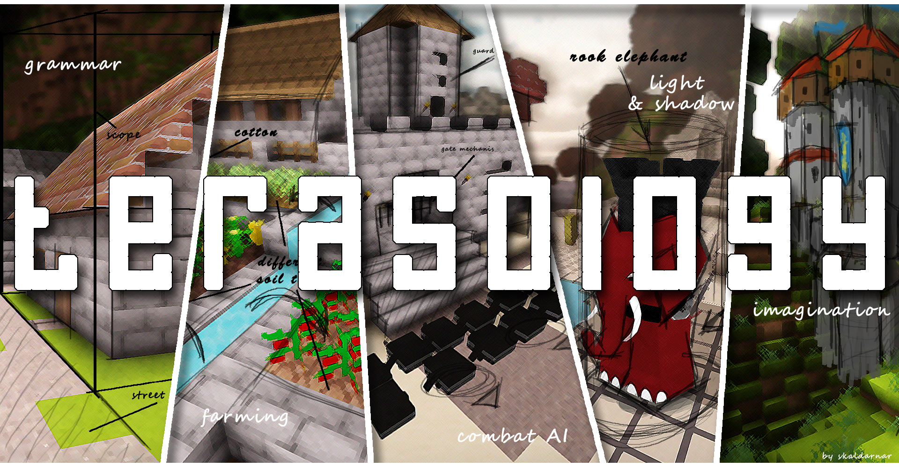
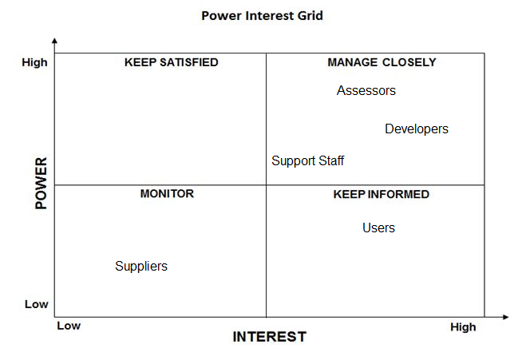
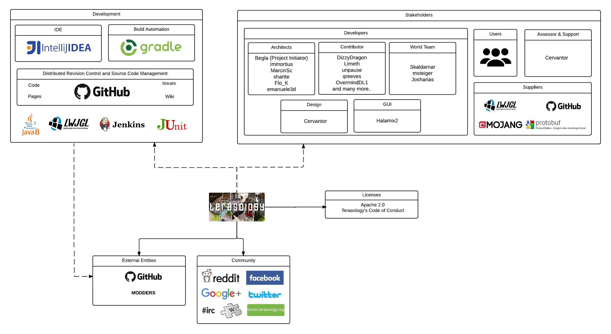
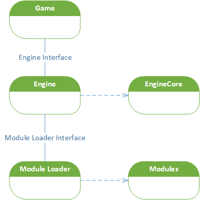
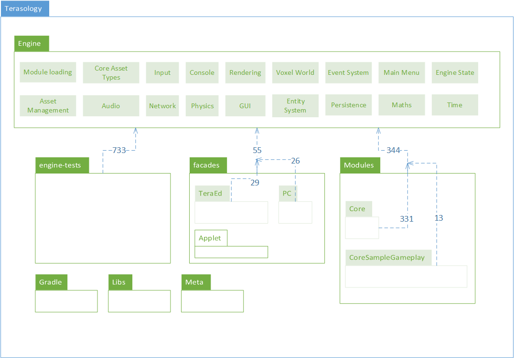
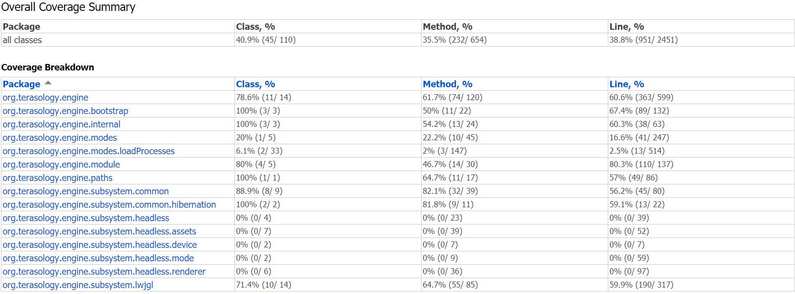
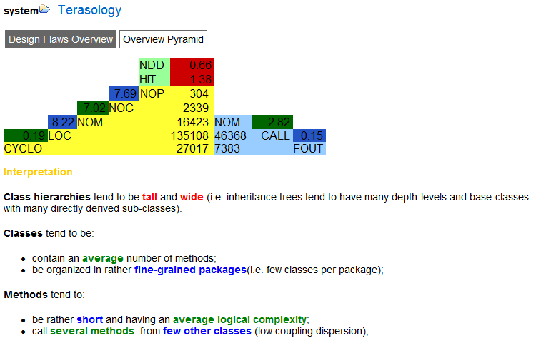
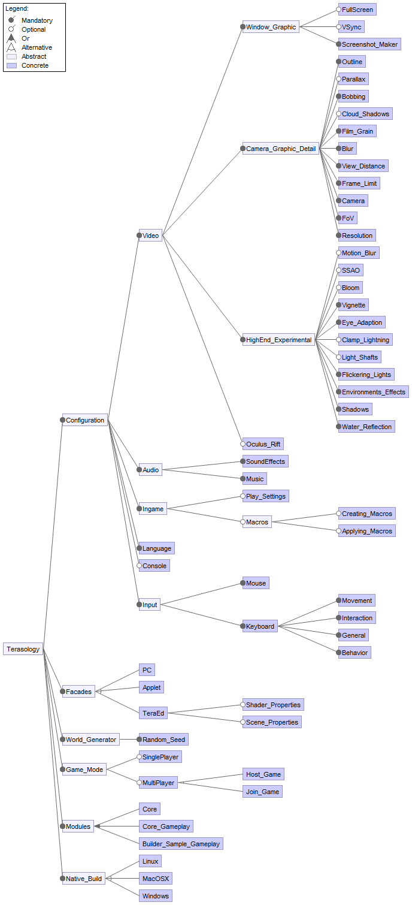

# Terasology: open source game development project

By [Bas de Böck](https://github.com/BdeBock), [Alexander Grooff](https://github.com/AlexanderGrooff), [Arkka Dhiratara](https://github.com/arkka) and [Jan Zegers](https://github.com/JanZegers)

*Delft University of Technology*

## Abstract

Terasology is a video game similar to [Minecraft](https://minecraft.net/). It started as part of a research project, but soon evolved into an active open source project. In this chapter, Terasology is described by different views and perspectives. On the one hand, focus is given to the development view, because Terasology currently finds itself in the development phase. On the other hand, focus is given to the variability perspective, as the modular architecture is the thing that makes the project special. Related to the next phase of the project, a description is given of the deployment view and performance and scalability perspective. The results from this research can provide new contributors to gain an architectural insight into the Terasology project, enabling them to more easily understand the project and contribute to it. 

## Table of Contents

1. [Introduction](#1. Introduction) 
2. [Stakeholders](#2. Stakeholders)
3. [Context view](#3. Context view) 
4. [Development view](#4. Development view)
5. [Variability perspective](#5. Variability perspective) 
6. [Deployment view](#6. Deployment view)
7. [Scalability perspective](#7. Scalability perspective)
8. [Contribution](#8. Contribution) 
9. [Conclusion](#9. Conclusion) 
10. [References](#10. References)

## 1. Introduction
Terasology is a video game inspired by [Minecraft](https://minecraft.net/) [\[1\]](#10. References). It started as a research project, but soon evolved into a serious open-source project. Terasology is developed by a small, but warm and active community, which we have experienced to be welcome and friendly to newcomers. 

Terasology is an interesting project as subject of study for software architects, as the community behind it is trying to get from the development phase to the deployment phase. In this document, we describe the different architectural views and perspectives of the Terasology project. We start with a stakeholder analysis, which gives insight into the people that are involved. After that, the context view is given to place Terasology within its environment. Next we describe the development view, as the project is still in its development phase we will give extra attention to this part. Because modularity is a key element of the project, the following variability perspective gets extra attention too. As previously explained the Terasology project is transferring to the deployment phase, as such this will be described in the deployment view. At last, we provide a description of the scalability perspective as extra metric on the maturity of the project. We end this chapter with our conclusion on the Terasology project architecture.

## 2. Stakeholders

Terasology originally started under the name of Blockmania by [Benjamin "begla" Glatzel](https://github.com/begla), and was meant as a research project for procedural terrain generation and efficient rendering techniques in Java using the [Lightweight Game Java Library (LWGJL)](https://www.lwjgl.org/) [\[2\]](#10. References). The first two members to join the project where Anton "small-keeper" Kireev and [Rasmus "Cervator" Praestholm](https://github.com/Cervator), which lead to the starting point of the conversion of a research project demo to a full-fledged game.

Terasology’s goal is to stake out its own niche by adding gameplay aspects from NPC-helper and caretaker games as Dwarf Fortress and Dungeon Keeper, yet paying ample tribute to [Minecraft](https://minecraft.net/) in look and origin. This results in a sandbox game with creative and building aspects that enable players to build constructions out of textured cubes in a 3D procedurally generated world. Based on the activated modules, the game provides activities as exploration, resource gathering, crafting and combat; as well as gameplay modes such as a survival mode where a player must acquire resources to build the world and stay alive. This module structure allows modders to come up with creative ideas as it allows them to create and ship a mod with a few simple commands, making it immediately available for download in-game by the users.

The main developers ["Cervator"](https://github.com/Cervator) and [Martin "msteiger" Steiger](https://github.com/msteiger) are the ones that open almost every issue. The rest of the issues have been opened by users of the system. We found that the four top contributors consist out of: ["Cervator"](https://github.com/Cervator), ["msteiger"](https://github.com/msteiger), [Malo "MaloJaffre" Jaffre](https://github.com/MaloJaffre) and [Josh "Josharias" Zacharias](https://github.com/Josharias) [\[3\]](#10. References). 

["Cervator"](https://github.com/Cervator) can be seen as the main integrator of the Terasology project, as he acts as a guardian for the project’s quality, while at the same time keeping contributions "in-flight" by communicating modification requirements to the original contributors. When a pull request is made which lays outside of his skillset, he assigns it to the developer that is specialized in that part of the system. The developers decide in consultation with the contributors whether to accept a contribution. In this project, three main factors leading to acceptance arise, namely: code quality, code style and project fit. The time it takes to make the acceptance decision mostly depends on the reviewer availability, responsiveness of the contributors and the overall complexity of the code. The quality of the code is evaluated by looking at the understandability, documentation and the added value to the project. For continuous integration, Terasology uses Jenkins as a tool to evaluate quality.

By using the knowledge we gained from the analysis of the [Terasology Github page](https://github.com/MovingBlocks/Terasology), [forum](http://forum.terasology.org) and social media pages we were able to create the following stakeholder overview as can be seen in [table 1](#stakeholder-overview).

| Type          | Entities                                                                                                                                                                                                                                      |
|------------------------------------|-----------------------------------------------------------------------------------------------------------------------------------------------------------------------------------------------------------------------------------------------|
| Developers    | **Construct and deploy the system. The following developers have been active in the past year and have been divided per team.**                                                                                                                   |
|               | Architects: [Benjamin "begla" Glatzel](https://github.com/begla), ["Immortius"](https://github.com/immortius), [Martin "MarcinSc" Sciesinski](https://github.com/marcinsc), ["shartte"](https://github.com/shartte), ["flo"](https://github.com/flo), ["emanuele3d"](https://github.com/emanuele3d)                                                                                                                           |
|               | Design Team: ["Cervator"](https://github.com/Cervator)                                                                                                                                                                                                |
|               | General: [Linus "LinusVanElswijk" van Elswijk](https://github.com/LinusVanElswijk), [Jakub "Limeth" Hlusicka](https://github.com/Limeth), ["unpause"](https://github.com/unpause), ["OvermindDL1"](https://github.com/OvermindDL1), ["prestidigitator"](https://github.com/prestidigitator), [Gustavo "gtugablue" Silva](https://github.com/gtugablue), [Flavio "sk0ut" Couto](https://github.com/sk0ut), ["Netopya"](https://github.com/Netopya), [Andre "andrelago13" Lago](https://github.com/andrelago13) , ["MaloJaffre"](https://github.com/MaloJaffre)
|               | GUI Team: [Piotr "Halamix2" Halama](https://github.com/halamix2)                                                                                                                                                                                                           |
|               | World Team: [Tobias "Skaldarnar" Nett](https://github.com/Skaldarnar), ["msteiger"](https://github.com/msteiger), ["Josharias"](https://github.com/Josharias)                                                                                                                                            |
| Users         | **The users of Terasology consist out of players from all over the world. This is depicted by the activity on their social channels.**                                                                                                            |
|               | 4k+ likes on [Facebook](https://www.facebook.com/Terasology/)                                                                                                                                                                                                                         |
|               | 400 subscribers on [Reddit](https://www.reddit.com/r/Terasology)                                                                                                                                                                                                                      |
|               | 1200+ [Twitter](https://twitter.com/terasology) followers                                                                                                                                                                                                                       |
| Suppliers     | **Build and/or supply the hardware, software, or infrastructure on which the system will run.**                                                                                                                                                   |
|               | [LWGJL](https://www.lwjgl.org/)                                                                                                                                                                                                             |
|               | Github                                                                                                                                                                                                                                        |
|               | Inspired by games like [Minecraft](https://minecraft.net/), [Dungeon Keeper](https://en.wikipedia.org/wiki/Dungeon_Keeper) and [Dwarf Fortress](https://en.wikipedia.org/wiki/Dwarf_Fortress)                                                                                                                                                                          |
| Assessors     | **Oversee the system’s conformance to standards and legal regulations.**                                                                                                                                                                          |
|               | ["Cervator"](https://github.com/cervator) by enforcing the use of an Apache 2.0 license agreement and Terasology’s Code of Conduct.                                                                                                                      |
| Support Staff | **Support is being provided via Github, Twitter, Facebook, Reddit and the Terasology Forum.**                                                                                                                                                     |
|               | ["Cervator"](https://github.com/cervator), serves as main moderator on the support sites.                                                                                                                                                                                                              |

*Table 1: Stakeholder Overview*  

The power interest grid, as depicted in [figure 1](#power-interest-grid), provides a prioritization of the stakeholders by their power/interest ratio.

*Figure 1: The stakeholders in a power/interest grid*

## 3. Context view

In order to provide a better understanding of the Terasology architecture, we have identified the relationships, dependencies and interactions between entities in the Terasology project. In this context view, we have grouped the entities into stakeholders, development, community, external entities, and licenses, which can be seen in [figure 2](#context-view).

*Figure 2: Context view showing the basic components of which Terasology consists of*

#### Development

The development group consists out of the technical related entities in the Terasology project. Terasology is build using the Java programming language to deliver a cross-platform solution to their users. Dependent on that programming language, Terasology uses a native game library for Java which is the [LWGJL](https://www.lwjgl.org/). LWGJL provides developers access to graphic ([OpenGL](https://www.opengl.org/)), audio ([OpenAL](https://www.openal.org/)) and parallel computing ([OpenCL](https://www.khronos.org/opencl/)) development tools. Terasology’s community prefers to use [IntelliJ IDEA](https://www.jetbrains.com/idea/) as their recommended Integrated Development Environment (IDE), though there is also support for other IDEs such as [Eclipse](https://eclipse.org/) and [NetBeans](https://netbeans.org/). A project with this scale obviously depends on existing libraries, therefore, Terasology uses [Gradle](http://gradle.org/) as their dependency management tool for monitoring the build process. Moreover, Terasology encourages the open source community on [Github](https://github.com/) to contribute to the project. Github provides distributed revision control and source code management that enable developers and contributors to work together collaboratively over the Internet. Therefore, Terasology is also required to verify each contribution from the community. Jenkins supports this task by providing continuous integration and continuous delivery. It is able to provide a number of different required tests, such as [JUnit](http://junit.org/junit4/) testing, [Checkstyle](http://checkstyle.sourceforge.net/) and [PMD](https://pmd.github.io/). 

#### Community

As a project that aims at a wide range of users, Terasology is also required to maintain their community presence on different channels. We have identified at least seven community channels, which are [Reddit](https://www.reddit.com/r/Terasology), [Facebook](https://www.facebook.com/Terasology/), [Google+](https://plus.google.com/103835217961917018533), [Twitter](https://twitter.com/terasology), #IRC, [Wiki page](https://github.com/MovingBlocks/Terasology/wiki) and the discussion board [forum](http://forum.terasology.org/). On these community channels, Terasology provides support to the community, as well as a discussion platform for the features and project vision.

#### External Entities

Github provides the collaborative coding platform for Terasology. It helps developers to work on issues, and modders to create new modules, containing custom game mechanics and features, for the game. 

#### Licenses

Terasology uses the [Apache 2.0](http://www.apache.org/licenses/LICENSE-2.0) and its own [code of conduct licenses](https://github.com/MovingBlocks/Terasology/blob/develop/docs/Conduct.md) [\[4\]](#10. References). Based on the Apache license, the community has the freedom to distribute the software, to modify the software, and to distribute modified versions of the software under the terms of the license, without concern for royalties.

## 4. Development view

### 4.1 Module organization

To form a development viewpoint, we first modeled the system as a component diagram (see [figure 3](#component-diagram)). This gives a depiction of how the components in the Terasology project are wired together to form the larger software system. 

When looking at this diagram one can see that the game interacts, through an interface made available by the engine. In-game the user can define which modules should be loaded. The engine then asks the module loader for these modules by making use of an interface made available by the module loader. A module is a container for code and assets, which can be used by game types, mods or other higher-level concepts. Finally, the module loader makes the modules available to the engine, that passes them to the game. While being in-game, the engine communicates with the core to send the game component information to the game.

*Figure 3: Terasology's component diagram*

We modeled the organization of the system’s source code into a module structure model (see [figure 4](#dependency-diagram)) [\[5\]](#10. References). This model defines the organization in terms of the architectural modules into which the individual source files are collected and the dependencies of these modules. The lines depict the dependencies between the packages, while the accompanying numbers depict the number of dependencies. We see the engine as the main element, where all the other architectural modules depend on. The other three main architectural modules are `engine-tests`, `facades` and `modules`. `Engine-tests` holds the JUnit tests for the engine. `Facades` contain executable front-end parts that can be chosen to be implemented. The `modules` are separate containers of content which can be injected in Terasology, which expand the gameplay beyond the standard-included core modules.

*Figure 4: Terasology's dependency diagram*

#### Standardization of design

To provide critical benefits to the maintainability, reliability, and technical cohesion of the system, it is required to implement a standardization of design [\[5\]](#10. References). Terasology achieves this by using three design patterns and off-the-shelf software elements.

First, the core framework of the game consists of an entity system. Everything in the game should be an entity; the only exceptions are the GUI and blocks. The entities are defined as interfaces and implemented through classes. If possible, code should be developed against these interfaces to make it possible to easily replace it in the future. An entity is a logical container for components. It can be identified through the Entity Manager, but the components are the elements that give meaning to it. Components are meaningful sets of data which should not contain any game logic, since they may only contain specific data types. The behaviour of the entities is managed by ‘ComponentSystems’. The entity system, with entities, components and ‘ComponentSystems’  gives the architecture its flexibility.

Second, the design uses Events and Event Handlers instead of direct method calls, to allow systems to interact with each other. This again provides flexibility and extendability to the project, by decoupling the systems.

Third, blocks are the main elements in Terasology, and enable developers to design their own gameplay. They are put in `.block` files and are stored in a separate directory of a module. Blocks are JSON objects and are easily creatable and alterable.

#### Standardization of testing

Every major software project should implement standardization of testing to ensure a consistent approach to testing. Terasology has implemented his own standardized testing approach described below.

First, every contribution should be done through a Pull-Request (PR) from the Terasology GitHub repository.
[Terasology’s GitHub bot "GooeyHub"](https://github.com/GooeyHub) will assist the Pull-Request by informing the admin and by providing an automated test request given by [admin "Cervator"](https://github.com/Cervator) directly from PRs comment. 

After the admin gives the command to test, GooeyHub will send the test request to [Terasology’s Jenkins](http://jenkins.terasology.org/), regarding the PR. Jenkins then builds and tests the PR code and provides the result, which GooeyHub retrieves and posts as a link on the PR's comment page.

After this phase, the admin and other related contributors will collaborate and discuss regarding the changes that are proposed by the contributor. They need to ensure that the new improvement complies with the architectural vision.

As a continuous integration and continuous delivery application, Terasology is using Jenkins in order to build and test every pull request. Jenkins implements a number of tests, such as:
[JUnit test](http://junit.org/junit4/), [Checkstyle](http://checkstyle.sourceforge.net/),  [FindBugs test](http://findbugs.sourceforge.net/), and [PMD test](https://pmd.github.io/).

#### Instrumentation

Terasology uses [SLF4J](http://www.slf4j.org/) (Simply Logging Framework For Java) library for different logging implementations. SLF4J also provides different log level configurations that are able to be adjusted to the requirements. Terasology’s contributors have also created general guidelines about the log levels, which can be found on the Terasology forum [\[6\]](#10. References).

### 4.2 Technical debt

#### Slowing rate of velocity

Velocity is a measurement of the amount of work a development team can complete during a time interval. When velocity starts to slow down over the course of several iterations, technical debt might be the reason [\[5\]](#10. References). If too much technical debt has piled up it will impair the development productivity. By analyzing the [Github statistics](https://github.com/MovingBlocks/Terasology/graphs/contributors) we can see that the productivity comes with ups and downs. Normally this could be a sign of technical debt, but in this case that is very unlikely. This is because there is no structured development process with measurable iterations, and the activity and consistency of the team are subject to change. Any slowing rate of velocity in the Terasology project can therefore not be linked with certainty to technical debt.

#### Aging libraries

By taking a look at the versions of the libraries the project uses, we could determine if these had an impact on the technical debt, as this is increased by versions that are behind or no longer being maintained. We looked at the used libraries covered in [appendix A](#Appendix A). 
A total of six libraries has been found that where behind their latest stable version. No libraries have been found that were no longer being maintained. This gives a indication that the technical debt could be increased by the aging libraries. 

#### Defects

The project has been analyzed with the use of the [FindBugs](http://findbugs.sourceforge.net/) plugin. The plugin gave a total of 301 warnings, from which were 91 high priority and 210 medium priority, which turns out to be three defects per thousand lines of non-commenting source statements. [Table 2](#warnings-overview) gives a summary of the number of errors per warning type.

| Warning Type                            | Number |
|-----------------------------------------|:------:|
| Bad Practice Warnings                   |   73   |
| Correctness Warnings                    |    3   |
| Internationalization Warnings           |    2   |
| Malicious Code Vulnerabilities Warnings |   62   |
| Multithreaded Correctness Warnings      |    1   |
| Performance Warnings                    |   52   |
| Dodgy code Warnings                     |   108  |

*Table 2: Warnings Overview* 

Bugs should be fixed as they are found and should not be let to accumulate. The number of defects this project has, could be the cause of a small amount of technical debt. 

#### Low automated test coverage

The project has been analyzed by the built-in test coverage tool of the IDE IntelliJ. The unit tests from Terasology only cover the engine package in a direct way. As is depicted in [figure 5](#test-coverage), only 40.9% of the classes in the engine is covered. The general agreement is that more than 90% coverage can be seen as a good sign, and less than 75% coverage may indicate a serious problem. In this case, it is very likely that the low automated test coverage is the cause of a great amount of technical debt, as tests are useful to be able to refactor code.

*Figure 5: Test coverage of the Terasology project*

#### Poor score on quality metrics

The project has been analyzed with the tool [InCode](https://www.intooitus.com/products/incode) to get an overview of the other quality metrics. From the 2339 classes that were analyzed, 154 had design flaws, and from the 16423 methods that were analyzed, 235 had design flaws. These metrics can be found in [appendix B](#Appendix B).

From this analysis we can infer that 6.6% of the classes and 1.4% of the methods have design flaws. The five packages with the highest severity of design flaws are: 

* `/engine/src/main/java/org.terasology.protobuf` , cumulative severity of 518.
* `/engine/src/main/java/org.terasology.rendering.nui.internal` , cumulative severity of 107.
* `/modules/Core/src/main/java/org.terasology.logic.inventory` , cumulative severity of 65.
* `/engine/src/main/java/org.terasology.logic.characters` , cumulative severity of 26.
* `/engine/src/main/java/org.terasology.engine.subsystem.headless.renderer` , cumulative severity of 24.

With the help of [InCode](https://www.intooitus.com/products/incode) we have also created an overview pyramid (see [figure 6](#incode-pyramid)). Each of the rows has a colored percentage, which is derived from the ratio of the number on this row and the one under it, e.g., CYCLO / Line is 0.19. The given numbers indicate where the ratios fit into the industry-standard ranges. From [figure 6](#incode-pyramid), can be derived that the number of direct descendants and height of inheritance tree is outside the range. The number of classes per package, lines of code per method and fan out (number of other methods called by a given method) per call are all below the range. The other ratios are all within the range. The red and blue cases increase the technical debt and should therefore be refactored. 

*Figure 6: Pyramid generated with InCode*

By using the tool [CodePro Analytix](https://marketplace.eclipse.org/content/codepro-analytix) we analyzed the comments ratio, which was 6.9%, such low amount of Javadoc could contribute to extra technical debt. As Terasology is an open source project which is dependent on new developers, documentation is an essential part of the understandability of the code for them. 

#### Dealing with technical debt

To get a good overview of how the Terasology team deals with technical debt, we analyzed the Github [pull requests](https://github.com/MovingBlocks/Terasology/pulls) and [issues](https://github.com/MovingBlocks/Terasology/issues). Since the Terasology project does not contain any labels concerning technical debt, we had to filter the issues and pull requests based on our self-created set of keywords. The keywords we filtered on are: "technical debt", "clean", "maintenance", "improve", "style", "cleanup" and "refactor". From these results we tried to find instances where the team had to deal with technical debt, which caused them to have discussions and possible refactoring decisions they had to make.  

We found out that there have been almost no relevant issues regarding refactoring. About 2% of the open and closed issues is about refactoring code. Issue [#1587](https://github.com/MovingBlocks/Terasology/issues/1587) shows an example for an open issue about refactoring the "Breathing" modules, and issue [#2089](https://github.com/MovingBlocks/Terasology/issues/2089) shows an example for a closed issue about improving the readability of the "Assets". The low number of issues regarding refactoring could mean that the team is not aware of the design flaws in the code or is simply ignorant towards them. When looking at the pull requests regarding refactoring, we found out that about 2% of the pull requests is about refactorization that is not based on issues. These refactorization pull requests were all own-initiative refactorization contributes. Most of the times contributors focus on refactoring classes, e.g., [#1562](https://github.com/MovingBlocks/Terasology/pull/1562). Sometimes contributors are working on certain issues and find code that needs refactoring, e.g., [#1751](https://github.com/MovingBlocks/Terasology/pull/1751). Other times contributors refactor closed issues of their own, which even can be work from six months ago, e.g., [#2135](https://github.com/MovingBlocks/Terasology/pull/2135).    

Based on the data from the Terasology project on Github we can state that the developers do not seem to discuss any problems regarding technical debt. Any mentioning about code refactoring is confined to its own issue or pull request, and thus is not part of encountered technical debt during the work on issues. Though in the previous section we stated that there is a large amount of possible technical debt in the Terasology project. The question then of course is, why this debt is not mentioned anywhere on Github. The reason for this could be that any bad code is refactored on the fly, without mentioning it on Github. Another unlikely but possible reason could be that the currently worked on issues do not have much overlap with the code that contributes to the technical debt, and that the technical debt still has to be repaid in the future. The last and most likely reason is the fact that they take the current technical debt for granted. The developers could take the debt for granted as they are reluctant to refactor the code. The first reason for their reluctance could be due to the lack of tests that are available, as tests are needed to refactor. The second reason could be the lack of understanding of the code. A lot of the initial developers have left the Terasology project, which could be a reason for the current developers to leave the old code as it is (if it ain't broke, don't fix it). The last reason could be the short term focus of the developers as new features are more important than refactoring existing ones. This becomes more likely if we look at the continuous integration tool Jenkins that they use. By analyzing this tool we can clearly see that design flaws are monitored, yet the developers run Jenkins and manually accept the result even though Jenkins shows that a lot is wrong with the code.

*In a reaction on our questionnaire on the Terasology forum 
["Skaldarnar"](https://github.com/Skaldarnar), confirmed that they ignore technical debt until the moment the code is touched for other reasons [\[7\]](#10. References).*
 

## 5. Variability perspective

Terasology has a range of important features that could cause the user experience to change. The features and their relationships have been modeled in a feature model as depicted in [figure 7](#feature-ide) [\[5\]](#10. References). The mandatory features are present in all products (be it as default settings). In OR-features, it is possible to select one or more feature, wherein the alternative (XOR)-features only one of the features can be selected.

*Figure 7: FeatureIDE diagram*

The main dependencies of Terasology are the native build related features. In order to run seamlessly on the different platforms (Linux, MacOSX and Windows), Terasology is required to define different native build configurations that include Input Library (`libjinput-linux`, `libjinput-osx`, `jinput`), Graphic Library (`liblwgjl`) and Audio Library (`OpenAL`). Moreover, there is also some specific platform 32-bit/64-bit configuration for each library being used on specific native builds, as depicted in [figure 8](#dependency-uml).

*Figure 8: Feature Dependency UML diagram*

Each Native build has two groups of features that depend on it, which are `Basic Configurations` and `Facades`. These features basically require specific platform libraries to communicate with the hardware (Input, Audio and Graphics). Advanced configuration feature support, such as Oculus Rift, extend the capabilities of the Video feature of the basic configuration. Gameplay related configuration also depends on basic configuration features, these include keyboard localization, language of the interface and other user interface related features. Separate from the Basic and Gameplay Configuration there is a group of features that do not depend on the native build, which are Modules and Game Mode. These two groups are mainly dependent on world generator features.

### 5.1 Variability Strategy

Terasology makes use of configuration files which can be edited in the various setting screens. These configuration files hold the various global configuration information that the user can modify. The configuration files can be saved and loaded in a JSON format with the `.ui` extension, and define the menu layout. Configurable items, like the button handlers, are defined in the `rendering.nui` package. These classes can adjust the overall config classes defined in the `Config` package.

Modules can be seen as containers for code and assets, that can be used by game types, mods or other higher-level concepts. Modules can be enabled, disabled or replaced. Therefore some of the main parts of the system, e.g. `Core Gameplay`,  are also modules. Every module gets a copy of the build file from the Core module so that all modules are built equally. Modules use a simple `module.txt` file to define their configurations and dependencies towards other modules. Gradle, a build automation system, handles the possible problems regarding the dependencies [\[2\]](#10. References). 

Terasology uses facades to create a front-end which can be executed. There are multiple facades, with the main one being `PC Facade`. This facade is included with the base version of Terasology, and can be used to run the game as an application. Other facades are `FacadeApplet`, `DestSolAndroid`, `DestSolGwt` and `FacadeAWT`.

Besides the single player mode, there is also a multiplayer mode option. Both options are part of the build and are available before creating a game. There is a small network infrastructure provided that enables someone to act as host and others to join his game. Multiplayer mode is still a feature that is under development and is not seen as stable by the community. 

## 6. Deployment view

This deployment view section looks beyond the alpha release. The Terasology launcher can be downloaded from the [download page](http://terasology.org/#download).  Extracting this launcher provides the opportunity to install stable releases of the game, with the latest version by default. Like the game, the launcher is executable on Windows, Linux and MacOSX. The only other software component, besides the launcher and the release version, that needs to be present on the PC is Java Virtual Machine version 8. There are other Java libraries used by Terasology, but they are downloaded as part of the stable release. The basic version comes with two modules, `Core` and `CoreSampleGameplay`. Within the game, it is possible to download additional modules. Additional modules change or add features of the game. Downloaded modules can be selected before creating a game.

There are no predefined hardware requirements for Terasology. The game, as we experienced by testing, has high graphical requirements. We asked the community for advice on running the game on basic systems with low graphical power: "With just the Core Gameplay and low graphic settings (especially view distance) any system that decently supports OpenGL 2.1 and Java 8 should have a chance to work" [\[7\]](#10. References).  However, there are modules, such as [Throughout the Ages](https://github.com/Terasology/ThroughoutTheAges) in combination with high graphic settings that can crash any regular system. For the multi-player mode, the server demands are not that problematic, however a noticeable draw on CPU and memory remains. Additionally, the game tends to crash when adding more than a couple of players to the game. Optimization of the server is one of the key parts the community is focussing on. 

## 7. Scalability Perspective

In order to identify the scalability of Terasology and understand its capability to perform under an increased workload, we observed the project scalability with various dimension measurements [\[5\]](#10. References). 

### 7.1 Administrative Scalability

In general, everyone is able to contribute to, comment on and provide ideas for this project. However, there is a key development phase that is only handled by a specific person, consisting of the contribution approval (pull-request) and the maintaining of the architectural vision. Unfortunately, there are only a few active maintainers that are available for this important responsibility. As a reminder, popularity on Github is essential for this project; because it attracts more contributors and accelerates the project development. Based on this fact, we have foreseen that this administrative problem will become the main scalability bottleneck for the Terasology project.

*Administrative Scalability really became a bottleneck when the project recently entered [Google Summer of Code 2016](https://summerofcode.withgoogle.com/), where the popularity largely outnumbered the capability of the community to support more than a couple of student.*

### 7.2 Functional Scalability

Terasology’s modular architecture enables contributors to develop new modules as desired. New modules are integrated with existing Terasology modules to provide new features with minimal effort. This capability strengthens the ability to stimulate the open-source community to keep developing Terasology.

### 7.3 Geographic Scalability

Terasology has three factors that improve geographic scalability. First, it is an open source project that gets contributions from every continent. Second, every user is able to host their own Terasology game, which acts as a server in the multiplayer mode. This enables scaling without the boundary of geographic constraint. Third, the game provides different languages for their users, to also attract non-English speaking players.

### 7.4 Load Scalability

The multiplayer game mode, needs to be able to easily expand to accommodate heavier loads of inputs. Therefore load scalability is the main requirement to provide multiplayer experience on Terasology. Every user is able to host their own game using their own resources (computer/server) and invite other users to join the game. Other users are only required to add the server connection information in order to connect to the host server. With this distributed architecture, Terasology is easily expandable to meet the community needs.

### 7.5 Generation Scalability

Terasology has a modular architecture. This makes it possible to change or add modules to the project. It can handle module dependencies and has a version control mechanism, to prevent the game from breaking when new module versions are introduced. This makes it possible to handle different generations of different modules. However, changing modules and checking for newer versions has to be done manually. This makes the execution of module generation coordination very labour intensive.

## 8. Contributions

The list of contributions that have been made to the Terasology project can be found in [appendix C](#Appendix C). We have five merged and one closed pull requests, from which four solved user interface issues and one solved a log file issue.

## 9. Conclusion and Reflection

Terasology is an open source game, which has grown from a research project to a mature project growing into alpha testing status. It has a small but active group of contributors, who work in a completely automated development environment on Github. The architecture has a modular structure, with a small engine and a lot of modules that add or change gameplay. This modular architecture has made it possible to reach a high variability, enabling to change almost every feature in the game. As a result of the high variability, some combinations of high graphics options, as well as the combination of multiple demanding modules, make the game impossible to run on a standard PC. Therefore a big architectural change is being discussed by the architects in order to decrease the computational demand of the game and improve its stability. Besides the possible architectural overhaul our research has indicated that the technical debt of the project is too high above the desired standard. The project contains a high number of design flaws and low amount of test cases and JavaDoc. This could prove to become problematic in the future when new contributors will start working on the project. 

During the DESOSA 2016 project, Terasology has been accepted for [Google Summer of Code](https://summerofcode.withgoogle.com/organizations/4668766554161152/). This will greatly increase the number of new contributors and users. Therefore GSoC would be a good research subject to analyze how Terasology is going to deal with new contributors and users, in regard to the technical debt and deployment and scalability factors. 

All in all we have had a lot of fun working on the project, but it would have been a lot less fun if the Terasology community had not given us a very warm welcome like they did. They did a perfect job in assisting us on our contributions and answering our questions. Therefore we would like to thank the Terasology community for helping us. 

## 10. References

[1] Terasology.https://github.com/MovingBlocks/Terasology. [Online; accessed 29-March-2015].

[2] Terasology’s Wiki.https://github.com/MovingBlocks/Terasology/wiki. [Online; accessed 29-March-2015].

[3] Terasology’s Github Pulse. https://github.com/MovingBlocks/Terasology/pulse. [Online; accessed 29-March-2015].

[4] Terasology’s Code of Conduct. https://github.com/MovingBlocks/Terasology/blob/develop/docs/Conduct.md. [Online; accessed 29-March-2015].

[5] Rozanski, N., Woods, E. 2012. Software System Architecture.

[6] Terasology’s logging guidelines. http://forum.terasology.org/threads/logging.611. [Online; accessed 29-March-2015].

[7] Terasology’s forum post:  Technical requirements. http://forum.terasology.org/threads/technical-requirements.1476/. [Online; accessed 29-March-2015].

## Appendix A - Used libraries

Several libraries are being used to run the game, the main ones being:

* LWJGL, which is the Lightweight Java Game Library. Current version being used: 2.9.3, while the latest version is 3.0. 
* JUnit, a library for unit testing. Current version being used: 4.12, which is the latest version.

Other libraries:

* Storage and networking: 
  * guava, version: 19.0, which is the latest version.
  * gson, version: 2.5, while the latest version is 2.6.1.
  * protobuf-java, version: 2.6.1, which is the latest version.
  * trove4j, version: 3.0.3, which is the latest version.
  * netty, version: 3.10.5, while the latest version is 4.0.34
* Java-related libraries: 
  * jna-platform, version: 4.2.1, which is the latest version.
  * reflections, version: 0.9.10, which is the latest version.
  * javassist, version: 3.20.0-GA, which is the latest version.
  * reflectasm, version: 1.11.0, while the latest version is 1.11.1
* Graphics, 3D, UI: 
  * lwjgl_util, version: 2.9.3, which is the latest version.
  * java3d, version: 1.3.1, while the latest is 1.5.2
  * abego.treelayout.core, version: 1.0.3, which is the latest version.
  * miglayout-core, version: 5.0, which is the latest version.
  * PNGDecoder, version: 1111, which is the latest version.
* Logging and audio: 
  * slf4j-api, version: 1.7.13, while latest version is 1.7.17
  * jorbis, version: 0.0.17, which is the latest version.

## Appendix B - Quality metrics

From the 2339 classes that were analyzed, 154 had design flaws:

* 87 Data Classes: These classes are exposing a significant amount of data in its public interfaces. This impacts the encapsulation, coupling, and cohesion of the system.
* 34 Schizophrenic Classes: These classes have public interfaces that are large and are used non-cohesively by client methods. This impacts the complexity, encapsulation, coupling, inheritance and cohesion of the system. 
* 19 God Classes: These classes use many attributes from external classes, directly or via accessor methods. They are also excessively large and complex, due to the fact that their methods have a high cyclomatic complexity and nesting level. This impacts the complexity, encapsulation, coupling and cohesion of the system.
* 14 Tradition Breaker Classes: These classes hide parts of the inherited interface. This impacts the coupling, inheritance and cohesion.
From the 16423 methods that were analyzed, 235 had design flaws.
* 118 Data Clumps: These methods have long parameter lists, which could be a sign that the group of parameters could form a new abstraction, that could be extracted to a new class. This impacts the complexity and encapsulation of the system.
* 2 Sibling Duplications:  These methods have duplications with methods from the inheritance hierarchy. This impacts the complexity, encapsulation, coupling and inheritance of the system.
* 26 Feature Envies: These methods heavily use attributes from one or more external classes, directly or via accessor operations. This impacts the complexity, encapsulation, coupling and cohesion of the system.
* 2 Message Chains: These methods use one object to access another object, which on his turn uses the obtained object to access another object, and so on. This impacts the complexity, encapsulation and coupling of the system.
* 34 Internal Duplications: These methods have duplication with other methods from their class. This impacts the complexity of the system.
* 53 External Duplications: These methods have duplication with other methods external to their class and their hierarchy. This impacts the complexity, encapsulation and coupling of the system.

## Appendix C - Contributions

### Pull request [#2176](https://github.com/MovingBlocks/Terasology/pull/2176) for issues [#844](https://github.com/MovingBlocks/Terasology/issues/844) and [#2134](https://github.com/MovingBlocks/Terasology/issues/2134). **MERGED**

This pull request was made to fix issues [#844](https://github.com/MovingBlocks/Terasology/issues/844) and [#2134](https://github.com/MovingBlocks/Terasology/issues/2134). In these issues, a request was made for a solution for dropdown menus which were becoming too long. To solve this, we implemented a new type of menu called UIDropdownScrollable (based on UIDropdown). This menu was similar to the typical dropdown menu, but had a scrollbar on the right side to shorten the length of the menu. 

One problem remained however in this pull request, which was that the menu did not close whenever the scrollbar was focussed last. The pull request message contained a detailed description of how to replicate the issue to clarify the issue.

### Pull request [#2180](https://github.com/MovingBlocks/Terasology/pull/2180) for issue [#2179](https://github.com/MovingBlocks/Terasology/issues/2179). **CLOSED**

This pull request fixed an issue we found in our previous pull request ([#2176](https://github.com/MovingBlocks/Terasology/pull/2176)). The scrollbar showed a scrollbar even when there was nothing to scroll down for. The issue was fixed by adding checks if there were more items than that the menu should be long.

This fix caused some more code to be added, and the decision was made to clean up the code, improving maintainability. More methods were added to divide the massive onDraw functions into smaller pieces.

Afterwards, we realized something went wrong with the commits, as it appeared that a rebase went wrong. This eventually got fixed in pull request [#2183](https://github.com/MovingBlocks/Terasology/pull/2183). 

### Pull request [#2181](https://github.com/MovingBlocks/Terasology/pull/2181) for issue [#2178](https://github.com/MovingBlocks/Terasology/issues/2178). **MERGED**

Issue [#2178](https://github.com/MovingBlocks/Terasology/issues/2178) was created by Cervator who directly asked us to implement our newly created scrollable menu from pull request [#2176](https://github.com/MovingBlocks/Terasology/pull/2176) in places which we deemed necessary. We implemented the scrollable menu is several places, and hinted in the pull request message that pull request [#2180](https://github.com/MovingBlocks/Terasology/pull/2180) was probably useful for this pull request, since it fixed the bad scrollbar.

### Pull request [#2182](https://github.com/MovingBlocks/Terasology/pull/2182) for issue [#2173](https://github.com/MovingBlocks/Terasology/issues/2173). **MERGED**

This pull request added a difference between the subheader titles of the singleplayer and multiplayer menus. Initially, an extra class and an extra .ui file were created, but [msteiger](https://github.com/msteiger) asked us to change this to prevent code duplication. We complied by adding [another commit](https://github.com/delftswa2016/Terasology/commit/1c03ea760d79398df281b0abf5c3ac1671bda685), which removed the Java class file which was deemed to be dead code. Afterwards, [msteiger](https://github.com/msteiger) thanked us but asked us to also get rid of the extra .ui file, suggesting another way of solving this issue. After a small discussion, [msteiger](https://github.com/msteiger) advised us to use a placeholder text for the subtitle label and set the correct one through Java code when the menu screen is opened. We complied by adding several other commits, most important being [commit 1](https://github.com/delftswa2016/Terasology/commit/ff5d0a49bfdbfc5c260b481c1f38692ca8584fd4) and [commit 2](https://github.com/delftswa2016/Terasology/commit/f14e0df6426afed67643f1d77aac0a7cf16f8586). Cervator merged the pull request, but mentioned that the subtitles should also be added to other game screens. For this, he created a new issue [#2233](https://github.com/MovingBlocks/Terasology/issues/2233), which we will fix in the nearby future. 

### Pull request [#2183](https://github.com/MovingBlocks/Terasology/pull/2183) for PR [#2180](https://github.com/MovingBlocks/Terasology/pull/2180). **MERGED**

Pull request [#2180](https://github.com/MovingBlocks/Terasology/pull/2180) solved its assigned issue, but something went wrong with the commits. This was caused by rebasing the develop branch on our fork, and updating the worked-on branch. After this was figured and pointed out, this pull request got closed. 

Pull request [#2183](https://github.com/MovingBlocks/Terasology/pull/2183) was created to fix the same issue as [#2180](https://github.com/MovingBlocks/Terasology/pull/2180), but this time with a proper commit history.

### Pull request [#2184](https://github.com/MovingBlocks/Terasology/pull/2184) for issue [#2030](https://github.com/MovingBlocks/Terasology/issues/2030). **MERGED**

Issue [#2030](https://github.com/MovingBlocks/Terasology/issues/2030) explained an issue regarding the filename of the logfile in multiplayer mode, as it was deemed to be unclear. We created a new structured filename, describing the server name, address and port to give a clearer view of what the log message contains. 

[msteiger](https://github.com/msteiger) pointed out a different way of handling this issue regarding Protobuf's `serverInfoMessageBuilder.setGameName()` method.

Cervator merged the pull request, and pointed out that the filename could be changed in a follow-up issue/pull request if a better name is found.

