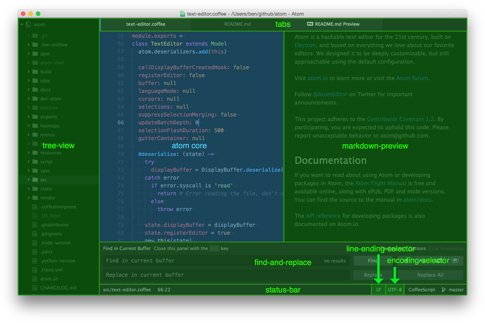
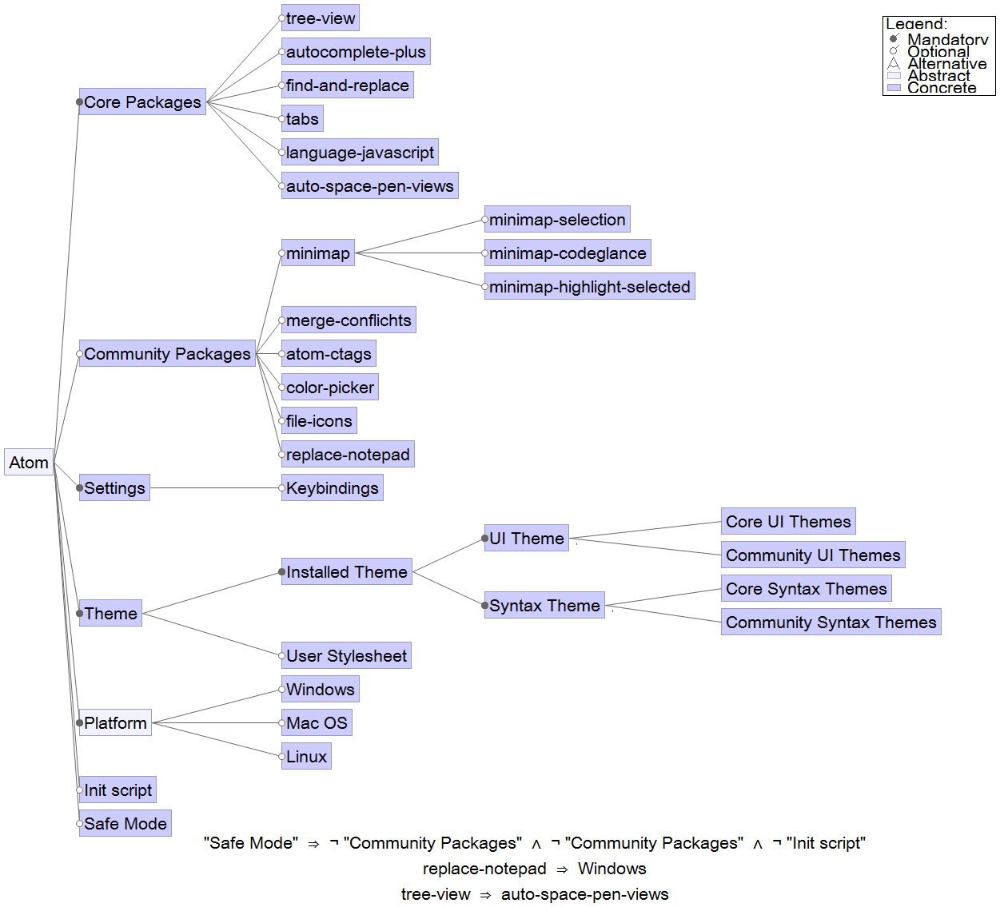

# Atom - the hackable text editor
**By [Rowan Bottema](https://github.com/rbottema), [Ruben Koeze](https://github.com/roebenk), [Robbert van Staveren](https://github.com/robbertvs) and [Freek van Tienen](https://github.com/fvantienen)**   
_Delft University of Technology_


## Abstract
Atom is an open source hackable text editor, developed by GitHub but also by other contributors.
In this chapter everything concerning Atom in the development and testing is dissected.
First, all stakeholders involved in or with Atom will be discussed.
After this, the structure and organization of Atom is dissected: how Atom is build and what methods are used.
In the third part, an overview of all features that can extend Atom is given, as well as the relationships between these features.
Lastly, in the functional view, all the elements delivering the functionalities of Atom are broken down into pieces.

## Table of contents
- [Introduction](#introduction)
- [Stakeholders](#stakeholders)
- [Context](#context)
- [Development View](#development-view)
- [Variability](#variability)
- [Functional View](#functional-view)
- [Conclusion](#conclusion)
- [References](#references)
- [Appendix: Contributions](#appendix-contributions)

## Introduction
Atom is an open source text editor, designed to be hackable to the core.
It started as a side project of Github founder [@defunkt](http://github.com/defunkt) in 2008, then called Atomicio[[1](#atomicio)].
Because he was mainly busy with the GitHub platform, Atomicio was put on hold for a couple of years.
Then in 2011, when GitHub was already getting bigger, they upgraded it to an official GitHub project called Atom.
Currently, it has [more than a million active users](http://blog.atom.io/2016/03/28/atom-reaches-1m-users.html) and [over 28,000 commits](https://github.com/atom/atom/commits/master) have been committed to the main repository, with many more committed to related repositories.
It is mainly developed by the company GitHub, but at the same time almost 300 people contributed to the main repository, indicating a big open source community.
These aspects make the Atom architecture an interesting object of study.

## Stakeholders
Because Atom is an open source project and evolved a lot over time, there are many stakeholders involved in the project.
Below is an overview of the most important stakeholders from _Rozansky and Woods_[[2](#rozanski2012software)]:

- __Developers__: Consist mainly of GitHub Staff, but there are other active persons not related to GitHub who also contribute a lot to the Atom project.
The GitHub staff wants to invite new developers into the project and gives them a lot of support.
One of the ways they try to get this done by giving some issues the “beginner” label, which means the issue is simple enough for a beginning developer to pick up.
It is interesting to note that Facebook also holds stakes in Atom, as they develop their Nuclide IDE on top of Atom. This is evidenced by 4 of the 5 top contributors of Nuclide being in the top 50 contributors of Atom[[6](#nuclide-contributors)].

- __Users__: Consist mainly of highly advanced computer users like programmers and system administrators.
Atom is also preferred by users when an IDE is not available or too much work to set up.

- __Maintainers__: Atom is maintained by the core developers, but GitHub is the main driver in keeping the project alive.
They make sure that there are enough developers for the Atom project and invest time and money in making sure the Atom project stays alive.

- __Support staff__: Consists mainly of a lot of volunteers, but next to that also the GitHub staff and core developers.
This is done by responding to issues, triaging issues and pull requests, closing bugs as duplicate or filed on the wrong repository, and much more.
Also the Forum and Slack are used for quick support to the end users and developers.
[Lee Dohm](https://github.com/lee-dohm) is the main community manager and manages all supporting staff.

- __Testers__: The main users test the system and report bugs to the issue tracker on GitHub.
There is no special test team available although the core developers test most pull requests before merging.

- __Production Engineers__: All tools like GitHub, the Forum, Slack and the build servers are maintained by the GitHub team.
They make sure it is running and invest time in updates or setting up new tools.

- __Assessors__: The core development team of Atom oversees the conformance of the programming standards.
They check each pull request with multiple people and also check if it is still in line with the future planning.

## Context
To get an overview of what is happening with and around Atom, a context view is created.
The context view shown below will be shortly discussed.

_Atom's context view_

### Software dependencies
Atom depends on a few technologies, shown in the _Software dependencies_ box.
Atom is built in CoffeeScript and LESS, which is compiled to JavaScript and CSS [[3](#atom.io)].
All this is built on top of Electron, a Node.js package that interprets and runs these languages.
Last but not least, Git can be used directly from the editor, and is therefore bundled with the editor.

### Developers
Atom is being developed by multiple parties.
These will be discussed in the next paragraphs.

#### Main Developer: GitHub
It is important to notice GitHub's role in the development of Atom.
As shown in the Context View, GitHub is used for version control & issue tracking.
This is the platform, or website, GitHub.com.
In addition to the platform, GitHub is also mentioned as a company.

#### Other developers
A lot of different people that do not work at GitHub are working on Atom.
Most of these people are not constant contributors, but two people could be identified as main contributors.
[Wliu](https://github.com/50Wliu) and [mnquintana](https://github.com/mnquintana) are active in numerous issues and pull requests.
Important to notice is that these two are not the only contributors, but that these serve merely as example.

### Main competitors
There are some important differences between Atom and its main competitors competitors.
- __Sublime text:__
Sublime text is not an open source editor, unlike Atom.
And even though Sublime can be used free, they urge you to pay licensing fee.
Sublime is similar to Atom in that it is extendable in much the same way as Atom.

- __Notepad++:__
Notepad++ is a widely used text editor which exists since 2003.
The main "problem" with Notepad++ is, that it is Windows only, whereas Atom can be used on Windows, Mac and Linux.

- __Brackets:__
Brackets is most like Atom.
It is open source, and also written in the web languages HTML, CSS and JavaScript.
The main difference with Atom is that the focus of Brackets lies on web development only, whereas Atom does not focus on one programming field in particular.

### Support
Support of Atom is given via multiple channels.
The feedback is given by GitHub and other developers.
The main platform for getting feedback is the Atom forum.
Atom tried to switch to Slack as main support platform.
After discovering that in Slack only 10.000 messages can be read back when using the free version, the decision was made to use the forum and Slack side by side.
Finally, GitHub is used for issue tracking and getting feedback.

### Continuous integration
Two tools are used for continuous integration on GitHub: [Travis CI](https://travis-ci.org/atom/atom) and [AppVeyor](https://ci.appveyor.com/project/Atom/atom)
Travis CI is used for testing if the build runs on Linux and Mac OS.
AppVeyor is the CI client for running the build test on Windows.
Important to notice is that Travis CI also runs the specs, but only on Mac OS.

## Development View
According to Rozanski and Woods[[2](#rozanski2012software)], the development view concerns "code structure and dependencies, build and configuration management of deliverables, systemwide design constraints, and system-wide standards to ensure technical integrity".
As stated in the [Atom Flight Manual](http://flight-manual.atom.io/getting-started/sections/why-atom/), Atom is developed as a very approachable and hackable text editor.
This combination raises high standards for the code structure and standardization, as the code needs to be understandable enough to be easily hackable, but well structured enough to be approachable.

> Our goal is a zero-compromise combination of hackability and usability: an editor that will be welcoming to an elementary school student on their first day learning to code, but also a tool they won’t outgrow as they develop into seasoned hackers.

### Overview
Atom achieves its goal of hackability by being very modular in its set-up. It consists of more than 4000 packages and themes, which can be divided in two categories: Core packages, about 90 packages and themes that are bundled with Atom and Community packages, extensions developed by the Atom community.

__Development View__

This image gives a very high level approach to the dependency organisation of Atom.
It has been very simplified, as with this large amount of packages it is intractable to display every dependency present in Atom.

The Atom core package contains the most basic editor functionality.
The [contribution guide](https://github.com/atom/atom/blob/master/CONTRIBUTING.md) of Atom mentions:

> The core editor component is responsible for basic text editing (e.g. cursors, selections, scrolling), text indentation, wrapping, and folding, text rendering, editor rendering, file system operations (e.g. saving), and installation and auto-updating.

All other functionality present in Atom, even one might consider as the most basic for a text editor, is achieved with packages, every functionality typically belonging to its own package.
This is represented in the following image, where the core package is shaded blue, and other functionality is shaded green and tagged with the package name.


Core package overview[[4](#img_core_package)]

This approach enables a highly flexible developing approach, where large refactorings of a single functionality will not impact other functionality.
Atom also enables packages to depend on other packages, replacing the need for redundant work with a simple dependency statement.

### Standardization
As an open source project that welcomes contributors, Atom has a great need for standardization.
Without it, contributions might not be developed or checked properly, leading to a messy codebase and bugs.

One way Atom fulfills this need is by the [contribution guide](https://github.com/atom/atom/blob/master/CONTRIBUTING.md).
This is a document setting a large amount of guidelines for every type of contribution, from bug reports to code contributions to commit messages, along with a clear explanation and pointers to more information.

In addition, Atom is tested using the [Jasmine](http://jasmine.github.io/) testing framework, which is required for all new functionality.
In order to improve this process, Atom uses Continuous Integration tools to do a test build for each new pull request, including running the entire test suite.

Furthermore, pull requests are in almost all cases merged by someone other than the pull request initiator, which will ensure that some other set of eyes checked the code before it is merged.

### Codeline organization
The approach of using packages to build up the editor automatically has as a consequence that the code is divided over different packages with dependencies.
Every package has a clear description and name, and all the files in a package are specifically for that package.

The dependencies and versions of Atom are managed by the [Atom Package Manager](https://github.com/atom/apm), which is based on the [Node Package Manager](https://www.npmjs.com).
The Atom Package Manager is therefore fully compatible with the Node Package Manager, and packages from the Node package Manager can be included in the Atom project.
To make sure that all the dependencies are using the latest software Atom uses [David](https://david-dm.org/atom/atom).
David shows outdated dependencies and when possible also the difference between versions in packages.

The Atom core itself consists of about 130 source code files, not counting build & configuration files, styles and tests.
Only 10 of these are not in `src` folder, giving Atom a very flat architecture.
While the filenames are quite clear, there are multiple files starting with `git-`, `gutter-`, `panel-`, `pane-`, `menu-`, all in the same directory.
This suggests the structure could be improved by splitting these into folders.
Lee Dohm disagrees:

> They're not really grouped by having the same prefix, they're grouped because that's what the class name is inside them. For example: `panel.coffee` -> `class Panel` ... `panel-container.coffee` -> `class PanelContainer`.

> When you get used to using the fuzzy-finder to open files, it doesn't really matter what directory things are in. Also, let's say we wanted to rename `Panel.*` to `Foozle.*`. Right now, all we have to do is change the names of the classes and rename the files. If we had them in a `panel` subdirectory and `panel*` filenames, then we need to change the name of the subdirectory too and that leads to all kinds of clicking around to find things. Having worked on Java projects where it is customary to have deeply nested namespaces where each directory is a namespace component, it makes refactoring tons harder.

The Atom core is tested by about 80 files containing test code, not including the large amount of fixtures used as test cases.
These files with test code are again almost entirely bundled into one folder named `spec`.

### Technical debt

Technical debt is an important property to examine in every software system, as a large amount of technical debt can make the software resistant to change until it is resolved.
The debt is mostly introduced by 'dirty fixes': quick solutions that do not adhere to the coding styles, are not tested properly or are not documented properly.

The definition of technical debt is analogous to monetary debt: you 'borrow' time to develop the dirty fix, but you will have to repay that at a later date, with interest [[5](#technical-debt-ref)].
For example, when a new change is not tested properly, the action of testing this change becomes debt.
When this debt is not repaid quickly, the knowledge may be lost, the change will break unexpectedly or other changes will be built on top of it, all increasing developer time needed, representing interest paid over the debt.

A system with a large technical debt is hard to properly maintain, because for there is an outstanding debt to be paid with each change. A common sight in such systems is a simple change requiring a lot of refactoring work.

#### Current technical debt

Technical debt reveals itself when simple bug fixes and feature requests take a long time to implement, because large refactoring is needed before it is even possible to introduce the fix or the new feature.
As such, the issues are the first place to look when assessing the technical debt of the system.

The Atom repository currently has [1700 open issues](https://github.com/atom/atom/issues) and even [4282 open issues](https://github.com/issues?utf8=%E2%9C%93&q=is%3Aopen+is%3Aissue+user%3Aatom) across the entire Atom organization.
The oldest issues are over 3 years old (for reference, Atom was only released to the public [2 years ago](http://blog.atom.io/2014/02/26/introducing-atom.html)), which might indicate a large amount of technical debt.
A closer inspection of these old issues shows this is not the case: the developers simply have given priority to other issues or the issue has disappeared from the radar.

A signal of technical debt can be found in the performance issues Atom is experiencing.
The Atom repository currently has [51 open issues](https://github.com/atom/atom/issues?utf8=%E2%9C%93&q=is%3Aissue+is%3Aopen+label%3Aperformance) with the `performance` label, some reported [as early as 2013](https://github.com/atom/atom/issues/979).
Additionally, a quick estimation gives that about three new issues about performance are created each week (which are quickly closed as duplicates of the existing issues), indicating the problem is still present.
The Atom organization has indicated multiple times (for example [here](https://github.com/atom/atom/issues/979#issuecomment-151140004) and [here](https://github.com/atom/atom/issues/2654#issuecomment-57530631)) performance is a big issue, not shying away from [allocating extra resources](https://github.com/atom/atom/issues/3673#issuecomment-155246765).
Despite those efforts, the performance issues still remain.
This suggests there is a lot of technical debt to repay before being able to fix the performance issues.
However, it [has also been suggested](https://discuss.atom.io/t/why-is-atom-so-slow/11376/45) that the performance issues remain simply because it is a hard problem to solve, especially on the web-based architecture of Electron.
Which of these two issues cause the main performance issues can not be determined conclusively.

#### Dealing with technical debt
The Atom developers have many ways of dealing with, and most importantly avoiding, technical debt.
In this section a quantitative and a qualitative approach will be taken to examine this.

##### Quantitative approach
Atom's [contribution guide](https://github.com/atom/atom/blob/master/CONTRIBUTING.md#git-commit-messages) suggests adding emoji to a commit message in order to make it clearer what a certain commit is supposed to do, opposed to simply adding more features.
Examples include  for improving the structure of the code,  for adding documentation and  for upgrading dependencies.

For this quantitative approach, all commit messages from commits made between 1 February 2015 and 1 March 2016 will be examined.
This point has been chosen as such to give a large sample of commits in which the emoji guide [did not change](https://github.com/atom/atom/commits/master/CONTRIBUTING.md).
In this period 6613 commits have been made containing a total of 2215 emoji's.
The following table lists some of those.

| Emoji                 | #    | Usage                                      |
|-----------------------|------|--------------------------------------------|
|  (+ )  | 200  | improving the format/structure of the code |
|            | 62   | improving performance                      |
|                 | 150  | writing docs                               |
|                 | 131  | removing code or files                     |
|          | 60   | fixing the CI build                        |
|             | 1409 | upgrading dependencies                     |

The most notable emoji is , being used a total of 1409 times.
When any of the Atom packages Atom depends on is updated, the maintainers make sure to immediately update the package in the core, to avoid technical debt caused by outdated dependencies.
Additionally, they use seperate tooling ([David](https://david-dm.org/atom/atom)) to keep an eye on all external dependencies.

##### Qualitative approach
A sampling of issues and pull requests reveals that the Atom maintainers keep a close eye on technical debt and try to avoid it.
Some notable examples will be shown in this section.

The maintainers [explicitly refrain](https://github.com/atom/atom-keymap/issues/35) from adding 'hacks' to code to temporarily fix a problem they believe lies elsewhere.
Also for important performance issues, they prefer to [fix it properly](https://github.com/atom/atom/issues/4293#issuecomment-102284752), instead of relying on a hack to get it done.

The Atom team themselves use the term technical debt as something that [should be avoided](https://github.com/atom/atom/pull/8968) and actively discuss ways to avoid it.
They [explicitly compare](https://github.com/atom/atom/issues/9165) short term and long term solutions where they juxtapose the added speed of a simple hack to the resulting technical debt it will cause. When technical debt is spotted, the Atom team [does not shy away](https://github.com/atom/atom/pull/8968) from large refactorings in order to eliminate it.

Additionally, when [new features are introduced](https://github.com/atom/atom/pull/9853) or even when [changing parts of the public API](https://github.com/atom/atom/pull/10930) that may break something in another package the team makes sure the changes are properly tested before merging.

When we asked Lee Dohm, Atom Community Manager at GitHub, about technical debt he stated he considered the large backlog of issues as a sign of popularity of the project, and not of technical debt (he added that they are working on tools to better manage the backlog).
In addition, Lee stated that a good process is in place for avoiding technical debt:
> We have smart people that communicate well. Anything that requires redesigning, we involve many people in things and go back and forth on it until we come up with a good solution. Even simplistic code is generally well-factored, which makes it easier to change later

In conclusion, the Atom project is very aware of technical debt and actively deals with it.
An inspection of the repositories linked to Atom did not reveal many signals of technical debt, indicating that the source code is in good health.

## Variability
Atom has a vast amount of features which can extend the basic functionality of the Editor.
In the next sections we will give an overview of these features and to explain the relationships between those features.

### Atom's strategy on features
As Atom states on [atom.io](https://atom.io/):

> Atom is a text editor that's modern, approachable, yet hackable to the core—a tool you can customize to do anything but also use productively without ever touching a config file.

To achieve this various ways of implementing variability can be seen in the feature model.
The most accessible variability are changing settings in the settings menu and downloading packages or themes.
Users do not need knowledge about the underlying system to change these.

More advanced users can change some more advanced settings, like altering key bindings or customizing themes in the user stylesheet.
Most software developers can alter these files without help.

If a user wants to go further than this, he can create his own packages or change the init file.
To make this level of customization approachable there is an extensive explanation with example in the flight manual.

### Features
Atom has an extreme amount of variability and thus also a lot of features.
To put this into perspective Atom already has 3727 [packages](https://atom.io/packages) and 1120 [themes](https://atom.io/themes) at this moment of writing.
But Atom not only has these packages and themes as possible variability features, there are for example also settings, snippets, init script settings, etc.

#### Feature Overview
In this section, we will give an overview of the variability features of Atom.
A model of these features, created in [FeatureIDE](http://wwwiti.cs.uni-magdeburg.de/iti_db/research/featureide/), is seen in the following Figure:

__Feature model of Atom__

- Most of Atom's default functionality comes with the 77 Core Packages.
These are packages bundled with Atom and each contain a specific part of the functionality, such as the find and replace functionality or JavaScript language support.

- Atom can be further extended by installing additional Community Packages.
These contain additional features not present with the default installation, for example adding a code minimap or add different icons for different types of files in the tree-view.
Packages can also be extended by other packages, for example by adding highlighting to selected rows in the code minimap.

- While every package can have its own settings (not shown in the model for simplicity), Atom itself also has its own settings.
These are individual toggles or input fields to change small amounts of functionality.
Additionally, all keybindings can be modified.

- The look and feel of Atom is also fully customizable through themes.
Atom is bundled with a set of 12 themes and users can install a theme from the community, as with packages.
The themes are split into two types, UI themes and Syntax themes.
Additionally, users can customize everything using a custom stylesheet.

- Atom is supported for Windows, Mac OS and Linux.

- Users can specify custom functionality to run at start-up using the init script.

- Atom can be started in Safe Mode, disabling user installed functionality for the purpose of debugging.

#### Core packages
The Core packages of Atom are by default bundled with the Atom editor.
These packages create the main functionalities of the Atom editor.

Atom has many of these core packages, for example [tree-view](https://atom.io/packages/tree-view) which adds the overview of files in the project directory.
But also packages like [autocomplete+](https://atom.io/packages/autocomplete-plus) are part of the core and adds the autocompletion for different languages while typing.

Automatic updates are done in run time without need for local compilation.
Only when a developer changes the source code locally it needs to be recompiled.

#### Community packages
The [community packages](https://atom.io/packages) are extensions which are developed mainly by the Atom community.
They can extend the default Atom functionality in many ways.

For example a package adding a [minimap](https://atom.io/packages/minimap) with the outline of a document.
Which can then again be extended by [minimap-selection](https://atom.io/packages/minimap-selection) which adds features that show the selected text in this minimap.
But there are also packages like [merge-conflicts](https://atom.io/packages/merge-conflicts) which help you resolve git merge conflicts inside the editor.

Like the core packages, community packages bind at run time except for local source code changes.
To ensure packages work immediately after installing them Atom uses lazy loading.
In contrast to core packages, updates for community packages need to be confirmed by the user.

#### Settings
Although some features can be enabled by downloading extra packages, some features are properties of the core packages.
These features can be altered in the settings menu.
Some examples are: adjustable line height, key bindings, non-visible character handling.
All changes in the settings are bound at run time.

#### Themes
Besides packages, themes can be installed as well.
These themes are installed the same way as packages.
A theme can change the look of the editors UI, but also the syntax highlighting.
While there are a lot of themes available, these themes do not have any dependencies.
While some of the themes look better with certain languages or have specific stylings for packages, they do not require these languages or packages.

Themes can be divided into two categories: Core themes and Community themes.
While core themes are bundled with Atom and can be chosen from the settings directly, the community themes must first be installed trough the [Atom package Manager](https://github.com/atom/apm).
After installation themes work instantly.

#### Platforms
Atom is currently available on Windows, Mac OS and Linux.
Atom has always been available for Mac OS from the beginning.
In July 2014, [Windows support was announced](http://blog.atom.io/2014/07/09/hello-windows.html).
This supported was extended with a proper installer [in December 2014](http://blog.atom.io/2014/12/10/a-windows-installer-and-updater.html).
In November 2014, [Linux support was announced](http://blog.atom.io/2014/11/05/linux-packages.html).
Nowadays, every feature is supposed to be working on every platform, as evidenced by the [Contributing guide](https://github.com/atom/atom/blob/master/CONTRIBUTING.md#pull-requests) explicitly mentioning to avoid platform specific code and continuous integration tools running on all three platforms.

Because of the underlying [Electron](https://github.com/atom/electron) architecture, there are very few differences in the functionality on the different platforms.
Only some small differences exist, because some features make more sense on some platforms than others.
For example, the items in the menu bar are divided [differently on different platforms](https://github.com/atom/atom/tree/master/menus) because the different platforms have different standard practices for the menu bar.
This sometimes results in small issues, such as the one fixed in [our first pull request](https://github.com/atom/welcome/pull/47).

In addition, some community packages work only on specific platforms.
This largely is because the functionality itself is specific to a certain platform, such as the [replace-notepad](https://atom.io/packages/replace-notepad) package which tweaks the Windows registry to replace Notepad, or the [spotify-linux](https://atom.io/packages/spotify-linux) package which speaks to Linux's Spotify client.

#### Init script
The Atom editor has a special initialization script called `init.coffee` which can be opened trough the Atom menu.
This initialization script is run when the Atom editor is opened.
It enables the functionality to run specific CoffeeScript code to further extend the functionalities of the Atom editor.

To give an example where the init script could be used:
```coffeescript
atom.workspace.observeTextEditors (editor) ->
  editor.onDidSave ->
    console.log "Saved! #{editor.getPath()}"
```
This CoffeeScript code adds a logging message in the development console whenever a file is saved.
This enables a developer to better debug a problem with the saving of files.
Changes in the init script will bind on the next startup of Atom.

#### Safe Mode
Atom can be started in Safe Mode with the `atom --safe` command.
When started in this mode, Atom disables [three things](https://discuss.atom.io/t/what-does-safe-mode-do/22229): all community packages, all community themes and the user's `init.coffee`.
Safe Mode is mostly used for debugging purposes, as it provides an as clean as possible environment to reproduce behavior.

### Relationships between features
The core of Atom is that most features are independent which greatly improves the extensibility and reliability of Atom.
Still there are some features with dependencies, but this is mostly because these features extend the functionality of the features which they depend on.

For example [tree-view](https://atom.io/packages/tree-view) depends on [atom-space-pen-views](https://github.com/atom/atom-space-pen-views), which enables the functionality to create views.
These views are needed to show the tree-view in the GUI.

But also many packages depend on [coffeelint](http://www.coffeelint.org/) during development, which adds the ability to check coding style.
This makes sure that the coding style across different packages is clean and consistent.

## Functional View
Atom has a lot of functionalities build which are available in the editor.
For the functional view of Atom we first look into the Capabilities Atom has.
Then we will show what interfaces Atom uses and finally we will show how this is structured.

### Capabilities
Every package in Atom adds functionalities to the Atom editor.
To analyze the functional capabilities of Atom we look into the most important packages and their functions.

| Package          | Function                                            |
|------------------|-----------------------------------------------------|
| core             | Package API and main text editor                    |
| tree-view        | Folder structure overview from working directory    |
| tabs             | Multiple text views in tabs to switch between files |
| notifications    | This shows messages and error boxes                 |
| settings-view    | Shows settings and makes them editable in a view    |
| autosave         | Makes sure files are saved in the background        |
| find-and-replace | Find and replacing text in a file                   |
| status-bar       | Shows status of the current file and cursor         |

Next to these above mentioned core functionalities there are a lot of functionalities available which are optional.
Some of these functionalities are also included into the Atom core but most of them are available as Community packages.

### External interfaces
Atom has two main interfaces, the interface for the user to interact with, and the interface for packages to interact with the Atom core.

#### User-interface
The user-interface is a Graphical User Interface, or GUI.
This interface has all core elements that exist in the core package, this is what makes sure that Atom is consistent in the GUI.
But the user-interface can be extended with different packages, that add functionality and user-interface elements.

#### Package-interface
When developing packages for Atom, communication between the Atom core and the package that is being developed, is needed.
This is done via an API.
This API is the package-interface that can be used to use functionalities that already exist in the Atom core.
With this come a lot of functionalities.
A few of these functionalities are for example:
- `Notification` and `NotificationManager` provide the functionality to create and manage notifications that need to be shown to the user.

- `TooltipManager` manages the tooltips that can be shown to the user.

- `Emitter` handles all the events happening in the code.
It is not only for emitting events, as the name suggests, but also for handling them.

### Internal structure
The capabilities of Atom are realized by coffeescript files in the src folder.
The src folder of each package contains all functionalities for the editor.
When building a package these coffeescript files are compiled into javascript files.

The API is created automatically when building.
From the user-interface the functionalities of the API can be called by using shortcuts as defined in the `keymap`, using the command as defined in `register-default-commands` or using the visual interface.
For the visual interface the bootstrap environment offers `click`, `hover` and `focus` options that can be used and linked to actions by packages.

## Conclusion
This chapter has shown that Atom is a text editor with a lot of functionalities.
Because of this extreme amount of functionalities in Atom, they divided the code into separate packages.
This enables users to easily extend the functionalities of the Atom text editor.
Besides these functionalities we also discussed the involved stakeholders and analyzed the context of Atom.
We also looked at the technical-debt of the Atom project, which they seem to deal with very well.
After all these extensive analysis of the Atom project we come to the conclusion that Atom really holds up is promise of a hackable text editor.

## References
1. <div id="atomicio"/> [http://blog.atom.io/2015/06/25/atom-1-0.html](http://blog.atom.io/2015/06/25/atom-1-0.html). *Atom 1.0*. [@benogle](https://github.com/benogle) (2015).
2. <div id="rozanski2012software"/> Rozanski, N., & Woods, E. (2012). *Software systems architecture: working with stakeholders using viewpoints and perspectives*. Addison-Wesley.
3. <div id="atom.io"/> https://atom.io/
4. <div id="img_core_package"/> [https://github.com/atom/atom/blob/master/CONTRIBUTING.md](https://github.com/atom/atom/blob/master/CONTRIBUTING.md). *Contributing*.
5. <div id="technical-debt-ref"/>[http://martinfowler.com/bliki/TechnicalDebt.html](http://martinfowler.com/bliki/TechnicalDebt.html)
6. <div id="nuclide-contributors"/>[https://github.com/facebook/nuclide/graphs/contributors](https://github.com/facebook/nuclide/graphs/contributors)

## Appendix: Contributions
During the analysis of the architecture of Atom, we additionally made some contributions to Atom.

### Pull requests

1. __[Change menu names for different platforms](https://github.com/atom/welcome/pull/47)__ fixes the text in the welcome screen of Atom for different platforms.
2. __[Add zero to hexadecimal numbers below F (16)](https://github.com/atom/atom/pull/11099)__ fixes the problem with the color picker generating incorrect hexadecimal numbers.
3. __[Add defaults on focus](https://github.com/atom/settings-view/pull/748)__ adds the functionality that defaults of settings are entered on focusing the input field.
4. __[Add summary chapter 3](https://github.com/atom/docs/pull/171)__ adds missing documentation to the Atom Flight Manual.

### Others

1. __[Atom hangs for ~30s when pasting a large text block into a new tab](https://github.com/atom/atom/issues/10855)__ is an issue where we were able to add more information by reproducing and profiling the error.
2. __[Uncaught RangeError: Maximum call stack size exceeded](https://github.com/atom/autocomplete-plus/issues/679)__ is an issue created by us which we found by trying to reproduce the above issue.
3. __[editor:select-to-end-of-line should work similarly to editor:move-to-end-of-line](https://github.com/atom/atom/issues/7159)__ is an issue for which we did some initial development.
