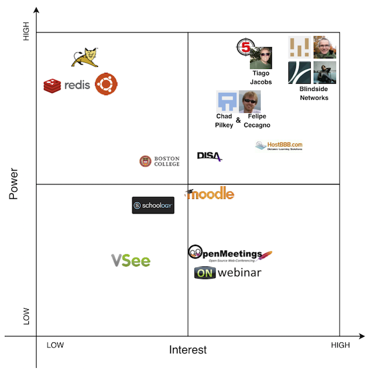
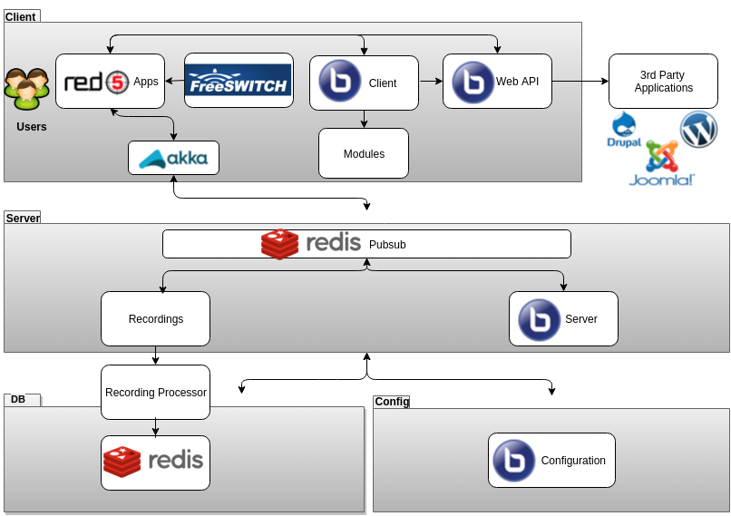
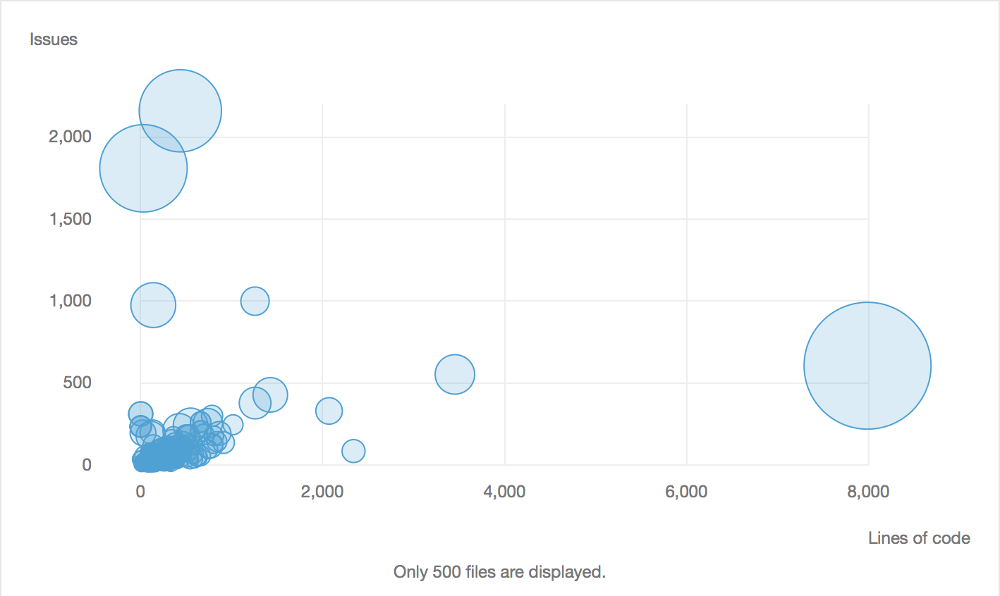
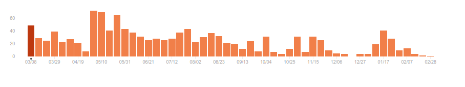

# BigBlueButton: High-quality on-line education
**By Michail Anastasakis, Pietro Frigo, Manuel Valle Torre and Kristín Fjóla Tómasdóttir**   
_Delft University of Technology_


##### Abstract

_BigBlueButton is an open source web conferencing system for on-line learning.
The system has been in development for nearly 10 years now with a strong group of core developers with a special focus on the stability and modularity of the system.
For people interested in software architecture, it is insightful to study the structure of such a well established software project like BigBlueButton.
Hereafter, a number of views and perspectives are used to demonstrate important aspects of BigBlueButton's internal and external structure.
This chapter provides a description of the people and systems involved, the developing process and architecture, the various features of the software along with its variability and possibilities to evolve._

##### Table of Contents

1. [What is BigBlueButton?](#what-is-bigbluebutton)
2. [Who cares about BigBlueButton?](#who-cares-about-bigbluebutton)
3. [How is it made?](#how-is-it-made)
  * [Development process and releases](#development-process-and-releases)
  * [The world outside BigBlueButton](#the-world-outside-bigbluebutton)
  * [The world inside BigBlueButton](#the-world-inside-bigbluebutton)
4. [What does it offer?](#what-does-it-offer)
  * [Features](#features)
    * [Teacher features](#teacher-features)
    * [Student features](#student-features)
    * [Shared features](#shared-features)
  * [Modules](#modules)
    * [Module communication](#module-communication)
5. [Is it implemented well?](#is-it-implemented-well)
  * [What does SonarQube say?](#what-does-sonarqube-say)
  * [What did we find out?](#what-did-we-find-out)
6. [How would you customize a big blue button?](#how-would-you-customize-a-big-blue-button)
7. [How can it evolve?](#how-can-it-evolve)
  * [Past and future](#past-and-future)
  * [Ease of evolution and tradeoff](#ease-of-evolution-and-tradeoff)
8. [But, hey! I want to contribute as well](#but-hey-i-want-to-contribute-as-well)
9. [Aaand...we are done](#aaandwe-are-done)
10. [References](#references)


## What is BigBlueButton?
Before starting the itinerary throughout the whole architecture of BigBlueButton (BBB) it is useful to understand what the system does.
So, let's begin.    

Quoting their [website](http://bigbluebutton.org):

> BigBlueButton is an open source web conferencing system for on-line learning.  

The project originally started at the Carleton University in a program for innovation and entrepreneurship in engineering [[5](#history)].
The program was already using a commercial conferencing system for their international students but it was too expensive.
A student of the innovation program, Richard Alam, received a challenge from the director of the program to replace the current system.
Today, BigBlueButton is a well established software which is widely used and integrated into many popular systems [[6](#users)] [[7](#integrations)].
Their vision is that every student should have access to a high-quality online education.

BBB has traditional conference system features such as a chat and webcam sharing for users to be able to interact in a meeting, and a deskshare functionality for the presenter to share his desktop with the audience.
However, the drive of BBB is education so there are two main characters in that environment: _teachers_ and _students_.
To satisfy the modern technology that these two groups require, features such as an interactive whiteboard is also present to aid the learning process.
Another cornerstone is the recording system that allows the students to watch the recordings whenever they prefer, removing the time constraints imposed by normal lectures.
These functionalities, amongst others, will be analyzed more in detail in later sections, along with the structure around their implementations.   

## Who cares about BigBlueButton?        

A software is made by people for people.
There is usually a group of people contributing to the software project and taking interest in its development.
The software itself is also made to meet the requirements of some other, or even the same, group of people.
These people who are somehow involved in the software or take interest in it are called stakeholders.
It is therefore very important to identify them in order to understand how the software should be implemented.

[Blindside Networks](http://blindsidenetworks.com) is by far the most evident and important stakeholder of BigBlueButton.
It is the company that started the BBB project and provides hosting for it along with commercial support.
The company is crucial for the project since no revenue comes from selling the product (since it is open source) but only from providing hosting and support [[16](#lessons)].
Based on the types of stakeholders that Rozanski and Woods suggest [[11](#book)], Blindside Networks can be considered as _Acquierers_, _Assessors_, _Communicators_, _Developers_, _Maintainers_, _Support staff_ and _Testers_.
Its two founders are [Richard Alam](https://github.com/ritzalam) and [Fred Dixon](https://github.com/ffdixon), which are the most influential people in the system.
Alam was the first developer of the project and is still today the lead architect along with being the CTO of Blindside Networks [[5](#history)][[25](#interview)].
Dixon joined him after the first release was made public and is the project manager of BigBlueButton and the CEO of Blindside Networks.
They are both still active developers and manage all aspects of the development.

There are other important groups of stakeholders that can be categorized in the following types:

* **Developers**  
Contributing to the BigBlueButton project on [GitHub](https://github.com/bigbluebutton/bigbluebutton) there are 61 developers which includes a number of about 20 very active members [[26](#contributors)].
The major commiters are again [Richard Alam](https://github.com/ritzalam) (3691 commits) and [Fred Dixon](https://github.com/ffdixon) (694 commits).
Other important developers, especially for the 1.0-beta release, are [Tiago Jacobs](https://github.com/tdj-br) from [iMDT](http://international.imdt.com.br/) who develops for the Red5 media server which is used by BigBlueButton, [Felipe Cecagno](https://github.com/fcecagno) working for [MConf](http://mconf.org) on the client, [Chad Pilkey](https://github.com/capilkey) who contributes from the Seneca College working also on the client and [Calvin Walton](https://github.com/kepstin) who is a part of Blindside Networks [[27](#blog)].   

* **Communicators**  
The role of communicators is to explain the system to other stakeholders.
For BigBlueButton these are the people responsible of writing the [documentation](http://docs.bigbluebutton.org), writing [blog](http://bigbluebutton.org/blog) posts and those that are taking care of answering questions on the mailing lists available for [users](https://groups.google.com/forum/#!forum/bigbluebutton-users), [developers](https://groups.google.com/forum/#!forum/bigbluebutton-dev) and [setup](https://groups.google.com/forum/#!forum/bigbluebutton-setup).
Blindside Networks put a lot of effort into making a good community around BBB, especially by upholding the mailing lists [[16](#lessons)].
All three forums are very active with many people offering their help, but most commonly it is Fred Dixon that answers the forum posts and sometimes the hosting company [HostBBB](http://hostbbb.com) which mainly answer questions about its service.
Another communication method is the BigBlueButton summit which is held once or twice per year since 2012 where developers gather to discuss further improvements and workshops are conducted as well.   

* **Customers**  
The users of the system have been mentioned before to be teachers and students.
The customers of BBB are however not these users but instead the companies that adopt the system.
These customers do not pay for the usage of the software since it is open source, but they might pay a company like Blindside Networks for hosting and support.
These customers are mostly schools and universities (such as [Boston College](https://twitter.com/BC_CTE/status/689859706370686980)), but also companies that integrate BBB into their Learning Management System (LMS) and system of e-learing (such as [Schoology](https://www.schoology.com/) and [Moodle](https://moodle.com/2015/07/06/moodle-launches-moodlecloud-free-hosting-for-educators/)) [[7](#integrations)][[28](#boston-college)].
Another important user that adopted the system in 2015 is the Defense Information Systems Agency ([DISA](http://www.c4isrnet.com/story/military-tech/disa/2015/02/11/disa-to-save-12m-defense-collaboration-services/23238997/)), extending the user community to governmental institutions as well [[29](#disa)].

To identify which stakeholders are necessary to manage closely it can be helpful to place them in a Power/Interest grid as can be seen in [Figure 1](#Figure1):

<a name="Figure1"></a>

*Figure 1: Power/Interest grid of stakeholders*


The Power/Interest grid is divided into four blocks based on the level of power and interest [[15](#power-interest)].
The stakeholders in the lower-left corner should only be monitored, the ones in the lower-right corner kept informed, the top-left corner kept satisfied and the top-right corner should be managed closely.
Additional stakeholders are present in the grid which are competitors such as [VSee](https://vsee.com), [OpenMeetings](http://openmeetings.apache.org) and [OnWebinar](http://www.onwebinar.com) along with some software that the system relies on such as  [Tomcat](http://tomcat.apache.org) and [Ubuntu](http://www.ubuntu.com).
The most important stakeholders are placed in the top right part of the grid which are in this case Blindside Networks, the core developers and the hosting company HostBBB.


## How is it made?
The BigBlueButton team treats the project as a product by having a standardized development process and release cycle along with upholding a solid architecture [[16](#lessons)].
Hereafter we will describe their development process,
how the software is constructed and what components they use.

### Development process and releases
The BigBlueButton group puts a lot of effort in making good quality software, both for users and developers. For the users their focus is mainly on stability and usability, also with an emphasis on features [[4](#faq)]. For developers they try to keep their technical debt low by focusing on modularity and with refactoring in each release.
Additionally, they keep up excellent documentation and uphold good code quality.
There are certain conventions for the developers to follow regarding the code such as Java Coding Conventions by Oracle, AsDoc format for Flex/ActionScript code and JavaDoc for documenting methods.

Code and issue management is entirely done on [GitHub](https://github.com/bigbluebutton/bigbluebutton) while most discussions occur on the [dev](https://groups.google.com/forum/#!forum/bigbluebutton-dev) mailing list.
A typical occurrence is that a BBB developer creates an issue on GitHub for a bug or an improvement and Dixon (being project manager) assigns it to an appropriate developer. Once the issue has been solved, a pull request is made by that developer where he links it to the issue. Finally the pull request content is  reviewed and merged by some other developer, often by Dixon or Alam.

Since the first release in June 2009, there have been 14 releases with the latest one in October 2015 (release 1.0-beta).
Each release has a well defined development cycle as can be seen in [Figure 2](#Figure2).

<a name="Figure2"></a>
  
*Figure 2: Development process for BBB*

1. **Planning**: The development cycle  starts with deciding on the main features that the BigBlueButton team wants to implement in that release.
2. **Design**: For each feature, issues related to them are created and specifications are published by the lead developers for the bigger and more complex ones.
3. **Development**: During this phase, developers start working on their own forks and make pull requests (PR) against the master branch. Every commiter is responsible for the PR to be compatible with the master branch but it should always be reviewed by another developer with some experience in the context of the PR. If the experienced reviewer considers the PR to negatively effect the stability or usability of the project he or she will reject it. If the PR gets accepted it will be tested with usage by other developers until a release is published.
4. **Beta Testing**: Before releasing the software is heavily tested by going through at least one beta stage and sometimes tested by the community for months. In this period every bug that is found is fixed.
5. **Release Candidate**: In this step, the label of the build is changed to be a _release candidate_ and the core developers wait for more feedback from the community, to fix the last possible bugs.
6. **General Release**: When there are no bugs left and the version is completely stable (this usually means two weeks of no reported bugs) the tag is changed and the _general release_ is published.

These steps construct the development process in BigBlueButton and what is interesting to notice is that the release is never planned for a specific date but only requires the system to be stable. As mentioned before, this highlights the focus on stability that the development team exhibits.

### The world outside BigBlueButton

It is important to identify how BigBlueButton works with other components in order to develop and maintain the software. The external entities that are connected to BBB are displayed in [Figure 3](#Figure3).

<a name="Figure3"></a>
  
*Figure 3: Context view of BBB*

BigBlueButton is an open source project and as a result needs help by the community to grow. Developers and users discuss about issues and new features through GitHub and mailing lists (_community_).
For developing the software, many languages and frameworks are used such as Java, ActionScript and Grails (_development tools_) [[17](#components)].
In order to make the system run, BigBlueButton decided to operate through external entities such as Red5, Tomcat and redis who provide their structure and implementation (_service providers_).
In order for a project like BigBlueButton to grow it needs financial and operational support.
In the past BBB received support from the WebFWD program and nowadays Blindside Networks is the main support provider (_commercial support_) [[5](#history)].
The customers of BigBlueButton can be separated into two different categories, the direct customers who include universities like Boston College or even the Defense Information Systems Agency and third parties that integrate BigBlueButton into their own system with the most famous being Drupal and WordPress (_customers_) [[7](#integrations)].
Finally, as with all software there are competitors to BigBlueButton with some of them being VSee and ONwebinar (_competitors_).


### The world inside BigBlueButton

The architecture of the system is split into layers and modules.
The main layers in BBB are Client, Server, Database and Configuration. Inside them, the different closed and open source projects interact across the platform as can be seen in [Figure 4](#Figure4).

<a name="Figure4"></a>
  
*Figure 4: Architecture of BBB*


**Client Layer**: The first layer of BigBlueButton is where the user performs the most activities. We can find the Red5 Apps that provide the functionalities for media sharing and streaming such as chat, board, presentation, voice, video, as well as FreeSWITCH which is the voice capability for conference [[18](#architecture)]. This is all connected to the BBB Web API which enables the use of other 3rd party applications such as Drupal and Wordpress.
The client itself consists of various modules which serve different features of the software.
Finally, there's the Akka apps that put together all the elements on the client side for a smooth real-time experience.

**Server Layer**: For the next layer, the first component is the Redis Pubsub which acts as a channel between server applications, connecting the main BBB Server and side applications for a unified performance. The HTML5 Server is not depicted since it is, as mentioned before, in process of implementation. The other part of the server level is the Recordings part of conferences, which manages all the events such as slides, videos, webcam and desktop, separately.

**Database/Configuration Layer**: For the final layer, we have the the Redis Database which is used for saving all the data of a conference session, which is then processed by the Recording Processor. On the configuration part of the layer we have the BBB Client Config file. The `config.xml` file includes the settings of all the modules that integrate with the BigBlueButton application, the logging system configuration and configuration settings concerning the servers IP and permissions.

## What does it offer?

In the [introduction](#introduction) a few features have been presented only to give a small idea of what BigBlueButton button is.
Now it's time to go more in depth.
The implementation of these features is divided into the separate modules in the client.
These modules will be discussed after describing the various features of the software.

### Features

As already said the two main categories of users are _teachers_ and _students_.
Therefore, it is logical to analyze the functionalities of the system based on these two roles.

#### Teacher features

The teacher is able to upload his slides so that everyone taking part in the class can see them [[23](#teacher-video)].
He is then aided in his presentation by an interactive whiteboard that shares his pointer and notes on the slides, making it easier for students to follow.
The teacher is also able to share his own desktop in order to go beyond the presentation itself or to fix a specific layout to have the students focus on a specific aspect of the lecture.
When he wants to make the lectures more interactive he has the possibility to have a student presenting the lecture.
This means that the student whiteboard will be shared for that specific timespan.
Moreover, he is also able to set up polling sessions or to split the students into breakout rooms for group projects.
Finally, for students that are not present in the class, the teacher has the opportunity to choose to record the lecture.

#### Student features

Students are able to set a reaction to the lecture with emojis next to their name, giving a possibility for the teacher to understand the prevalent reaction of the class to the lecture [[24](#student-video)].
These emojis include a raised hand that allow them to ask questions. The students are then able to take notes on the slides so that they can avoid to lose important parts of the lectures and they are even able to share a common notepad between multiple students where everybody can contribute to the notes.
In the case that the teacher decided to record the lectures they are even able to watch them back whenever they want.

#### Shared features

The system has also a few functionalities that are shared among all the users.
One is a WebChat on which everyone has the possibility to have private conversation with specific users or publicly interact with all the others taking part in the class [[31](#overview)].
There is also a WebCam and a Voice over IP (VoIP) system that makes the communication more natural.

### Modules

The system has been implemented with a modular structure in order to decouple functionalities as much as possible. Modularity is in fact one of the main goals in the development of BigBlueButton [[9](#roadmap)].
Each module is responsible of a few of the functionalities listed above.
In [Figure 5](#Figure5) these modules are represented showing the dependencies between each of them.

<a name="Figure5"></a>
  
*Figure 5: Modules of BBB and their dependencies*

There are also two additional modules currently under development [[9](#roadmap)].
These are a closed captioning module that has the purpose of enhancing the accessibility of the system [[21](#cc-module)] and a synchronized playback module for external media [[22](#sync-playback)].

#### Module communication
In order for the modules to work efficiently and coordinated, a shared structure and communication  is required. For that reason a specific design pattern is followed when modules are constructed. The communication of modules is implemented by  messages being broadcasted and handled by each module for every action in the system. Furthermore, every module has a similar folder structure with each folder being responsible for a different aspect of the module functionalities.

More specifically, every module has a _Service_ folder that provides the _Message Receiver_ and _Message Sender_ which are classes responsible for handling the various event messages  broadcasted by the  module. Moreover, the _Events_ folder includes the specific events related to the module and the _Managers_ folder includes the manager who is responsible for the initiation and termination of the  module. Finally the _Models_ folder includes the different module configurations ([Figure 6](#Figure6)).

<a name="Figure6"></a>
  
*Figure 6: Internal structure of the modules of BBB*

## Is it implemented well?
For a project to evolve efficiently, it is important to take into consideration future consequences during development.
If these consequences are not considered, developers might introduce [technical debt](https://en.wikipedia.org/wiki/Technical_debt) which could slow down future development.
Like stated before, the developers of BigBlueButton try to keep the technical debt low by enhancing modularity in the system and refactoring for every release. To investigate the technical debt in BBB we applied the [SonarQube](http://www.sonarqube.org) tool on the project along with some manual analysis.

### What does SonarQube say?
SonarQube bases its measures of technical debt on the SQALE methodology [[19](#sqale)].
Every time a code breaks a rule an issue is raised and is categorized as a _blocker_, _critical_, _major_, _minor_ or just an _info_ which is not considered as a flaw but merely a finding.
All these issues are converted into a measure for technical debt which is described in time units.
We applied the SonarQube tool on the BBB project, analyzing all code written in Java, ActionScript and JavaScript which accounts for 82.3% of the code.  

The results from the analysis show a passing grade of A which means that it has low technical debt.
The amount of technical debt was reported to be 387 days and 32.534 issues with most of them being _major_ or _minor_.
Furthermore, looking into the files that have the most technical debt (the highest six files) we see that they are all external files (not written by BBB developers) like `jquery-ui.js`, `jq-ui.js` and `sip.js`.
For internal files, instead, the number of issues per file is relatively low and the classes' size is not too big depicting a high quality project. In [Figure 7](#Figure7) some of the project's files are visible where the size of the circles reports the technical debt with the number of issues on the y axis and file size on the x axis. All circles outside the dense lower-left corner are classes from external sources.    

<a name="Figure7"></a>

*Figure 7: Technical debt of files in BBB*


### What did we find out?

Based on the work by Cairns and Allen [[1](#18f)] we analyzed the project in regards to its velocity rate, stressful releases, aging libraries, defects and automated test coverage.

1. From the GitHub repository we observe the graph in [Figure 8](#Figure8) depicting the number of commits from March 2015 up to February 2016 [[30](#commits)]. It is evident that the velocity rate is decreasing which might be an indicator that too much technical debt has piled up and is now impairing development productivity.
It might also be because of other reasons, like less features being added now than before.

2. If the team always experiences stressful releases or if bugs accumulate in the system it might very well indicate technical debt. Like described earlier the BBB team states that they take their time with releases where they make sure that they have fixed every single bug that has been introduced. However, looking at the [issues](https://github.com/bigbluebutton/bigbluebutton/issues) on their GitHub repository (at the time of this being written), out of the 336 open issues there are 155, almost half of them, with the label `Defect` which still have to be fixed.

3. On the aspect of aging libraries there are not any issues since all libraries used are up-to-date.

4. Without being able to analyze test coverage due to the multi-language nature of the project, there seems to be a serious deficit of automated tests. They heavily test the software before a release but that is almost entirely done with usage by the community [[18](#floss)].

<a name="Figure8"></a>

*Figure 8: Commit history of BBB 2015-2016*


Finally, by looking at the analysis above it is evident that the BBB developers try to keep the technical debt low and that they succeed in doing so.
By doing that they minimize the development time for each release since technical debt does not stand in their way.


## How would you customize a big blue button?

As explained when talking about [functionalities](#featuresfunctional-view), the configurable client features of BigBlueButton are split into different modules that can be loaded at startup [[2](#client-config)].
There is a `config.xml` file that includes each loaded module along with all their configurations and all their dependencies [[3](#config)].
```xml
<module name="WhiteboardModule" url="http://HOST/client/WhiteboardModule.swf?v=VERSION"
    uri="rtmp://HOST/bigbluebutton"
    dependsOn="PresentModule"
    baseTabIndex="601"
    whiteboardAccess="presenter"
    keepToolbarVisible="false"
/>
```
Above we can see an example of the `config.xml` structure where the WhiteBoardModule is declared.
Here the module has a `dependsOn` field, which means that the WhiteBoardModule cannot be loaded unless PresentModule has already been loaded.
An example of a configurable item is the `keepToolbarVisible` which can be set to `true` or `false`.


The usage of an xml file allows enough flexibility to the customer adopting the platform. In fact, this design choice does not ask the administrator of the system to edit the source code in order to enable or disable functionalities but only requires work on a human-readable XML file.
These configuration settings are although intended to be used by the system administrator, and not by users like teachers or students.
All these configurations are loaded at startup time which means that the program will not load new modules (or changes to the current ones) dynamically at runtime. However, at the same time, it will not require a full recompilation of the code to process the changes.
This policy, from a customer perspective, can be considered as a good tradeoff in order to have a system that can change semi-dynamically.
Apart from this strategy not many other expedients are used for aiding variability and evolution of the system.
When it comes to using these configurations, methods use `if` checks to verify the settings specified in the XML file.
This makes it more difficult to edit pre-existing modules but at the same time leaves space for future expansions with new features.
In fact, building a new module requires just to add a new `<module>` section to the `config.xml` file.
A final remark on customization is the branding allowed by BBB, where the skin of the system can be modified in a CSS file that is also compiled before running the client side, where logos or color schemes can be added [[20](#branding)].

## How can it evolve?
BigBlueButton as an Open-Source Software is intrinsically subject to change.
Furthermore, as a project dedicated to education, it has to be able to adapt to different and upcoming needs that may appear.
The main team of developers at BBB are fully responsible for the assessment, planning and management of change but it is mostly triggered by outside factors.

### Past and future
The BBB project has been in development for nearly 10 years and has evolved a great deal over that period.
New features have been introduced in many of their 14 releases but also with some of the releases only focusing on stability and improvements [[8](#releases)].
The biggest milestones in evolution have come from explicit or implicit user needs, as well as strategic decisions by the team.
Early additions to the software in 2009 includes packaging the software into a virtual machine in order to make it easy for users to set up BBB [[12](#youtube1)].
A big feature was then introduced in 2011 that enabled Record and Playback which had been widely requested by the community [[13](#playback-request)], which required extensive rework on the server architecture [[5](#history)].
Later on, the team added accessibility support with screen readers for users with sight disabilities.
The focus of the year 2015 was mostly dedicated to providing users with world class quality, such as having an excellent audio experience.
The future goals for BBB include support for users with hearing disabilities (Closed Captioning), adding unit testing to core modules and creating a HTML5 client (which is currently under development) [[9](#road-map)].
The HTML5 client will give users an option to join a session without having to use Flash, like it is required at this moment [[10](#html5)].
The reason why Flash has been used so far is because of the previous limitations of HTML5 regarding capturing webcam and audio [[14](#floss)].

### Ease of evolution and tradeoff
Systems can be designed to be highly flexible and easy to change or simpler in the way that they meet the original requirements and might need extensive refactoring for later changes [[11](#book)].
BigBlueButton is somewhere there in between but closer to being a flexible software.


The BBB team has taken into consideration certain aspects that make future evolution easier.
The internal structure of the system and the various modules that are part of it facilitate the evolution and new features.
Every implemented new feature is related to a module and as a result is integrated with a reliable existing base.
When we interviewed Fred Dixon on this subject he said:
> The client was always modular and we kept that modularity through the development of the client (this is making it easy for us to add Closed Captioning, a feature planned for a future release).

This modularity has therefore been a part of the structure from the beginning.
As a part of the internal structure of the modules, they include services that communicate with each other through broadcasted messages.
As a result when new features are added, they can take advantage of all the events that are already broadcasted from the messages and build on them.
Another way that eases evolvability is implementing parts of the system using third party softwares. It is very cost and time efficient and allows the team to focus on the core functionalities, but also leads to dependencies on these external softwares.
Furthermore, with an iterative approach with many releases the BBB team allows its users to take advantage of new features as soon as they are ready and stable.

However, there are a few aspects of the system that can be considered as obstacles for evolution.
Currently development is mainly supported on Ubuntu machines. The VM integration on non-Ubuntu machines can be a problem for developers and slow down the evolution of the system.
Moreover, the BigBlueButton client is built on Flash using ActionScript.
ActionScript is becoming outdated and there are some problems with the development of the client side related to the usage of Flash such as a difficulty of logging.

In general, the BBB team uses modularity to ease future evolution but also tackle some problems when they appear, all in all with a main goal of keeping the system completely stable.


## But, hey! I want to contribute as well
The BigBlueButton community is very inviting for new developers to contribute to their project [[14](#floss)].
In order to uphold the quality of their development they require certain things from contributors and for them to apply a certain workflow [[4](#faq)].
They require contributors to first study the architecture of the system and fully understand it before adding or modifying any code.
Before making a contribution it is also advised to have participated in the [dev mailing list](https://groups.google.com/forum/#!forum/bigbluebutton-dev) on Google Groups by showing understanding of the system and to build trust with the community.

When choosing what kind of contribution to make it is advised to tackle an [open issue](https://github.com/bigbluebutton/bigbluebutton/issues) or if the contributor is not a developer, to submit translations for localization or, to help others with the installation and configuration of a BBB server.

If contributing with code, it is required to first sign a CLA and to announce your intent on the issue itself on GitHub or on the dev forum and receive positive feedback.
When submitting the contribution it is necessary to follow a certain workflow on GitHub by forking the repository, creating a topic branch and submitting a pull request from that branch.
If the patch/feature is big it is also necessary to a accompany the PR with test cases and to follow certain coding conventions.

## Aaand...we are done
In this chapter we have analyzed the architecture of BigBlueButton based on different views and perspectives, so readers can have a broad understanding of the software and its structure.

In conclusion, BigBlueButton is an open source on-line conference system for education, where its developers strive to provide excellent tools and features for high quality remote learning.
There is a strong community around the project where the core developers make an effort to reply quickly to the active mailing lists.
Even though it is an open source project the managers of BBB treat it as a product, having specific development and release processes and focusing on good code quality.
New contributors are highly welcomed and the core developers go out of their way to make the environment good by having excellent  documentation available and good support on the mailing lists.
The BBB team focuses on having the software very stable in each release which has attracted some heavyweight customers and third party integrations such as WordPress, Moodle and The Defense Information System Agency (DISA).

The structure of the code is very modular which eases evolution and helps to minimize technical debt.
Many external components are used which allows the BBB developers to focus more on the client side of the project.
As a part of keeping the project stable, it is heavily tested by the community before each release but they lack automated tests.

Analyzing this project has proven beneficial for us to learn about how a good structured software is.
We got the opportunity to take part in a great open source community by making small contributions to the project where we were welcomed with inviting and helpful communication with the project manager Fred Dixon.
This was a very valuable experience where we learned how to approach an open source project and it provided a good way to learn about the system's architecture.
For other developers or people interested in open source projects, it is very interesting to study such a well established and stable project, and we hope this analysis can help with that.


## References
1. <div id="18f"/> 18f, https://18f.gsa.gov/2015/10/05/managing-technical-debt
2. <div id="client-config"/> Client Config, http://docs.bigbluebutton.org/dev/client-configuration.html#Client_Configuration_
3.  <div id="config"/> config.xml, https://github.com/bigbluebutton/bigbluebutton/blob/master/bigbluebutton-client/resources/config.xml.template
4. <div id="faq"/> BigBlueButton Documentation FAQ, http://docs.bigbluebutton.org/support/faq.html
5. <div id="history"/> BigBlueButton History, http://bigbluebutton.org/history
6. <div id="users"/> BigBlueButton downloads in July 2012, http://bigbluebutton.org/2012/07/06/bigbluebutton-is-a-global-project/
7. <div id="integrations"/> BigBlueButton Open Source Integrations, http://bigbluebutton.org/open-source-integrations
8. <div id="releases"/> BigBlueButton Release Notes,  http://docs.bigbluebutton.org/support/release-notes.html
9. <div id="road-map"/> BigBlueButton Road Map, http://docs.bigbluebutton.org/support/road-map.html
10. <div id="html5"/>  http://docs.bigbluebutton.org/labs/html5-overview.html
11. <div id="book"/> Rozanski and Woods. _Software Systems Architecture: Working With Stakeholders Using Viewpoints And Perspectives._ Upper Saddle River NJ: Addison-Wesley, 2012.
12. <div id="youtube1"/> BigBlueButton talk at Carleton University, https://www.youtube.com/watch?v=FXNeNZqVwsQ
13. <div id="playback-request"/> Response to a request for Recording on the user forum,  https://groups.google.com/forum/#!searchin/bigbluebutton-users/record$20and$20playback%7Csort:date/bigbluebutton-users/c6fCmD4Lc3M/gcQrmrI1-dsJ
14. <div id="floss"/> Floss Weekly, Interview with Fred Dixon, https://twit.tv/shows/floss-weekly/episodes/147
15. <div id="power-interest"/> Bright Hub Project Management, _What Is the Power/Interest Grid?_,  http://www.brighthubpm.com/resource-management/80523-what-is-the-powerinterest-grid
16. <div id="lessons"/> Technology Innovation Management Review, _Lessons from an Open Source Business_ - Fred Dixon,  http://timreview.ca/node/441
17. <div id="components"/> BigBlueButton Open Source Components, http://bigbluebutton.org/components
18. <div id="architecture"/> BigBlueButton Architecture, http://docs.bigbluebutton.org/overview/architecture.html
19. <div id="sqale"/> SQALE http://www.sqale.org
20. <div id="branding"/> BigBlueButton Branding, http://docs.bigbluebutton.org/dev/branding.html
21. <div id="cc-module"> BigBlueButton GitHub issue 2517, https://github.com/bigbluebutton/bigbluebutton/issues/2517
22. <div id="sync-playback"> BigBlueButton GitHub issue 973, https://github.com/bigbluebutton/bigbluebutton/issues/973
23. <div id="teacher-video"> Moderator/Presenter Tutorial (0.9.0), https://www.youtube.com/watch?v=J9mbw00P9W0
24. <div id="student-video"> Viewer Overview (0.9.0), https://www.youtube.com/watch?v=LS2lttmPi6A
25. <div id="interview"> Interview with Fred Dixon via email
26. <div id="contributors"> BigBlueButton Contributors,  https://github.com/bigbluebutton/bigbluebutton/graphs/contributors
27. <div id="blog"> BigBlueButton Blog http://bigbluebutton.org/blog/
28. <div id="boston-college"> Boston College STE Tweet https://twitter.com/BC_CTE/status/689859706370686980
29. <div id="disa"> C4ISR&Networks, _DISA to replace DCO with new collaboration services tool_,  http://www.c4isrnet.com/story/military-tech/disa/2015/02/11/disa-to-save-12m-defense-collaboration-services/23238997/
30. <div id="commits">  BigBlueButton GitHub Commits https://github.com/bigbluebutton/bigbluebutton/graphs/commit-activity
31. <div id="overview"> BigBlueButton Overview http://bigbluebutton.org/overview/
