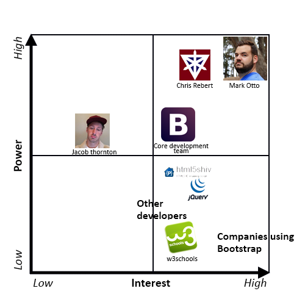
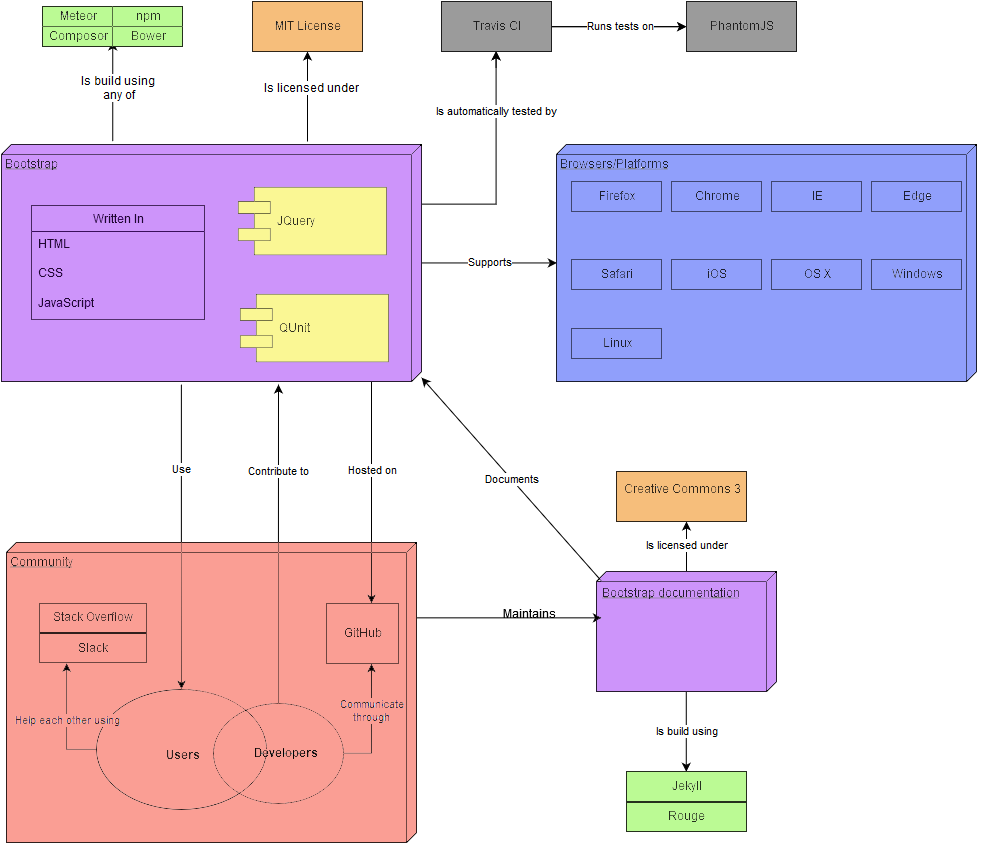
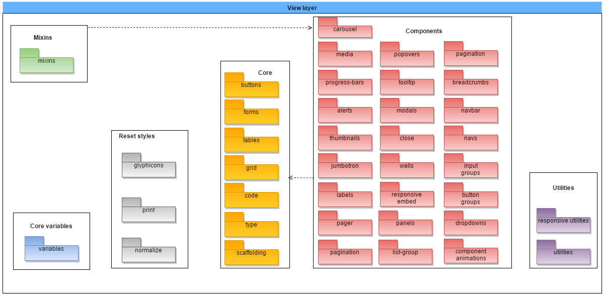
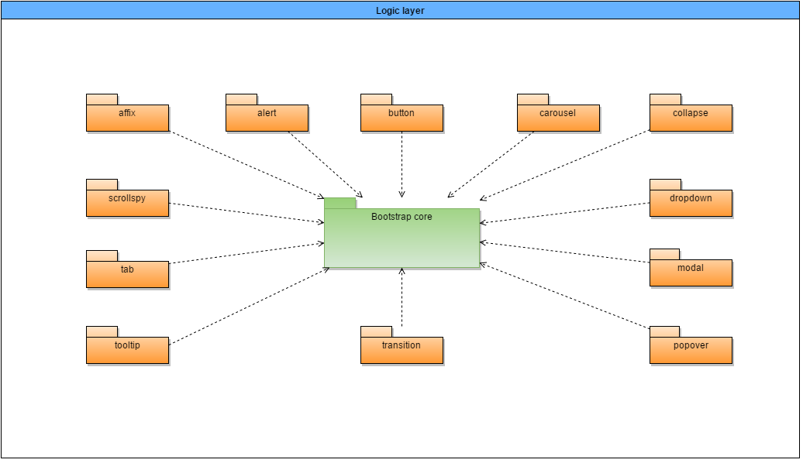
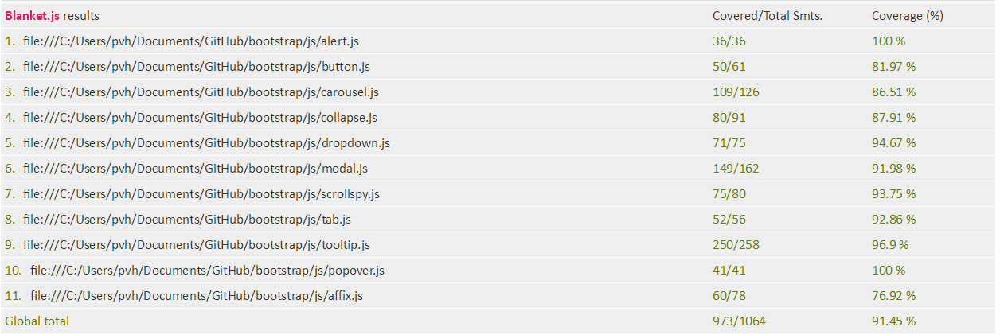
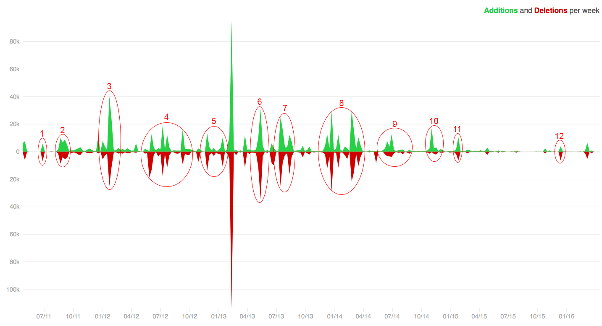

#Bootstrap
**By [Patrick van Hesteren](https://github.com/Pvanhesteren) and [Floris Verburg](https://github.com/florisverburg)**  
*Delft University of Technology*

*Bootstrap is an easy-to-use and powerful front-end framework for faster and easier web development and it is the most popular HTML, CSS, and JS framework for developing responsive, mobile first websites. In this chapter, the Bootstrap project is analyzed by means of architectural views and perspectives. The context view, development view and functional view are provided, just as the evolution perspective and usability perspective. Lastly, possible improvements to the Bootstrap project are mentioned.*

##Introduction
Bootstrap is a sleek, intuitive, and powerful front-end framework for faster and easier web development. Bootstrap was created by Mark Otto and Jacob Thornton at Twitter mid-2010. Before it was a successful open-sourced framework, Bootstrap was known as Twitter Blueprint. During the first Hack Week of Twitter, after Bootstrap was a few months into development, the project exploded because developers of all skill levels jumped in without any external guidance. 

The first official release of Bootstrap was on the 19th of August, 2011. Bootstrap has released over 20 releases since then, including two major rewrites with version 2 and version 3. The fourth version of Bootstrap had its first alpha release on the 19th of August, 2015 while the development of Bootstrap v4 is still in progress. Nowadays, Bootstrap is the most popular HTML, CSS, and JS framework for developing responsive, mobile first projects on the web [[7](#s10)].

Bootstrap is maintained by the founding team, Mark Otto and Jacob Thornton, together with the core development team and with the support and involvement of the Bootstrap community. The Bootstrap community consists of various people contributing to the project. The founding team and core team decide the direction Bootstrap is going. The core team and the community implement the functionalities together.

In this chapter, the insights of the Bootstrap project are given. We will give some background on the different stakeholders, architectural views, architectural perspectives and possible improvements to the project.

##Stakeholders
Stakeholders are the people, groups and/or organizations that have interest or concern in an organization. Stakeholders can affect or be affected by the organization's actions, objectives and policies.
Rozanski and Woods[[2](#s10)] discuss 11 types of stakeholders in their book. The most important ones for Bootstrap are listed below:

* **Acquirers** oversee the procurement of the system or product. The people that are involved in this stakeholder class are [Mark Otto](https://github.com/mdo) and [Jacob Thornton](https://github.com/fat).
* **Assessors** oversee the system's conformance to standards and legal regulation. [Mark Otto](https://github.com/mdo) is the only assessor in the Bootstrap project.
* **Communicators** explain the system to other stakeholders via its documentation and training materials. Persons involved in this class are [W3Schools](http://www.w3schools.com/bootstrap/), [Chris Rebert](https://github.com/cvrebert) and random GitHub contributors.
* **Developers** construct and deploy the system from specifications, or lead the teams that do this. The [core team](https://github.com/orgs/twbs/people) develop the sytem and are the only people that can merge pull requests. Furthermore, random GitHub contributors are involved in this class.
* **Maintainers** manage the evolution of the system once it is operational. The [core team](https://github.com/orgs/twbs/people) are involved in this, mostly [Chris Rebert](https://github.com/cvrebert).
* **Testers** test the system to ensure that is is suitable for use. The [core team](https://github.com/orgs/twbs/people) and random GitHub contributors write the test suite for Continuous Integration. All tests are automatically run upon committing to the repository.
* **Users** define the systems' functionality and ultimately make use of it. Companies and web developers use Bootstrap as framework for their website. A small selection of [large companies](https://www.quora.com/What-are-some-famous-websites-using-Twitter-Bootstrap/) that use Bootstrap is: Twitter, Walmart, NBA, Codecademy.

###Power/Interest Grid
A widely used method to classify stakeholders is Mendelow's power/interest grid[[1](#s10)]. On this grid, the interest of the stakeholder is shown on the horizontal axis and the power of the stakeholder is shown on the vertical axis. The higher the power of the stakeholder, the more important it is the stakeholder is satisfied in the decision making. The higher the interest of the stakeholder, the more the stakeholder would like to be kept informed. The stakeholders with high power and interest must be managed closely and the stakeholders with low power and interest must be monitored but with minimum effort. The power/interest grid of the Bootstrap project is shown below.

*Bootstrap's Power Interest Grid*

The person with the highest interest and power is Mark Otto, one of the founders of Bootstrap and still one of the most active developers of the project. Someone close to him is Chris Rebert, he is not one of the founders but he is the person from the core development team that is most active and he reviews and handles most of the pull requests. 

Jacob Thornton is also one of the founders, so he still has quite a lot power but he is currently not so active anymore. Therefore, he has less interest in the project.

The core development team is also a stakeholder with high interest and power. These are the people that actively contribute to and maintain the project and have write permissions to the project.

The companies that use Bootstrap - especially the big ones - are important to keep satisfied. If these companies are no longer satisfied, they will stop using Bootstrap. If no one uses Bootstrap anymore, the project will lose its value. Therefore, it is important for Bootstrap to keep these stakeholders satisfied. 

Stakeholders like [W3Schools](http://www.w3schools.com/) and [jQuery](https://jquery.com/) have high interest in the project. It is important for Bootstrap to keep these stakeholders informed. W3Schools is a source of information about Bootstrap that a lot of users use. jQuery and also for example html5shiv, are also important to keep informed. Because Bootstrap depends on these stakeholders, the stakeholders must know if Bootstrap wants to change anything that depends on for example jQuery. 

##Context view
The context view of a system defines the relationships, dependencies and interactions between the system and its environment. This environment includes the people, systems and external entities with which it interacts. It defines what the system does and what the system does not do [[2](#s10)].

###Context Model
Bootstrap's context model is visualized in the following figure and will be explained in depth in the following section.

*Bootstrap's context model*

Next to the code written by the contributors of the project (purple), Bootstrap is built using the [jQuery library](https://jquery.com/) (yellow) and the coupling with this library is very strong. If a backwards incompatible change is made, it requires a fair bit of work to support the new version. Bootstrap does its dependency management through [Grunt](http://gruntjs.com/), which depends on [Node.js](https://nodejs.org/en/). Grunt builds Bootstrap, the tests and the documentation. The framework itself is built using Meteor, npm, Composor or Bower and the documentation is built using Jekyll and Rouge (green).

On the testing side, the Bootstrap's unit tests are written in [QUnit](https://qunitjs.com/) (yellow). This dependency is fairly strong as migrating away from QUnit (and having maintainable tests) would be a fair bit of work. The automated testing infrastructure (grey) consists of [Travis CI](https://travis-ci.org/) running the tests on [PhantomJS](http://phantomjs.org/). It also runs [JSHint](http://jshint.com/) for code analysis. This dependency is not as strong as it is in the infrastructure instead of the code.

One of the functions of Bootstrap is to abstract away the differences between different platforms and browsers (blue). This makes all of the supported combinations an external dependency. When a backwards incompatible change is made, Bootstrap has to adjust to support the change. Bootstrap is a framework that supports all large browsers and mobile platforms.

For the users of Bootstrap looking for support, StackOverflow and Slack are used, which are part of the community of Bootstrap (red). These are only loosely coupled with the project and different platforms could be substituted in easily.

Bootstrap's source code is also licensed (orange) under the MIT license. Its documentation is licensed under creative commons 3 with the notable exception of the code fragments, which are licensed under the MIT license. 

##Development view
The development view provides an insight in the way Bootstrap is being developed. The development view is the view that addresses the specific concerns of the software developers and testers. First we will explain the architecture of the project and thereafter, we will discuss the technical debt.

###Dependencies
In order to reduce the amount of dependencies, Bootstrap aims to be modular by introducing new functionalities as plugins. As described in the development view section, Bootstrap hardly has any dependencies between the models, which indicates low coupling. In the case of Bootstrap, this does not lead to a high cohesion, as is usually the case with large projects, since all components are stand-alone.

###Source code modularization
Bootstrap is designed in a modular way in order to reduce the total amount of dependencies within the system. Bootstrap is built using two different components: the logic layer and the view layer, which are explained below. We can summarize Bootstrap's architecture as a view-view-controller architecture. On the one hand, we have the views, which are used for visual display. On the other hand, we have the view-controller that describes the behavior of all visual components (e.g. disabling a button after it has been clicked). When creating a webpage with Bootstrap, designing it in the popular *Model-View-Controller*[[3](#s10)] way would make the most sense. When using Bootstrap within a web application using the Model-View-Controller design principle, Bootstrap will serve as the view component.

####View layer
The view layer consists of 6 different modules: the core variables (blue), reset styles (gray), core (yellow), components (red), utilities (purple) and finally the mixins (green). The architecture of the view layer can be seen below.

*The architecture of the view layer*

* The core variable module consists of a style file that loads all different global styles that are used within Bootstrap.
* The reset styles module has the purpose of resetting or overriding the default browser styles to ensure that a Bootstrap page looks similar across all different device/browser combination styles that may occur when accessing a webpage built using Bootstrap.
* The core module consists of the backbone of Bootstrap and contains functionality that is generally used within all webpages built using Bootstrap.
* The components module consists of commonly used components within webpages that are not available in HTML by default. All components have been built independently and are only dependent on the core module.
* The utilities module is responsible for one of the most popular features of Bootstrap: it's responsiveness and Mobile First way of designing.
* The mixins module does provide a way to quickly generate simple, semantic layouts. Mixins are built on top of the core and components and reuse these to generate the semantic layouts which can be adjusted by overriding their properties.

####Logic layer
The logic layer provides the logic that all visual aids, the Bootstrap components, require. The architecture of the logic layer can be seen below.
 

*The architecture of the logic layer*

The logic layer consists of 12 different components that each provide a different functionality for a different corresponding visual aid. All different components rely on the Bootstrap core, which verifies that the jQuery dependency is loaded and provides CSS transition support.

As shown in the diagrams above, all modules have been built as independent as possible in order to reduce technical debt. While downloading, Bootstrap includes all modules by default. It is also possible to manually remove these from the includes in order to reduce resource usage within the web application.

###Technical debt in Bootstrap
The absence of a clear definition and model for technical debt can exacerbate the challenge of its identification and adequate management. It can further prevent the realization of technical debt’s utility as a conceptual and technical communication device[[5](#s10)].

Technical debt can be divided into multiple dimensions: code debt, design and architectural debt, environmental debt, knowledge distribution and documentation debt and testing debt[[5](#s10)]. We have measured Bootstrap's technical debt using these dimensions. Measuring the technical debt from Bootstrap differs from other projects as it is built on the idea of providing independent plugins. Furthermore, CSS files cannot be measured in terms of complexity.

####Code debt 
Code debt has to do with unnecessary code duplication and complexity, bad style that reduces the readability of code and poorly organized logic that makes it easy for a software solution to break when updated at a future point in time. We have ran the JavaScript source files against [complexity-report](https://www.npmjs.com/package/complexity-report).
This produces the following metrics:

* Mean per-function logical LOC (lower is better): 5.865373712711182
* Mean per-function parameter count (lower is better): 0.6435881047084829
* Mean per-function cyclomatic complexity (number of cycles in the program, lower is better): 1.867627071212864
* Mean per-function Halstead effort (effort required to write the program): 2373.7342178742506
* Mean per-module maintainability index (-infinity - 171, higher is better): 117.82584093099538
* First-order density (percentage of all possible internal dependencies that are actually realized in the project, lower is better): 0%
* Change cost (percentage of modules affected, on average, when one module in the project is changed, lower is better): 3.8461538461538463%
* Core size: (percentage of modules that are both widely depended on and themselves depend on other modules, lower is better): 0%

All metrics are defined on a linear scale, apart from the maintainability index which is defined on a logarithmic scale. While there is no such thing as a 'normal' score for these metrics, since every project is composed very different, it is however immediately show that Bootstrap has a very low amount of dependencies and changing a module would hardly require any changes to be made to other modules. Furthermore, we see that there is no unnecessary complexity introduced (low amount of parameters in functions, low amount of lines of code per function, low amount of cyclomatic complexity), which eases the maintainability of Bootstrap. It is clear that there is hardly any code debt in the Bootstrap project.

####Design and architectural debt
Design debt has to do with upfront design with a lack of focus on for example maintainability and adaptability. Architectural debt has to do with sub-optimal solutions, such as the usage of superseded technologies or patterns. 

Bootstrap works with an extensive issue and shipping list. While the issues are created ad-hoc, the shipping list is defined months in advance. New features are thought of in advance and all changes that are made to the system are verified to be in line of the upcoming releases (e.g. [issue #19303](https://github.com/twbs/bootstrap/issues/19303)). New features can be implemented at once, but will however not be added to pre-defined shipping lists. Instead, they will be added into feature releases. Bootstrap has chosen to work with technologies that are stable and supported. If better solutions become available, a switch is made in the next release.

Overall, the design and architectural debt of Bootstrap is very minimal, as we have not stumbled upon any outstanding issues that would have impact on the design/architecture of the upcoming or current releases.

####Environmental debt
Environmental debt of an application has to do with the environment in which the application is hosted or developed, especially the manual tasks and the frequency in which they occur. Since Bootstrap is a framework and is not deployed on its own, there are hardly any manual or incidental tasks that need to be performed within the environment in order to keep developing the framework. Since most of the issues are created by random contributors and most bug-fixes and feature implementations are made by them as well, the Bootstrap core team has chosen to take up an overseeing role. Since a lot of issues and pull requests are created every day, all must be verified according to code standards and checked whether or not the changes made are in line with feature releases. 

We see that the Bootstrap core team has to invest a lot of time in maintaining and informing the community about the changes.
The environmental debt of Bootstrap is as minimal as it can be and is mostly caused by the popularity of Bootstrap, since this triggers a lot of community involvement that needs to be managed properly. This cannot be reduced unless the core team will start to implement more features themselves.

####Knowledge distribution and documentation debt
Knowledge distribution and documentation debt has to do with the way the knowledge and documentation of the project is spread / maintained over time. Bootstrap has an extensive documentation and in general, each of the different components of the framework is described with all different options plus working examples. The documentation is available via GitHub and via the [official Bootstrap website](https://getbootstrap.com/), making it very accessible for knowledge sharing. The community actively contributes to the documentation, especially to documentation for new features that have not been documented properly yet. Since Bootstrap has a lot of random contributors, it has an extensive documentation on how to build and contribute to the project.
The knowledge distribution and documentation debt of Bootstrap is therefore very minimal.

####Testing debt
Testing debt measures the extent to which an application is tested properly in order to ensure that the application keeps functioning when changes are made.

We ran [BlanketJS](http://blanketjs.org/) on the QUnit test suite of Bootstrap in order to measure the code coverage of the JavaScript files. Below, you can find the results.

*JavaScript code coverage of Bootstrap*

We notice that while there is some room for improvement, all JavaScript files are covered quite well and there is no real testing debt here.

In addition, there are some visual tests containing predefined webpages that should look correct when testing the project. These need to be ran manually though.
	
The test pyramid [[6](#s10)] as described by Martin Fowler is however not properly adhered to. While we admit that the majority of the framework consists of CSS files which are hard to test, one could however easily automate the testing of the proper scaling of the grid system when resizing a webpage using [Nightwatch](http://nightwatchjs.org/) for example. Also, the integration of different components should be tested better, as Bootstrap is only tested at unit level and very basically at a visual level.

###Prevention of technical debt
Contributors need to be are aware of the fact that they are not the only one using and/or contributing to the system and that there is a common baseline to which all contributions must adhere in order to reduce technical debt. Only by introducing technical debt measurements, a project like Bootstrap will remain maintainable. Next to the measurements regarding the source code, which are explained below, the documentation also has its own guidelines.

####Code guidelines
The Bootstrap project uses HTML, CSS and JavaScript, which each have different code guidelines. Mark Otto, one of the creators of Bootstrap, has provided standards for developing flexible, durable, and sustainable HTML and CSS where contributors of the project must adhere to. This code guide can be found [here](http://codeguide.co/). In this code guide, the preferred syntax of HTML and CSS are defined, just as some rules the code must abide by. Next to this code guide, Bootstrap provides its own guidelines for every language.

####Test guidelines
If a contribution to the project contains JavaScript code, a set of relevant unit tests must also be provided. Each Bootstrap plugin of the project has its own dedicated test suite.

Next to these unit tests for each Bootstrap plugin, the project also has third-party testing-related code, which are written for QUnit and jQuery. And lastly, the project has "visual" tests, which are run interactively in real browsers and require manual verification by humans.

###Automated Testing Infrastructure
In order to be able to ensure the quality and integrity of the Bootstrap project throughout the entire development phase, Bootstrap also uses automated testing through continuous integration. The different parts of the continuous integration are Travis CI and Hound CI.

####Travis CI
[Travis CI](https://travis-ci.com/) is a continuous integration service that is used to build and test software projects that are hosted on GitHub. Every time a pull request is opened or something is pushed to a branch in the Bootstrap project, Travis CI automatically runs all the unit tests of the project. First, the framework and documentation are both generated. Then each of them is validated/tested.

####Hound CI
In addition to Travis CI, [Hound CI](https://houndci.com/) is also automatically triggered when a pull request is opened. Hound CI is a hosted service that comments on style violations in GitHub pull requests. This allows the project contributors to better review and maintain a clean codebase. This is done in order to emphasize care and team communication and it encourages other developers working in the code to keep the campground clean. It also avoids unnecessary debate during code reviews.

##Variability perspective
The extent to which a project can be configured of varied is called the variability of a project. In this section, an analysis of the variability of the Bootstrap project is provided. 

Since Bootstrap is a framework, it cannot be configured like other software projects. We will therefore describe how each of the features makes use of other features and how they can be configured throughout the framework and describe the variability perspective from the users' point of view.

###Variability / configuration strategy
As we have mentioned before, all Bootstrap functionality has been built on the idea of providing plugins that can be enabled/disabled based on the user's preferences. While by default Bootstrap will contain all functionality, it is possible to customize Bootstrap to your needs in order to make your website use less resources and save user's bandwidth in the end. While it is possible to compile the project on its own, it is also possible to customize and download your Bootstrap configuration via the [customize](https://getbootstrap.com/customize/) page. This page is made available for less experienced users and eases the configuration of the framework.

####Configuring the features
The configuration of Bootstrap differs from most project in the sense that it is a framework and not so much a stand-alone project. Therefore, the configuration opportunities lie within using (or not using) certain components in a certain way that suits your goals.

The [customize](https://getbootstrap.com/customize/) page allows users to determine the features available throughout the project and to customize them. This page splits them up into two types: the style files and the jQuery plugins. One should of course make sure to exclude both the style sheet and the jQuery plugin when excluding a feature.

One is also able to exclude plugins or style sheets by recompiling the project after altering the style sheets or removing the mappings of the source folder to the distribution folder for both the style sheets and the plugins.

###Relationships and dependencies between the different features
Bootstrap is very loosely coupled and just as with the source code modularization there are not many features that are dependent on one another. While in theory Bootstrap has been built on the idea of providing plugins that can be enabled or disabled, one cannot simply use a single plugin and neglect the rest of the plugins while still maintaining the *intended* functionality of the Bootstrap developers. The following diagram visualizes the dependencies among the different features, which are explained below. Please note that this diagram has been drawn as seen from the *intended* use of the Bootstrap developers.

*Dependencies among different features*

* The key features (yellow) are the features that most other features are dependent on. These include the basic Bootstrap styles (typography) and the grid system.
* The navigation bar and the responsive utilities (green) are dependent on both key features as they both make use of the grid system and basic styles.
* Most components are modular (blue) in the sense that they have almost no dependencies, apart from the basic Bootstrap style. In addition, we see that the input groups are dependent on the forms feature as the input groups are to be used within the forms.
* Finally, the tooltip and popover (red) are dependent on almost every other modular component (blue). While they do not depend on all components at once, the tooltip and popover features can only be used in combination with any of the modular components.

##Evolution perspective
Throughout the years, Bootstrap has evolved a lot. At this moment, the project has 36 releases, from the release of v1.0.0 on August 18 2011 to the v4.0.0-alpha.2 release on December 8 2015. Between all of those releases, a lot of features has been added, as is also reflected by the increased size of the project. In the next figure, the additions and deletions per week are shown. 

*Additions and deletions per week*

As can be seen in this figure, there are a lot of peaks in the additions and deletions. These peaks correspond to the releases of the Bootstrap project. The large peak, around February/March 2013 can't be explained through one of the releases, but there was probably a change in project structure or some mistake was made. The other peaks are explained one by one below:

1. The first release of Bootstrap, v1.0.0. This was the most basic version with only the key CSS features and minor documentation. 
2. The release of v1.3.0. In this version, the first JavaScript plugins were added and the documentation was improved a lot. 
3. The release of v2.0.0. This was basically an entire rewrite of the library. Also, additional responsive CSS for nearly all components was added. 
4. Releases of v2.0.4 until v2.2.2. In these releases, the documentation and HTML and CSS were improved and the support of Travis CI, the continuous integration, was added.
5. The addition of some features, the shift from global to local dependencies and the addition of the changelog in the repository. 
6. Release of v2.3.2. The large amount of added and deleted lines of code is mainly caused by the update of the jQuery dependency.
7. The release of version 3 of Bootstrap. In this version, Bootstrap introduced a new, flat design. Also, Bootstrap is from version 3 on, thanks to a massive redesign and rebuilt, mobile first and always responsive. Also, the grid system is improved a lot in order to be optimized for different screen sizes and the JavaScript plugins are rewritten. 
8. Releases of v3.1.0 and v3.2.0. The most important changes in these releases were the change of build system and packaging and the deprecation of some classes. Furthermore, responsive embeds and responsive utility classes were added, just as an extra bot checking live code examples in issues and pull requests on GitHub. 
9. The release of v3.3.0. In this release, another extra bot was added for checking new pull requests for common mistakes. Also, some Less variables were added for easier customization and the accessibility of some plugins was improved. 
10. A release of Bootstrap with mostly bug fixes. 
11. A release of Bootstrap with mostly bug fixes. 
12. Release of v3.3.6. This is the current release of Bootstrap.

Since mid-2014, less additions and deletions are done compared to earlier. This is because in the first few years, the framework had to be developed from scratch. Nowadays, the framework is well developed and has a lot of features. However, bug fixes are still applied and new features are still added. 

Bootstrap 4 is currently in development. But because this isn't committed to the master branch, this isn't visible on the graph. This is an example that the framework continuously is improved according to the new standards in programming. While doing this, Bootstrap ensures a high quality framework with up to date dependencies. All of this ensures that Bootstrap continues to adapt while keeping in mind accessibility, making it an excellent choice for a web-development framework, also in the years to come.

##Usability perspective
Applying the usability perspective ensures that the system allows those who interact with it to do so effectively [[2](#s10)]. The only place users may interact with the system is when a user creates a website with the Bootstrap framework. This interaction only happens via computers, because users don't develop websites on their mobile phones. Furthermore, HTML, CSS and JavaScript can be executed on every operating system, so Bootstrap doesn't need to cope with the variation in bandwidth, hardware capabilities, and rendering software issues.

The interaction between the user and Bootstrap doesn't occur via a user interface, but via predefined HTML, CSS and JavaScript notations. Therefore, Bootstrap is a framework that supports all large browsers as well as mobile platforms in order to be available to as many users as possible.

The only touch point for the Bootstrap project is the development of websites, which has a comprehensive touch point interaction. The user builds his website with Bootstrap and mainly the use of the grid system requires some knowledge in order to be able to use. Furthermore, the different components can require quite some time to adapt to your needs as well. Bootstrap tackles possible implementation problems with its extensive documentation.

Bootstrap users vary from unexperienced web developers to very experienced web developers. This can cause problems, because the unexperienced users want to develop their website as easy as possible, while the more experienced users want to tweak the Bootstrap framework. The Bootstrap framework can be used without any tweaks, but can also be adapted by the users to fit their needs. Components of Bootstrap can be excluded from the resources and a minified version of Bootstrap is available as well in order to minimize the resource usage and bandwidth, as is also explained in the variability perspective.

##Possible improvements
Based on our research on the Bootstrap project, we have have come up with some suggestions to further improve the project. In order to make the project even more accessible, we suggest that the following changes are made to the project. These suggestions have also been submitted to the issues list of the Bootstrap project.

###Extending the annotations of the style sheets and their implications [#19418](https://github.com/twbs/bootstrap/issues/19418)
To allow for manual adjustment to the developers needs, we recommend that all style sheets and their implications are documented so that developers become aware of the changes they are making and the possible implications they may have.

###Development of a real-time implications view [#19419](https://github.com/twbs/bootstrap/issues/19419)
Often developers will want to change some styling specifically for a certain use case on their website. The Bootstrap [customize](https://getbootstrap.com/customize/) page allows for these changes to be made, but when making these changes the implications are not shown. Bootstrap should allow developers to upload their webpage and to make the changes on the styling in split screen. On the left side, changes can be made, whereas on the right side their webpage will update accordingly so that changes can be made more easily.

##Conclusion
The goal of this research was to study the stakeholders, architecture, configurability and usability of the well-known Bootstrap framework. Mark Otto, Chris Rebert and the Bootstrap core team belong to the most influential stakeholders, but companies using Bootstrap, jQuery and W3Schools are also important stakeholders of the project. 

All Bootstrap functionality has been built on the idea of providing plugins that can be enabled/disabled based on the user's preferences. It is very loosely coupled and there are not many features that are dependent on one another. Bootstrap can be styled and customized using the [customize](https://getbootstrap.com/customize/) page or via editing the source files and recompiling the project. This ensures the framework is accessible for both experienced and unexperienced users.

There is hardly any technical debt in Bootstrap, although the integration of different components could be tested better. Bootstrap aims to reduce technical debt using its automated testing infrastructure which uses Travis CI, Grunt, Sauce Labs, Amazon C3 and Hound CI. Furthermore, it provides a set of code and documentation guidelines.

Bootstrap has evolved a lot throughout the years. The last time, less additions are done, because Bootstrap is a full grown framework nowadays. This doesn't mean the framework isn't maintained or is slowly dying. Still a lot of bugfixes are applied and features are added.

To conclude, Bootstrap is a robust framework that allows developers to create responsive web applications in a very easy way. With many more features to come in the upcoming release, Bootstrap will continue to ease web development for years to come, so it remains an excellent choice for a web-development framework.

##References

1. Olander, Stefan, and Anne Landin. "Evaluation of stakeholder influence in the implementation of construction projects." International journal of project management 23.4 (2005): 321-328.
2. Nick Rozanski and Eoin Woods. 2011. Software Systems Architecture: Working with Stakeholders Using Viewpoints and Perspectives. Addison-Wesley Professional.
3. Burbeck, Steve. "Applications programming in smalltalk-80 (tm): How to use model-view-controller (mvc)." Smalltalk-80 v2 5 (1992).
4. Sven Apel, Don Batory, Christian Kästner, Gunter Saake. Feature-Oriented Software Product Lines. Springer, 2013.
5. Tom, E., Aurum, A., & Vidgen, R. (2013). An exploration of technical debt. Journal of Systems and Software, 86(6), 1498-1516.
6. TestPyramid. (n.d.). Retrieved March 27, 2016, from http://martinfowler.com/bliki/TestPyramid.html.
7. Official Bootstrap website, http://getbootstrap.com.
