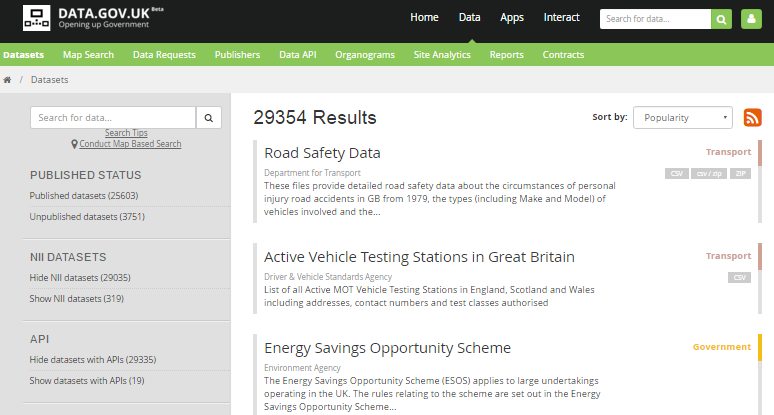
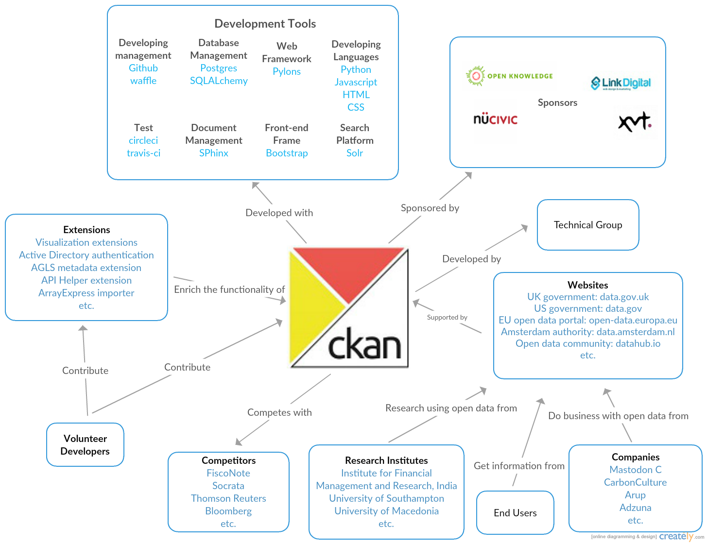
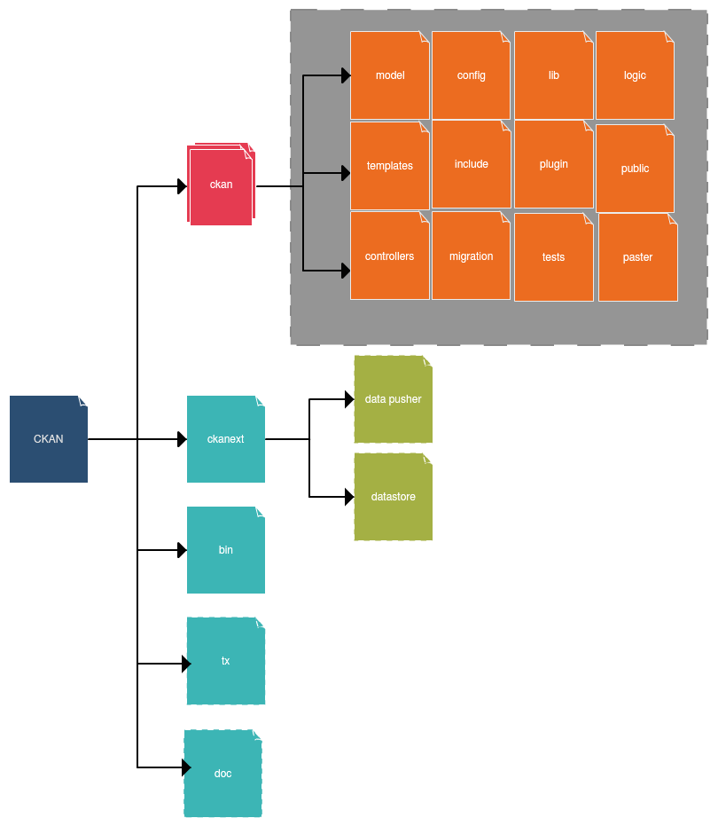
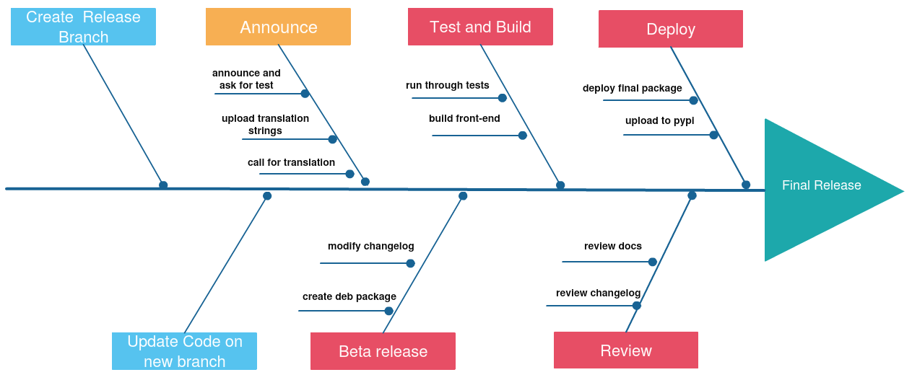
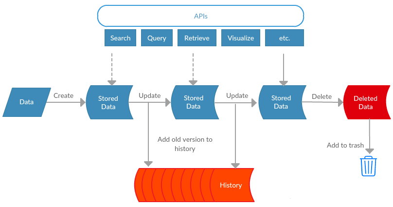
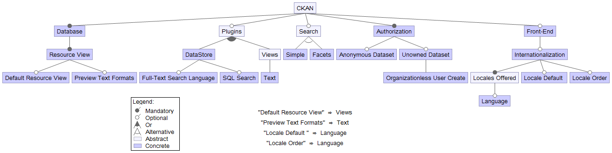

#CKAN: The open source data portal

By Andy Chiu, Boyang Tang, Jihong Ju, Bo Wang

Delft University of Technology

##Abstract

Pirates value gold as much as researchers value data. They crawl through the entire web driven by their unsatisfying hunger for more data. Every once in a while, they find a CKAN instance which is a wonderful treasure trove filled with data, free for everyone to take. As part of the Delft Students on Software Architecture book, we provide an in-depth analysis of CKAN the open source data portal. This is done by identifying key stakeholders and putting them into context. Followed by the software architecture and how to contribute. Finally, we end with an evolution perspective and information viewpoint.

##Table of Contents

- [Introduction](#1-introduction)
- [Usability Perspective](#2-usability-perspective)
- [Stakeholders](#3-stakeholders)
- [Putting into context](#4-context)
- [Modules](#5-modules)
- [Common Processing](#6-common-processing)
- [Codeline Organization](#7-codeline-organization)
- [Information Viewpoint](#9-information-viewpoint)
- [Variability](#11-variability)
- [Technical Debt](#12-technical-debt)
- [Conclusion](#13-conclusion)

<h2 id='1-introduction'>Introduction</h2>

As a researcher you can never have enough data, especially when facing socio-economic problems. Technological advancement has created the opportunity to make data freely available to everyone. Collaborating by sharing data on a world-wide scale is one step towards a unified front for meeting the challenges of tomorrow. Open data is the formalized definition of this idea. In practice, most data is kept under control by both public and private organizations due to commercial interest. Advocates of open data argue that these restrictions are against the communal good and that these data should be made available without restriction or fee. Furthermore, they should be re-usable without requiring permission so that we can build upon earlier work.

The Open Knowledge Foundation introduced CKAN, the open data portal. Since its release it has been deployed by many governments, organizations and companies to make their data open and available. It is a powerful data management system that provides the tools for publishing, sharing, finding and using data. There exist other data hub software that can contain collections of data from multiple sources, but they do not provide the same degree of freedom and flexibility as CKAN. The latter is an open source initiative that lets you avoid long-term lock-in and the code is freely adaptable. Furthermore, it contains a rich set of features that helps gathering data from multiple sources, faceted search, machine interface to data and metadata, and sharing public data with other CKAN instances.

One of the many CKAN websites is [data.gov.uk](https://data.gov.uk/), they are also part of the Steering Group that drives the CKAN project forward. The purpose for launching [data.gov.uk](https://data.gov.uk/) is to help people understand how the government works and how effective policies are made by releasing public data. Over 19000 data sets have been published so far by various UK departments. They encourage technical users to create useful applications out of raw data that can benefit society, or investigate how effective policy making changes over time.

In this chapter of Delft Students on Software Architecture we will provide an in-depth overview of the people involved in the CKAN project, the development process, how CKAN evolves over time and its information management.

<h2 id='2-usability-perspective'>Usability Perspective</h2>

A CKAN instance serves as a place where data can be published and searched. The success of the system depends on the effectiveness of these tasks. Therefore, applying the usability perspective can ensure that the system is well suited to user needs. This perspective will also give the reader an impression of how a CKAN instance looks like by introducing several key features and how these facilitate high usability. CKAN features can be either accessed by an intuitive web interface or by other machines through a common API , here we mainly discuss the web interface. It is important to point out that there is a clear separation of the user interface and the functional processing. [Figure 1](#Figure1) presents a screenshot from [data.gov.uk](https://data.gov.uk/), an exemplary data portal powered by CKAN. Visitors for such a website are mostly researchers or individuals with intermediate computer experience.

*Figure 1, CKAN interface*

### Publish and Manage Data

The web interface allows data publishers to easily upload and update their datasets in a distributed authorisation model called 'Organizations'. Each 'Organization' can manage its own access rights instead of a central admin. There is an organization admin page for managing members, datasets and dataset access.

### Search Data

CKAN provides a rich search experience based on keywords, tags and browsing between related datasets. Other options like Fuzzy-matching and Faceted search are able to allow users to search for datasets without an exact keyword match. CKAN's search is powered by SOLR, an open source search platform.

### Display Data

Data can be displayed by numerous previewing tools without downloading the data. This makes it easier for the user to inspect the data using an appropriate previewing tool for a certain file type.

### Theming

Each CKAN instance can be themed to match the design of a certain organization. CKAN pages are generated from [Jinja2](http://jinja.pocoo.org/) template files which can be modified. The design can then incorporate any messages or workflow that best suit the visitors.

<h2 id='3-stakeholders'>Stakeholders</h2>

Making decisions regarding the CKAN project involves multiple stakeholders, each with different interests, requirements and needs. It is one of the most important tasks to correctly identify the stakeholders in order for the project to succeed, though this is often neglected in practice. In the following we discuss the different stakeholders based on [Rozansky and Woods](https://books.google.nl/books/about/Software_Systems_Architecture.html?id=ka4QO9kXQFUC) surrounding the CKAN project. First, a high-level diagram is shown that presents a simple overview. This is complemented by a more detailed description of each stakeholder and their influence.

*Figure 2, CKAN stakeholders*

###Stakeholder Description

The eventual **users** of CKAN are the governments, organization, and communities that wish to publish or collaborate with data. Their interests and needs lie in the usability and functionality of a data portal. They require control of data that gets published and is accessible most of the time. An extensive list of CKAN instances around the world can be found on their [website](http://ckan.org/instances/). CKAN is open source and is free to download and install for any kind of use. The Open Knowledge Foundation has a professional team that provides paid CKAN services to assist in deployment, setup, hosting and support. This team belongs to Open Knowledge Services and can be categorized as stakeholders of the type **production engineers, system administrator, suppliers and support staff** with the Open Knowledge Foundation as their supplier.

The CKAN project started as an initiative of the Open Knowledge Foundation and is today overseen and managed by the CKAN association, independent and with its own governance. The [steering group](http://ckan.org/about/steering-group/) consists of key stakeholders who are committed to oversee and steer the CKAN association forward. Their main responsibilities are to oversee finance and activities within other groups including the legal and administrative aspects. The Steering group communicates with the [advisory group](http://ckan.org/about/steering-group/) which consists of members and representatives that support CKAN. The latter gives advice and expresses the needs of the community, but it does not have decision-making authority for the CKAN association. Both groups belong to the class **acquirers** and **assessors**. The [community and communications team](http://ckan.org/about/community-and-communication-team/) of the association are of the **communicators** stakeholder type. Its responsibility lies in informing key users, communities and the press trough meetings and online content with the purpose of increasing engagement. Finally, the [technical team](http://ckan.org/about/technical-team/) provides technical vision, makes major architectural decisions and has many more responsibilities regarding the software. Privileges like getting a vote on core changes and setting the technical direction of CKAN make it a very influential stakeholder. It is the core CKAN **developer** and **maintainer**. In addition, there are voluntary contributions to the code from around the world.

Apart from the stakeholders defined in [Figure 2](#Figure2), we identify the **sponsors** which are the [members](http://ckan.org/about/members/) of the CKAN association. Membership is a way for individuals, companies and organizations to support the CKAN Project and be recognized for doing so. They contribute resources by providing money and and-kind resources such as staff-time. The level of contribution varies between the different tiers of membership.

### Power/Interest Grid

To achieve a better understanding of the different stakeholders, we present a [power/interest](https://www.mindtools.com/pages/article/newPPM_07.htm) grid. that provides a simple view of how influential each stakeholder is and the degree of interest. Identifying key stakeholders that are authorized to make decisions is essential for any architect.

*Figure 3, power-interest grid*

From [Figure 3](#Figure3) It is clear that the Steering Group has the most power that makes all major decisions, but it does receive input from the Advisory Group. The technical Team is in charge of software and the architecture with the privilege to vote on core changes.

<h2 id='4-context'>Putting into context</h2>

With the service provided by CKAN, dataset owners are able to store and publish the raw data and metadata in well-structured and manageable ways. The users can then search for datasets of interest through both the website and APIs. CKAN also allows various extensions and plugins developed by third-party developers to enrich the functionalities of CKAN.

[The context diagram](#Figure 4) presents the context of CKAN as well as the scenarios in which CKAN can be used. The CKAN Project is sponsored by the Advisory Group members who contribute resources, either through contributing money or providing in-kind resources such as staff time, for the development of CKAN. Some of the advisory group members, for example Open Knowledge, also provide technical support to other CKAN instances such as [UK open data protal](https://github.com/delftswa2016/team-ckan/blob/D6/d4/sub-documents/data.gov.uk). The data published on CKAN instances can be used for research purposes, commercial exploitation or individual interests. The Technical Team takes charge of code contributions, technical documentation and all other technical-related issues using [Github](https://github.com/), testci and many other developing tools. Volunteer Developers are people who are interested in the project and willing to contribute to some coding area, for example fixing bugs and writing extensions for the CKAN platform. Finally, CKAN is not the only open data solution, competitors like [FiscalNote](https://www.fiscalnote.com/) and [Socrata](https://www.socrata.com/) are playing the game as well.

*Figure 4, context view of ckan*

<h2 id='5-modules'>Modules</h2>

We'll now have a look at the architecture of the CKAN project. These include the high level modules that provide CKAN's functionality and any architectural design that is system-wide implemented. Each module is categorized in a layer for which the dependencies between the different layers are shown.

### Pylons

CKAN's internal structure is adapted to the structure of the [Pylons Web Framework](http://www.pylonsproject.org/). This framework works a little differently than many other web frameworks. Normally, an entire framework is loaded first and then it searches for any project code to execute. Pylons does the opposite by importing objects while running the code, assembling a so called WSGI Application and returning it. This is done to achieve a higher degree of flexibility and customizability in building a web application. Pylons applies a Model-View-Controller (MVC) architectural design pattern. They have extended this slightly by not having the Controller directly interpret the client's request, it only acts to determine the appropriate way to assemble data from the model and render it with the correct template. In other words, the Controller calls portions of the model and view as necessary to fulfil the request.

### Module Organization

In order to gain understanding of the architecture, we present a [module structure diagram](#Figure5). Three different layers can be identified:

1. Controller layer
2. Model Layer
3. View Layer

*Figure 5, modules of CKAN*

#### Controller Layer

When an HTTP request is being send by a client, the controller layer intercept this since this is how the Pylon framework handles requests. The purpose of the *Config* module is to apply middleware to the request. These can add additional functionality to the base application depending on the request. For example, the RoutesMiddleware parses the request URL to see if it has a matching controller, the information of the controller to be called is stored in the request. It then attempts to locate the class with a similar scheme in the *Controller* module.

#### Module Layer

The model contains all the necessary modules to perform non-trivial operations on datasets, organizations and users. The *Logic* module is most abstract which accepts calls from the controller to access data. Eventually, data are stored as atomic values in [PostgreSQL](http://www.postgresql.org/), a relational database. This makes it harder to retain conceptual information that is present in objects when using an object-orientated programming language. [SQLAlchemy](http://www.sqlalchemy.org/) comes to the rescue by taking care of the translation from objects to relational database entries and vice versa. For this purpose, the modules *Dictization* and *Models* are used. Search functionality is made possible by the *Search* module, which in turn will call the third-party [SOLR](http://lucene.apache.org/solr/) library that will perform the actual search.

#### View Layer

The data retrieved from the model layer is display neutral, meaning that no formatting has been applied. CKAN uses a *Render* module which is responsible for generating templates with the requested data from the model. [*Jinja2*](http://jinja.pocoo.org/docs/dev/) is a designer-friendly template language that is imported by the render module.

<h2 id='6-common-processing'>Common Processing</h2>

Identifying common processing elements is necessary for any large system, not only because it helps avoid code duplication but also because it can improve the overall technical coherence and reduce the risk of falling into intricate programming traps. This is where a common design model is needed. A clearly defined common design model also makes it easier for the developers to understand, upgrade and maintain the system. In this section, we will provide an introduction to the common processes in CKAN and how it benefits from these design choices.

1. **Message Logging**

   CKAN uses the Python standard library’s [logging module](http://docs.python.org/2.6/library/logging.html) to log messages. For different messages with different levels of destinations, the *logging* module supports writing to files, HTTP GET/POST, SMTP service, sockets or some OS-specific logging mechanisms. The log messages should be short and concise, accompanied with proper log-level (DEBUG, INFO, ERROR, WARNING or CRITICAL, see [Python’s Logging HOWTO](http://docs.python.org/2/howto/logging.html)). Well formulated logging messages help CKAN developers and maintainers trace bugs easily without wasting effort on identifying the code causing the problem.

2. **Internationalization**

   All user-facing strings in CKAN code are internationalized so that the translator could automatically localize the strings and translate them for various supported languages by CKAN. "Internationalization" here basically means passing the string to the translation platform, [Transifex](https://www.transifex.com/okfn/ckan/).

   CKAN uses urls to determine which language is used. For example, `/fr/dataset` will be shown in French. For now, CKAN already supports numerous languages. A list of supported languages can be seen [here](https://www.transifex.com/okfn/ckan/). The default language of a CKAN site can be simply changed by setting the *ckan.locale_default* option in the config file to desired language.

   CKAN's language support was contributed by a great number of volunteers, they work together in [Transifex](https://www.transifex.com/okfn/ckan/) to create translations for CKAN. This resulted in the support of 62 different languages. The translation team includes 4 admins, 178 coordinators, 31 reviewers and 460 translators.

3. **Documenting the parameters, exceptions and returns of functions**

   CKAN requires developers to document the parameters and return values of functions. All the CKAN code should also properly document exceptions, including the type of exception and conditions. This informs other developers about the behavior of a particular function so that they know what to expect when using it.

4. **Third-party libraries**

   CKAN is developed with dozens of third-party libraries such as the Pylons Web Framework, the database ORM toolkit SQLAlchemy, the Bootstrap front-end framework, python standard library, etc. These libraries can be commonly used among different code modules consistently for solving one specific problem. For instance, Pylons can provide solutions to session encryption while SQLAlchemy contains encryption module for the database. The use of third-party libraries saves developers' efforts from solving trivial problems with existing solutions. However, these libraries might also limit the flexibility, leading to a tit-for-tat strategy.

5. **CKAN Library**

   In addition to the external libraries, CKAN has an internal library that contains:

   - Common Helper functions.
   - Security: User Authentication and Security such as Captcha.
   - Data Management: Data dictization, Package Search, Package data dumper, Resource saver etc.
   - User Interface: Email Notification, Emails reader and sender, Date Formation, Webpage paginator etc.

   These functions are isolated from the other modules to avoid circular dependencies and are easy to use by importing the corresponding modules. These functions help isolate common processes like dictizing data, dumping packages, and avoid code duplication.

6. **Logic functions**

   High-level functions like create, delete, search for and get, patch and update data from CKAN are available from the *logic* module in the Model Layer. Controllers are able to call them with `ckan.logic.action.get`. For each logic action, there is an authentication function to authorize the action. Besides, controllers can also validate external datasets in other formats and convert them to the proper format. These functions enable controllers to manage their actions in high level without considering how these actions are implemented in detail.

7. **Testing**

   All new modules of code or changes to existing code should have passed corresponding tests before being merged into master. The test modules in CKAN are maintained independently from the module being tested. They can be shared by many code modules. Therefore, developers can re-use the existing test modules instead of writing tests for every new change. We will also cover content about testing standards in [testing standerds](#7-codeline-organization).

<h2 id='7-codeline-organization'>Codeline Organization</h2>

CKAN's source code structure, coding standard and testing standard are discussed in this section.

### Source Code Structure

[Figure 6](#Figure6) illustrates the general structure of CKAN. Folder *ckan* contains the key modules of CKAN, including models, views, controllers (the [MVC](https://github.com/delftswa2016/team-ckan/blob/D6/d6/sub-documents/MVC) pattern), data migration module, test module etc. Folder *ckanext* holds the user libraries. Other folders contain configuration files, bins or documentation.

*Figure 6, code structure of CKAN*

### Code Test Standardization

For CKAN, all new code or changes to existing code should have new or updated tests before being merged into master. Nowadays CKAN maintains 2 test styles named `ckan.test.legacy` and `ckan.tests`. Both the legacy tests and the new tests need to pass before merging into the master branch.

### Release Process

The process of a new release starts with the creation of a new release branch. A release branch is the one that will be stabilized and eventually become the actual released version. *Beta releases* are branched of a certain point in master and will eventually become stable releases. Once the release branch has been thoroughly tested and is stable we can do a *final release*. A detailed release process can be found in [Figure 7](#Figure7). 

*Figure 7, release process of CKAN*

<h2 id='9-information-viewpoint'>Information Viewpoint</h2>

###Importance of an information system

An information system is defined as an organized system for the collection, organization, storage and communication of information. As we have already discussed in the previous chapters, CKAN is an open data management system. It allows data owners to streamline publishing, sharing, finding and using data. The essence of CKAN is an information system. Therefore, it could be interesting if we have a look at the information model of CKAN and how it satisfies the requirements of CKAN's features.

In order to get a taste of CKAN's information system, it could be helpful if we start with a brief overview of CKAN features regarding data management. Data nowadays usually come in large volume and is in various formats. The data management system should be able to store these data properly in an efficient and flexible manner. Besides, data needs to be easily accessed through web interface and APIs. Data should be indexed and searchable so that users are able to find data of interest conveniently. It might not be wise give everyone authorization to data, so fine-grained access control is needed in the system. In addition, data should be spatially and temporally consistent to users accessed from different locations or at different times.

### Information Model

For these purposes, CKAN developed the following structures to manage scalability, flexibility, availability, consistency, persistency and safety of data:

#### Datasets and Resources

CKAN uses so-called "datasets" or "packages" as basic unit to store, publish and edit data parcels. Datasets can be temperature records from various weather stations or any other data. Each dataset consists of "resources" which is the data itself. In addition there is information about the data, referred to as "metadata". Resources can be stored as relational database entries or separate files (XML files, images, linked data in RDF format). Different storage metrics allow CKAN to manage data in various formats. For the structured data, each individual data elements are accessible and querible with SQL queries. For the unstructured data, files are atomic, meaning that there is no way to access or query parts of that file (see [CKAN Documentation: Datasets and Resources](http://docs.ckan.org/en/latest/user-guide.html#datasets-and-resources)).

The use of packages also improve the scalability of the information system. One can manipulate only the part of interest without considering the size of the whole data. Users can find the packages efficiently using provided search tools.

Different from other Cloud services like Netflix, CKAN does not use a distributed data store, because multi-user concurrency is not an important requirement for CKAN's information system. Instead, the integrity of data is usually favored by data publishers to avoid data conflicts. Therefore, CKAN decided to implement central data storage to satisfy their needs.

#### Users, Organizations and Authorization

As mentioned in Section [Usage Perspective](#2-usability-perspective), CKAN users are structured based on "organizations", for example Environment Agency from the UK government. Users within organizations can create, edit and publish datasets depending on their authorization level which can be configured by the system administrators. When an action is taken, the parameters passed to CKAN are validated against a schema. The schema contains a list of functions that will validate the value of the corresponding parameters like the existence of datasets, the user permissions, etc. These schemas are customizable by the system administrator. 

### Data Flow

*Figure 8. CKAN data flow*

We have seen the static structure in the previous two subsections. In this part, we change our perspective to the dynamic flow in CKAN's information system. [Figure 8](#Figure8) presents the life cycle of a dataset. It is first created (registered) by the users within an organization. Datasets can be updated during its life time. Every time it is updated, the old version gets added to the history of all edits and dataset metadata using the Open Knowledge Foundation's [Versioned Domain Model](https://pythonhosted.org/vdm/) (VDM). The latest dataset version is available for users before being deleted and added to trash. Datasets are usually accessed via various APIs. The web interface is also build on top of these APIs. Version control helps recover from corrupt data. It simplifies making changes and enhances collaboration among multiple editors within one organization.

<h2 id='11-variability'>Variability</h2>

Many of CKAN's features can be enabled by downloading the corresponding plugins and include them in a configuration file. These add additional functionality to the CKAN core. The configuration file also contains settings for toggling certain features, some are dependent on one another. For example, specifying a default resource view requires that the corresponding plugin is loaded. Also, if datasets don't have to belong to an organization then creating unorganized users must also be enabled. A conflict between features can arise if both simple and faceted search is enabled. Finally, a language must be specified in the *Locales Offered* setting before it can be set as *Locale Default* or included in *Local Order*. A diagram from [FeatureIDE](http://wwwiti.cs.uni-magdeburg.de/iti_db/research/featureide/) is shown in [Figure 9](#Figure9) that visualizes some features and their dependencies. To keep the size manageable, only a selection of features are included that have some dependency.  

*Figure 9, CKAN feature IDE*

These configurable features can be changed at different binding times. we classify these features into two categories: boot time features and runtime features.

### Boot-Time Features

CKAN configuration options are generally defined before starting the web application (boot-time), these options can be modified via configuration files or environment variables.

These are generally low-level critical settings needed when setting up the application, like the database connection, the SOLR server url, etc. Sometimes it can be useful to define them as environment variables to automate and orchestrate deployments without having to first modify the configuration file. These options are only read at startup time to update the *config* object used by CKAN, but they won’t be accessed any more during the lifetime of the application.

### Run-Time Features

A limited number of configuration options can also be edited during runtime. This can be done on the administration interface or using the `config_option_update()` API action. Only *sysadmins* can edit these runtime-editable configuration options. Changes made to these configuration options will be stored in the database and persists when the server is restarted. In addition, Extensions can add (or remove) configuration options to the ones that can be edited at runtime.

### Configurable Feature Evolution

CKAN has already been developed for years and open-sourced from the very beginning. A full [changelog](http://docs.ckan.org/en/latest/changelog.html) with detailed descriptions starting from 2009 (v0.10) is available for the evolution history and a [ideas and roadmap](https://github.com/ckan/ideas-and-roadmap/issues) is set for the direction of CKAN's evolution. These help a lot for our analysis of the evolution of CKAN's variability mechanisms and features. In [Figure 10](#Figure10) we will highlight some of the most important configurable features as examples of the evolution. 

*Figure 10, several example configurable features evolution of CKAN, for example, search configuration, API configuration, authorization configuration and sysadmins configuration*

<h2 id='12-technical-debt'>Technical Debt</h2>

Technical debt is a metaphor referring to the eventual consequences of any system design, software architecture or software development within a codebase. Technical debt is not necessarily a bad thing, and sometimes it is required to move projects forward. But if technical debt is not repaid, it could continue accumulating, making the system hard to maintain and implement changes later on.

### Coding Language and Test Suite Update

One of the biggest consequences of technical debt CKAN now faces is to maintain and update the old code base. Since CKAN uses many different development tools and coding languages, it has to keep the code up to date to accomodate the latest version of each tool. [Issue#2772](https://github.com/ckan/ckan/issues/2772) is an example that CKAN wants to update its CSS pre-processor. These kinds of updates usually mean rewriting a lot of code and may cause some compatibility issues.

### Lack of Documentation

This open source project was build and developed by multiple developers. Documentation is an essential part for understanding each other's work. CKAN has created a *doc* folder to store all documents. But this folder is not well structured and can be hard for user to find relevant information. Also, most of the files lack description about their usage.

### Defects

While developing, some pieces of code may not work as intended. Bugs are inevitable even with a strict test process. The accumulation of defects may cause technical debt. There are a lot of [issues](https://github.com/ckan/ckan/issues?q=bug+label%3ABug) that report defects and some of them remain unsolved.

[Figure 11](#Figure11) illustrates the analysis result returned by [SonarQube](http://docs.sonarqube.org/). The majority of CKAN's technical debt is focused on efficiency and maintainability. These kinds of technical debt are mainly caused by non-standard code.  SonarQube gave CKAN a score of *A* and the technical debt ratio was 1.0%. Results indicate that code duplications account for 2.6% of CKAN files, which exists in 108 blocks and 23 files. 

*Figure 11, technical debt of CKAN*

With the help of the [ideas and roadmap](https://waffle.io/ckan/ideas-and-roadmap), the CKAN team is able to identify the features, functionalities, services or apps to be discussed. Estimation of effort can be made for each of the issues. The development schedule is then made based on the discussions. This mechanism of development management can help the developers identify the technical problems in advance and reasonably allocate their effort so that unnecessary technical debts can be avoided. In addition, developers will also benefit from this clear development roadmap when they have to make an inevitable technical debt by adding the debt to the Backlog and coming back to it when it gains higher priority.

<h2 id='13-conclusion'>Conclusion</h2>

In this chapter, we provided an overall view for an open source data management portal named CKAN together with various detailed perspectives.

The key features of CKAN are publishing data and making them easily searchable by anyone that is interested. Since its release, many governments, organizations and communities have launched a data portal powered by CKAN. This can be considered a success and a major step towards realizing the idea of Open Data. The steering group, advisory group and techincal team are the most important stakeholders. They will keep steering CKAN in the right direction. CKAN's internal structure resembles an MVC-model where functionality is clearly separated from the interface. Common processing and codeline organization help the development team to remain consistent. CKAN developers made a lot of effort to make sure that each CKAN instance has customizable configuration options to satisfy their user's needs. Still, there is not much dependency between the different features. Since its birth in 2010, CKAN has evolved to a mature project where improved authorization and support for multiple data views are notable changes. However, changes came at a cost and have introduced technical debt primarily in maintainance and efficiency due to non-standard coding.

We are grateful for having the chance to study a well-developed open source project. In this process, we have learned a lot about the exterior and interior of CKAN. Stakeholders play an important part and it is key to consider their needs throughout the development process and evolution of the system.