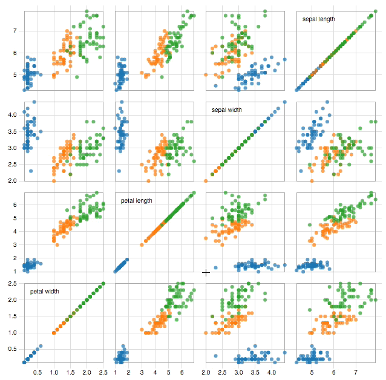
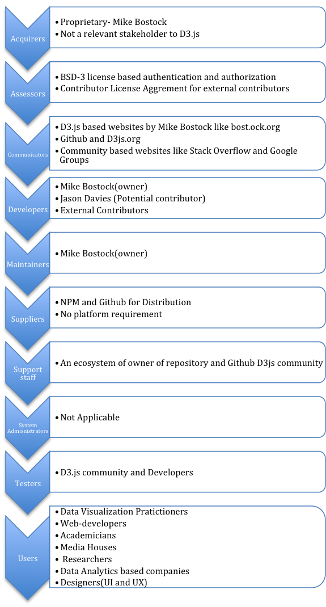

#  D3.js - Date-Driven Documents
_Authors: M. Dunnewind, P. Gupta, S. van Schooten and P. van der Veeken_

## Abstract
D3.js is a JavaScript library which enables developers to manipulate a website's HTML, DOM and CSS styling. The core strengths of the library are the specialized manipulation functionalities which allow for binding DOM elements to a dataset. This data-binding, along with a multitude of additional functionality, makes it easy to create beautiful, interactive visualizations. The library is a long standing and proven project which is used by developers, data scientists and journalists alike to create a diverse range of different visualizations about all kinds of topics. In order to stay future-proof, relevant and to keep-up with new developments, constant work is done on the architecture. A prime example of this continued development is the upcoming release of version 4.0. This release features a rewrite of the entire library structure, to make it completely decoupled and suitable for extensive customization.

## Table of Contents
 - [Introduction](#introduction)
 - [D3.js](#d3js)
 - [Stakeholders](#stakeholders)
 - [Architecture](#architecture)
 - [Evolution](#evolution)
 - [Conclusion](#conclusion)

## Introduction
D3.js (Data-Driven Documents) is a long standing and widely used visualization library written in Javascript. It enables developers to easily manipulate a webpage's HTML DOM (Document Object Model) and CSS styling to create stunning visualizations. The central concept on which the library is built, is that it should be possible to easily bind data to DOM elements. This data-binding, along with a multitude of additional functionality, makes it easy to create beautiful, interactive visualizations. 

The library has existed for several years now, and during its lifetime it has went through several major version changes. These changes range from architectural modifications to natural evolution in order to keep up with the changing needs of the library's users. This becomes most obvious when looking at the upcoming major version change, in which the structure of the library is completely overhauled to make it more modular and customizable.

In this chapter we will try to demonstrate how powerful and well-suited D3.js is for visualizing data. Additionally, we will detail how the library has evolved throughout the years, how the underlying architecture of the library functions and who the different people and organizations are who have a vested interest in this library. 

## D3.js
Before we dive deeper into the architectural intricacies of this visualization library, you as a reader should first gain a better understanding of how D3.js is used by hundreds of thousands of developers around the world to create breathtaking visualizations. This section will attempt to give an insight into the ways D3.js facilitates creating these visualizations and what the general workflow is for doing so.

### Creating Visualizations with D3.js
D3.js works by allowing its users to easily attach data to DOM elements. By harnessing the power of CSS, SVG and HTML, it becomes possible to create stunning, interactive visualizations. 

Ben Fry has described the process of creating visualizations from data as a series of subsequent steps [[9](#ref-vis)]:

1. Acquire
2. Parse
3. Filter
4. Mine
5. Represent
6. Refine
7. Interact

Step 1 will not be very relevant to using D3.js, because acquiring an actual dataset of which to create a visualization is something the user needs to themselves, obviously. 

#### Parse
Datasets are commonly formatted as either comma-separated values or tab-separated values. For both these formats D3.js provides functionality to parse them. 

A concrete example: imagine that the grades of participants of the software architecture course are stored in a file called grades.csv which is structured in the following manner:

```CSV
group_name, language, members, grade
Team-d3, Javascript, 4, 9
....
```
We now want to visualize if the choice of language is correlated with a group's grade. The first step is then to parse the grades.csv file. Which is done like so:

```Javascript
var grades = []
d3.csv("grades.csv", function(data)
{
    /*data is now an array of json objects containing the data 
    from the csv*/
    data.forEach(function(d))
    {
        /*each d is one line of the csv file represented as a 
        json object*/
        grades.push({
        "group":d.group_name, 
        "language":d.language, 
        "members":d.members, 
        "grade": d.grade});
    })
});
```
Notice in the code example above, how seamless the transition is from parsing a dataset to mapping the resulting data.

#### Filter
When a dataset is parsed, it is rarely the case that it contains only the data one is interested in. In such cases, the data needs to be filtered in order to trim away the irrelevant entries. D3.js provides its users with the powerful `filter()` function for doing exactly that. 

Continuing with the example above, say we are only interested in the languages Javascript, C++ and Ruby, then we need to filter out all the other languages. Furthermore, for the visualization we're creating, the group's name and number of members are not very relevant, therefore we need to filter those out as well.

```Javascript
grades = grades.filter(function(d)
{
    //Filter for only our desired languages
    var lang = d.language;
    if(lang == "Javascript" || lang == "C++" || lang == "ruby")
    {
        //Return only the fields we're interested in
        return {"language":d.language, "grade":d.grade};
    }
});
````
We now have an array of filtered data containing only the variables we're going to use for a visualization.

#### Mine 
The nest feature of D3.js allows for elements in an array to be grouped in a tree structure much like the GROUP BY operator in SQL. Unlike the SQL operator though, Nests allow for multiple levels of grouping. Mining data is all about extracting useful information from a dataset. Nests make it effortless to categorize data in any way the user wants, and for this reason D3.js is a powerful tool to use for the mining step in creating a visualization.

An example: The data obtained from the filter example above, now looks something like this:

```Javascript
var grades = [
    {language:"Javascript", grade:9,
    {language:"C++", grade:8},
    {language:"Ruby", grade:5},
    {language:"Javascript", grade:7},
    {language:"C++", grade:6},
];
```
We now want to group the data by programming language and then order by grade, to see if the choice of programming language has an influence on the grade of a team. This is done easily with the following code:

```Javascript
var nest = d3.nest()
    .key(function(d) { return d.language;})
    .key(function(d) { return d.grade;}).sortKeys(d3.descending)
    .entries(grades);
```
which produces formatted data, like so:

```Javascript
var nest = [
    {key: 'Javascript', values: [
            {key: '9', values:
                [{language: 'Javascript', grade: 9}]
            },
            {key: '7', values: [
                {language: 'Javascript', grade: 7}]
            }]
    },
    {key: 'C++', values: [
            {key: '8', values: 
                [{language: 'C++', grade: 8}]
            },
            {key: '6', values: 
                [{language: 'C++', grade: 6}]
            }]
    },
    {key: 'Ruby', values: [
            {key: '5', values: 
                [{language: 'Ruby', grade: 5}]
            }]
    }];
```
This example might be a bit trivial, but it should be clear that grouping data in this way is exceptionally useful when working with large datasets with a lot of variables.

#### Represent 
In this step of the visualization process, one is supposed to choose in what way they want to represent the data. Common representations are graphs, lists, trees, etc. Whatever choice the user decides to make, d3.js will provide a framework which will make the most common obstacles (i.e creating scales, interpolating points) of each representation less of a chore.

The author of D3 maintains a gallery which showcases a great diversity of the types of visualizations [[17](#d3-gallery)]. An important take-away from this gallery is that visualizing data is most-definitely not restricted to just charts and graphs, but can instead be done in so many different ways. With the most important rule being: Explain and convey information in the simplest way possible, but not simpler. 

#### Refine
Refinement entails making the chosen representation as comprehensive and unambiguous as possible. D3.js doesn't necessarily make this step easier because refinement is mostly a subjective step, however it does make applying colour scales, formatting timestamps or easing lines, for example, trivial. 

#### Interact
D3.js provides a whole host of functionality to create transitions and animations easily. It is therefore at this step that D3.js is arguably at its most effective. An outstanding example of how interactivity can make a visualization more effective, is the scatter matrix as can be seen in [image 1](#image1).

<div id="image1" />

[](http://benjiec.github.io/scatter-matrix/demo/demo.html) 
*Image 1: click image to go to interactive visualization*

### Peripheral technologies
The D3 library doesn't exist in a vacuum, it relies on some fundamental technologies and standards without which it couldn't exist. These technologies and standards are:

#### HTML(5)
As mentioned above, D3.js works by allowing users to attach data to DOM elements. The DOM is an integral part of the HTML standard and as such, D3.js is inextricably entwined with it.

#### CSS(3)
D3.js makes use of CSS-style selectors to pick elements on which to operate. Furthermore, the idiomatic way of styling elements in a visualization created with D3, is by applying CSS rules to them. For these reasons, D3.js couldn't exist without the CSS core technology.

#### SVG
 D3 is at its best when rendering visuals as Scalable Vector Graphics. SVG is a text-based image format. Meaning, you can specify what an SVG image should look like by writing simple markup code, not unlike HTML tags. SVG code can even be included directly within any HTML document.

For example, drawing a circle can be done by embedding SVG code directly into HTML, like so:
```HTML
<svg height="50" width="50">
    <circle cx="25" cy="25" r="25" fill="#FF3D00" />
</svg> 
``` 
Which results in an image as displayed in [image 2](#image2).

<div id="image2" />


*Image 2*

Users of D3 are not required to use SVG with D3, but nearly everyone agrees that SVG provides a range of visual opportunities that aren’t possible with regular HTML elements.

### Performance
Since D3.js is built upon a series of injectors (see the [architecture](#architecture) section), the length and complexity of the injection chain is one of the main variables in terms of performance. To define how much a visualisation costs performance-wise, certain aspects have to be measured for that specific case, such as response time (time to process a single element), throughput (time after another element can be processed, or the 'wait' time) and latency (the time between a change in the dataset and the first form of output). Based on these metrics more optimized solutions can be created which might even take advantage of internal patterns for acceleration.

There are four main components that play a part in the processing chain of D3.js:
 * **Input data**: collection of entries that contain the information that is needed to create the visualisation.
 * **Element binding**: the informal relation between a data entry and an element in the DOM.
 * **Method chain**: the method chain that extracts element parameters based on the data.
 * **DOM** (Document Object Model): the document elements that the entries are bound to through the element binding.

These processes are easier to understand when visualized as in [image 3](#image3).

<div id="image3" />


*Image 3*

As can be seen in the diagram, the method chain is invoked on every action, where entries are either edited, created or removed. This means that this is the first location in which to look for possible speed-ups. The method chain is unique for every visualisation, so the metrics defined above (response time, throughput and latency) can not be compared with other visualisations without taking the difference in the chain into account. For simpler examples, the response time can be fairly linear on the size of the input, meaning that this metric is (at least partially) uncorrelated with the input size. Though sometimes the complete dataset has to be analysed at some (or multiple) point(s) in the chain, this will cause a more exponential behaviour. The same goes for the throughput, though memory and data organisation might be more important here. The latency is affected by almost all elements in the processing chain, since it is measured from input event to first binding modification/instantiation, though the overlap is not complete.

All in all, this means the performance for a given visualisation mostly depends on the complexity and length of the method chain, input size and hardware available to the browser for rendering. This is mainly due to the fact that most of the injectable methods in the chain have a fairly linear runtime. Combining certain non-linear ones will result in a non-linear performance as expected. However, when dealing with very large amounts of data, the browser rendering performance will start being a bigger and bigger issue, since that has actual physical limitations in contrast to the runtime limitations of the method chain.

## Stakeholders
The owner and maintainer of the D3.js library is Michael Bostock [[7](#d3site)], whose vision it was to utilize DOM manipulation for creating visualizations. His work on D3.js was for a large part influenced by his previous work on Protovis (based on JQuery) and his advisor’s prior visualisation toolkits, Prefuse and Flare. The inspiration behind D3.js was to extend the limits of visualization and empower developers with full access and control to the DOM, thereby allowing them to communicate their gathered-data and analysis efficiently. Bostock [[8](#d3blog)] argues that “visualisation is more than a tool for finding patterns in data.” And so D3.js was developed to serve as an enabler for effective, interactive and meaningful visualisation of statistical and analytical data, rather just than an eye-catching graphical representation.

A majority of the contributions to D3.js come from Michael Bostock and Jason Davies, furthermore an active network comprising of D3 communities on [Github](https://github.com/mbostock/d3), [Stack-Overflow](http://stackoverflow.com/questions/tagged/d3.js) and [Google Groups](https://groups.google.com/forum/#!topic/d3-js/aRKFtUaE5h4) have made D3 much more accessible and welcoming to the external contributors. In the words of Michael Bostock[[2](#discussionbostock)], “I think D3 needs a better story around extensibility and external contributors. This is part of the motivation for breaking it up into smaller modules for 4.0.” From this statement it becomes evident that Michael is considerate towards the immense support and help pouring in (also in the form of tutorials, examples, books etc) from D3 practitioners. D3 4.0 is thus aimed to increase reuse and external contributions, which is a must for making an open-source platform sustainable. 

D3 enjoys widespread popularity with an average of 9000 downloads [[4](#d3npm)] per week. This prominence is a cumulative output of extensive documentation and examples, great community support and the approachability of Michael Bostock himself. The target audience is an ever-increasing number of web-developers, data-visualisation practitioners, small companies and start-ups aiming for a big leap in their knowledge and growth. In conjunction with these, there are various market giants [[2](#discussionbostock)]. like Microsoft (Microsoft BI makes use of D3) which have employed D3 for interactive data visualisation. What makes D3 an attractive choice for numerous companies is its graphical flexibility in data representation and its ability to take up various roles. Several tools, such as exploratory tools, data mining tools, communication tools and analytics tools can be designed with it as basis. Mentioned below[[3](#d3companies)][[6](#d3companies2)] are the companies whom are making extensive use of D3.js in media visualizations, fashion reports and much more 
 *  [Open Street map](http://bl.ocks.org/ninjaPixel/7f244063ca7171fc9a67): Editing open street maps
 *  [Dataviz](http://dataviz.rennesmetropole.fr/quisommesnous/en/):For communication and business tools
 *  [Chart.io](http://chart.io/) : Providing Business Dashboard solutions
 *  [Plotly](https://plot.ly/javascript/) :  Rendering Plots
 *  [DataMeer](http://www.datameer.com/product/data-visualization.html) : Representing Big data exploration
 *  [New York Times](http://www.nytimes.com/interactive/2012/02/13/us/politics/2013-budget-proposal-graphic.html?_r=0) :Rendering Graphs and statistical analysis.

Considering the Large scale visualization capacity[[5](#d3largedata)] of D3.js (which can be utilized in visualizing Bigdata workflow), it is of huge interest for the Big data companies like Datameer, SAP HANA, Palatfora Clear Story, Trifacta etc. An example of BigQuery Big Data Visualization implemented using d3.js can be found [here](http://blog.vida.io/2014/07/06/bigquery-big-data-visualization-with-d3-dot-js/). D3.js can also serve as a real-time visualization tool for ambitious projects like Human Genome Projects and DOPA implementations.

In summary, D3.js stakeholders can be classified into below mentioned categories as per Roznaski and Woods[[10](#rw)] which is shown in [image 4](#image4).  

<div id="image4" />  


*Image 4*

### Competitors 
D3.js is undoubtedly one of the best data visualization libraries in the current scenario. As per a notable data visualisation specialist Moritz Stefaner[[15](#bestD3)],no one is as good as D3.js especially in the case of SVG based data visualization .There are several other worth-mentioning data visualization tools and java script libraries in competition like Tableau, RAW, Leaflet, Chart JS, Timeline JS etc. The only downside of D3.js (which is ironically the strongest attribute as well) would be the complete freedom given to the data visualizer, there is nothing to recommend or suggest from the D3.js end. In the case, when users are looking for specific data visualization services ,then tools like GEPHI, for network visualization and Chart JS for precise control over charts might come handy [[16](#bestref)]. Tableau, another popular visualisation toolkit which does matrix based visualizations differs significantly from D3.js which a general purpose visualization framework.. While D3.js relies on the inherent properties of the browser, then in the situations where browser does not offer extensive functionalities, usage of D3.js might not offer a pleasant experience. Also, initially it might seem more interesting to programmers than common users as writing a code to create a graph can be a cumbersome approach for them. Although ,the users who are willing to migrate to D3.js , they are motivated to experience an amazing user interaction and advanced visualization provided by D3.js.

## Architecture
Since D3.js is a framework with which you can build your own visualizations, it is mostly comprised of functions and modules that create elements in a visualization or modify them in one way or another. The basis is a core module that offers document-data binding methods, where the other modules plug into to create the desired graphics. By binding the data elements to elements in the document, D3.js can seamlessly create these visualizations with low overhead. The browser handles the rendering in the same manner as a regular HTML/SVG document and is thus very fast.

### Inner workings
Since D3.js is a visualization library and not an application, D3.js depends on certain modules and elements. As will be mentioned later in this section, D3.js is in the middle of a big restructuring which completely changes its underlying architecture. From a functional viewpoint[[10](#rw)], we will be focussing on the new structure rather than the old one, because it will be relevant much longer.

From _Software Systems Architecture_, chapter 16: "_Functional capabilities define what the system is required to do—and, explicitly or implicitly, what it is not required to do._" [[10](#rw)]. Because D3.js does so many different things, each module of D3.js (as of Version 4) will have its own short description in the table below.

| Module | Description | Dependencies |
| ------------- | ---------------------------------------------------------- | ------------------ |
| d3-array | The module responsible for transforming data into information, since D3.js can only bind data in array form. | None. |
| d3-axis | Alleviates the need to manually create axis for charts and tables. | d3-scale, d3-selection, d3-transition |
| d3-collection | Offers more complex data structures. | None. |
| d3-color | Provides a wide collection of color manipulation and representation methods. | None. |
| d3-dispatch | Event emitting and listening module for more decoupled code creation. | None. |
| d3-dsv | Parser module for delimiter separated values, such as CSV and TSV. | None. |
| d3-ease | Providing easing functions for transitions and animations. | None. |
| d3-format | Number formatting made easy. | None. |
| d3-interpolate | Exposes a number of methods for interpolating two values. | d3-color |
| d3-path | Easy path rendering, similar to path drawing on canvasses.  | None. |
| d3-polygon | Applying geometric operations on two-dimensional polygons. | None. |
| d3-quadtree | A module dividing data using a quadtree: a two-dimensional recursive, spatial subdivision. | None. |
| d3-random | Exposes a number of random number generation methods. | None. |
| d3-request | Conveniency wrapper for XMLHttpRequest. | d3-dsv, d3-dispatch |
| d3-scale | Encoding for abstract to concrete data mapping. | d3-array, d3-collection, d3-color, d3-format, d3-interpolate, d3-time, d3-time-format |
| d3-selection | DOM transformation by selecting and joining data. | None. |
| d3-shape | Graphical primitives, such as lines and areas. | d3-path |
| d3-time | A calculator that can cope with the human readable time definitions. | None. |
| d3-time-format | Date parser. | d3-time |
| d3-timer | A low overhead queueing mechanism for managing thousands of concurrent updates and animations. | None. |
| d3-transition | Animated transitions for D3.js selections. | d3-ease, d3-timer, d3-interpolate, d3-selection |
| d3-voronoi | Voronoi computation for a set of two-dimensional points. | None. |
| d3-brush | Wrapper for easy selection of data points in a graphical manner. | d3-scale, d3-selection |
| d3-hierarchy | Layouting algorithms for visualizing hierarchical data. | None. |
| d3-geo | Wrapper for geographical calculations and projections. | None. |


### Current status (v3.5)
As is mentioned above, the current state is based on a core module and (mandatory) plugins, all wrapped in one large package. Though it is possible to compile you own library with only the plugins needed, this option is not offered or even documented. The current architecture is based on modules and dependencies, which are visualized in [image 5](#image5).

<div id="image5" />


*Image 5: modules and dependencies*

It is obvious that D3.js uses an architecture that is easily expandable and improvable. Each module in the graph above has a responsibility that can be clearly derived from the module name. The archetypes (or boundaries) are depicted above the name to indicate more implicit relations between the modules. Creating certain kinds visualizations requires certain modules, which have to be used in a manner and order that allows the injection into other modules. This order has to be in accord with the way build-up of a visualisation is intended.

Most of these modules will return functions that can be applied and chained to create whatever desired effect the developer wishes. The modules are built as a system of _injectors_, which is a software design pattern that resolves dependencies in an inverse manner [[1](#depinj)], resulting in an easy to comprehend and pluggable library. 

### Upcoming release (v4.0)
With the upcoming release, the biggest change will be the fact that the library is pluggable. This means less overhead and faster loading times, due to the fact that only the modules which are actually used, are loaded. The plugins load themselves into the already loaded d3 global variable, which makes a module's functionalities available to the end-user. The only requirement for this system to function, is that the d3 core is initialized first, and that then all the plugins (in no particular order) are loaded.

Although this new architecture reduces cost and overhead, it does increase the number of dependencies of a any given project. However, this downside can also be viewed as an invitation for a developer to write their own injectors and use them as d3 plugins. When a certain structure or organisation is used a lot in a project, it is a viable possibility to roll their own plugin which pre-injects d3 with their own definitions, removing the need to re-implement certain functionality.

One of the biggest up-sides of the restructuring will not be for the end-users, but for the developers; testing and building will not fail or result in monolithic, modules and the core can be bundled using something like [WebPack](https://webpack.github.io/). Modules can be used separately as injectors for other systems, so you can use the advanced color scale generation methods for other projects too. Along with the upgrade to [EcmaScript 6](http://es6-features.org/), d3 has become much friendlier to extend and use.

## Evolution
In this section we will detail the evolution of the D3.js library. The evolution cycle is the process which a system undergoes in order to adapt to changes in the software development process. As discussed in Rozanski and Woods, a flexible system should be able to deal with all the possible types of changes that it may experience during its lifetime [[10](#rw)]. Just like the previous section, this section will for one part focus on the current version (v3.5) and for the other part on the upcoming version (v4.0).

### Evolution Needs
D3.js is a continuously developed visualization framework based of Michael Bostocks PhD thesis, it was first registered as open source project on Github in late 2010. At that time the Google Closure Compiler [[11](#google-closure)] was still used to optimize the different code parts and combine them into a single source file. However the popularity of D3.js grew quickly and so did the demand for a compiler which would generate smaller and more performant source files. In March 2011 the team switched to using UglifyJS [[12](#uglifyjs-switch)] for their build process. This change was the only noteworthy alteration, other updates consisted mainly of tweaking functionalities and ironing out small bugs.

With a growing amount of D3.js users, the development kept going forward as well. In August 2011 the first major version change was released: v2.0 [[13](#v2)]. It addressed the users' need for more concise code by eliminating code duplication, additionally it introduced selector functions, transparent transitions, prototype injection and a lot of other incremental improvements. Version 2 was also the version in which a testing suite was introduced to the library with the goal of guaranteeing the correctness of the core functionality. The addition of a testing suite is a clear example of an adaptation in response to a need of providing a stable and predictable library to the growing D3.js community. The release included 1,200+ tests covering 90% of the library's functionality.

From that point onward it took another 1,5 year before the next major version v3.0 [[14](#v3)] was released on December 2012. This release saw the introduction of a powerful new geographic projection system, new plugins and improved transitions. Furthermore, a whole host of performance and bug fixes were released. The main focus seemed to be on making it easier for developer to use the library. One change that should be mentioned is the so called chaining of transition functions. Instead of listening to an "end" event, the next function would automatically be applied. The evolutional need addressed in this release, was the developers' need for the library to keep up with smart and easy ways of using the library.

### Future release
D3.js is currently undergoing a restructuring and refactoring phase of the entire codebase which will most likely be released this year as version 4.0. The new release won't introduce much in the way of new functionality, but will instead focus on making the library much more modular and easier to maintain. In its current form, D3.js is massive monolithic library which users have to include in its entirety, even if they need only a small part of the library's functionality. Version 4.0 seeks to address this by making everything a module with little to no dependencies. Because the whole library has become a set of low-dependency modules, maintenance and contributing has also become much easier. If a bug arises in some module, that bug will only affect that specific module and won't interfere with the functioning of the other parts of the library.

The need for easier to maintain, low-dependency modules is a clear evolutional need. As can be seen with other JavaScript libraries, there is a shift to making everything an exhaustively tested independent module. Furthermore, by switching to the node package manager (NPM) as its main source of distribution, developers can pick and choose only the functionality they desire, with little to no overhead. With the use of NPM it is also becomes easier to create plugins and add-ons that provide a certain visualization functionality. This specific module will have build in dependencies to D3.js modules, making it much easier for developer who only want to include certain common visualizations.

### Trade-offs
While version 4.0 will see a lot of improvements, there are also some possible to downsides to this modularization. For newcomers to D3.js it will probably be a lot more confusing as to what modules they need in order to create visualizations. Furthermore, some modules which have been created are rather low on functionality, which brings up the question if the library was not split in too much modules.

## Conclusion
This chapter has hopefully shown that D3.js provides a wide range of tools for not only data visualization, but also for complex filtering and creating user interactions. This makes D3.js to a lot of developers a powerful and useful library suited for a wide range of applications. Besides the functionality, also the library's stakeholders, background, architecture and evolution were discussed. From these discussions it can be concluded that D3.js uses a solid architectural model which is also constantly being improved upon. Finally, the evolution and future plans showed that D3.js is ready for the future. As such, our final conclusion on D3.js is that it is a well-built and decently constructed library which is exceptionally well-suited for what it is created for.

## References
1. <div id="depinj"/> Dhanji R Prasanna. Dependency injection. Manning Publications Co., 2009.
2. <div id="discussionbostock"/> M. Bostock, "Hi! I’m Mike Bostock, creator of D3.js and a former graphics editor for The New York Times", _Reddit_, 8 September 2015. [Online]. Available: [https://www.reddit.com/r/dataisbeautiful/comments/3k3if4/hi_im_mike_bostock_creator_of_d3js_and_a_former/](https://www.reddit.com/r/dataisbeautiful/comments/3k3if4/hi_im_mike_bostock_creator_of_d3js_and_a_former/). Accessed on: 20 March 2016
3. <div id="d3companies"/> Multiple (mainly Shawn Allen, Chris Viau), "What companies are using d3.js in production?", _Quora_, 24 February 2012. [Online]. Available: [https://www.quora.com/What-companies-are-using-d3-js-in-production](https://www.quora.com/What-companies-are-using-d3-js-in-production). Accessed on: 31 March 2016
4. <div id="d3npm"/> Mike Bostock, "d3", _NPM_, February 2016. [Online]. Available: [https://www.npmjs.com/package/d3](https://www.npmjs.com/package/d3). Accessed on: 31 March 2016
5. <div id="d3largedata"/> Online discussion - users of D3.js, "D3JS to visualizae BIG DATA", _Google groups_, 18 April 2013. [Online]. Available: [https://groups.google.com/forum/#!topic/d3-js/aRKFtUaE5h4](https://groups.google.com/forum/#!topic/d3-js/aRKFtUaE5h4). Accessed on: 17 March 2016
6. <div id="d3companies2"/> Peter May, "Companies using d3.js?", _Data Discourse - Experfy_, 18 November 14. [Online]. Available: [https://data.experfy.com/t/companies-using-d3-js/296](https://data.experfy.com/t/companies-using-d3-js/296). Accessed on: 31 March 2016
7. <div id="d3site"/> M. Bostock, "D3.js - Data-Driven Documents", _d3.js_, 2015. [Online]. Available: [https://d3js.org](https://d3js.org). Accessed on: 30 March 2016 
8. <div id="d3blog"/> Liam Andrew, "Mike Bostock wants us to visualize algorithms, not just the data that feeds into them", _NiemanLab_, 26 June 2014. [Online]. Available: [http://www.niemanlab.org/2014/06/mike-bostock-wants-us-to-visualize-algorithms-not-just-the-data-that-feeds-into-them/]( http://www.niemanlab.org/2014/06/mike-bostock-wants-us-to-visualize-algorithms-not-just-the-data-that-feeds-into-them/). Accessed on: 31 March 2016
9. <div id="ref-vis"/> B. Fry. Visualizing data. Beijing: O'Reilly Media, Inc., 2008.
10. <div id="rw"/> Nick Rozanski and Eoin Woods. Software Systems Architecture: Working with Stakeholders using Viewpoints and Perspectives. Addison-Wesley, 2012.
11. <div id="google-closure"/> Google, "Closure Compiler", _Google Developers_, 13 February 2016. [Online]. Available: [https://developers.google.com/closure/compiler/](https://developers.google.com/closure/compiler/). Accessed on: 29 March 2016
12. <div id="uglifyjs-switch"/> Jason Davies, "Replace Google's closure compiler with UglifyJS.", _github/mbostock/d3_, 25 March 2011. [Online]. Available: [https://github.com/mbostock/d3/commit/1dfd3350dcd78ce29f76f4f15da0f94ca219ffad](https://github.com/mbostock/d3/commit/1dfd3350dcd78ce29f76f4f15da0f94ca219ffad). Accessed on: 31 March 2016
13. <div id="v2"/> Mike Bostock, "2.0 Enter and Update", _github/mbostock/d3_, 23 August 2011. [Online]. Available: [https://github.com/mbostock/d3/releases/tag/v2.0.0](https://github.com/mbostock/d3/releases/tag/v2.0.0). Accessed on: 29 March 2016
14. <div id="v3"/> Mike Bostock, "3.0 Baja", _github/mbostock/d3_, 21 December 2012. [Online]. Available: [https://github.com/mbostock/d3/releases/tag/v3.0.0](https://github.com/mbostock/d3/releases/tag/v3.0.0). Accessed on: 30 March 2016
15. <div id="bestd3"/> Luke Dormehl, "The Five Best Libraries For Building Data Visualizations", _Fast Company_, 28 April 2014. [Online]. Available: [http://www.fastcompany.com/3029760/the-five-best-libraries-for-building-data-vizualizations](http://www.fastcompany.com/3029760/the-five-best-libraries-for-building-data-vizualizations). Accessed on: 31 March 2016
16. <div id="bestref"/> Nishith Sharma, "The 14 best data visualization tools", _TheNextWeb_, April 2015. [Online]. Available: [http://thenextweb.com/dd/2015/04/21/the-14-best-data-visualization-tools/#gref](http://thenextweb.com/dd/2015/04/21/the-14-best-data-visualization-tools/#gref). Accessed on: 30 March 2016
17. <div id="d3-gallery"/> Mike Bostock, "D3 Wiki Gallery", _github/mbostock/d3_. [Online]. Available: [https://github.com/mbostock/d3/wiki/Gallery](https://github.com/mbostock/d3/wiki/Gallery). Accessed on: 30 March 2016
