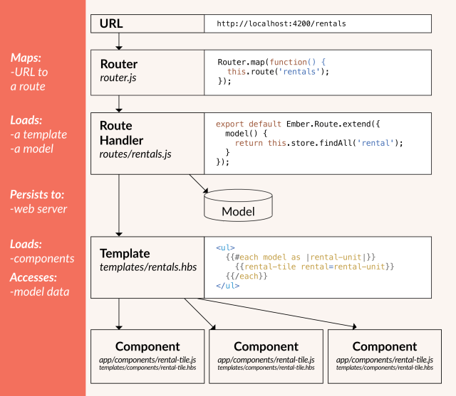
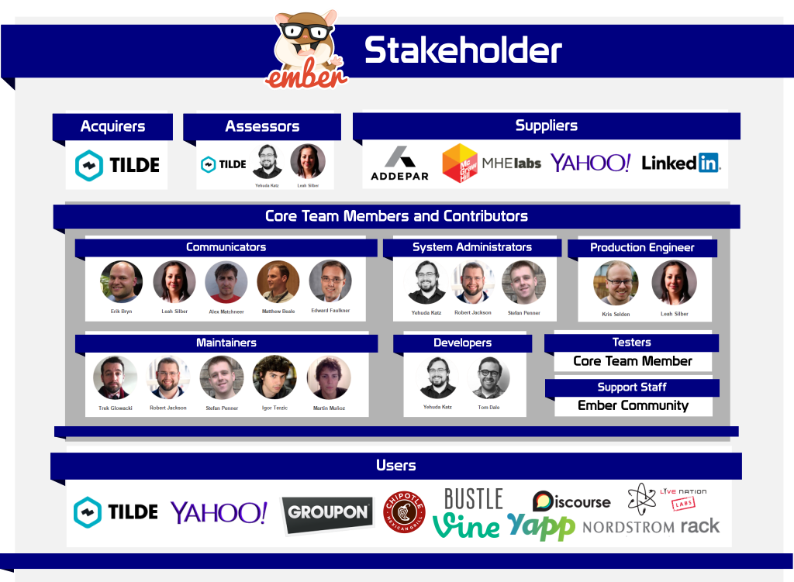
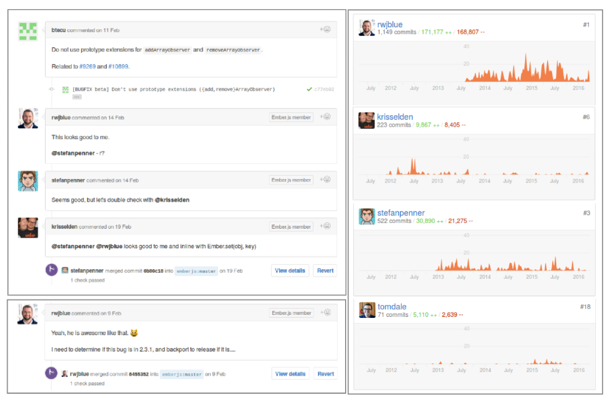
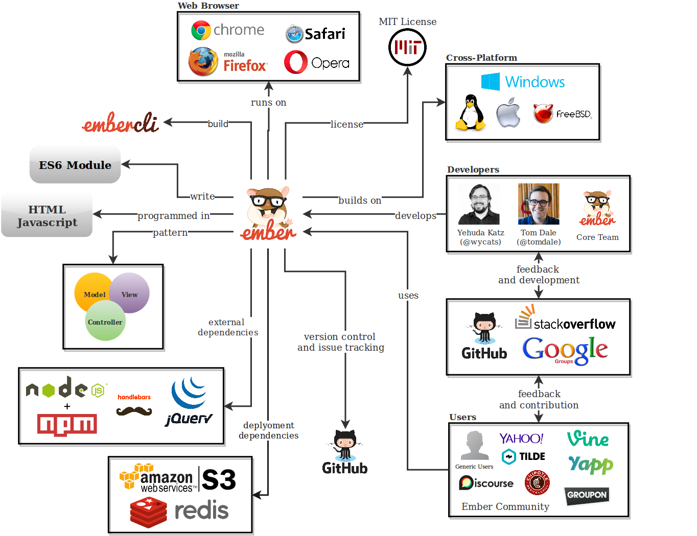
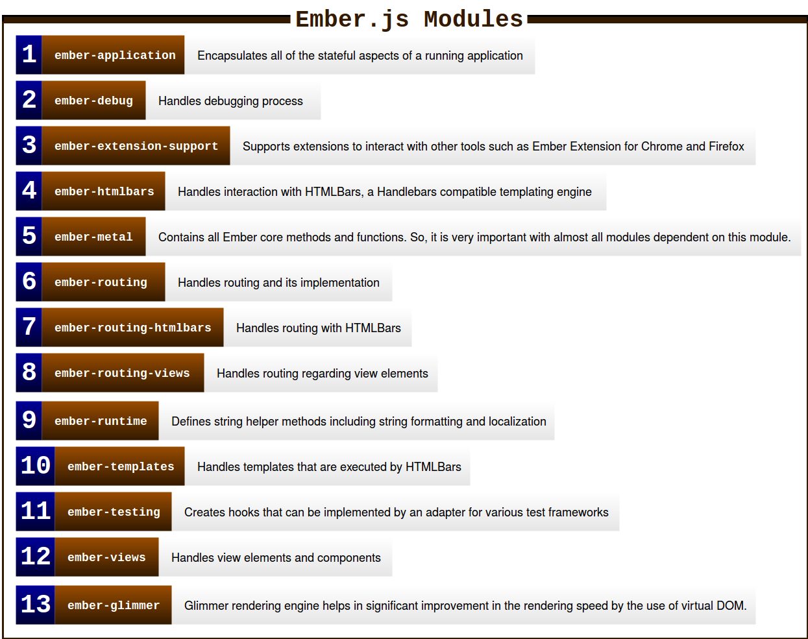
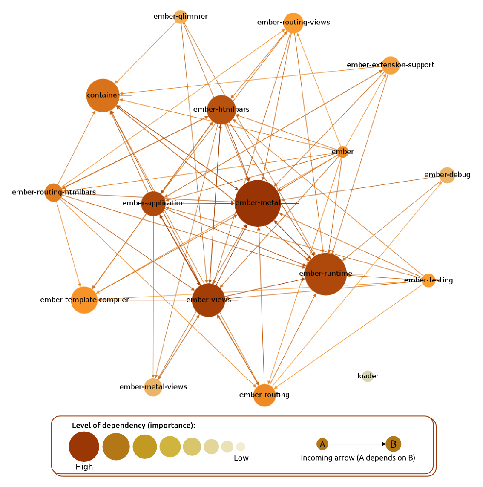
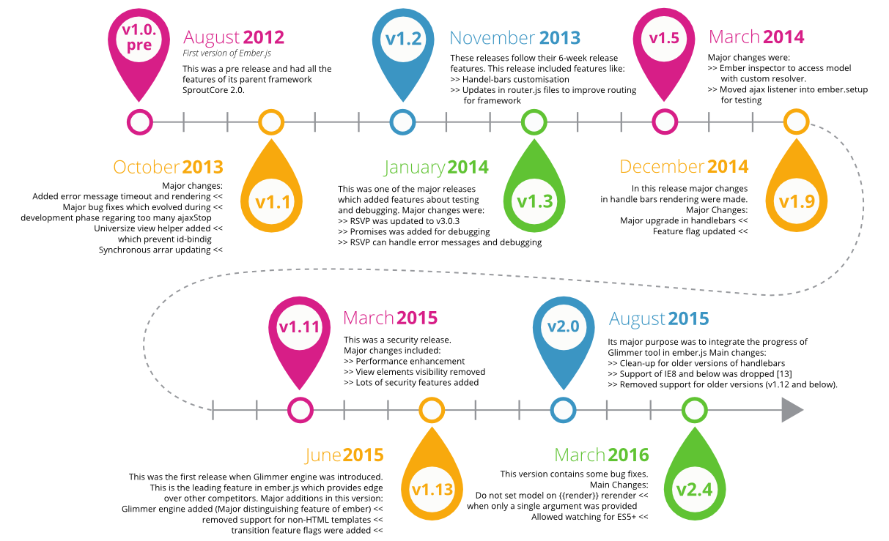
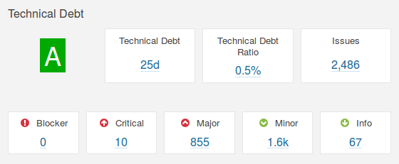
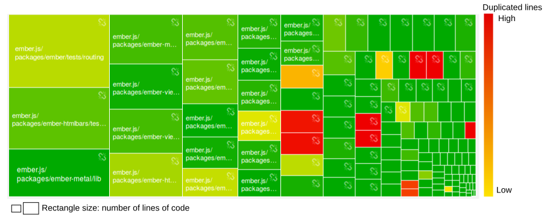
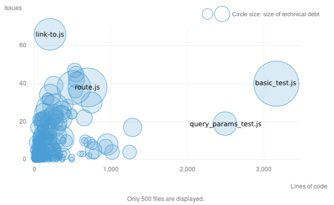

# Ember: A framework for creating ambitious web applications

<!-- -->

**[Andri Rahmadhani](https://github.com/xflash), [Jesse Kaptein](https://github.com/JesseKaptein), [Sambit Praharaj](https://github.com/sambit2)** and **[Shashwat Verma](https://github.com/shashwat91)**

*Delft University of Technology, 2016*    

**Abstract**

*Ember, the brainchild of Yehuda Katz (@[wycats](https://github.com/wycats)), is maintained by a large community of developers and consumers always striving for novelty and simplicity. It allows developers to build scalable web applications and is used by major websites such as Yahoo! and LinkedIn. Currently, it is run by thousands of contributing members from all over the world. This chapter will describe the Ember framework according to multiple perspectives, including the context view, which describes the interaction with its environment. The development view, then, describes Ember's different modules and layers. Subsequently, Ember's features and functionalities are discussed in the feature list and deployment view. Finally, the evolution perspective carves the roadmap for future releases.*

**Table of Contents**

- [Introduction: Starting the Expedition](#introduction)
- [Ember Basics: Getting started with the framework](#ember-basics)
- [Stakeholders: The team behind Ember](#stakeholders)
    - [Core Team Members and Contributors](#stakeholder-analysis)
    - [Users & Suppliers](#Users)
- [Context View: Interacting with Ember's environment](#view-context)
- [Development View: The Foundations of the Ember.js](#view-development)
    - [Modular Design: Ember’s MVC Design Pattern](#design)
    - [Module Organization: Dependencies and Interactions](#module-organization)
    - [Standardization of Design and Testing](#design-standard)
    - [Codeline Organization](#codeline-organization)
- [Features from different Perspectives](#features)
    - [Users: Data Model, Routing, Rendering Engine & Configuration of Application](#data-model)
    - [Developers & Users: Configuration of New Features](#configuration)
- [Deployment View: The Operational Environment](#deployment-view)
    - [Third Party Software Requirements](#third-party)
    - [Network Requirements](#network-requirements)
- [Evolution: How has Ember become the framework it is today?](#evolution)
    - [So, why does Ember change?](#change)
    - [Change management in theory: different variability mechanisms in Ember.js](#change-theory)
    - [Change management in practice: from one version to another](#change-practice)
- [Technical Debt: Consequences of System Choices](#technical-debt)
    - [Evolution Trade Offs](#trade-off)
    - [Technical debt in detail](#tool)
- [Ember.js: Keep Improving Performance](#performance)
- [Conclusion: Ending the Expedition](#conclusion)
- [References](#references)

## Introduction: Starting the Expedition

Ember.js is an open-source JavaScript web framework, based on the Model-View-Controller (MVC) pattern. It allows developers to create scalable web applications by incorporating common idioms and best practices into the framework. Ember.js is used on many popular websites, including Yahoo! and LinkedIn. Although primarily considered a framework for the web, it is also possible to build desktop and mobile applications in Ember. The best-known example of this is Apple Music. Note that Ember.js is only one product of a complete front end stack built and supported by Ember. Examples of other products are *Ember Data*, *Ember Inspector* and *Liquid fire*.

Over the past few weeks, team-Ember, from the Delft Students on Software Architecture (DESOSA)-group, have dived into the framework by stepping through its various components from different perspectives and views. With these insights, we hope to contribute to the framework by both solving issues and make it accessible for readers to contribute too. These issues can vary from bugs to potential new features. In the end, we will bring all the different views and perspectives together to examine whether Ember's architecture is robust or if particular components have to be improved or extended. Before doing so, first, we will guide the reader through Ember's basics.

## Ember Basics: Getting Started with the Framework

As described, Ember is built for developers to create web applications effectively and efficiently. However, before one can start writing any Ember code, it is a good idea to get an overview of how an Ember.js application works. The framework itself consists of a couple of basic concepts, namely [[1](#guides)]:

* **Router:** The router translates a URL into series of templates, each backed by a model. As the templates or models change, Ember automatically keeps the URL in the browser's address bar up-to-date. This means that a developer is always able to modify its application, without disturbing the user that much;
* **Route (handler):** A route is an object that tells the template which model it should display. This is simply done by linking user events (e.g. mouse click) to other templates;
* **Models:** A model is an object that stores persistent state. Templates are responsible for displaying the model to the user by turning it into HTML;
* **Templates:** A template describes the user interface. Each template is backed by a model, and the template automatically updates itself if the model changes;
* **Components:** A component is a custom HTML tag. They allow developers to create reusable controls that can simplify other templates;

Figure 1 presents the described relations between the router, routes, models, templates and components [[1](#guides)].

  
    *Figure 1: The way in which Ember's core concepts interrelate with each other*

## Stakeholders: The Team behind Ember

The Ember society consists of a [large community](https://github.com/emberjs/ember.js/network/members) of thousands of software developers, architects, users, and testers, with most of them having another job and working voluntarily on the Ember.js project. The search for detecting the most relevant stakeholders led immediately to [Ember's Core Team Members](http://emberjs.com/team/). It appeared that only a limited group of Core Members were actively involved in approving or denying potential contributions.

For a detailed presentation of the community behind Ember.js, see Figure 2. For a clear interpretation and explanation of terms, please consider  [Rozanski & Woods (2011)](http://www.viewpoints-and-perspectives.info/home/stakeholders/).   

  
    *Figure 2: An oversight of all relevant stakeholders in the Ember framework and their roles*

### Core Team Members and Contributors

The [core team](http://emberjs.com/team/) behind Ember.js is relatively small and, therefore, they are considered to be both developers, maintainers, testers, communicators and assessors within the community. Currently, the core team consists of thirteen members, of which we will describe the most important:

* **Yehuda Katz** (@[wycats](https://github.com/wycats)), founding father of the Ember framework and still mainly responsible as a developer and system administrator;
* **Robert Jackson** (@[rwjblue](https://github.com/rwjblue)) & **Stefan Penner** (@[stefanpenner](https://github.com/stefanpenner)), both one of the most active members in the Ember.js GitHub repository;
* **Tom Dale** (@[tomdale](https://github.com/tomdale)), important developer and tester of the Ember framework and again there from the start in 2011;
* **Kris Selden** (@[krisselden](https://github.com/krisselden)), important production engineer of the Ember framework.

Based on GitHub activities as seen in Figure 3, one can conclude that mainly *Robert Jackson*, *Stefan Penner*, *Tom Dale* and *Kris Selden* are involved in approving or denying contributions to the Ember framework.

  
    *Figure 3: Ember.js Github activities*

### Users & Suppliers

Ember is used on many popular websites, including Yahoo! and LinkedIn. Some of these larger users support the framework financially. Other, smaller users, can help improve the framework by reporting bugs, performance issues or proposing new features. Therefore, many of the fixed bugs are dedicated to users. Furthermore, small users can also make donations to the project, buy unique Ember.js gear or participate in Ember.js courses and conferences, to support future development of the framework.

## Context View: Interacting with Ember's environment

By developing a broader view, the frameworks relationships, dependencies, and interactions with other systems and parties will appear. In Figure 4 such a context diagram is presented. In this figure, we see that Ember.js is (technically) based on a couple of software packages and languages. To install and configure Ember.js, one should have *Node.js* and *npm package manager*. To build templates and make use of Ember’s vast library, though, understanding of both *Handlebars* and *jQuery* are required. For creating modules, the ES6 module standards are used, whilst the technical core is based on *JavaScript Model-View-Controller* pattern in combination with *HTML*.

  
    *Figure 4: Ember.js context view diagram*

To maintain and help the large Ember community, a couple of third party platforms are used. For user support, Ember uses [StackOverflow](http://stackoverflow.com/questions/tagged/ember.js). Other channels for user support can be found in the Ember Community on Slack, the IRC channel on [Freenode IRC](https://webchat.freenode.net/) or within Google Groups. For Ember [learning resources](http://emberwatch.com/) (podcasts, videos, blog posts, books and so on) almost all Core Team Members have public channels on either YouTube or Vimeo. Most of these platforms are also able to give feedback for future development. Finally, for developers, Ember’s source code is, of course, available on GitHub.

Lastly, the figure shows that Ember applications can be built on a cross-platform server running Node.js, such as Windows, OSX, Linux, and FreeBSD. The framework can be rendered on multiple web browsers like Google Chrome, Firefox, Opera, and Safari. Also, Ember uses an efficient deployment technique using Redis and Amazon S3, which will be discussed in the [later section](#change-practice).

## Development View: The Foundations of the Ember.js

As a framework, Ember.js makes use of the Model-View-Controller (MVC) design pattern for the users to build their applications. MVC is used for relating user interface to the underlying model, providing several advantages, such as [[2](#ember-mvc)]: clean separation of concerns, simplified testing, improved scalability, easier maintenance, reuse of code and decoupling of application layers. The different modules and components of Ember’s framework are presented in Figure 5 [[1](#guides)].

This section starts discussing the modular design that forms the foundations of Ember.js to gain a deeper understanding of Ember’s architecture. Furthermore, some standardization aspects and Ember’s codeline organization are considered.  

  
    *Figure 5: Architectural View of MVC Design Pattern Provided by Ember.js*

### Modular Design: Ember’s MVC Design Pattern

Firstly, in Figure 4, the yellow block describes Ember’s **models**. Models represent the underlying data that an application presents to the user. There is no doubt that models can vary heavily through different apps. A photo sharing application might have, for example, a `Photo` model to show a specific photo, whilst a `PhotoAlbum` represents a group of pictures. Contrary, a shopping website would probably have other models, such as `ShoppingBag` or `Payment`. Note that each model testable in isolation and can easily be changed or replaced. They work with the router by a `find(id)` command. Thus, each module has its identity (id) which is inside its store. The REST adapter loads and saves the various records. As presented, data flows from models to templates in top-down fashion via bindings.

Secondly, **controllers** are shown. In recent versions of Ember.js, controllers are being replaced by **components**, making them less important in the framework. The controller module is only being used to pass user actions through the different layers when moving from components to routes. Note that they are also testable in isolation. Controllers consist of object controllers and array controllers. Array controller contain lists of elements and also interact with object controller.

Thirdly, **views** render HTML elements and manage the user interface. In this, DOM (Document Object Model) helps with event interactions, like mouse overs and key ups. Handlebars are just like HTML bars which are self-updating **templates**. Note that controllers need views to work.

Fourthly, **templates** are more or fewer components of the view module. They more or less boost the app’s user interface. They consist of the bound expressions, firing events, conditions, scope of the code and nesting (like nested loops). It helps in firing events from the view to the router. Thus, it defines the basic building blocks for the app’s (front-end) structure.

Finally, **routers** update the model based on the templates (events) and the controller. It consists of the application state, URL, and different route classes. The URL interacts with the application state and the route classes to forward the events to the model.

### Module Organization: Dependencies and Interactions

As a complex system, Ember.js source code can be classified into several modules as seen in Figure 6. Whilst Ember’s design pattern for developers is modular and easy to interpret, the application’s source code is not.

  
    *Figure 6: Ember.js modules*

It is difficult to group and partition modules in Ember.js into different layers as they form a complex dependency pattern (see Figure 7; this figure is constructed by visualizing Ember.js’s source code through [GraphViz](http://www.graphviz.org)). Some of these modules interact with third party modules as well, making the interaction pattern even more complex. The relatively clear defined modules prevent develop functions multiple times and make it easy to localize bugs and performance issues, though. However, the dependencies between the different modules make it hard to change specific components, because it can be hard to predict its consequences for other modules. Subsequently, this has a negative impact on both scalability and maintainability of the Ember.js framework. This is in particular true for *ember-metal*, *ember-runtime* and *ember-views*.

  
    *Figure 7: Ember.js modules and their dependencies*

### Standardization of Design and Testing

Ember's internals and most of the code we will write in our applications takes place in a run loop. The core codebase of Ember uses ES6 modules which help in improving the runtime i.e. if we have things set up properly in our development environment, then we can import just the parts of Ember.js that we want to use.

For developers, Ember team provides JavaScript [style guide](https://github.com/emberjs/ember.js/blob/master/STYLEGUIDE.md), which gives best practices for new contributors and developers. It makes the code more readable and maintainable. Also, Ember team provides a [guideline](https://github.com/emberjs/ember.js/blob/master/CONTRIBUTING.md) for developers and contributors to add new features through an RFC process. Ember uses Configuration to configure dependencies and other things for developing Ember.js.

Every developer and contributor should perform a unit test, typically using [Qunit](https://qunitjs.com), before submitting a PR (Pull Request) which potentially changes parts of the code. Ember.js implements a continuous integration platform called [Travis CI](https://travis-ci.org/emberjs/ember.js/pull_requests). It is used to test each PR before it is merged. When developers submit a modification of code, Travis will automatically be launched and a note will be added to the PR.

### Codeline Organization

The term codeline is mainly used to describe the arrangement of the source code files. Ember’s codeline can be organized into a well-defined structure as shown in Figure 8.

  
    *Figure 8: Directory structure*

The Ember.js directory consists of main folders like *bin*, *ember.js* and *packages*. In the root directory, `bower.json` and `ember-cli-build.js` are the most important files. `bower.json` is a Bower package manager file which helps managing dependencies, whilst `ember-cli-build.js` is the build configuration to be used by `ember-cli`. In *bin* folder, the `changelog` keeps track of the changes in version and the commits. *Packages* consist of the main modules which have been described in the Ember’s Module Organization. The *config* folder contains the configuration files that handle the mapping of a specific configuration with corresponding files. *Generators* contain the `license` and *lib* consists of the configurations of packages.

## Features from different Perspectives

This section provides a generic insight in the main features of the Ember.js framework along with the perspective of the different stakeholders (see Figure 2). We have seen that there are two important stakeholder groups, namely the actual users of the framework and its developers team. It appears that Ember.js has dozens of features, mainly for their users. Here, a couple of relevant features for users and one important feature for both users and developers are discussed.

### Users: Data Model, Routing, Rendering Engine & Configuration of Application

Ember provides a robust **data model** using [Ember Data](https://github.com/emberjs/data). It retrieves models from the server as JSON, save updates to the server and create new models in browsers. Ember Data can be configured to connect with different types of backends without writing any networking code by accomodating a relevant adapter provided in the [Ember Data Adapters collection](http://emberobserver.com/categories/ember-data-adapters). Users can easily extend the default Adapter if they work with non-standard backend using `DS.JSONAPIAdapter`.

Secondly, Ember uses **routers** as the URL routing mechanism. It has four options, namely: `history` (uses the HTML5 History API), `hash` (uses anchor-based URLs), `auto` (uses history if supported by the user's browser and falls back to hash otherwise) and `none` (doesn't update the URL). This option can be configured by users in `config/environment.js` under `ENV.locationType`. Ember uses also *controllers* that allow developers to decorate models with display logic. Ember Controller has two different types: either `automatic` or `custom`. They can be selected and configured using `ember-cli`. The `custom` controller provides flexibility to users to extend the behavior of one of the automatically generated controller.

Thirdly, Glimmer is used as the latest *rendering engine* of Ember.js. It differentiates between static and dynamic components, because of expressiveness of Handlebar's templates [[3](#blog_face_off)]. Glimmer can be configured through feature list during the build process.

Finally, Ember users can **configure their application** in a configuration file located in `config/environment`. This is a default file generated by Ember CLI. Here, the users can change the default environment by defining `ENV` object, which is currently limited to three: development, test and production [[1](#guides)].

To conclude, users can benefit from Ember’s flexibility by choosing between three different environments. The users can disable and enable features in each of environments depending on requirements they have. Ember users can configure Ember CLI by adding configuration codes to the `.ember-cli` file in the application root.

### Developers & Users: Configuration of New Features

Ember uses **Features Flag** that manages Ember.js features used in a project. Ember users can enable or disable the features listed in `features.json` file, which is located in the root of the Ember.js project, by changing the application configuration file as stated in the previous section. The `features.json` file displays all new features and their current status.
A feature can have one of a three flags [[1](#guides)]:

- `true` - The feature is present and enabled: the code behind the flag is always enabled in the generated build.
- `null` - The feature is present but disabled in the build output. It must be enabled at runtime.
- `false` - The feature is entirely disabled: the code behind the flag is not present in the generated build.

The description of newly-flagged features can be found in `FEATURES.md` file located in *master* branch on Github. In this file, developers explain what certain features do and the link to the original pull request is given. This, so that users get knowledge regarding how the feature is implemented in Ember.js.

Newly-flagged features have a Feature Life-Cycle, starting from Canary, Beta, to Release phase. In Beta phase, Ember’s Core Team will evaluate each of new features that come from Canary phase. When the features are considered to be stable, they are made available in the next beta phase and enabled by default. As the beta cycle completed, the features will available in the release phase and becomes part of Ember framework [[1](#guides)].

An example of a newly-flagged feature is Glimmer rendering engine, which is still in Beta phase. Glimmer potentially is a significant improvement to the Ember.js framework, as can be seen in pull request  [#10501](https://github.com/emberjs/ember.js/pull/10501). For this reason, this feature is flagged as `null` in `features.json` file.

## Deployment View: The Operational Environment

Considering the vast use of Ember.js, it is important to describe the deployment of software to guarantee its operation in different environments, as defined in Rozanski & Woods [[4](#book-ssa)]. The deployment viewpoint applies to any system with a required deployment environment that is not immediately obvious to all of the interested stakeholders.

### Third Party Software Requirements

Identifying third-party software requirements are essential for both developers and users. For developers, requirements make it clear what tools or libraries to use. On the other hand, for users can understand what is needed to apply software in their environment. Fortunately, as Ember.js works with JavaScript, it requires only a handful of third party tools.

Each software element in Ember.js imposes requirements for specific versions of third party software. Most of these require separate installation as they do not come in one, complete package.

For Ember.js, the following tools are required for configuration:

* **npm**: This manages dependencies for an application running on it. It is also written in JavaScript and is maintained via [GitHub](https://github.com/npm/npm). Required version v2.4+;
* **Node.js**: This is an open-source, cross-platform runtime environment for developing server-side web applications [[5](#wiki_node)]. Required version v4.x+;
* **Bower**: Bower is a package management system for client/developer side programming on the internet. It depends on Node.js and npm. It has to be v1.0+;
* **Browser support**: After v2.0 Ember does not support IE8 or below to render its applications.

These version requirements are not related to Ember.js, but we found them out when building it in our environment.

### Network Requirements

Ember.js runs a state manager and reverse proxy on the web server. The node in the system can be divided into two categories: server and client. On the server side, Ember.js has limits on version issue which get deployed after a certain version has passed deployment tests. These limits are in place to protect services from both accidental and untimely crashes. On the client side, the network requirements are not specified.

## Evolution: How has Ember become the framework it is today?

To deal with the variability of an ever changing environment, Ember has adopted a six-week release cycle, inspired by the rapid release cycle of Google Chrome [[6](#ember-blog)]. As described, this approach allows newly developed features to be carefully released when the community considers them ready to use. For versioning, Ember uses the semantic versioning convention [[6](#ember-blog)]. It means that new features and fixes for small bugs are added by point releases (1.1, 1.2, ...), whilst breaking changes are only introduced at major version numbers (1.0, 2.0, ...). The complete version history can be seen in Figure 9.

  
    *Figure 9: Ember.js version history*

### So, why does Ember change?

In general, the issues and pull requests in GitHub show a couple of reasons why changes in the Ember.js framework are needed. It turns out that major changes in the framework are caused by developments in both its **supporting languages** and **supported web browsers**. Both languages like JavaScript and web browsers keep developing themselves. To remain compatible with those newer versions, Ember.js releases new versions as well.

Note that pull requests for new features are not expected in the GitHub repository because they move to [Ember RFC](https://github.com/emberjs/rfcs) (*Request for Comment*) for discussion purposes. Furthermore, new versions are also released because of new (or improved) documentation and depreciation. It means that for simplicity purposes, not all web browsers, plugins, features or add-ons are supported anymore. Support for Internet Explorer 8, for example, is available up to version 1.13, but is dropped from release 2.0 onwards [#11313](https://github.com/emberjs/ember.js/pull/11313). For a complete oversight of all changes made to the Ember framework since 2012, please consider the [Ember Changelog](https://github.com/emberjs/ember.js/blob/master/CHANGELOG.md).

### Change management in theory: different variability mechanisms in Ember.js

Dealing with ever changing software is not easy. Therefore, Ember has installed several variability mechanisms to adapt to the changing environment. To denote variability mechanisms, a slightly changed definition derived from Puhlmann et al. (2005) [[7](#Puhlmann)] is used: *"Variability mechanisms denote techniques for the derivation of software from software models"*. Puhlmann et al. also describes some commonly used variability mechanisms, to which will be referred. Note that we only looked at changes at runtime level, which comprises of adjustments done whilst the software product is already implemented. This is in contrary to product time changes, which refer to types of variability that are resolved during the implementation of a software product.

Document changes are the simplest to deal with. Because of Ember's open-source nature, all documentation is publicly accessible. If document changes are needed, one can open a pull request to do so. The "old" documentation module will simply be replaced by a new one, when the request is approved. Puhlmann et al. denote this as *replacement of components*.  If new documentation modules are needed because of the adoption of recent features, new documentation is simply added (*addition of components*). Note that "old" documentation is still being saved (see [Ember Guide](https://guides.emberjs.com/v2.4.0/)).

Ember.js manages new features in three different ways:

1. If new features are classified as irrelevant to be incorporated in new releases, then the community relies upon third parties to create add-ons to make use of the suggested features. This may be the case if the feature is useful, but only for a limited amount of users. Puhlmann et al. denote this as *delegation*:  the functionality of an object can be extended by delegating the calculations the object cannot perform to another object encapsulating the (varying) functionality for performing the respective calculations;
2. If new features can be incorporated by extending some of the modules upon which Ember.js is based, a point release will be launched. Puhlmann et al. refer to this as *extension points of modules*. Due to the modular structure, Ember’s framework can easily adopt such changes;
3. If new features can be incorporated by adjusting the modular structure or adding new modules, a new release will be launched. Puhlmann et al. denote this as the *addition of components*.

Compatibility issues are using the same variability mechanisms as described above. If compatibility issues are not important, then Ember relies upon the community to develop add-ons. If the issues are important enough, then they will be incorporated in future releases. Note that bug fixes are being dealt with only the last two mentioned variability mechanisms. Unimportant bug results in the closing of the pull request. Finally, if the framework is going to be deprecated, particular modules will simply be omitted, or parts of the modules will be adjusted. Puhlmann et al. refer this to *omission of components*.  

### Change management in practice: from one version to another

Ember.js uses an interesting version change technique, namely *S3+ Redis deployment* (also called as *lightning deployment*), which was introduced about a year ago. With this technique, developers can push static assets (version upgrade components) to *Amazon S3* anytime, see Figure 10.

  
    *Figure 10: S3+ redis deployment in Ember.js*

Amazon S3 allows developers to have different versions of App.js anytime. However, only one of these versions is  used in production, which is determined by `index.html` in *Redis*. This allows to release a new version of Ember.js when it is ready to be shipped, and this can be done easily by pushing the corresponding `index.html` into Redis. This new version of `index.html` is recognized by *Reverse proxy*, which picks up the corresponding asset from S3 and transfers the contents to the browser. This deployment technique switches versions lightning fast without any noticeable downtime for users.

## Technical Debt: Consequences of System Choices

Developers have roughly two options to implement new features in their applications. One is to do it quick and dirty, which has its impact on future changes. The other option is to do it smart and robust, but this will cost money and time. Technical debt is a metaphor regarding the eventual choice of the implementation and its consequences [[8](#cunningham)].

### Evolution Trade Offs

Ever since the development of Ember.js back in 2011, efforts were undertaken to manage and control technical debt of the Ember.js framework. To manage technical debt, for the development team, it was crucial to create a community to develop, build, and test Ember.js applications in an efficient way and make peer reviews possible using pull requests and issues. To do this, they first created Ember App Kit (EAK). EAK is eventually replaced by [ember-cli](https://github.com/ember-cli/ember-cli), which is a faster, more user-friendly command line tool that made testing and peers reviewing even more efficient. Even so, technical debt is still present in the Ember framework today.

Ever since the development of Ember.js back in 2011, efforts were undertaken to manage technical debt of the Ember framework. As Stefan Penner called it in his presentation at the 2014 Ember conference: *"We want to build applications that are stable, fast and extensible, oh and, your product feature is due on Tuesday!"* [[9](#penner)]. To manage technical debt, it was crucial to create a community to develop, build, and test Ember.js applications and make peer reviews possible using pull requests and issues. To do this, they first created Ember App Kit (EAK). EAK is eventually replaced by [ember-cli](https://github.com/ember-cli/ember-cli), which is a more user-friendly command line tool that made testing and peer reviewing simpler. Even so, technical debt is still present in both the Ember framework today. Stefan Penner also outlined a couple of frequently made trade-offs that has led to technical debt for Ember developers, namely:

* **Coupling & complexity:** to build web applications quickly, Ember uses *Inversion of Control (IoC)*. This means that for the flow of control, a generic, reusable library is used. The (dis)advantage of this is that it hides complexity, which is a good thing for interpretation purposes, but can also lead to tremendous technical debt if things go wrong. To manage this, the Ember framework uses both *containers*, that abstracts away coupling, and *resolvers*, that abstracts the way to find code;
* **Building time & usability:** sometimes, if you have to do things quickly, one may write a single, large code in which loading the code becomes dependent upon the order of lines. *"This is totally crazy"*, according to Penner [[9](#penner)]. To manage this form of technical debt, Ember uses modules based upon [ES6 module syntax](http://www.2ality.com/2014/09/es6-modules-final.html). This makes testing easier and the application independent of the order of lines.

### Technical debt in detail

[SonarQube](http://www.sonarqube.org/) is used to analyze technical debt in the Ember.js framework in more detail. Only the source code inside the `lib` and `packages` folder are analyzed, as these folders contain the core files. SonarQube will raise an issue whenever a code violates certain rules of programming language used, as seen in Figure 11.

  
    *Figure 11: Technical debt info generated using SonarQube*

Fortunately, no blocking issues were found. Blocking issues are issues with high probability to severely impact the behavior of the application in production. However, there still exists several critical and major issues, mostly about unused variables and functions. The critical issue represents either a bug with a low probability to affect the system or security flaws, whilst major issues deal with quality flaws, which can negatively impact developer productivity [[10](#sonarqube)]. Overall, Ember.js has got a low technical debt ratio, which means that the project is well-maintained. This conclusion is reinforced by the analysis of code duplication, which yields a low percentage of the total code duplication (14.3%). The code duplication for each component is depicted in Figure 12.

  
    *Figure 12: Code duplication portion for each component*

Another interesting fact is that relatively most of the issues come from the code that handles routing as presented in Figure 13. Note that the size of the circle represents the technical debt.

  
    *Figure 13: Technical debt on files*

The `link-to.js` file is located inside *ember-routing-views* package. It has the highest issues, moderate technical debt, yet has few lines of code whereas `basic_test.js`, which is part of *ember* route testing package, has the highest technical debt and lines codes, but has a moderate number of issues. This could be a good opportunity for a new contributor to collaborate to resolve routing issues.

## Ember.js: Keep Improving Performance

Significant effort has been made by Ember to improve boot, rendering, and build performance. In addition to creating a performance subteam, the infrastructure work is starting at a pace to allow Svelte Builds—builds of Ember that have all code related to deprecated features removed. This allows developers who have eliminated the deprecation warnings in their code to benefit from a significantly reduced file size.

The basic advantage of Ember is that it has slowly become a stable core on top of which developers can build web applications. Much effort is put into the *“Stability without Stagnation"* concept behind Ember and the Ember community demonstrates that, unlike other open source projects, Ember is mostly developed by the consumers instead of a giant corporation. So, the developmental stability remains without halt due to contribution from multiple users.

While low-level API gives developers maximum flexibility, it does not always make it pleasant to build large apps. However, these building blocks have unlocked frameworks and libraries like jQuery, Ember, Angular, and React. By focusing first on raw capabilities before ease-of-use, the scope is constrained. It allows Ember developers to ship features faster, and by exposing just the building blocks, the experimentation in the ecosystem can continue with the help of developers without hampering backward compatibility. The same thing is starting to happen in Ember. Two illustrative examples are *FastBoot* and *Engines*.

## Conclusion: Ending the Expedition

The end of the expedition has led to the conclusion that the Ember.js framework has an interesting, but complex architecture. We believe that our chapter can help the reader to contribute to the Ember.js framework by structuring the (architectural) complexity, showing its functionalities and deployment and reveal its potential weaknesses.   

Starting with the involved stakeholders, we clearly showed that there are two important stakeholder groups within the framework, namely **users** - the developers that use and support the framework to build their own web applications - and **developers**, those who continuously improve the framework. For contributions, within the last mentioned group Robert Jackson (@[rwjblue](https://github.com/rwjblue)), Stefan Penner (@[stefanpenner](https://github.com/stefanpenner)), Tom Dale (@[tomdale](https://github.com/tomdale)) and Kris Selden (@[krisselden](https://github.com/krisselden)) are the most important to contact in Ember’s Core Team. By developing a broader view, the frameworks relationships, dependencies and interactions with other systems and parties appeared. Ember.js benefit from numerous of third party software to support their framework, compatibility, community and developers. Furthermore, it is shown that as a framework, Ember.js makes use of the Model-View-Controller (MVC) design pattern, which mainly relies upon *models*, *controllers*, *views*, *templates* and *routes*. We have also shown that Ember’s modules are clearly defined, but have extremely complex interactions with each other. Moreover, a generic insight in the main features of the framework along with the perspective of the stakeholders is presented. It appears that Ember.js has dozens of features, mainly for their users. Finally, we have shown the way Ember.js is deployment, its evolution, why the framework changes and how it manages the changes over time. It comes out that Ember changes because of adjustments in both *supporting languages* and *supported web browsers*.

After analysing Ember.js from different viewpoints and perspectives, it can be clearly seen that the framework has improved over time. Though, there are still points of concern left. The dependencies within the modular organization make it hard to change specific components because it can be difficult to predict its consequences for other modules. This clearly has a negative impact on both scalability and maintainability of the Ember.js framework. In addition, the technical debt analysis showed that fortunately no blocking issues were found. However, there still exists several critical and major issues, mostly about unused variables and functions. Another fact is that relatively most of the issues come from the code that handles routing and testing. To conclude, we believe that in both `link-to.js`, `route.js` (both handle routing) and `basic_test.js` there is still major room for improvement and contributions.

Though, from the intensive study, we are convinced that collaborating online on a large framework like Ember.js really moves the framework forward. Ember.js has hundreds of passionate and, above all, very intelligent contributors and warmly welcomes new contributors and developers. GitHub contributes to this as well, by supporting communication, cooperation and a structured way of working. To conclude, if you are going to build a web application using the Ember.js framework, we hope that we have encouraged you to make contributions. It is worth trying,  however, small it may be.

## References

1. 
 Ember.js Guides and Tutorials. (2016). Retrieved from: [https://guides.emberjs.com/](https://guides.emberjs.com/)
2. 
 Rouse, M. (March, 2011). *MVC Design Pattern*. Retrieved from: [http://whatis.techtarget.com/definition/model-view-controller-MVC](http://whatis.techtarget.com/definition/model-view-controller-MVC)
3. 
 Peyrott, S. (2015). *React Virtual DOM vs Incremental DOM vs Ember’s Glimmer*. Retrieved from: [https://auth0.com/blog/2015/11/20/face-off-virtual-dom-vs-incremental-dom-vs-glimmer/](https://auth0.com/blog/2015/11/20/face-off-virtual-dom-vs-incremental-dom-vs-glimmer/)
4. 
 Rozanski, N., & Woods, E. (2012). *Software systems architecture: working with stakeholders using viewpoints and perspectives*. Addison-Wesley.
5. 
 Node.js Wikipedia Page. (March 24, 2016). Retrieved from: [https://en.wikipedia.org/wiki/Node.js](https://en.wikipedia.org/wiki/Node.js)
6. 
 Ember.js Blog. (2016). Retrieved from: [http://emberjs.com/blog/](http://emberjs.com/blog/)
7. 
 Puhlmann, F., Schnieders, A., Weiland, J. & Weske, M. (2005). *Variability Mechanisms for Process Models: Process Family Engineering in Service-Oriented Applications (PESOA)*.
8. 
 Cunningham, W. (January 22, 2011). *Ward Explains Debt Metaphor*. Retrieved from: [http://c2.com/cgi/wiki?WardExplainsDebtMetaphor](http://c2.com/cgi/wiki?WardExplainsDebtMetaphor)
9. 
 Penner, S. (April 21, 2014). *EmberConf 2014 Software Productivity and Ember: Ember CLI by Stef Penner*. Retrieved from: [https://www.airpair.com/ember.js/expert-stefan-penner](https://www.airpair.com/ember.js/expert-stefan-penner)
10. 
 Campbell, A. (May 7, 2015). *SonarQube Issues*. Retrieved from: [http://docs.sonarqube.org/display/SONAR/Issues](http://docs.sonarqube.org/display/SONAR/Issues)
