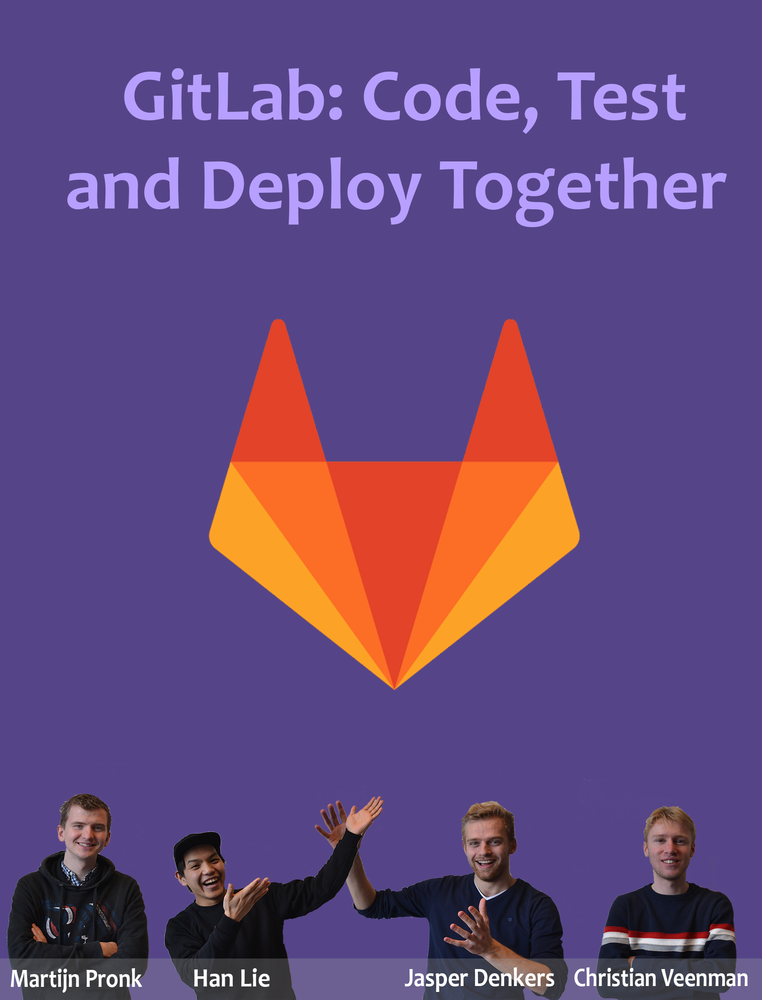
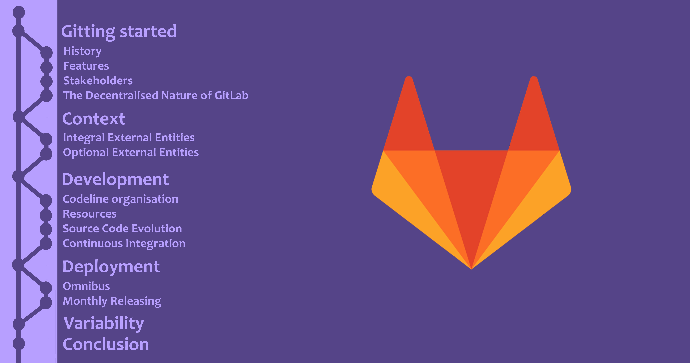
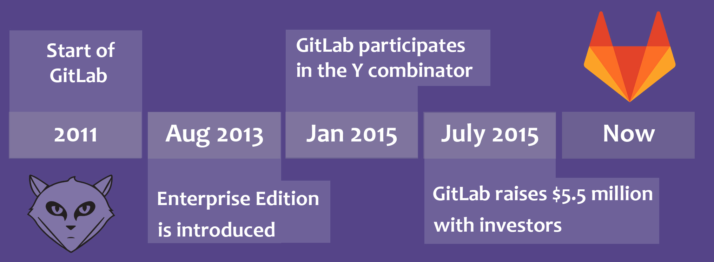
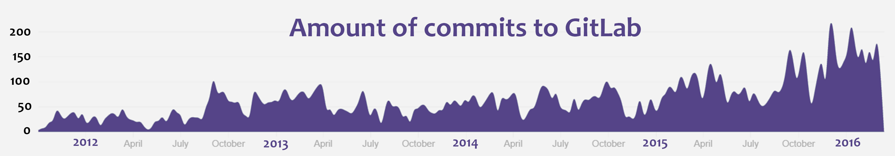
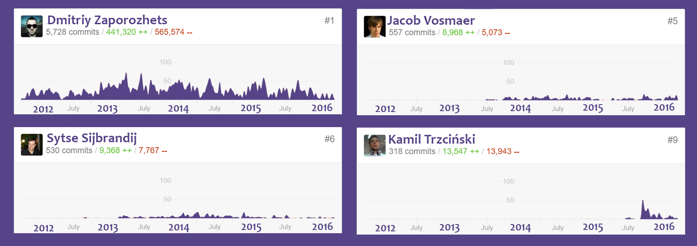
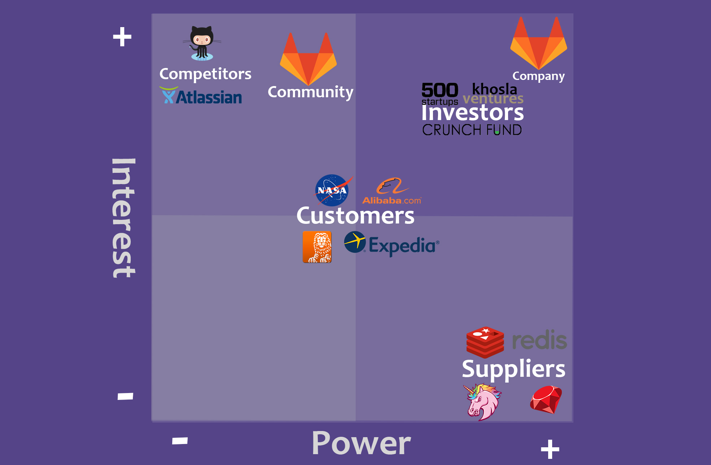
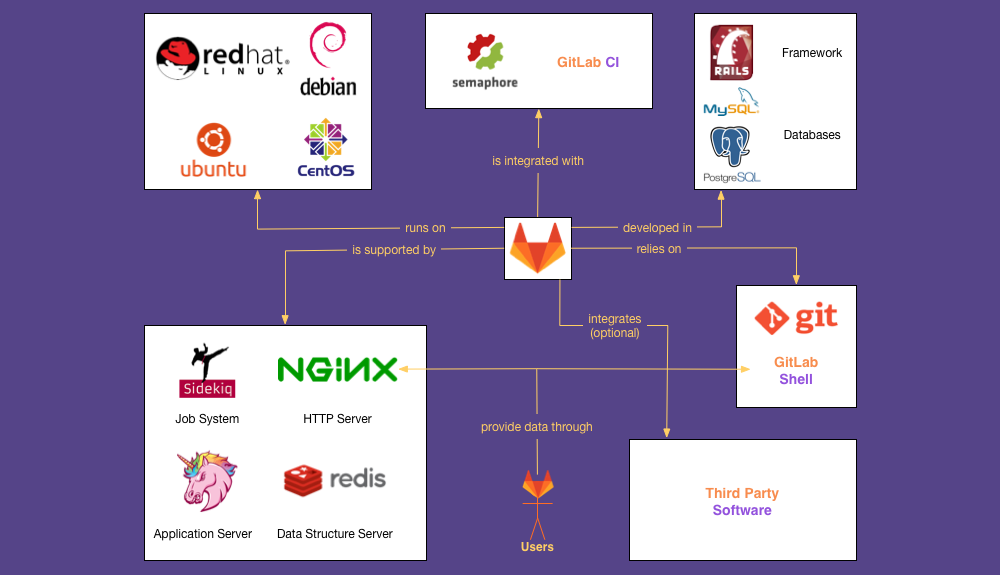
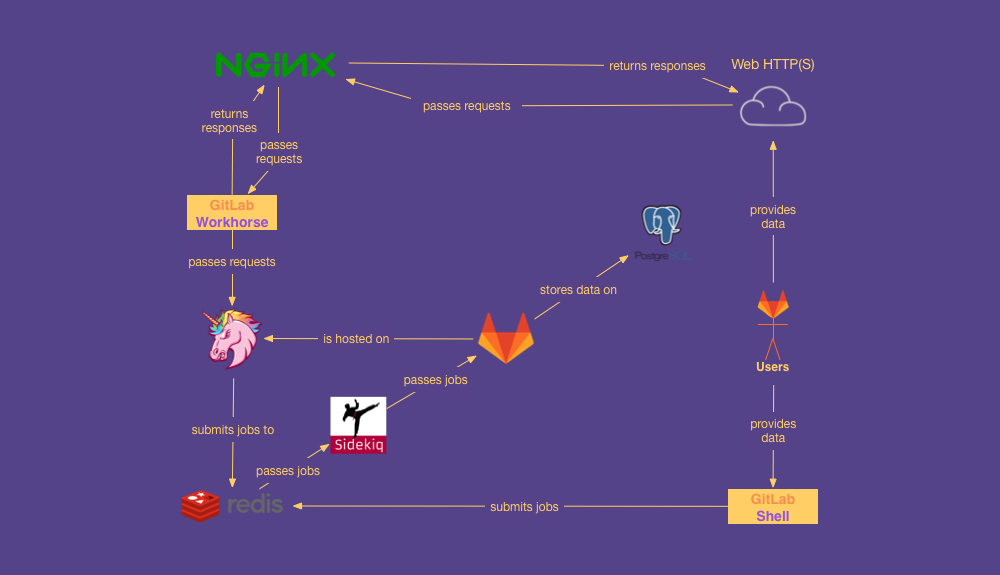
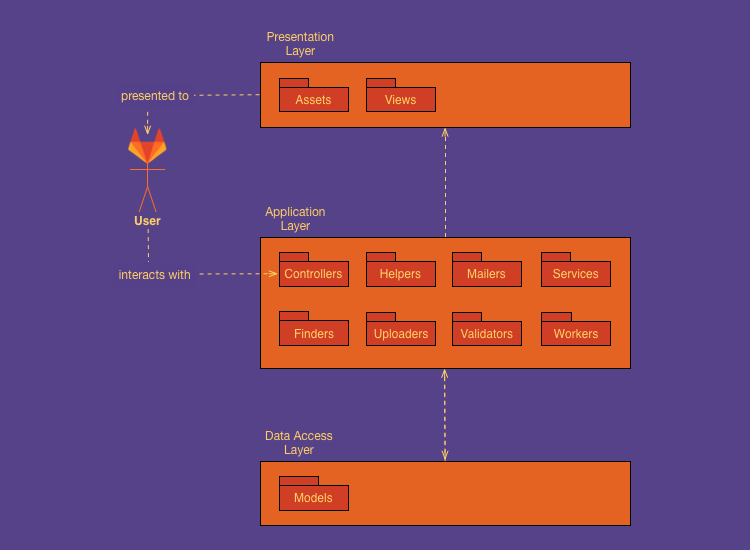
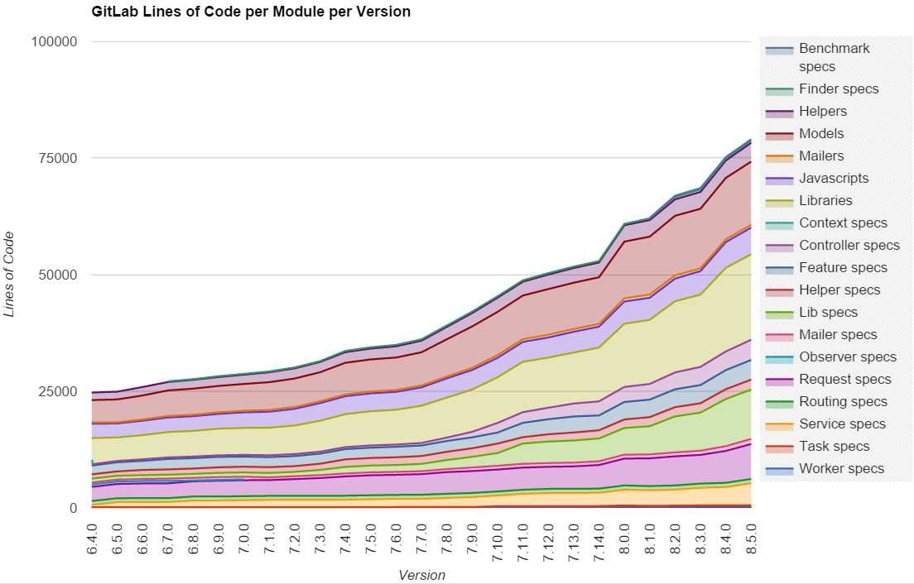



# GitLab: Code, Test & Deploy Together

## Abstract

GitLab is a web-based source control manager. It focuses on documenting, managing and enhancing the workflow of software projects. GitLab distinguishes itself from similar systems by providing out of the box continuous integration and self-deployment. The system is created with Ruby on Rails, PostgreSQL and Git to implement an MVC-based architecture. It delegates tasks to specialised services such as Redis and Nginx, for performance optimisation.
Deployment and distribution are done with the GitLab Omnibus package, which makes setting up a GitLab instance easy. GitLab's open and decentralised business philosophy (its community edition is open-source), results in the need for good documentation, communication and a well-structured architecture.



## Gitting Started

In the last decade software projects have become increasingly more complex as a reaction to the high demand of functionality. This resulted in larger teams having to maintain and improve the software. In order for a software project to succeed, it is essential to have good version control and a clear process on how to contribute to the software without breaking it. GitLab provides a web-based solution to source control with Git and aims to solve these problems by allowing developers to work together in a structured manner. Examples of features that GitLab provides are: a dedicated project wiki, customised continuous integration (CI) and the ability to host GitLab on your own private servers.

This chapter gives an overview of what GitLab is, the development process and its architecture. To better understand GitLab we interviewed GitLab employee Jacob Vosmaer, who has been the fourth employee for GitLab and has helped making GitLab to a success. Jacob is one of the core implementers of the GitLab Omnibus and became senior developer in 2013. He helped us to improve our story and add valuable information.

### History

GitLab is a rather young company, it will celebrate its 5th anniversary this year. The amount of downloads is [growing exponentially](https://about.gitlab.com/2016/02/11/gitlab-retrospective/) and multiple Fortune 500 companies are using GitLab for source control.  

A brief history of GitLab can be seen in _Figure 1_. The company has been founded in 2011 and has been growing ever since. Since August 2013 a paid [Enterprise Edition](https://about.gitlab.com/features/#enterprise) was made available next to the already existing [Community Edition](https://about.gitlab.com/features/#community). According to Jacob Vosmaer the initial strategy of GitLab was to grow slowly. However after joining the Y Combinator (a company that provides seed money and advice for startup companies) in March 2015 they made a switch and speeded up their development.

The amount of commits is increasing by the year. The source code of GitLab is being mirrored and is available at GitHub and GitLab.

### Features
GitLab provide a lot of features that are useful when doing a software project. The features discussed in this section are thought to be the most important to GitLab.

 - Sufficient **documentation** is important in every software project that multiple people collaborate on. GitLab provides a dedicated project wiki that can be accessed through the web interface. The wiki can inform users on how to build, use or learn about the software. Because the wiki is mainly edited in the web interface, GitLab provides a feature which allows users to edit files (including the wiki).
 - Two main features are related to **authentication** within GitLab. It is possible to use [LDAP](https://nl.wikipedia.org/wiki/Lightweight_Directory_Access_Protocol) and two factor authentication. Two factor authentication adds a layer of security and LDAP is enabling to log in with existing external accounts.
 - There are multiple **process management** features that together help with managing a GitLab project. For example adding weights to issues and the ability to view an activity stream provide useful insight of what is being done and what has to be done. Another feature that can enhance management of a GitLab project is adding an external JIRA issue tracker. When migrating between different platforms this can provide better portability.
 - There are also features that together **enhance the workflow** of developers. For example, the ability to fork or mirror repositories both enhance the ability to let developers work with a repository without touching the original repository. The ability to merge builds automatically (if no errors are found) together with the feature that allows for reverting commits both enhance the experience and workflow that developers have when working with GitLab. Also the ability to do code reviews is an enhancement.
 - One of GitLab's unique features is that it can be **run for free on a user's private server**, opposed to something like GitHub. The code never leaves the customers environment which is valuable for companies like, NASA, ING, CERN and Alibaba.
 - There are multiple features that improve the ability to do **Continuous Integration**. The feature of integrating Docker on GitLab requires the GitLab Runner feature to be able to work. _GitLab Triggers_, _GitLab Artifacts_ and _custom build scripts_ all enhance the ability of doing CI.

### Stakeholders

In _Figure 3_, four important people are displayed that are important to the **company GitLab**. [Dmitriy Zaporozhets](https://gitlab.com/u/dzaporozhets) is the founding father of GitLab, he has made the most commits and is the biggest contributor. At the right top there is [Jacob Vosmaer](https://gitlab.com/u/jacobvosmaer), who shared useful insights with us about the way GitLab works. [Sytse Sijbrandij](https://gitlab.com/u/sytses) is the CEO of the company and played a vital role in bringing this idea to the market. [Kamil Trzciński](https://gitlab.com/u/ayufan) is the lead of CI which is a unique feature to GitLab. Kamil first started contributing and later got hired by GitLab. So from contributor he turned into an employee after doing some significant contributions. Most of the top contributors are employed by Gitlab.

As can be seen Dmitriy is contributing a lot. This made that GitLab used to have a high busfactor. A lot of knowledge was centered with Dmitriy, however throughout time the busfactor slowly decreased. The organisation attracted more employees and expertise spread through the sharing of knowledge.  

Besides the employees there is a big **GitLab community** that also contributes. A [special page](http://contributors.gitlab.com) at GitLab is showing an overview of all the 1109 contributors (31st of March).

GitLab is not the first to offer a Git-based source-control system, there is tough **competition**. One of the most well known and used is GitHub. One of the main differences is that GitLab is a complete white box by offering the source code to the customers. This is not the case at GitHub, they are more of a black box. GitLab has gained a lot of traction in the past few years, with self deployment being one of its unique features. As has been mentioned before the GitLab repository is also shared on GitHub so the competition is helping GitLab get more exposure and growth. The competition interested in the developments at GitLab however don’t have direct power to change things.

As GitLab is used to host the source of other systems, their **customers** heavily depend on it functioning properly. If GitLab does not function well, development of a system that utilises it will be hard. Things such as issue management and code review are tasks that are facilitated by GitLab and make developing less of a chore.

There are multiple **investors** that have enabled GitLab to grow further. Khosla ventures, 500 startups and Crunch Fund have supported GitLab with $5,5 million, so they have the best interest in GitLab and also have power to change things.

GitLab makes use of different open source programs. GitLab is dependent on these **suppliers** and therefore they have power since changes at the suppliers affect GitLab. From these programs there is however a low interest in GitLab. The suppliers will be discussed in further detail in the [context section](#context).

### The Decentralised Nature of GitLab
GitLab is very open about their internal and external processes. Since GitLab is a decentralised organization their employees often are working in different time zones. In the interview with Jacob Vosmaer he made clear that sufficient documentation is essential since they often cannot contact their colleagues because of time differences. After their rapid exponential growth they are still able to stay open towards the community and are still working decentralised. All documentation can be found on their [website](http://doc.GitLab.com/ce/).

## Context
In this chapter the relationships and interactions with the system's environment (such as third party applications) are described. The context view provided in this chapter is based on [the book by Rozanski and Woods](http://www.viewpoints-and-perspectives.info/).

GitLab tries to achieve the aforementioned goals with an architecture that contains several external entities. Some are necessary for the system to run properly, while others are optional.

The systems architecture can be sectioned into two groups that give a clearer view on how GitLab interacts with its external entities, namely:

 - Integral external entities
 - Optional external entities

In _Figure 5_ this overview can be seen. This figure excludes the optional external entities, as they are not a necessity for the system to run and including them would create a too chaotic view on the architecture. These will be elaborated upon below.

### Integral External Entities

**Development tools** used to create GitLab are Git, Ruby on Rails and MySQL/PostgreSQL.

Git is both used as a development tool and as a main feature of GitLab. Git is a source control tool and facilitates users in creating a more efficient workflow. As GitLab itself is a Git-based source version control application, Git also has to be integrated in the application itself besides being used as a development tool. It is one of the most important components of GitLab.

The system is built in Ruby on Rails, which is a popular web application framework that was chosen as most of GitLab's initial developers were experienced in this framework. It is used to create applications that are based on the MVC (model-view-controller) architecture.

Databases used to store basic information are either MySQL or PostgreSQL, which stimulates portability.

GitLab also provides their own CI tool. This is a very distinguishing feature as most CI tools are paid services. GitLab makes use of this tool during development. Besides their own tool they also use Semaphore CI for some tasks.

**Service providers** used by GitLab mostly provide server software that try to separate the workload and make the application run more efficient. For GitLab to function properly these servers need to be installed, with frameworks and applications that talk to them. In _Figure 6_ a diagram can be found that gives a better understanding of the main architecture behind GitLab and its surrounding systems. Below that figure a more thorough analysis will be conducted.

Sidekiq is a background processing framework for Ruby. It is used for job processing tasks such as queueing and job prioritisation.

Sidekiq makes use of the Redis as a database backend. It contains job information, meta data and incoming jobs. Redis is a fast data structure server, that lives in the RAM memory. This makes it great for job caching and working with Sidekiq to do the job processing.

GitLab repositories are accessible via two front end systems: GitLab-shell and Nginx.

The GitLab-shell is an add-on provided by GitLab that gives a terminal like environment to handle Git commands. It communicates with Sidekiq via Redis to give Git commands.

Regarding the latter, Nginx is a web server that can handle a high number of connections and specialises in load balancing. It can be accessed via HTTP(S) and can serve static files very well. Nginx functions as a first entry point to all web requests and is used to access the Unicorn application server.

Unicorn is an application server that contains the main Rails application. It processes requests received and filtered through Nginx and GitLab Workhorse and returns a response to the users.

GitLab Workhorse stands between Unicorn and Nginx. It is used to handle large HTTP requests such as file transfers and Git push and pull requests. Other requests are passed to Unicorn to handle.

GitLab can be run on multiple server distributions. These include Red Hat Linux, Debian, Ubuntu and CentOS.

### Optional External Entities
The external entities described in this section are optional to include in the system. GitLab is unique in comparison to its competitors in the sense that it has support for external entities out of the box (the integration is implemented by GitLab itself). A competitor such as GitHub can integrate these entities too, but the integration initiative needs to be taken by the companies that provide these entities themselves. Below a list is given on these entities and what they are used for.

**Continuous integration:** even though GitLab provides its own CI tool, it is possible to use external CI systems, including:

 - Atlassian Bamboo CI
 - Buildkite
 - Drone CI
 - JetBrains TeamCity CI

**Project management and issue tracking:** it is possible to use tools to enhance project management. Codeline managing, bug tracking, issue tracking, task tracking etc. can be done by integrating the following tools:

 - Assembla
 - PivotalTracker
 - RedMine
 - JIRA

**Deployment:** deployment can be facilitated by using e.g. one of the services listed below:

 - Docker
 - Heroku

GitLab facilitates integrating a lot of services. The ones mentioned above were deemed most important, as they make certain cumbersome tasks a lot easier when integrated with GitLab. Other services include spam protection, dependency/vulnerability tracking, authentication, communication, metrics and avatar integration. On [the GitLab website](http://doc.gitlab.com/ce/project_services/project_services.html) a full list can be found.

## Development

This development view presents an analysis of how GitLab is structured, how the code is organised and it describes the most important processes and resources related to developing and testing GitLab.

### Codeline Organisation
GitLab mainly uses the Model-View-Controller (MVC) architecture. MVC is a design pattern often used in software architecture. It separates the system into three interconnected parts, namely a model, view and controller. The _model_ represents the business domain, where data can be stored and retrieved. The _view_ is used for presentation to the user. The _controller_ is the communication link between the model and the view. It manipulates the model by sending commands. Commands can also be sent to the view so that the right information is displayed.

According to the book by Rozanski and Woods, source code can be organised into modules that contain related code. Though MVC gives a clear view of the global structure of a system, it does not encompass all of the modules in GitLab. A module structure diagram is therefore created that takes MVC and all of the modules into account. In _Figure 7_ a module structure model is given to show the dependencies between these modules.

MVC is implemented making use of Ruby on Rails, a web application framework that purely focuses on this design pattern. Therefore most GitLab modules can be separated according to how Ruby on Rails modules are organised. We separate modules into three layers:

 - Presentation Layer: Contains modules that create the view of the system. Views in the presentation layer are shown to a user through a browser or console. Furthermore assets that are needed for the view are contained in the presentation layer, i.e. images, stylesheets, javascript files for interaction and fonts.
 - Application Layer: Contains modules that contain the main functionalities of the system. It furthermore directly speaks to the data access layer to extract, write to and manipulate data. Following an overview of each of these modules:
	  - Controllers: Process requests to show certain views to the user or to access the correct data from the data access layer. It directly receives its requests from the user.
	  - Helpers: Used to support controllers. By default in Ruby each controller automatically includes all helpers. GitLab has around fifty helper modules, which focus on supporting the controller modules through for example a SearchHelper module that contains autocomplete methods for searches.
 	  - Mailers: Allows sending emails from the system. An example is the Groups module that focuses on sending and managing group emails.
	  - Services: Contain basic functionalities of GitLab such as the MergeRequests module that executes merges.
	  - Finders: Mostly used for sorting and finding modules.
	  - Uploaders: Used for managing files in directories.
	  - Validators: Contains modules that validate certain properties of the system, such as an url_validator module which validates each uploaded url.
	  - Workers: Contain background workers that are needed for background processing after certain actions are performed. Most of the worker modules include a Sidekiq module for job queueing their background processes.
 - Data Access Layer: Contains implementation of the domain model.

### Resources
Since GitLab has so many external dependencies, getting started with developing for GitLab could be hard. GitLab facilitates developing by providing the [GitLab Development Kit (GDK)](https://gitlab.com/gitlab-org/gitlab-development-kit) for various operating systems. The GDK provides an isolated environment for developers that is easy to setup up and eliminates the hassle of setting up a lot of services and dependencies to get started with GitLab development. Additionally, it accompanies the process of updating between different versions, including for example database migrations. It is unique in the sense that it encourages the use of Ruby and dependencies installed natively on your OS, rather than in a virtualised environment. Due to lots of IO operations, a virtualised solution would be much slower for running and testing the system.

Since GitLab is a continuously evolving system, no specific time constraints are set. Additionally, it seems like the organisation does not have specific budget constraints. There is budget, as provided by the investors and customers, which is used the pay employees and evolve the system as quickly as possible. The only self-imposed time constraints that exist are prescribed by the monthly release schedule.

The main resources that are used to develop the system are developers. There are two types of developers that build the system: GitLab employees and open source contributors. The GitLab employees are mainly remote workers and get paid. The open source contributors provide free contributions where GitLab benefits from.

GitLab provides a free distributed Community Edition of their system, available for dedicated installation for developers the use for their own projects. This distribution requires hardware in the form of servers. When a consumer decides to run an instance of the GitLab community edition itself, hardware is required. Additionally, hardware is required for the so called GitLab runners, the workers that execute CI builds. GitLab also provides free CI runners. In practice, these are slow and real customers would probably decide to add extra resources by dedicating servers for building their GitLab CI builds.

Probably the most important form of development resources is the documentation. GitLab focuses on openness and transparency in communication. This is reflected in the amount of effort that is put in online discussions, guides and management of issues and merge requests. This empowers employees and contributors to quickly get started with contributing. Additionally, extensive feedback on proposed changes helps keeping quality high. The [descriptions and guidelines of internal processes](https://about.gitlab.com/handbook/) are also open.

GitLab is mainly written in Ruby and its current version uses about 173 external gems. Gems are basically libraries that are written in Ruby and can be installed by the gem command which will automatically download them from a source. Reusing code is often a good idea since it saves development time and costs, often also providing a more specialised solution. However since the external gem files are hosted on the rubygems.org, GitLab is dependent on the behavior of rubygems.org. If the owner of a gem decides to remove a gem from rubygems.org that GitLab uses, it will create issues when building GitLab. A good alternative would be if GitLab mirrors all gem files on its own servers so that they are not dependent on rubygems.org.

### Source Code Evolution
We measured the volume of the GitLab codebase over time. The measurement is performed on major/minor versions (x.x.0). The results are visualised and analysed below. The graphs in the proceeding sections visualises the evolution of GitLab’s codebase over time.

In _Figure 8_ we see that the overall (normal and test) code volume increases gradually. For version 8.5.0, it increased with a factor more than 3 relative to 6.4.0. Additionally, we see that the amount of test code relative to normal code increases over time. For version 6.4.0, the amount of normal code is 1.24 times more than the test code. At version 8.5.0 it is less: 0.97. This could indicate that GitLab's focus on testing is increasing.

With the visualisation in _Figure 9_ we see that the growth of the overall codebase is spread across most modules. There are no single modules that increase substantially more than others. Most modules are present from the beginning till the current lifecycle and no splitting of modules can be identified. This could be a sign that good architectural decisions were made at an early stage, since there was no need for big refactoring afterwards.

### Continuous Integration
GitLab performs CI using two systems, namely Semaphore and their self created GitLab CI. Via these systems it is made easy to do automatic software testing and deployment to the cloud. Extensive automated testing increases quality during development. As we have seen in the [Source Code Evolution Analysis](#source-code-evolution), this is of big importance for GitLab. This is supported by one of the [contribution acceptance criteria](https://gitlab.com/gitlab-org/gitlab-ce/blob/master/CONTRIBUTING.md#contribution-acceptance-criteria), which states that all contributions should contain proper tests.

GitLab [builds itself](https://gitlab.com/gitlab-org/gitlab-ce/builds) using their own tool. This is a nice demonstration of one of their own prominent features, CI within the GitLab environment. CI builds are parallelised and sped up by dividing the complete build job into several dependant and independant smaller jobs. If a job fails, jobs depending on such a job will not get executed to save resources.

Additionally, CI is applied using Semaphore for targeting tests with specific setups that GitLab does not support itself, yet. This mainly consists of tests using PostgreSQL as a database.

## Deployment

Interestingly enough, since GitLab is a piece of software itself, it is used as the main tool for coding, testing and deploying itself. In this section we will focus on the deployment part.

### The GitLab Omnibus
GitLab deploys and distributes its system to consumers in a package that’s called the [GitLab Omnibus](http://doc.gitlab.com/omnibus/), which was one of the big factors that allowed GitLab to grow. Since GitLab relies on a variety of external services like databases, servers, etc., setting the system up could be a hassle. The Omnibus package solves this by packaging required configuration options and updating and maintaining features into a single resource that users can install on various operating systems to get started quickly in minimal time. Initially, GitLab was mainly supporting Ubuntu 12, which was the most recent stable Ubuntu release back then. However, because larger companies often used Red Hat as their Linux distribution, it often caused minor issues when following the manual installation and configuration steps.

Jacob Vosmaer played a significant role in the creation of the GitLab Omnibus. In our interview with him he explained to us that creating the GitLab Omnibus decreased the time necessary to invest in technical support since most users did not have to do any manual configuration steps anymore. The user could simply install the GitLab Omnibus package. Upgrading your current GitLab configuration can also be done by using single-set Omnibus operations, which removes the need for manual configurations when a new version has been released.

The GitLab Omnibus is largely based on [CHEF](https://www.chef.io/), because CHEF is easy to configure for multiple platforms. Currently the GitLab Omnibus contains Nginx, LDAP, PostgreSQL, Redis, Unicorn and more systems required for running.

### Monthly Releasing
Since October 2011, GitLab has consequently released a new version on [the 22nd of each month](https://about.gitlab.com/2015/12/17/gitlab-release-process/) (excluding patches and security releases). It is the 22nd of the month because just the last release before GitLab decided to start releasing monthly was on the 22nd, and they decided to stick with that.

The philosophy of GitLab prescribes that there should be no single point of failures. We can see this in the release process, where there is the role of a _Release Manager_. This is a role that is being passed on to a different person every month. The two main takeaways of this method in the deployment is improved reliability (the busfactor is decreased) and a better process. It gets a refreshing look every month and documentation is stimulated. This enabled GitLab to release monthly without exceptions, while working with mostly remote developers that do not have frequent physical meetings.

## Variability

GitLab is built to be very configurable. Projects have different demands and therefore also have a need for different features. The variability points that are of main importance to GitLab will be discussed in this section.

 - **Community vs. Enterprise Edition:** The product is distributed in two different ways: a free Community Edition (CE) and a paid Enterprise Edition (EE). Selling the EE generates the main source of income for GitLab. It varies from the CE in the sense that it has extra features that are developed by GitLab and is mainly targeted at bigger organisations. Those features include advanced authentication and authorization options, extended workflow and project management, etc. However all contributions made by the open source community are always added to CE and will never be made only available for the EE. Another difference between the CE and EE is that EE includes customer support whereas CE does not. GitLab itself maintains [an extensive list on their website](https://about.gitlab.com/features/#compare) viewing the differences between CE and EE.
 - **Authentication and Authorization:** While GitLab contains a basic authentication system, the authentication system can be configured to a project's needs. GitLab can be configured to make use of multiple LDAP servers, two way authentication or Kerberos user authentication. Two factor authentication can be used together with other forms of authentication.
 - **Project Settings:** GitLab provides various project supporting features out-of-the-box which are automatically enabled (like issues, continuous integration), but some users possibly are not interested in using those features at all. Therefore, these features can be disabled on a per-project basis. This is being done by either disabling the feature in the web interface or by adding the configuration options in the GitLab.rb configuration file which can be found in every GitLab setup.
 - **Operating System (OS):** GitLab deploys its system either via the [Omnibus package](#omnibus) or by doing a manual installation. By using the Omnibus GitLab was able to provide more support for different platforms. Whereas at the start GitLab was only available on Ubuntu, it can now run on a variety of platforms including CentOS and Red Hat Linux.

## Conclusions

The main goal of GitLab is to code, test and deploy together. It tries to achieve this by providing a web application that integrates Git repository management, code review, issue tracking, project reporting, continuous integration and deployment.

GitLab distinguishes itself from similar applications such as GitHub in the sense that it makes self deployment possible and easy. It delivers an out-of-the-box experience with its GitLab Omnibus and includes CI to make development and testing even more accessible.

GitLab has a culture and philosophy that embraces openness and transparency, which is necessary as they are a company that functions mostly decentralised. This results in the need for proper documentation, good communication and a strong architecture.

The main architecture created using Ruby on Rails makes GitLab a well organised system, that facilitates integrating external entities such as Redis and Nginx. Integrating them makes the system faster by dividing time consuming tasks over specialised services.

Currently GitLab is getting a lot of traction. They have received several large investments in the past few years and GitLab is becoming more popular due to their free features of CI and self deployment. In upcoming years it hopes to grow more and invest more in these distinguishing features.

As indicated by Jacob Vosmaer, the focus in the near future will be on extending CI functionalities. In the past few releases, new technologies like the programming language Go are introduced. These two moves and their impact on the evolution of GitLab will be interesting to follow.
