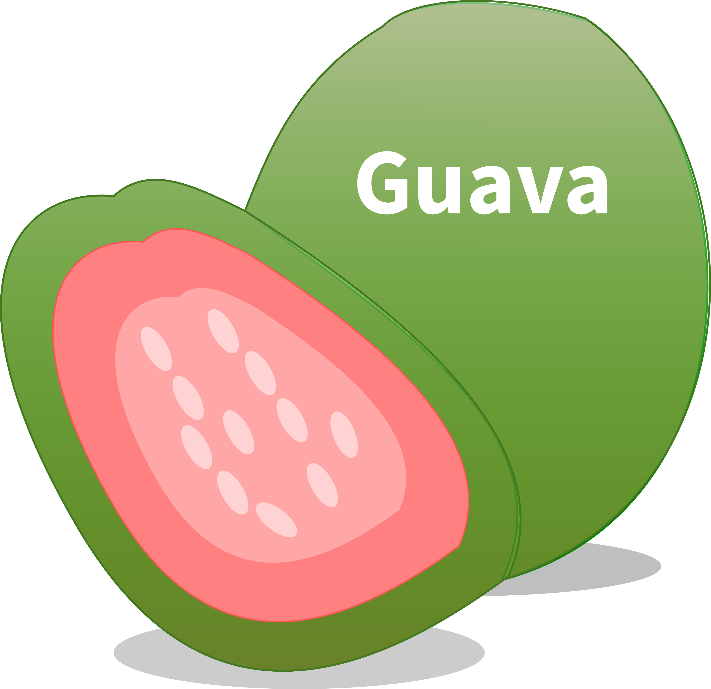
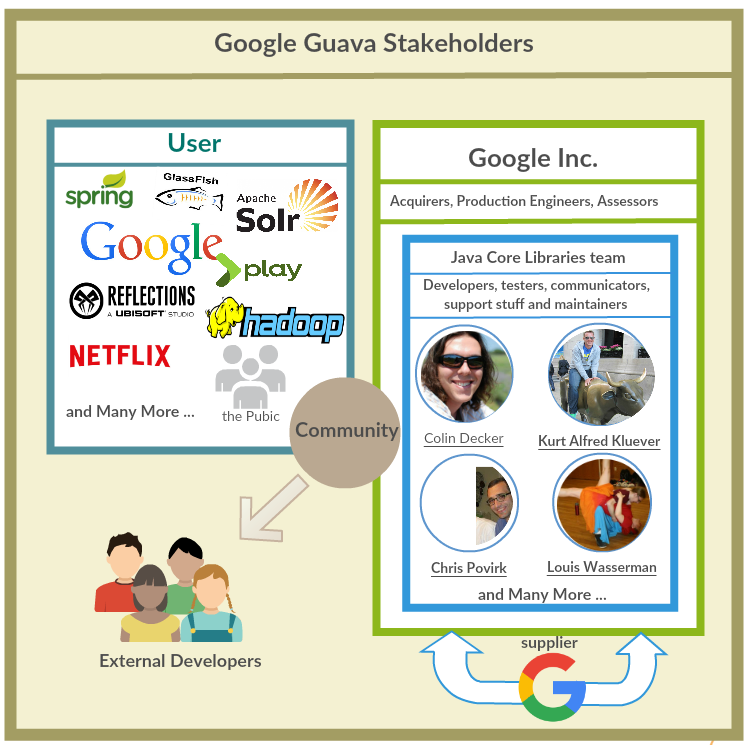
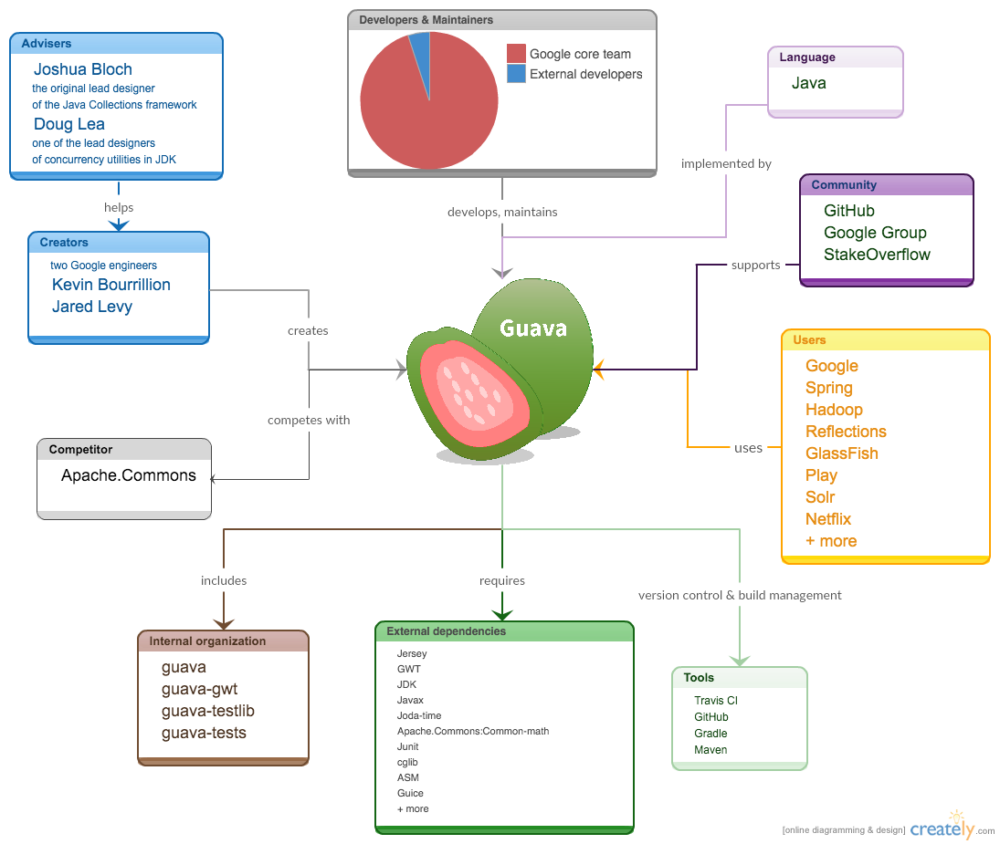
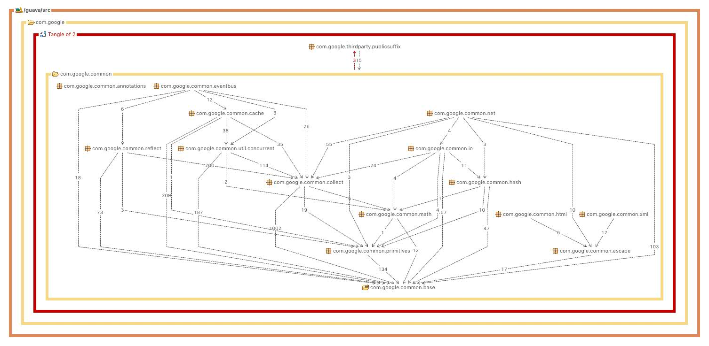

# Guava - As it Currently is
[Bastiaan Reijm](https://github.com/breijm), [Marco di Biase](https://github.com/mardibiase), [Qianqian Zhu](https://github.com/qianqianzhu), [Luca Pascarella](https://github.com/lucapascarella)

*Delft University of Technology*

## Abstract
Guava is a Collections and Utility library, focusing on complementing the Java Standard library. We present the current state of Guava for newcomers and interested parties. We look at what Guava is and elucidate the architecture by analysing several key viewpoints and perspectives. Furthermore we present the current plans for Guava so that contributors and users know in which direction the project is going. We briefly discuss what to do when contributing. Finally we look at our own work and experiences at we gathered while analysing this project. Our aim is to provide an outside perspective of Guava.

## Table of Contents
* [Introduction](#introduction)
* [What is Guava?](#what-is-guava)
   * [Where is it used?](#where-used)
   * [The Architecture of Guava](#architecture)
	   * [Stakeholders](#stakeholders)
	   * [Context Viewpoint](#context-viewpoint)
	   * [Development Viewpoint](#develop-viewpoint)
		   * [Module Organisation](#module-organisation)
		   * [Standardisation of Design and Testing](#standardisation)
	   * [Information Viewpoint](#information-viewpoint)
	   * [Evolution Perspective](#evolution-viewpoint)
	   * [Security Perspective](#security-viewpoint)
* [Comparison to Apache Commons Collections](#comparison-apache-commons)
* [What's Next for Guava?](#what-next-guava)
	* [Plans for Guava 20 and 21](#plan-guava)
	* [Usage Statistics and Phenomenon](#usage-statistics-phenomenon)
* [Conclusion](#conclusion)
* [References](#ref)
* [Appendix: How to Contribute](./appendix-how_to_contribute.md)
* [Appendix: Our Contribution](./appendix-our_contribution.md)

## Introduction
The Guava project [[1](#guava)] is one of the many libraries written to expand and simplify the use of the Java Standard Library (JSL). This chapter about Guava is an academic study conducted to analyse this project and show it from multiple angles.
What is it? Who is involved? Why use it? How to contribute? All these are valid questions and this chapter attempts to answer these questions and provide resources for further investigation on that project.

First off, who this chapter written is for. Often it is hard for an outsider to get insight on the working of a tool or how a project is organised; it requires a substantial amount of effort. The Guava wiki [[2](#wiki)] is an excellent place to start however its main focus is usage and the features that Guava has. We take a different approach. We started as outsiders to this project and now that we know more about this project we present our findings so that anyone in the near future can gain a similar understanding of Guava without expending a similar amount of effort.

With the previously elaborated idea in mind, the chapter is organised as follows. First we start by looking at what Guava actually is from both a conceptual as well as an architectural point of view. In these sections we explore in details: the stakeholders, the context viewpoint, the information viewpoint and the evolutionary and security perspective. The previous analysis are also the starting point to propose a little comparison with similar projects like Apache Commons Collections. Then we discuss the future plans of Guava and some phenomenon related to its real-world usage. Finally we conclude this chapter by reflecting on our own work and the lessons we learned.

## What is Guava?
In the simplest terms, Guava is a Java library. Specifically it is a Collections and Utilities library that adds functionality to the Java Standard Library (JSL). It is not a separate language and it does not attempt to be a replacement of the JSL. Rather it provides features and functionality that are either non-existent or cumbersome in Java.

### Where is it used?
As with any product, the proof is in the usage. Guava is used in several scenarios of everyday Java programming. When dealing with common Java development, enhanced functionalities on top of JSL are needed.
For instance, dealing with `null` values is a hassle. Guava provides a way to handle this. Giving it a name, increases readability in the first place and forces developers to think about the cases when a method might return a null value.

`Optional` [[3](#optional)] replaces a nullable reference with a non-null value. An Optional may be *present* or *absent*.

	Optional<Integer> possible = Optional.of(5);
	possible.isPresent(); // returns true
	possible.get(); // returns 5

Returning Optional makes it impossible for callers to forget that case, since they have to unwrap the object themselves for their code to compile.

Another key example of additional functionality is for Strings. Strings in Java are used in a multitude of scenarios. Guava provides enhanced functionalities in order to join, split, match characters and use specific charsets. For instance, using Guava `Splitter.split` [[4](#splitter)] allows to control over the confusing behaviour of `String.split` when dealing with trailing separators or empty. This is just the beginning, because string splitters is much more powerful. For instance:

	MapSplitter splitter = Splitter.on(" ").withKeyValueSeparator(":");
	splitter.split("a:1 b:2"); // => Map {a=1, b=2}

creates a Map starting from a string, defining a custom splitter and key-value separator.

Java collections are very useful, but Guava expands classic Maps and Sets with `Multiset`, `Multimap`, `BiMap` and `Table`. These have specific features that are useful in a multitude of scenarios. For example, JSL `Map<K, Set<V>>` is the typical way to have an non-labeled directed graph. Accessing it though, is not trivial. Guava's Multimap (and in particular for this scenario a `SetMultimap` [[5](#set_multimap)]) makes it easier to map one key to multiple values. A Multimap is a general way to associate keys with arbitrarily many values.

Finally, Guava `Iterable` [[6](#iterables)] is another useful utility class that provides utility methods that operate on or return objects of type Iterable. All of the iterables produced in this class are lazy, which means that their iterators only advance the backing iteration when absolutely necessary. This is extremely useful when a *collection* is not actually stored in main memory (for instance retrieved from a database) and does not support operations like size without actually grabbing all of the elements.

These are just a few of the large number of functionalities made available with Guava.

### The Architecture of Guava
This book is about Software Architectures of Open Source Systems thus we find it appropriate to include some factors, viewpoints, and perspectives that relate to the architecture of Guava.

#### Stakeholders
The very first thing of understanding the Guava's architecture is to identify and understand the role of stakeholders. Since stakeholders, who have interests in the system, play a vital role in the realisation of the system. They explicitly or implicitly determine the main features of the system to satisfy their needs.

To start with, a brief background information about Guava. In 2007, Guava started out as the "Google Collections Library". In 2010, Guava released its first version on GitHub. For now, Guava has 6,734 usages according to the statistic is shown in Maven Repository website [[7](#mvnrepository)]. Meanwhile, Guava has 1,002 copy repositories (forks) by other GitHub users [[8](#sgithub)]. In one sentence, Guava is an open source project while it is also a collection of APIs referenced throughout the internal Google codebase. The two keywords, *Google* and *open source*, determines the distribution of Guava's primary stakeholders.

First of all, Google, as the owner of Guava, develops, tests, maintains, supports and uses Guava project. Thus, in this case, staff from Google consists of the central part of the stakeholders. Google, of course, is one of the biggest **users** and **suppliers** of Guava. **Acquirers** are mainly senior managers from Google. **Production Engineers** are members from Google that provide development and test environment for Guava. **Assessors** are from Google's quality control or conformance departments.

Among the **developers**, **testers**, **communicators**, **support stuff** and **maintainers** are Java Core Libraries team members at Google [[9](#gt)]. They communicate with and provide support to users in user community while they develop, test, and maintain Guava project. The most important **developers** that have contributed to guava are @[cpovirk](https://github.com/cpovirk), @[kluever](https://github.com/kluever), @[cgdecker](https://github.com/cgdecker) and @[lowasser](https://github.com/lowasser). Each one of them has more than 150 commits on the repository, and more than 40k of lines of code written.

Meanwhile, *open source* means the public has access to Guava and they can use it; possibly make contributions the project. In this case, third-party organisations and the members of the pubic consist of **users**. The third-party organisations include Spring, Hadoop, Reflections, GlassFish, Play, Solr [[7](#mvnrepository)] and Netflix [[10](#netflix)]. The members of the public include web application developers, Java programmers, distribution application developers and CSP programmers. These users can also act as the external **developers** via GitHub. They sometimes can also fill in the role of **accessor** ([pr #2247](https://github.com/google/guava/pull/2247)) and **communicators** ([pr #2248](https://github.com/google/guava/pull/2248)).

To date we have not identified any **system administrators** in the Guava project, since Guava serves as a core library and no need to run this system additionally.

The [stakeholders diagram](#stakeholders_diagram) below shows the overview of Guava's stakeholders as mentioned above.

Guava has a large and diverse set of stakeholders; both the community and Google actively contribute to this project.

#### Context Viewpoint
If we would like to summarise in one sentence what Guava wants to achieve, we could say don’t reinvent the wheel [[2](#wiki)].
##### Creators and Advisors
The former Google Collections Library was born due to the necessity to extend some core Java functionalities in order to improve the structure. Two engineers at Google, Kevin Bourrillion and Jared Levy, decided to step in and write an extension to the standard JDK, which included productive features such as hashing, functional programming and so on. Apache Commons Collection was in the game, but unluckily was not enough for the kind of structures and operations that these two people were looking for.

Two big names were prominent in the original design of Guava [[14](#bigname)]: one is Joshua Bloch, the original lead designer of the Java Collections framework. The other is Doug Lea, one of the lead designers of concurrency utilities in JDK. They both advised and reviewed this library’s design and preliminary implementation.

Guava is a Java library that lets any project to import it and make use of its features. In contrast to the JDK, Guava deprecates and eventually deletes unwanted features over time. The changes are made in order to make sure that no actual system that uses it gets broken.
New components are also very important as well, and they are marked with the tag @Beta. They receive the same treatment as normal component, regarding for instance the testing aspect.
If Beta component are to be deleted, they are deprecated one release before.

##### Internal organisation
From Guava's codebase, we found it consists of four projects: `guava`, `guava-gwt`, `guava-testlib` and `guava-tests`. We will provide further analysis of Guava internal organisation dependencies in [Development Viewpoint](#develop-viewpoint) section.

##### External dependencies
From Guava's maven build file, we identified the several external dependencies. Firstly, Guava depends on Java basic packages JDK and Javax. Secondly, some web server tools are also required such as Jersey, GWT. Thirdly, Guava injects dependencies with Guice[[30](#guice)]. Fourthly, Guava's testing related dependencies. Apache.common.math package is used to conduct benchmark testing. Junit is used to conduct the unit testing. Several Java bytecode generators, such as cglib and ASM, is also used for testing. In addition, Joda-Time, which provides a quality replacement for the Java date and time classes, is also adopted in Guava.

##### User and Community
The users can get supports and helps via User Community. The main websites are GitHub, Google Groups and StakeOverflow. Public users can post questions, feature requests or potential patches in the community. The developers are also involved in the discussions.  

##### Version control and build management tools
Guava is a open source project and it mainly uses GitHub as its version control tools. Travis CI, as a popular companion with GitHub for open source project, is adopted to build and test projects Guava also uses Maven and Gradle for build automation.

The context model is presented below ([context model diagram](#context_view_diagram)). The context model diagram summaries the above content and also includes information from stakeholders analysis. In conclusions, Guava's context model is relatively simple, since Guava is a Java library and does not involve much common processing.

#### Development Viewpoint
The development view gives more information about the organisation of the project, in particular regarding its source code. This view focuses on the technologies that are used in building, testing and releasing a software product.

##### Module Organisation
Once you set up a local clone of Guava on your machine, you will find the current version (version 19) of Guava consists of four projects:

| Project | Purpose |
|--------|---------|
|`guava` | the main source of Guava |
|`guava-gwt`| the GWT-compatible super-source that helps make Guava GWT-compatible |
|`guava-testlib`| the test suite builders that assemble customised, exhaustive test suites for collection implementations |
|`guava-tests`| the tests for Guava |

Since `guava` project represents the main source of Guava, we further analyse the `guava`'s module organisation. The project `guava` consists of 16 packages. [Guava Dependencies Figure](#guava_dep) generated by using [STAN4j](http://stan4j.com/) Eclipse plugin displayed the inside dependencies.

Based on the package dependencies and functionalities, `guava` project can be further clustered into four layers:

| Layer | Package(s) | Functionality |
|--------|----------|---------------|
|The corest of the core|  `base` | provides with fundamental utility libraries and interfaces for other modules.
|Utilities Module| `primitive`, `escape`, `math`, `html`, `xml`, `io`, `net`, `concurrent`, `collect`, `cache`, `eventbus`, `hash`, `reflect` | each functionality can refer to Guava's API documentation [[12](#api)].|
|Annotation Module| `annotation` | served as an independent module which provides common annotation types throughout the whole project.|
|Public Suffix Module | `thirdparty.publicsuffix` | accessing to public-suffix information (public suffix can refer to [[13](#ps)]).|

##### Standardisation of Design and Testing
The participation of two well-known Java fundamental designers, that are Joshua Bloch and Doug Lea, implies that design standards in Guava are quite elaborate and strict.
Based on Guava's wiki documents as well as the previous investigations of Google Java code guidelines, we conclude that several design strategies are split into the following parts:

* best solution
* intuitive semantics of methods and classes (details refer to good code style [[15](#gjs)])
* focus on generic use cases
* emphasis on maintainability:
  * most exposed classes should be `final`
  * conservative attitudes towards `AbstractXXX` classes
* compatibility:
  * introduction of `@Beta` annotation which indicated the related features are not ready to freeze

Furthermore, Guava also has been battle-tested in production at Google. For now, the guava-tests package includes more than 600,000 individual test cases which achieve thorough testing coverage. Guava also has additional benchmark tests (in `guava-tests/benchmark` subfolder) to check the real performance.

From the wiki and codebase, we identify that Guava has used at least three **test tools**:
* JUnit: unit testing framework
* Maven, Gradle: build tools manager for Java
* Travis CI: automatic test execution

#### Information Viewpoint
From an Information Viewpoint Guava has a rather simplistic architecture. Guava itself inherently does not have any information; there is neither a database nor a configuration file for Guava. Guava does not have the common ownership, mapping, volatility, and consistency problems that other systems have. Guava is not even a complete system, rather it’s a utility library. Therefore in this viewpoint we focus on information purpose, usage, flow, quality, consistency in the context of what does Guava do to try to help with these aspects.

A good example of how Guava is more than just a wrapper for the JSL is the Input and Output (IO) [[16](#io)]. Guava uses a paradigm commonly found in graph theory, namely sources and sinks. Information is read in by a Source and written out by a Sink. To facilitate this paradigm, abstract classes are provided that support this concept and aim to help developers write more consistent code with ease.

IO certainly is not the only part where Guava provides useful features. Among the more mature and popular parts of Guava — according to the wiki [[17](#coll_utils)] — Guava provides extra functionality with regards to working with collections. For example, Guava provides functionality to take the cartesian product of two sets. Remember that the cartesian product is the set of all the pairs that can be created by picking one element from each set. This functionality is not available in the Java 8 or lower. While this is a rather trivial example, Guava provides much more functionality like this for Collection types.

Another significant area that Guava targets is data consistency, it does so in the form of caches [[18](#cache)]. Caches in Guava provide ways to manage data eviction strategies so that caches limit their memory footprints. These caches are most useful when memory can be traded in for processing speed, data will be queried more than once, and the entire cache can be loaded into memory. Guava caches are local in-memory data structures that neither write data nor persist over multiple applications runs.

Guava as a project is of low complexity from an Information Viewpoint simply because it does not store data, it only facilitates the processing of data. This functionality comes in the form of IO handling, collections manipulation, and in-memory data management.

#### Evolution Perspective
Like most software systems and libraries, Guava has changed over time. The project started as the internal collections library for Google and became known as the Google Collections API.

The major architectural changes are always discussed with the community, however seeing these changes in action is a different story. Google maintains Guava with input from the community. Google maintains an internal issue list and has internal pull requests [[19](#commit_convention)]. Thus changes are added to the internal repository, tested, and mirrored out. In theory this model safeguards the reliability of the changes though we have no of measuring this effect. It also seems to increase the timescale for changes since discussions on the forum can be quite elaborate, involving many stakeholders. The [discussion](https://groups.google.com/forum/?utm_medium=email&utm_source=footer#!searchin/guava-discuss/java$208/guava-discuss/fEdrMyNa8tA/jxvkaPauPfkJ) about how to handle Java 8 started in July 2014 and the release that is scheduled to adopt these changes will become available in early to mid 2016.

Java is a major external factor driving changes in Guava’s implementation and design. Java 8 introduces duplications of functionality, incompatible features, and the need to separate Guava into several versions [[20](#guavate)]. Not only do major languages changes to Java affect Guava but so do minor security updates. When Java 7 update 51 was released, a small security fix was introduced that directly affected Guava and had to be fixed in a timely manner. [Issue #1635](https://github.com/google/guava/issues/1635) elucidates the details of this issue and the fact that this only took 24 hours to fix.

Smaller updates and additions offered up by the community take much more effort to be included. Feature requests are actively discussed but seem to rarely make it into production code and if they do, it's only at major releases when the Google team is content with the stability of the system. The pull-requests tell a similar story, many of them are simply waiting to be merged [[21](#pulls)].

Guava is managed by Google and ultimately this relationship causes changes of smaller magnitude and a seemingly longer timescale for most changes. It has much active discussion and many interesting challenges such as that a large part of the evolution of Guava is the evolution of Java.

#### Security Perspective
Guava, as mentioned several times before, is a utility library. It does not have it’s own system state and it does not have to directly protect any sensitive assets.

Guava itself may not need many security features but maybe surprisingly does not provide security oriented features. Why is this the case? It seems that the community simply is not interested in security features. For example, according to the exchange between a community developer and a google engineer about the escaping of html characters, the google engineer states that they simply have seen any demand to justify changing the current implementation [issue #1887](https://github.com/google/guava/issues/1887). Less than 1% of all the issues are security related and of the 98 pull requests not one of them is security related. Similarly less than 0.5% of the messages posted to the google groups forum are security related. Due to the lack of any substantial communication related to security we conclude that the Guava community is not a security oriented one, thus Guava does not provide extra security oriented functionality.

Guava does however use one narrow facet of the security features provided by the JSL. In order to efficiently store and access data, objects are often assigned a number (a hash) in a process called hashing. Guava allows developers to more easily create hashes using cryptographically strong algorithms that specialise in uniformly distributing these hashes [[22](#hashing)]. The advantage is that data can be retrieved faster if fewer objects are assigned the same hash. As such the security features are used because they are also advantageous in increasing the efficiency of collections.

As for the most important asset in the Guava ecosystem, the source code, it is secured against malicious code injections. In order for malicious code to be intentionally added to the code base, a pull request would have to be approved by a google team member and pass internal testing before being mirrored out the public repository. This mirroring and internalisation process means that Google can check the quality and functionality of the code before it ever reaches the general public. Another important security measure is that releases are available on the Maven Central Repository and are protected using checksums to verify the identity of the packages (see [issue #354](https://github.com/google/guava/issues/354)).

Guava, in our opinion, is a low risk project with respect to security. Inherently it does not have any sensitive assets other than the source code. Standard security measures to ensure the integrity of this code base are in place and the internalisation of contributed code allows for security audits before the code is made public. Since it builds on the JSL general security flaws in the JSL and JVM will also affect Guava. We also conclude that the Guava community and Guava as it currently is, do not have security as a main focus.

## Comparison to Apache Commons Collections
Some of you readers may be familiar with the Apache Commons Collections (ACC), this is a similar project. However, Guava has some distinct advantages.

First and foremost Guava has had more recent activity than ACC. As of this writing 11 major versions have been released with a median release frequency of 133 days as measured in the last 5 years [[23](#guava_releases)]. ACC in comparison has had 1 major release in that time period because the project was not actively maintained for a period of 7 years. [[24](#acc_releases)]

As thoroughly explained on StackOverflow [[25](#equiv)], and referenced by a presentation by Google [[26](#devoxx)], Guava greatly benefits from the Java 5 features: generics, varargs, enums, and autoboxing. Generics is one of the reasons Google chose to create a new library instead of improving Apache Commons, as said [here](https://code.google.com/archive/p/google-collections/wikis/Faq.wiki).

The code is full of best practices and useful patterns to make the API more readable, discoverable, performant, secure, and thread-safe. These patterns are everywhere in the code and they are not only *for the show*, they have a real value: the API is a pleasure to use, easier to learn, more efficient, many classes are simpler and thread-safe due to their immutability.

As for translating ACC to Guava, please refer to the Guava wiki [here](https://github.com/google/guava/wiki/ApacheCommonCollectionsEquivalents).

## What's Next for Guava
Guava is still under active development, what are the plans for the future?

### Plans for Guava 20 and 21
The big discussion for the last two years has been the discussion about how to support Java version 8. Complicating the process is that Java 8 includes classes that are very similar to Guava classes. Furthermore, Java 8 includes lambdas which are not supported yet by Guava and more importantly neither does Android. The crux of the problem is therefore that Guava needs to be updated while still holding on to the philosophy of compatibility of previous Java versions.

>We are confident that backwards compatibility with previous Guava versions is the best way forward for us and for our users.  I'm hesitant to estimate a timeframe for an official release, largely because we're somewhat constrained by the rest of Google. [[27](#compat)]

In December 2015, it was announced that support for Java 8 would introduced soon.

>Guava 20 (to be released in early 2016) will be the final Guava release to support Java 6, or even Java 7. Guava 21 (ideally mid-2016) will require Java 8. So, if you're unable to upgrade to 8, you may be using 20 for a while. We don't expect to issue patch releases except for relatively serious issues. [[28](#future)]

How does this affect Android?

> With version 21 we will also kick off a new fork, presumably called guava-android. It will maintain Java 6 compatibility, allowing it to be used for Android apps supporting a minimum version of Gingerbread. [[28](#future)]

### Usage Statistics and Phenomenon
In terms of usage in the development world, few Java oriented projects rival Guava. Just to get an idea as to how popular Guava is, an analysis that was done in 2013 [[29](#top_libs)] showed that it was the 8th most used external library from over 10,000 GitHub projects. In a further work done in 2015 [[30](#msr)], based on 40,000 Java projects hosted on GitHub, Guava is the 5th most used API.

Guava currently (March 2016) has 8150 stars on GiHub which according to Borgus et al [[31](#stars)] makes it minimally a top-10% project in terms of followers.

According to a study done in 2015 [[32](#thesis)], Guava’s most popular version (29% of the users) is 14.0.1 even though Guava 18 was the most current version at the time. Furthermore, no major version after 14 is in the top 5 most used versions. What is even more surprising is that 9.6% of the methods (and classes) are ever used by clients. Since Guava has an active depreciation policy, it seems likely that the remaining methods and classes are used inside Google for various projects.

In general, Guava’s overall popularity is increasing but the current user base is slow to adopt new versions.

## Conclusion
The Guava project is a library used to expand the Java Standard Library. In this chapter we studied the architectural structure of the project from multiple viewpoints and perspectives. Each of the following parts: context viewpoint, information viewpoint, the evolutionary perspective and the security perspective are highlighted and reported in the appropriate paragraphs of the current work. Moreover we actively contributed to the Guava project proposing a feature improvement in the source code aim to add a missing functionality in the Guava library.

The purpose of our project was to analyze the architecture of the Guava library from different viewpoints and perspectives. The first step we took was the stakeholders analysis. In this part we discovered that the main contributors are members of the Google team. The Guava project, like other libraries, does not have well defined stakeholders. They will be defined or inherited after the integration of the library in a project.

Then was the Context Viewpoint analysis in which we found the differences with JDK approach and the use of the Beta features. The third step was Development Viewpoint analysis. In that case we studied the module organization and the way how testing and design are done.

Next was the Information Viewpoint analysis in which we found a simplistic architecture. The reason is in the design of the library. The basic idea in the Input and Output case is manage the information in Source and Sink stream.

In the evolution perspective we found that the major changes come after the community discussion but at same time the team has an internal requests list to guarantee an high grade of quality. This approach is a starting point to guarantee a good security level. In addition due to the nature of the project the security is often an external problem linked to the host project. The Guava community simply does not have security as a priority for this reason.

The last step in our analysis we comapred Guava with the Apache Commons Collection project. Guava has some key advantages including a more frequent release cycle.

Finally, what did we learn from this experience? Guava is a well-established project with a concise philosophy and thriving community. Though the project is maintained by Google, the community is actively involved in its development especially in the form of discussions. These various stakeholders define many aspects of the architecture from how Guava processes data to its lack of security oriented features; they even define the development speed and style. Viewing a real-world project has given us a deeper appreciation for the architecture of software. Source code is just a fraction of the story, it is the entire ecosystem surrounding Guava that makes it the project it is.

## References

1. 
 "Google Core Libraries for Java 6+", GitHub, 2016. [Online].  
Available: [https://github.com/google/guava](https://github.com/google/guava).  
[Accessed: 30-Mar-2016].

* 
 "Google Core Libraries for Java 6+ Wiki", GitHub, 2016. [Online].  
Available: [https://github.com/google/guava/wiki](https://github.com/google/guava/wiki).  
[Accessed: 30-Mar-2016].

* 
 "com.google.common.base.Optional<T>", Google.github.io, 2016. [Online].  
Available: [http://google.github.io/guava/releases/snapshot/api/docs/com/google/common/base/Optional.html](http://google.github.io/guava/releases/snapshot/api/docs/com/google/common/base/Optional.html).  
[Accessed: 30-Mar-2016].

* 
 "com.google.common.base.Splitter", Google.github.io, 2016. [Online].  
Available: [http://google.github.io/guava/releases/snapshot/api/docs/com/google/common/base/Spitter.html](http://google.github.io/guava/releases/snapshot/api/docs/com/google/common/base/Splitter.html).
[Accessed: 30-Mar-2016].

* 
 "com.google.common.collect.SetMultimap<K,V>", Google.github.io, 2016. [Online].  
Available: [http://google.github.io/guava/releases/snapshot/api/docs/com/google/common/collect/SetMultimap.html](http://google.github.io/guava/releases/snapshot/api/docs/com/google/common/collect/SetMultimap.html).
[Accessed: 30-Mar-2016].

* 
 "com.google.common.collect.Iterables", Google.github.io, 2016. [Online].  
Available: [http://google.github.io/guava/releases/snapshot/api/docs/com/google/common/collect/Iterables.html](http://google.github.io/guava/releases/snapshot/api/docs/com/google/common/collect/Iterables.html).
[Accessed: 30-Mar-2016].

* 
 "Maven Repository: com.google.guava", Mvnrepository.com, 2016. [Online].   
Available: [http://mvnrepository.com/artifact/com.google.guava/guava](http://mvnrepository.com/artifact/com.google.guava/guava).   
[Accessed: 27-Mar-2016].

* 
 "Search result of 'Guava' in GitHub", GitHub, 2016. [Online].  
Available: [https://github.com/search?q=guava](https://github.com/search?q=guava).  
[Accessed: 27-Mar-2016].

* 
 "(AMA) We're the Google team behind Guava, Dagger, Guice, Caliper, AutoValue, Refaster and more -- ask us anything!", reddit, 2014. [Online].  
Available: [https://www.reddit.com/r/java/comments/1y9e6t/ama_were_the_google_team_behind_guava_dagger](https://www.reddit.com/r/java/comments/1y9e6t/ama_were_the_google_team_behind_guava_dagger).  
[Accessed: 27-Mar-2016].

* 
 K. Bourrillion, "Guava for Netflix slides", googlecode.com, 2010. [Online].   
Available: [https://guava-libraries.googlecode.com/files/Guava_for_Netflix_.pdf](https://guava-libraries.googlecode.com/files/Guava_for_Netflix_.pdf).  
[Accessed: 27-Mar-2016].

* 
 "Artifacts using Guava: Google Core Libraries For Java", Mvnrepository.com, 2016. [Online].   
Available: [http://mvnrepository.com/artifact/com.google.guava/guava/usages](http://mvnrepository.com/artifact/com.google.guava/guava/usages).   
[Accessed: 27-Mar-2016].

* 
 "Guava: Google Core Libraries for Java 19.0 API", Google.github.io, 2016. [Online].   
Available: [http://google.github.io/guava/releases/19.0/api/docs/](http://google.github.io/guava/releases/19.0/api/docs/).   
[Accessed: 27-Mar-2016].

* 
 "Learn more about the Public Suffix List", Publicsuffix.org. [Online].   
Available: [https://publicsuffix.org/learn/](https://publicsuffix.org/learn/).  
[Accessed: 27-Mar-2016].

* 
 G. Wielenga, "What is the Google Collections Library?", Javalobby.org, 2007. [Online].   
Available: [http://www.javalobby.org/articles/google-collections/](http://www.javalobby.org/articles/google-collections/).   
[Accessed: 27-Mar-2016].

* 
 "Google Java Style", Google.github.io, 2014. [Online].   
Available: [https://google.github.io/styleguide/javaguide.html](https://google.github.io/styleguide/javaguide.html).   
[Accessed: 27- Mar- 2016].

* 
 "IO Explained", GitHub, 2016. [Online].   
Available: [https://github.com/google/guava/wiki/IOExplained](https://github.com/google/guava/wiki/IOExplained).   
[Accessed: 30-Mar-2016].

* 
 "Collection Utilities Explained", GitHub, 2016. [Online].   
Available: [https://github.com/google/guava/wiki/CollectionUtilitiesExplained](https://github.com/google/guava/wiki/CollectionUtilitiesExplained).   
[Accessed: 30-Mar-2016].

* 
 "Caches Explained", GitHub, 2016. [Online].   
Available: [https://github.com/google/guava/wiki/CachesExplained](https://github.com/google/guava/wiki/CachesExplained).   
[Accessed: 30-Mar-2016].

* 
 "Guava commit convention", groups.google.com, 2016. [Online].   
Available: [https://groups.google.com/forum/#!searchin/guava-discuss/anand/guava-discuss/gsgfYUJrxYk/jQzGbIxprVEJ](https://groups.google.com/forum/#!searchin/guava-discuss/anand/guava-discuss/gsgfYUJrxYk/jQzGbIxprVEJ).   
[Accessed: 30-Mar-2016].

* 
 "Guavate - Guava and Java 8", groups.google.com, 2016. [Online].   
Available: [https://groups.google.com/forum/?utm_medium=email&utm_source=footer#!msg/guava-discuss/oWv4ee0BCHc/2UO4Yg2dqHgJ](https://groups.google.com/forum/?utm_medium=email&utm_source=footer#!msg/guava-discuss/oWv4ee0BCHc/2UO4Yg2dqHgJ).   
[Accessed: 30-Mar-2016].

* 
 "Pull Requests", GitHub, 2016. [Online].   
Available: [https://github.com/google/guava/pulls](https://github.com/google/guava/pulls).   
[Accessed: 30-Mar-2016].

* 
 "Hashing Explained", GitHub, 2016. [Online].   
Available: [https://github.com/google/guava/wiki/HashingExplained](https://github.com/google/guava/wiki/HashingExplained).   
[Accessed: 30-Mar-2016].

* 
 "Releases", GitHub, 2016. [Online].   
Available: [https://github.com/google/guava/releases](https://github.com/google/guava/releases).   
[Accessed: 30-Mar-2016].

* 
 "Apache Commons Collections", Mvnrepository.com, 2016. [Online].   
Available: [http://mvnrepository.com/artifact/commons-collections/commons-collections](http://mvnrepository.com/artifact/commons-collections/commons-collections).   
[Accessed: 30-Mar-2016].

* 
 "What are the big improvements between guava and apache equivalent libraries?", StackOverflow, 2016. [Online].   
Available: [http://stackoverflow.com/questions/4542550/what-are-the-big-improvements-between-guava-and-apache-equivalent-libraries](http://stackoverflow.com/questions/4542550/what-are-the-big-improvements-between-guava-and-apache-equivalent-libraries).   
[Accessed: 30-Mar-2016].

* 
 "An Overview of Guava Devoxx FR April 2012", guava-libraries.googlecode.com, 2016. [Online].   
Available: [https://guava-libraries.googlecode.com/files/AnOverviewofGuavaDevoxxFRApril2012.pdf](https://guava-libraries.googlecode.com/files/AnOverviewofGuavaDevoxxFRApril2012.pdf).   
[Accessed: 30-Mar-2016].

* 
 "Guava and JDK 8 / Java 8", groups.google.com, 2016. [Online].   
Available: [https://groups.google.com/forum/#!searchin/guava-discuss/Java/guava-discuss/fEdrMyNa8tA/jxvkaPauPfkJ](https://groups.google.com/forum/#!searchin/guava-discuss/Java/guava-discuss/fEdrMyNa8tA/jxvkaPauPfkJ).   
[Accessed: 30-Mar-2016].

* 
 "News about Guava and Java 8", groups.google.com, 2016. [Online].   
Available: [https://groups.google.com/forum/#!topic/guava-discuss/ZRmDJnAq9T0](https://groups.google.com/forum/#!topic/guava-discuss/ZRmDJnAq9T0).   
[Accessed: 30-Mar-2016].

* 
 T. Weiss, "We Analyzed 30,000 GitHub Projects - Here Are The Top 100 Libraries in Java, JS and Ruby", blog.takipi.com, 2013. [Online].   
Available: [http://blog.takipi.com/we-analyzed-30000-github-projects-here-are-the-top-100-libraries-in-java-js-and-ruby/](http://blog.takipi.com/we-analyzed-30000-github-projects-here-are-the-top-100-libraries-in-java-js-and-ruby/).   
[Accessed: 30-Mar-2016].

* 
 "Guice Getting Started", GitHub Wiki, 2014. [Online].
Available:
[https://github.com/google/guice/wiki/GettingStarted](https://github.com/google/guice/wiki/GettingStarted).
[Accessed: 30-Mar-2016].

* 
 Sawant, A. A., & Bacchelli, A. (2015, May). A dataset for API usage. In Proceedings of the 12th Working Conference on Mining Software Repositories (pp. 506-509). IEEE Press.

* 
 Borges, H., Valente, M. T., Hora, A., & Coelho, J. (2015). On the Popularity of GitHub Applications: A Preliminary Note. arXiv preprint arXiv:1507.00604.

* 
 Sawant, A. A. (2015). fine-GRAPE: fine-Grained APi usage Extractor An Approach and Dataset to Investigate API Usage (Doctoral dissertation, TU Delft, Delft University of Technology).
