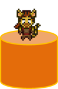
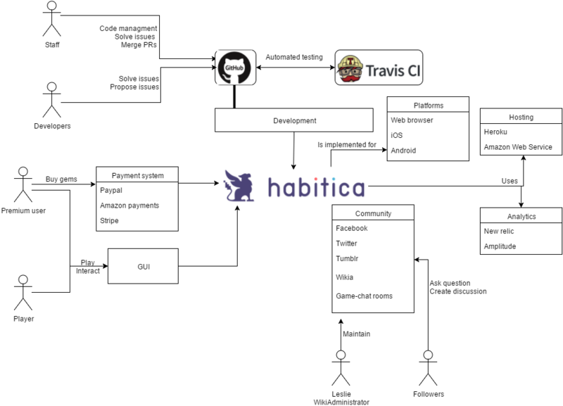

by Andrea Lorenzo Pallini, Philipp Kogelnik, David van Es, Jaroslav Ševčík

Delft University of Technology

----------

# Abstract

Habitica is an open-source, cross-platform, role-playing game. It is designed to gamify reality to help build positive habits and organize daily personal activities. The goal of this project is to analyze the architecture of the software from different viewpoints. At first, we give an analysis of the stakeholders involved and the context view of the system. Next we analyze the development and information view and identify technical debt. Then we perform a feature analysis and from this describe the variability. Lastly we look at the level of Internationalization present in Habitica. In conclusion, we share our experiences with contributing to the project and look to the future of Habitica.

# Table of Contents

1. [Introduction](#introduction)
2. [Stakeholder Analysis](#stakeholders)
3. [Context View](#context)
4. [Development View](#development)
5. [Information View](#information)
6. [Internationalization Perspective](#performance)
7. [Contributions](#contribution)
8. [Conclusion](#conclusion)
9. [References](#reference)

## 1. Introduction

In February 2012 Tyler Renell wanted to limit his personal consumption of cigarettes, beer, coffee, junk food and excessive internet use. As a gamer, he felt that he could combine his struggle to curb his bad habits and his love of video games. He started working on a program that would allow him to track his daily tasks, build good habits, and reward him for good behavior by treating life as a video game: thus Habitica was born. An early open-source version went live on GitHub at the beginning of 2013. Over time, as interest accumulated, the project grew and Tyler was joined by several other enthusiasts to form the core of Habitica's staff. To boost the project further, Tyler started a crowdfunding campaign and raised almost $50K - twice the target amount. Nowadays Tyler has accepted the CTO role, leaving the coding to others. Habitica is still going strong and growing, with an active developer community and hundreds of thousands of players.

Habitica is inspired by the popular fantasy role-playing game genre. When they first start the game, a new player creates an avatar, a virtual representation of themselves. By fulfilling user defined tasks, they are rewarded with gold and experience. This allows them to improve their avatar with new specializations, abilities, equipment or buy a cute pet. They can also form a party with other players to co-operate with them to fight terrifying monsters, like the infamous Basi-List, together. There are also many guilds which players can join to debate with like-minded Habiticans or get advice from more experienced players or even the staff members themselves. For a more exhausting list of game features visit their web page [[10]](#habitica).

## 2. Stakeholder Analysis

In this section we take a look at the people, systems and organizations involved in Habitica and categorize them according to the Rozanski & Woods book Software Systems Architecture [[1](#book)], with some additions. This book serves as the basis for most of the analysis we have done.
The stakeholder's names we use throughout the document refer to their in-game or GitHub nicknames.

### The staff

|||||||
|----------------|-----------------|----------------|---------------|--------------------|--------------------|
|Lefnire|Lemoness|Redphoenix|SabreCat |Paglias | Viirus |
|Original creator, CTO|Community manager, runs social media|CEO, legal| developer | developer | mobile developer |

The staff is the main organ of the Habitica project. They are responsible for decisions about the present and future, solving legal issues and raising the money for the survival of the game. The staff consists of the six people in the table above: Lefnire, Lemoness, Redphoenix, SabreCat, Paglias and Viirus. The particular relationships of the members to the types of stakeholders can be found in the next section.

### Stakeholders

| Role   |      Stakeholders      |
|----------|-------------|
| Acquirers | Lefnire (Tyler Renelle), Redpheonix (Vicky Hsu)  |
| Assessors | Redpheonix  |
| Communicators | Lemoness (Siena Leslie), Breadstrings, Alys |
| Support | Lemoness, Redpheonix, Alys, SabreCat (Sabe Jones), Viirus aka vliRuS (Phillip Thelen), Blade aka Crookedneighbour (Blade Barringer) |
| Moderators | Lemoness, Redpheonix, Alys, beffymaroo, Breadstrings, Cantras, deilann, Megan |
| Suppliers | MongoDB, ExpressJS, AngularJS, Heroku, Amazon Web Services |
| Developers, Maintainers| Lefnire, SabreCat, Paglias (Matteo Pagliazzi), Viirus, Blade, Alys, Lemoness |
| Users | General public, Companies, Premium users |
| Funders | Kickstarter backers, Donators, Premium users |

**Acquirers** oversee the procurement of the system or product. As the original creator of Habitica and founder of the Kickstarter campaign **Lefnire** can be classified as an acquirer. He was responsible for raising the funds required to make the entire project possible. When Lefnire became CTO of the project **Redpheonix** took up the mantle of main CEO.

Besides being the CEO Redpheonix is also the main **assessor** of Habitica. Assessors oversee the system’s conformance to standards and legal regulation. Redpheonix is the legal advisor who 'handles all of the terrifying paperwork and business planning'.

A very important group of stakeholders for satisfying existing user and the acquisition of new users are the **communicators**. They explain the system to other stakeholders via its documentation and training materials. There are several communication channels like wiki, Facebook, Twitter or email. The wiki page is the main channel used by Habitica for learning about the gameplay and introduce the project to new users and developers. Habitica is also a game with an emphasis on friendly social interaction. For this purpose, the in-game Tavern and the Newbies Guild in particular are also top learning resources, where new players can ask all the questions they want without fear of being ridiculed. The administrators of the wiki are the main communicators, as is the Habitica staff and all players who actively participate in the guilds.

The group of communicators is partially coupled with the **support** staff of Habitica. This group provides support to users for the product or system when it is running. Some of them are helping mainly with in-game content - Lemoness, Redphoenix, whereas others are focusing on technical issues - Alys, SabreCat, Blade, Viirus. It can be seen that Lemoness and Alys are reponsible for giving support to existing users and communicating the game to the outside. They use many different channels for communication like GitHub, in-game chat or email.

Another type of stakeholders related to the communication in the game are the **moderators**. This group supervises the communication in Habitica. They have the right to delete inappropriate posts. They are also recognized persons and their advice can have an influence on many staff decisions.

**Suppliers** for this project build and/or supply the hardware, software, or infrastructure on which the system will run. The software and technologies used to build Habitica are roughly divided into five sections: Server-side, Client-side, Testing, Services, and Other (mobile developing and GitHub).
External services like the hosting provider apply some constraints regarding availability to the project. Habitica has no internal hardware resources. For this reason, they highly rely on those external services. If there are downtimes at these services the Habitica system is not able to run any more.

Then there are the stakeholders who are responsible for implementing the features which should excite the users. The role of the **developer** is to construct and deploy the system from specifications and **maintainers** manage the evolution of the system once it is operational. Habitica is an open source project and the lines between the developers and maintainers are blurred. There is a core staff who is ultimately responsible for all these issues with their roles overlapping.
Habitica is based on a concept which potentially allows everyone to contribute to it and become a developer. However, some of the staff members and few others are the ones who do most of the work from designing, coding, testing to acceptance (merging of pull requests)[[4](#who)][[6](#staff)]. The team also manages the main evolution of the system, for this reason they also belong to the maintainers group. The staff members are not the only "good stakeholders"[[1](#book)] in the system, there are also a few very active contributors who support the staff in development and maintenance. They acquired information and experience during the collaboration period ("informed"), and have also acquired the responsibility to make important and difficult decisions with the right to speak on behalf of Habitica or merge pull requests ("committed" and "authorized").[[7](#guidelines)][[8](#moderators)] The developers responsible for accepting new contributions are the first five people in the table. Lemoness is the main pixel artist responsible for the appearance of the game.

Very important stakeholders for an exciting game are the **users** themselves. They are the people making use of the system, so the functionalities are designed to satisfy their needs. They also have the opportunity to request new features. The users come from the following groups: The public: people who may have problems with daily tasks, time management, bad habits and like fantasy RPG.  Companies: They can encourage(force) employees to use Habitica in order to increase their motivation and productivity. Families, health and wellness groups: leaders of these groups want to help their members change their behaviors. Premium users: users that want to support Habitica in exchange for in game currency.

The group of users highly overlaps with the **funders** of the project. Funders are users who support Habitica with spending money on the project. This includes all the people who backed Habitica through the Kickstarter campaign, the premium users and the donators.

### Power/Interest Graph
Each and every stakeholder has a different level of interest in the project, and a certain amount of power to influence it. The stakeholders can be categorized into the following four groups:

- __Low power and low interest__
 - The power of common users is limited but still they can convince the staff (through in-game chat or GitHub issue) to change or add functionalities.
- __Low power and high interest__
 - Premium users are very interested in Habitica, they are strictly involved in the game.
      Developers are active in discussions but they still need the staff approval.
- __High power and high interest__
 - The staff is part of this group.

*Figure 1: Power/Interest graph*

## 3. Context View

Habitica is reliant on and communicates with many different systems. The context view model gives an overview of the most important systems that Habitica interacts with. The purpose of this view is to see the big picture: how does Habitica fit in to the larger universe around it.

*Figure 2: Context Diagram*

A major platform for the development process is GitHub. It is used for code management, solving issues and merging pull requests for updates or bug fixes. GitHub is also used as a customer support platform: users with problems are encouraged to create an issue for any bugs or defects they may encounter while playing. TravisCI complements the functionalities of GitHub. It is used as a continuous integration platform and is the main platform for performing tests.

In addition to the GitHub issues a big part of the communication with the community goes through either in-game chat rooms, the wiki, or through their social media pages. Habitica has pages on Facebook, Twitter and Tumblr. In addition, Facebook is also used as a login provider, allowing users to use their facebook accounts.

Habitica uses Heroku and Amazon Web Service (AWS) as hosting service providers for the whole project to handle all 1,000,000 players. In the beginning they just used Heroku, but in the moment they are moving the project towards AWS. For tracking the performance of the system and the user interaction there are two service providers which are used in this project: New Relic and Amplitude.

Habitica also provides public API for the creation of external extensions. Therefore, there can be many external applications (like the Data Display Tool) interacting with the system. The exact nature of these interactions depends on the nature of the extension itself.

## 4. Development View

### Module structure model

The Development view attempts to capture all aspects of the system relevant to the development of the project.
Habitica is composed of two main components: the client-side and the server-side. These components communicate via an API provided by the server-side.

*Figure 3: Development view structure model*

The code on the server-side is divided into several layers and modules in accordance with the framework used (Express JS). In the “controllers“ layer there are mainly modules dealing with routing. In the “middlewares” layer there are modules dealing with preprocessing of requests and responses. In the third layer, “models”, there are the business logic, utility libraries, handling of database access and some shared resources useful for the multiple Habitica repositories. All the dependencies go in the direction controllers -> middlewares -> models.

The code on the client-side is divided as a pure MVC in accordance with the Angular JS framework. This pattern separates the view from the business logic, which increases the reusability of code. The “view” layer contains the Jade files. These files are compiled into the HTML code. We also added the filters scripts here, because they only transform the displayed data a little (for example displaying the date properly).
 The “controllers” layer contains one explicitly declared Angular JS module called habitrpg. All the other “modules” are defined as an extensions of it. These dependencies are omitted from the diagram for clarity. These modules are responsible for routing and dynamic rendering of the parts of the view.
The services represent the “model” layer here. They are substitutable objects used to share code across the application and they handle the communication with server-side.

### Common design model

There are some parts of the system where common processing rules are imposed. The first and probably one of the most important points from the perspective of the system users is the internationalization. All strings in the system must be localized and stored in the locale files in the directory "common/locales/<lang>".
Another principle of the project that can be seen after a closer look at the source files, is to use an existing framework whenever possible. If this principle is satisfied the developers can fully concentrate on the core features which cannot be covered with external libraries. For the database there should be model classes which are able to hold the data, store it and retrieve it.

The concrete implementation of external libraries should be hidden to the developers. In the project this is done with the facade pattern [[12]](#gof). This ensures that the developer can use the functionalities of external libraries without having to care for changes of the interfaces if one of the libraries gets exchanged by another one.
The logging part of the software is done with different logging providers. For this reason the common interface is not implemented as a facade, but as a mediator [[12]](#gof). The mediator aggregates the functionality of different logging providers and makes it easier to add new ones without influencing other parts of the code.

The most important design approach for the whole project is the usage of the model-view-controller (MVC) pattern.

There are also some parts of common software used in this project. For the separation of the layers on the client side the framework AngularJS is used. The database interaction with MongoDB is done with an object data mapper (ODM) called Mongoose. For the internal logging the Winston framework is used, which can be extended to log to many different destinations (database, plain text file, xml file, ...). For the internationalization part the self-written i18n functionality should be used. It parses the translations directory and stores the translations for the user language in the memory. This component ensures a fast retrieval time for the needed texts.

### Configuration strategy

There are several different approaches to configure the application. The more technical configurations like logging or choosing an analytics provider, that serves particularly to developers and operators, are managed via a configuration file or by commenting parts of code. The setting of user preferences is handled through a database variable that points to a relevant file on a disk. Then there are various intrinsic or third party extensions that are installed separately from the game, as a browser add-on, web page widget, bookmarklet or desktop application, and cooperate with it via provided API. Other types of extensions just amend the appearance of the web site without any direct interaction with it. They usually need the Stylish[[11]](#stylish) web browser add-on. To differentiate the appearance of the web application on desktop and mobile devices, CSS media queries and JavaScript conditions are used. Lastly, for some mobile devices (Android, iOS) there are native applications replacing the client side of the system completely. However, they lack many features of the web application (as of March 3, 2016).

As identified above, a variety of different mechanisms is used to add variability to Habitica. After a closer analysis of pull requests and issues on GitHub, we found that the variability mechanism didn't change over time, but it differs among different developers. Some configuration possibilities were not part of the initial versions, but were added in later stages of the development.

## 5. Information View

The purpose of any information system is to manipulate data in some form. Habitica stores data persistently in a database managment system using MongoDB. MongoDB is one of the most popular NoSQL databases.

*Figure 4: Static information structure model*

The diagram presented in Figure 4 shows the logical relationship between the principal entities in the game. The two main entities are the user and the task.

The user is personalized by the equipment chosen, the skills developed during the game and his own pets/mounts. Moreover, the user can create or participate in parties and guilds with their friends.

The tasks are the most important element in Habitica. Every user must complete them in order to increment his own game-level and earn gold. Each task is associated with a single user. Habitica gives the possibility to create challenges among the players. A challenge is a collection of tasks which are automatically assigned to all the participants.

However, the logical view mentioned above doesn't directly map to the database structure. It is partially because of the use of the NoSQL DB, which doesn't have a fixed structure. Another reason is the use of a second storage - a JavaScript file. We will explain the persistent representation of the main entities and the relationships among them.

In the database there are three core document types: User, Group and Challenge. The User document contains all of the information related to a concrete player. It contains the user information, tasks, customization references, gold, equipment, pet references, UI preferences, private messages, etc. The Group document represents all the parties and guilds with their chat logs and quests. The Challenge represents a group of tasks for the participants to fulfill, the list of participants themselves and the prize for the winners.

In addition to the database storage there is information stored in JavaScript files. In these files all of the various items and appearances you can have as a player are stored. For example, the equipment, spells, haircuts, etc. These items are then referenced from the database document.

### Notable Characteristics ###

#### How Habitica deals with old data ####

With the increasing number of users the staff of Habitica worked a lot on the improvement of server's performance. One key issue is the reduction of database storage requirement. This is the main reason why Habitica does not keep all historical data for all tasks. Instead, older data are averaged and only the average is included in the data exports (data export is a feature which allows players to retrieve data about completed Habits and Dailies, as well as personal user data). The further back in time the data goes, the more data is combined together into a single average. For example, a data export might include several data points for the current week, one data point for each of the previous few weeks, one data point for each of the previous few months, and only one data point per year for previous years.
As a (probable) side effect of this, when players examine their exported data for Habits, they will see at most one data point for each Habit per day, i.e. they will not see every click they made on the Habits' plus and minus buttons. This has been logged as issue 3079 but it is not currently known whether this behavior is deliberate or a bug.
In addition, for non-subscribers, completed To-Dos are automatically deleted after 30 days to regain database storage space. For subscribers, completed To-Dos are automatically deleted after 90 days.
If a player uses the "Delete Completed" button in the To-Dos' Completed tab, all completed To-Dos will be permanently removed.
Because older task history is severely limited, players who want to keep a full history of tasks should export their data regularly.

#### Static Information Storage ####

One of the most interesting parts in the information flow is the transfer of static information to the database. All information about equipment, quests, pets and spells is stored as JSON objects in JavaScript files which are located in */common/script/content/*. When a user buys equipment, the information from the file is set as a reference in the user's document in the database. For example if a user buys a new instance of a shield, the information of the shield is looked in the related JavaScript file. Then the identifier of the shield is copied to the database entry of the user. The identifier includes the class of the user (rogue, warrior etc.), the type of the equipment and a sequential number. The attributes of the equipment, like strength boost, are still looked up in the JavaScript file.

A similar process where the data is copied to the database entry of the user is the challenge system. A user can create a challenge which consists of different habits, dailies, todos and rewards. Other users can join these challenges and get the included tasks transferred to their personal task list. The challenges are stored in a separate document collection in MongoDB and include all the information which is needed. When a new user joins the challenge, the information from the challenge is copied to the database entry of the user. This means that the personal task is independent from the challenge task. There is just a reference to the challenge kept to keep track of the challenge progress.

## 6. Internationalization Perspective

In order for a system to become truly international it must not overly depend on any one language, country, or cultural group. Habitica is a game that could potentially be enjoyed by people from all cultures or different parts of the world. To make sure that the absolute widest range of people is targeted there are some common concerns that need to be looked at.

A place where a person interacts with the system is called a touch point. To obtain a good level of internationalization it is first necessary to go through the system and locate all the touch points. Then, for each touch point each concern can be checked. This gives a good indication of what the current level is and also how much work is yet to be done.

The concerns we will address are the support for the following items:

  - Multiple character sets
  - Differently oriented text presentation
  - Multiple languages
  - Different cultural norms (i.e. units of measurement)
  - Financial differences
  - Cultural neutrality

*Figure 5: Touch points*

### Touch Point Analysis

Habitica's main touch points are the game itself, the wiki, GitHub and Trello. For the game this would include all screens, buttons, pictures, dialog boxes etc.

The Wiki is available in six different languages: English, German, Spanish, French, Polish, Brazilian Portugese, and Russian. However, the English version contains much more information than the wiki versions offered in other languages. A lot of new users will come into contact with the Wiki and will use it to learn game basics. Therefore the most important pages, such as how to play guides etc., are given priority.

| Language  | Pages  (as of March 30, 2016)|
|---|---|
| English  | 576  |
|  German |  91 |
| Spanish  | 206  |
| French  |  141 |
| Polish  |  3 |
| Brazilian Portuguese  |  34 |
| Russian  |  143 |

The game itself offers support for a lot more languages. There are translations in 24 languages (including the much overlooked Pirate English), in various states of completion. In some cases the translators have not yet completely finished their work and the American English version overrules the translation. Also, as Habitica has frequent updates and on top of this also has seasonal in-game events, it is unlikely that the newest content will have been translated when it is just released.

The game and wiki all support multiple character sets and has no problem representing symbols such as icons or chinese texts.
Habitica tries to take into account different cultural norms. For example, the way dates are represented vary across the world and this can be customized to match the players preference.

The financial differences are not completely taken into account. The prices for gems are still all listed in American Dollars. However, these differences are mostly resolved through the use of the external payment providers PayPal, Amazon or Stripe which will automatically give the conversion.

For the developer side of things there are two main touch points: GitHub and Trello. Historically, English has been the go-to language in computer science related fields with the most popular programming languages using English naming conventions for keywords and the like. Likewise, in Habitica all the code is in English. Furthermore, all discussions, issues, bug reports and feature reviews are typically done in English.

Like with many open source projects getting things done essentially relies on enthousiastic hobbyists to put in the required effort. Such is also the case with all of Habitica's translations. That means that there is somewhat of a chicken and egg problem in that users of Habitica who would like to see it in their native language must first help to translate it.

## 7. Contributions

Habitica is a project which relies on help from external contributors. The manpower in the staff is limited, and they rely mainly on volunteers. For this reason, the staff is very welcoming when new people want to contribute. Work can be done in numerous different ways. Writers can update the wiki entries or translate the game in new languages. Designers can create new images for new equipment or pets. Software developers are able to create new features, fix bugs or contribute to the test coverage. But also people without knowledge in those areas can contribute to the project in suggesting new features or reporting bugs.

The main focus of our team is the software development part of Habitica. In the beginning it can be very hard to find a starting point for contributions in such a big project. Fortunately, the staff and main contributors of Habitica label all features according to their importance and complexity. With these labels we found some issues on which we could work on. We provided a pull request which got updated some days later ([#6736](https://github.com/HabitRPG/habitrpg/issues/6736)). We were added to the Hall of Heroes of Habitica and got the Tier 1 contributor award. This is a very interesting approach for motivating contributors and reward them for their work.

Our confidence grew after this first pull request and luckily we found our own bug in the project just a few days later. We opened the issues and started working on it by ourselves. A few days later our second pull request got merged ([#6740](https://github.com/HabitRPG/habitrpg/issues/6740)).

One big problem of the Habitica project is the low test coverage for client side code. According to coveralls.io, just 52% (as of March 30, 2016) of the code is covered by different tests. This could be a serious problem when new features are introduced, because nobody knows if the old features are still functional. For this reason, we wanted to create new unit tests for the project, to increase this metric. After a closer investigation of the project, we found some rudimentary experiments with end to end tests with the Protractor framework. Our focus switched a bit and we wanted to focus on creating a test suite which is based on the page object pattern [[9]](#pageobject). As of March 26, 2016, we are still working on the test suite to make it compliant to the testing strategy of the Habitica team. ([#6868](https://github.com/HabitRPG/habitrpg/pull/6868) and [#6876](https://github.com/HabitRPG/habitrpg/pull/6876))

## 8. Conclusion

In this project we have analyzed Habitica from a Software Architecture perspective. We have found that Habitica is built and maintained
by a core set of staff who fulfill multiple roles and are largely responsible for overseeing the whole project. Like many open source projects,
they rely heavily on external contributors: enthusiastic volunteers who are willing to help them fix bugs, add features, and help out in general.

The architecture is stuctured nicely into different layers with a single page application for the client side and backend services accessible through an API.
They develop the project using very flexible technologies that allow the developers to quickly make changes to existing features. For example the use of MongoDB and JavaScript. They also put great effort into making the
process of getting involved as easy as possible for new developers by using popular technologies and providing "Getting Started" guides. This was especially helpful to us as it allowed us to jump in without too much effort.

The biggest issue that we encountered was the low test coverage. Our group tried to improve this by adding our own end to end tests for the tasks page and the user customization features.

The future looks bright for Habitica. They are currently at the next stage of developement with the imminent introduction of the API v3. With this, and the increased focus on improving testing and code quality the overall quality of the application will likely become even better.

We are glad to have been able to get some insight into a big open source project and are very happy to have contributed to Habitica. We hope that Habitica continues growing and that thousands of players keep getting the most out of the gamification of life!

## 9. References

1. 
Nick Rozanski and Eoin Woods. (2011). Software Systems Architecture: Working with Stakeholders Using Viewpoints and Perspectives. Addison-Wesley Professional.
2. 
 Habitica staff. Guidance for Blacksmiths. http://habitica.wikia.com/wiki/Guidance_for_Blacksmiths, 2016
3. 
 Wikipedia. Habitica. https://en.wikipedia.org/wiki/Habitica, 2016
4. 
 Habitica staff. Staff presentation. http://blog.habitrpg.com/who, 2016
5. 
 Habitica staff. User plans. https://habitica.com/static/plans, 2016
6. 
 Habitica staff. Staff. http://habitica.wikia.com/wiki/Staff, 2016
7. 
 Habitica staff. Community guidelines. https://habitica.com/static/community-guidelines, 2016
8. 
 Habitica staff. Moderators. http://habitica.wikia.com/wiki/Moderators, 2016
9. 
Arie van Deursen. Beyond page objects. http://avandeursen.com/2015/06/25/beyond-page-objects/, 2016
10. 
 Habitica staff. Habitica. https://habitica.com, 2016
11. 
 Jason Barnabe. userstyles.org. https://userstyles.org/, 2016
12. 
 Gamma, E. , Helm, R., Johnson, R., Vlissides J.: Design Patterns: Elements of ReusableObject-Oriented Software. Addison-Wesley, 1996
