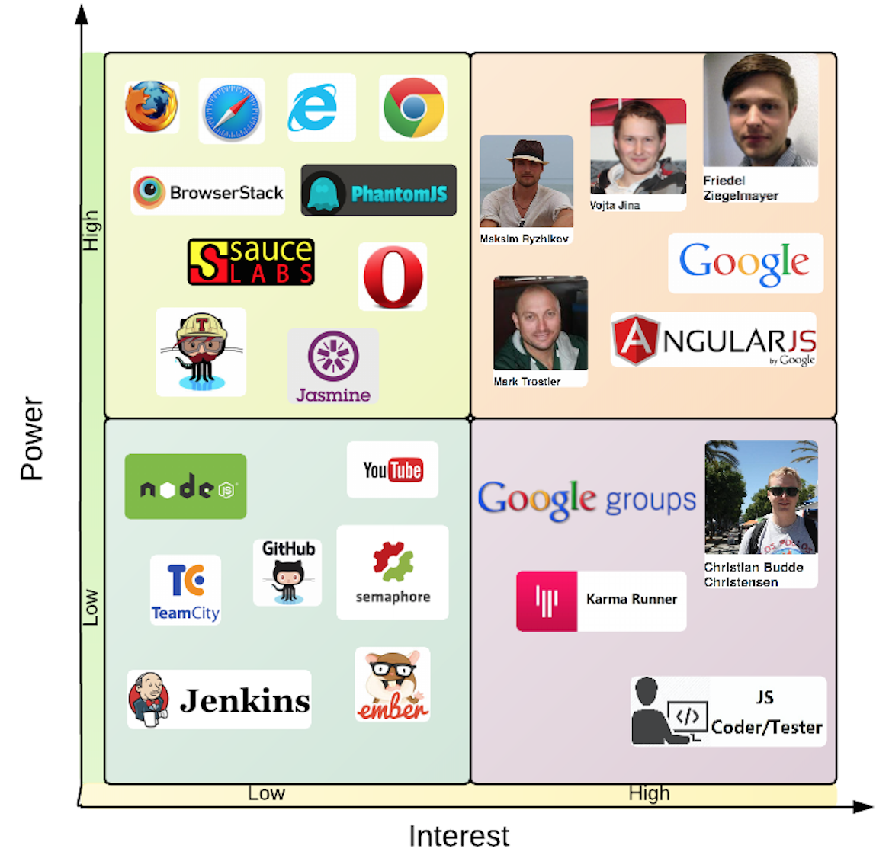
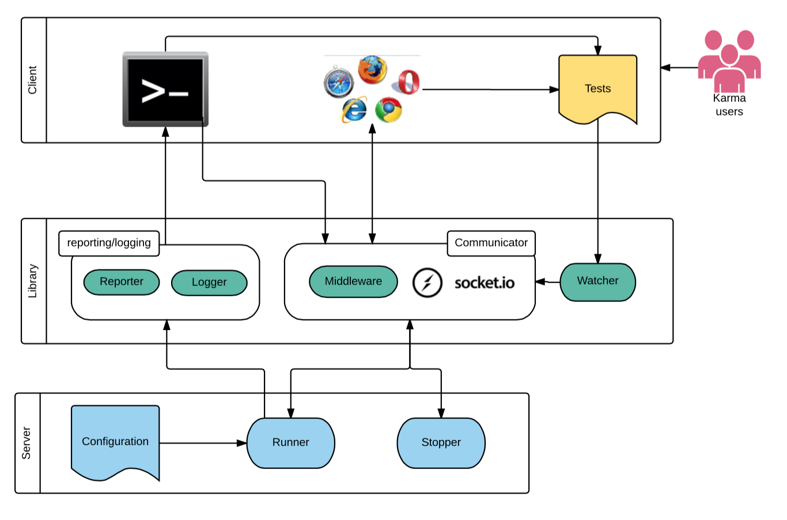
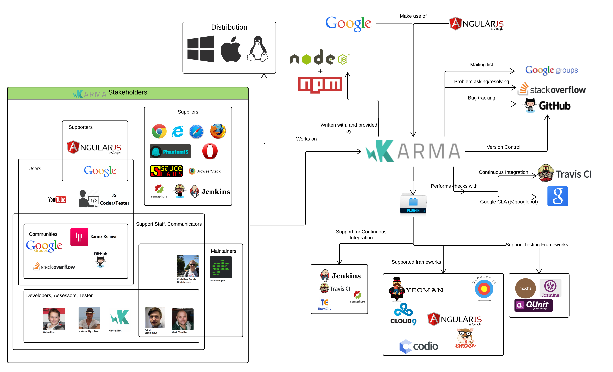
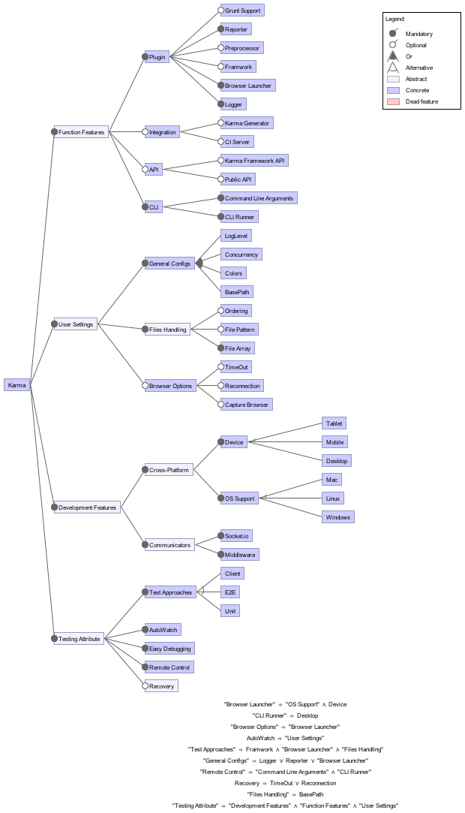

# Karma: the JavaScript test runner

**Figure 1.** *Karma Logo*

By: **[Lu Dai](https://github.com/ludai0106), [Wesley van der Lee](https://github.com/wesleyvanderlee), [Mourad el Maouchi](https://github.com/moumi)** and **[Liu Yiran](https://github.com/liuyiran13)**
 *Delft University of Technology, 2016*

##### Abstract
*Building online applications coincides with continuous testing. Testing these applications on all available browsers and platforms seems cumbersome. Karma stimulates Test Driven Development (TDD) of JavaScript applications by providing a productive testing environment where developers can just write the code and get instant feedback from their tests. In order to facilitate this environment a lot of logic requires to be implemented into the Karma system. This chapter studies the Karma system by discussing different viewpoints and perspectives on Karma’s environment and internal structure. We discovered that Karma has been built by a large community of developers, which now also includes us.*

##### Table of Contents
- [Introduction](#introduction)
- [What is Karma?](#what-is-karma)
- [Stakeholder Analysis](#stakeholders)
    - [Identification](#stakeholders-identification)
    - [Interests and Influences](#stakeholders-interests)
- [Environment Analysis](#context-environment)
    - [Internal Environment](#context-internal-environment)
    - [External Environment](#context-external-environment)
    - [Impact on the Environment](#context-impact)
- [Functionalities in Karma](#functional)
    - [Design Philosophy](#functional-design-philosophy)
    - [Functional Structure Model](#functional-model)
- [Variability](#variability)
    - [Main Features](#features-main)
    - [Relationships](#features-relationships)
    - [Strategy](#features-strategy)
- [Development View](#development-view)
    - [Modules](#development-modules)
    - [Code Standards](#development-standardized-design)
        - [Standardization of Design](#development-standardization-of-design)
        - [Standardization of Testing](#development-standardization-of-testing)
- [Technical Debt](#development-technical-debt)
    - [Management of Technical Debt](#development-debt-management)
- [Performance Perspective](#perspective-performance)
    - [Performance Model](#diagram-performance)
- [Conclusion](#conclusion)

## Introduction
Web applications have become a part of the average person's everyday life.
They fulfill an unlimited number of purposes, which may range from social interacting through invoicing or playing games.
Due to its flexibility and browser support, JavaScript has become one of the dominant languages to create these applications in.
Building online applications coincides with continuous testing and hence requires a way to easily enable a Test Driven Development (TDD) approach, to safeguard the correctness of the implemented applications.
This is where Karma comes into play.
Karma supports this TDD approach by providing a productive testing environment where developers can write the code and immediately see the test results.

In this chapter, we provide a comprehensive architectural analysis of the Karma system.
First, Karma is explained in short.
Next, relevant stakeholders and their interests will be identified.
Afterwards, the environment of Karma is discussed.
Next, the functionalities provided by Karma are introduced with afterwards the features supporting these features.
Moreover, a development view is provided with the technical debt for the system.
At the end, a performance perspective is provided with a conclusion regarding the architectural analysis.

## What is Karma?
Karma is *the Spectacular Test Runner for JavaScript*, which in essence is a tool that allows test execution, of JavaScript applications, in real browsers.
Karma itself is also written in JavaScript.
Karma started off as a [Master Thesis](https://github.com/karma-runner/karma/blob/master/thesis.pdf) project by [Vojta Jína], carried out at the *Czech Technical University* in Prague.

The main goal of Karma is to enforce TDD by providing a productive testing environment to developers.
In this environment, the developers should not have to set up tons of configurations, but rather a place where developers can write test code and get instant feedback from their tests.
Getting rapid feedback, is what makes a developer productive and creative at the end.

From the [official website] of Karma[[2](#official-site)], explaining the purpose of Karma:

**"Things should be simple. We believe in testing and so we want to make it as simple as possible."**

## Stakeholder Analysis
Stakeholders are an important element for every software system.
This also equals for Karma.
Within the Karma environment, there is a various amount of stakeholders.
Each of these stakeholders is concerned with one, or multiple, aspects of Karma.
To be able to understand the architecture and the current state of the Karma system, firstly, the stakeholders and their interests and influences are analyzed.

In the first subsection, the identified of the stakeholders is elaborated on.
Next, the interests and influences of those stakeholders are discussed.
In addition, we discuss the stakeholders in the early stage and in the current stage of Karma.

### Identification
Instead of identifying the stakeholders as individuals, they are grouped together and categorized.
The categorization is based on the 9th chapter produced by Rozanski and Woods [[1](#book)], which states that software systems have corresponding assessors, communicators, developers, maintainers, suppliers, etc.
In the following table, [Table 1](#stakeholders-table-1), the stakeholder types are provided with the corresponding stakeholders in Karma.

| Stakeholder Type   | Identified Stakeholders                                               |
|------------------- | ------------------------------------------------------------------ |
| Assessors            | This exists out of the community that discusses if an issue or pull request is in line with the standards. This can not be categorized to a few individuals, as the community is too large for this.   |
| Communicators        | [Friedel Ziegelmayer], with the help of the community.     |
| Developers            | There is a total of [219 contributors](https://github.com/karma-runner/karma/graphs/contributors) (as of 29th of March) of the Karma project. The main ones are [Vojta Jína], [Friedel Ziegelmayer] and [Christian Budde Christensen].     |
| Maintainers          | [Greenkeeper], [Friedel Ziegelmayer] and [Christian Budde Christensen]. Greenkeeper keeps updating plugin version, Friedel manages most issues and PRs and Christian was invited to become a maintainer due to his rich amount of contributions.     |
| Suppliers            | The compatible browsers, plugins and additional tools that Karma uses.     |
| Support staff        | [Friedel Ziegelmayer]. However, the community that uses and helps develop the project can also be seen as the support staff.     |
| Testers              | For every new feature, the developer who created that feature has to submit tests to it, before it gets merged. However, [Friedel Ziegelmayer] has the responsibility to create the main tests.   |
| Users                | There is a huge amount of users that make use of Karma. [jQuery], [AngularJS] and a lot of internal Google Projects use it. This has been told to us by Friedel.     |
| Community            | Two communities are present for Karma: [Karma Users] and [Karma Runner].     |

**Table 1.** *Stakeholders.*
 

### Interests and Influences
As mentioned before, Karma has started off as a Master Thesis project.
Hence, during the early development, the stakeholders of Karma differ compared to the current situation.

#### Early Stages
During the early stages of Karma, there were mainly *three* stakeholders.
One of which were the JavaScript developers the system was made for.
The other two stakeholders were Jína himself and his supervisor from the university.
In that stage, it was easier and relatively faster to make changes that satisfied all the needs of the stakeholders.
The JavaScript developers did not practice any influence to the development but were taken into consideration.
The supervisor, and Jína himself, were the only stakeholders with influences to the development of the system.
In the current stage, this is very different.

#### Current Situation
In the current stage, Karma is highly dependent on the open source community.
The stakeholders that perform a type of influence and have their interest in the system are identified in Table [1](#stakeholders-table-1).
The user community has a very high interest in the functional correctness of the system, as they primarily use it.
This user community exists from regular persons to entire organizations such as Google, with their AngularJS project, as some internal projects.

To depict the interest and influences of these stakeholders, they are best depicted in the form of a Power-Interest Grid (see Figure [2](#pid)).
This grid contains the important stakeholders and their interests in the system.

**Figure 2.** *Power-Interest Grid*

 
On the bottom-left corner of the Power-Interest Grid are tools that are used by Karma for the own development of it.
It is hosted on GitHub and uses Continuous Integration tools.
Next, in the top-left corner are the plugin suppliers which have low interest in Karma, but have high power.
This results out of the fact that Karma launches real browsers and makes advantage of various testing frameworks to execute the tests.
On the bottom-right corner, the general community and Karma users are depicted which has high interest, as they aid in the development and wanted tools, but do not have high power.
The last group, on the top-right corner, contains the main developers and the two organizations that have both high interest and high power.

## Environment Analysis
The stakeholders are identified with their corresponding interests and influences.
In this section the environment within and surrounding Karma is discussed to gain more understanding.
Next, the impact on the environment, during the development of Karma, is discussed.

In order to better understand the influences and impacts on Karma, or even from Karma on the surrounding environment, it is important to gain knowledge of what that environment consists of.
The environment analysis has been separated into two parts, the internal environment and the external environment.

### Internal Environment
The internal elements can be separated in three layers.
These layers consist of the *client*, *library* and *server* layer.
Below, the three layers are discussed.

- **Client:**

    Most user actions are available through the client layer where a user can carry out command line operations, web browser testing and debugging.
    The tests are performed in real browsers.

- **Library**:

    The library layer acts as a bridge, connecting the client and server.
    Karma uses a considerable amount of internal and external libraries to guarantee its performance.
    The reporter and logger provide relevant information and the gathered test results to the client.
    The middleware delivers the needs from the clients to the servers, such as informing the server to run, stop or perform a retry.
    Socket.io is one main external library used in Karma to guarantee web browser connection.
    The watcher keeps an eye on the files, specified in the configuration, and signals Karma to run with the help of the middleware once one of those files changes.

- **Server:**

    The Karma server controls, runs and stops processes.
    The runner can perform testing based on the configuration file or command line options.
    The latter are delivered by middleware.
    When the server runs, the library supports it with necessary files and the tests are run in the client layer.

[Figure 3](#internal-environment) depicts the internal environment of the Karma system.

**Figure 3.** *The Internal Environment*

### External Environment
In order to explain and depict the system's interactions with the external environment, a context model is made.
This model is used to explain what the system does, and does not do.
It presents an overall picture of the system’s interactions with the outside world, and summarizes the roles and responsibilities of the participants in these interactions.

**Figure 4.** *Context Model*

### Impact on the Environment
Now that is known what the overall environment consists of, the impact on the environment will be discussed.
The impact of the Karma's deployment on the aforementioned environment is addressed in this part.
According to *Rozanski and Woods*, addressing the impact on the environment includes:

1. Systems that contain dependencies on Karma and may require
    - functional changes,
    - interface changes,
    - performance improvements,
    - security improvements;
2. Systems that will be decommissioned as a result of Karma's deployment;
3. Any data that will be migrated into Karma.

The continuance of this subsection will discuss each of the aforementioned concerns regarding the impact on the environment.

- **Dependent Systems**

    Karma is a test runner which integrates testing frameworks.
    Especially for the purpose of continuous integration.
    Since Karma is often used as an end-to-end test runner (running independently of the rest of the framework), other systems do not depend on the way Karma works.
    Other systems integrate Karma by running the Karma program and edit Karma's configuration options, in order to have matching interfaces.
    As Karma provides this functionality, other systems are dependent on whether or not Karma will implement the configuration interface.
    This is the case for all levels of dependency: *functional*, *interface*, *performance* and *security*.

- **Decommissioned Systems**

    There are several possible scenarios where systems will be decommissioned.
    This might not always be the case, and when systems will be decommissioned due to a fault in Karma, it will be noticeable.
    Karma will not decommission many systems, because of Karma's end-to-end characteristics.
    Karma is well known for its enormous amount of plugins and its flexibility.
    So, it aims to prevent the decommissioning of systems.
    In case systems get decommissioned, this might have an (in)direct effect on the plugins and other functionalities within Karma.

- **Data Migration**

    With regard to data migration, Karma takes in JavaScript tests created by the end user.
    Since this type of data is often of a universal template, Karma does not influence, nor have a large impact on the way data is migrated into Karma.

## Functionalities
Karma's environment shows a large number of actors. Moreover, the previous section discussed several systems who are dependent on Karma or may even be decommissioned once Karma stops working. In order to understand more clearly on which processes are relied on by other systems, the functionalities of Karma will be discussed.
The main goal of a system can in general be derived from the sum of its functionalities.
The main goal for Karma is *"to bring a productive testing environment to developers"* [[2](#official-site)].
The central functional capability provided by Karma is, therefore, the ability to run different (types of) tests.
There exist five main functionalities which are identified, and elaborated on, in the following table:

| Functionality     | Description                                                   |
|------------------ | ------------------------------------------------------------- |
| Running tests     | The ability to run tests on a various amount of different browsers and operating system platforms.     |
| Remote control    | Controlling the entire workflow either through the command line or the IDE.     |
| Testing framework integration     | Integration with testing frameworks, which can be used to generate test descriptions. Some testing frameworks are: [Jasmine], [Mocha] or [QUnit].     |
| CI integration    | Integration with Continuous Integration servers like [Jenkins], [Travis] or [Semaphore].     |
| Easy debugging    | Possibility to directly debug, in an easy way, from the IDE (like [WebStorm]) or Google Chrome.     |

**Table 2.** *Functionalities and their corresponding description.*
 

### Design Philosophy
The stakeholders identified in the [environment analysis](#context-environment) should be taken in mind and continuously kept satisfied during the endless development cycle of Karma.
Each type of stakeholder has different requirements in terms of Karma's software architecture.
The stakeholders influence the design philosophy, which is translated in terms of design qualities and their appliance to the system.
These design qualities and their appliance are elaborated on in the following table:

| Design Quality           | Appliance                                                            |
| ----------------------- | ------------------------------------------------------------------ |
| Separation of Concerns  | Karma has been made in such a way that elements are separated from each other. In this way, elements can be grouped together depending on their task. The result is that it is much easier to support Karma. |
| Cohesion                   | The Karma system has a high cohesion available. The strength of the relationship between pieces of functionality within a given module is high. Within the middleware part of Karma, functionalities are grouped together since they all contribute to a single, well-defined task. |
| Coupling                | Karma provides the ability to create plugins for different tasks. This is done to ensure loose coupling between certain system components. Since the system is loosely coupled, it provides the ability to easier build, support and enhance the system.    |
| Functional flexibility  | With the functional capabilities in mind, it is difficult for Karma to have a high functional flexibility. It is the core of the system and the additional parts have been developed as plugins. Changing the functional elements would result in breaking (multiple) other components. |

**Table 3.** *Design qualities and their appliances.*
 

### Functional Structure Model

[Figure 5](#figure-5) depicts the functional structure model of the Karma system.
Different functionalities are illustrated as end nodes in the diagram, pointed to by an arrow.
These functionalities include, for example, the functionality of *CI Integration* or *Test Results*.
Different interfaces are required in order to reach a certain functionality.
These interfaces are either internal, provided by the Karma system, or external, provided by means of dependencies or separate installation.
One could, for example, clearly see that in order to gain CI Integration functionality, one requires the server-interface from within the Karma system as well as other external testing frameworks like [Jasmine] or [Cucumber].
These frameworks, are not provided from within the Karma system and are thus said to be external interfaces.

**Figure 5.** *Functional Structure Model*

## Variability
Features are needed to aid the existence of the main functionalities of Karma.
These features do not only aid the functionalities, but may also affect the variability and flexibility of the system.
In order to identify the variability of the system, these features are required to be identified at first.
With these features, it is possible to deduct the flexibility of the system.
The variability aspects described in this section, all aim to keep the technical debt as low as possible.

### Main Features
The main advantage of using Karma as a test runner is to gain instant testing feedback from test code,
while in the meanwhile, freedom on customizing Karma is also allowed to fit the user's preferences.
The most important features are listed below in Table [4](#main-features-table).

| Feature            | Description                                                      |
| ------------------ | ---------------------------------------------------------------- |
| Cross-Platform     | Karma is platform independent and hence supports different OS (Windows, Linux, MacOS)and devices (desktop, mobile, tablets ). |
|  Plugin            | Many external products (browser-launchers, testing frameworks, preprocessors, reporter, etc.) can be integrated with Karma via plugins, which maximizes Karma's abilities. |
| Configuration      | Configuration enables customize Karma's running behaviors. In this file, users specify wanted plugins, customize browser options, decide how to handle testing files and basic settings like color of logging information etc.  |
| CLI                | Karma can be run directly through the command line and command line arguments have ability to overridden settings predefined in the configuration file.  |
| Public API         | Karma API provides users the ability to call Karma programmatically from different Node modules and in the meanwhile enable users to write customized plugins to connect existing testing libraries.  |
| Easy Debugging     | Debugging directly from Chrome or your IDE via WebStorm. After each modification users can see the test output directly in the IDE and do not need to switch to the terminal. |
| Auto Watch         | Karma triggers tests automatically once a file is saved w.r.t corresponding changes. It enables automatic debugging and provides real-time test results to users. |
| Test Approaches    | Client, unit and e2e tests approaches help users focus on certain aspects they want when performing tests.  |

**Table 4.** *Features with their corresponding description.*
 

### Relationships
Sometimes one feature can not arise without the existence of another feature or features.
This generates feature dependency or even feature interdependency.
A dependency in Karma is the browser-launcher, which relies on the type of operating system and corresponding devices.
The easy debugging attribute depends a lot on the Chrome-launchers and IDE-plugins.
Remote control is realized in the existence of CLI and other IDE(s).
Recovery feature appears partially due to the reconnection and timeout features of browser setting.
Other than these, much more of such situations are detectable in the case of Karma.

Considering the respectable amount of features, the most important features are classified into four categories according to their properties with relation to their relationships.
The classification consists of: *development features*, *function features*, *user settings* and *testing attributes*.
Most of the identified features and their relationships are illustrated in the feature model below.

**Figure 6.** *Feature Model*

### Strategy
In order to flexibly provide these features to the large number of individual preferences originating from different kinds of developers, Karma is highly configurable. Karma also integrates with popular continuous integration packages and has excellent plugin support.
Karma's success is mainly due to its variability, configurability and thus its flexibility.
To be able to keep this up, a strategy is of importance to apply to the system to keep it successful.
Below, three aspects are summed up which aid this variability, configurability and provide the flexibility which aid this strategy.

- **Configuration File**

    Users of Karma are able to modify the configuration file to fit their needs.
    This configurability ranges from changing a port number to the plugins used within the system.
    There are mainly five sections of the configuration file that influence the configurability of Karma the most: *testing framework*, *preprocessors*, *browsers* and *files handling*.
    The configuration file exists with default values set which are changeable.
    Karma extracts this information and applies it throughout the system, without any further need of modification.

- **Plugin**

    As aforementioned, Karma provides the ability to use plugins in the system.
    This provides variability to the users of the system.
    The wanted plugins are set inside the configuration file and loaded at the start of Karma.
    Depending on the functionality of the plugins, they are loaded at the appropriate parts of the system.
    A simple example is the use of a different browser.
    This is loaded as a plugin, and in case it is found, that browser is also run during the testing process.

    Note: It is advised to perform an `npm install` to install plugins which are not present yet.

- **Design Patterns**

    To provide users with more variability, Karma provides some files which can be specialized by means of inheritance.
    In the Karma project, these files, or variable functions, start with the word `base`.
    An example of such a file that can be used to apply inheritance on, is the *BaseReporter*.
    The use of inheritance in the project makes it possible for users to specify in more depth what they need.
    In case a certain file/module does not provide the needed functionality, this makes it easier for them to change.
    Especially the messages, output by Karma, can be changed easily in this manner.

## Development View
Now that a higher overview of Karma is gained, this section dives deeper into the development process.
Complex systems such as Karma are often built in several modules.
These modules are organized in a specific way.
This section addresses the aspects which support the software development process
and starts first of all by identifying all different modules and lastly provides a discussion on the existence of code standards.

### Modules
Karma consists of a large number of different source files, which for maintainability have been logically organized into several different modules.
The following modules have been identified in Table [5](#table-modules).

| Module         | Description                | File amount | Size (bytes) |
|-------------   | -------------------------- |-------------| ------------ |
| Runner         | Makes it possible to run Karma from the command line | 1 | 50 |
| Client         | Provides the client shown to the user when Karma starts | 7 | 11k |
| Documentation  | Documentation of the Karma project | 29 | 80k |
| Library        | Overall library | 49 | 142k |
| Library - General | Provides general functionality for the server, loading plugins etc.  | 28 | 100k |
| Library - Initialization | Questions regarding for the installation of Karma (the configuration) | 3 | 8k |
| Library - Launcher       | Contains parent launchers, these can be extended for custom launchers | 4 | 9k |
| Library - Middleware     | Creates the communication for the Karma client. Serving files and proper setup of the HTML-pages. | 7 | 20k |
| Library - Reporter       | Reporters for the Karma client. Both for tests and the debug view. | 7 | 8k |
| Node Modules   | Contains all the modules used by Karma. E.g. test frameworks, browser launchers, server sockets etc. | N/A | N/A |
| Static         | Static HTML-files shown in the browser. | 4 | 11k |
| Tasks           | Provides initialization for the development environment and ability to perform *grunt tests* | 2 | 2k |
| Tests          | Contains the tests for Karma | 77 | 250k |
| Tests - Client | Client tests and the karma configurations. | 6 | 23k |
| Tests - Unit | Unit tests for specific parts of the system. | 33 | 21k |
| Tests - E2E  | End-to-end tests for expected behavior and data integrity. | 36 | 205k |

**Table 5.** *Modules of Karma.*
 

All modules contribute to the end-to-end functionality and, therefore, require interconnection.
The following figure, Figure [7](#module-structure-model), shows Karma's Module Structure Model.
Within this figure, the interaction between these modules is depicted.

**Figure 7.** *Module Structure Model*

### Code Standards
With the aforementioned modules, what kind of standards does Karma apply to its development process?
Most software systems, and especially systems that rely on the open source community, are developed by multiple people rather than individual persons.
In order to collaborate effectively, it is best practice to adhere to standardized key aspects of design and testing.

#### Standardization of Design
Most of the functionality of the Karma system is implemented using three layers, as seen in Figure [3](#internal-environment).
Karma's main functionality is running tests as Karma is called a *test runner*.
The tests are specifically run on the server, whereas the results are all reported to one main client, which prompts the user with the test results.
The bridge is provided by the library layer, which is in essence the backbone of Karma.
So, this layered approach is a standardization of their design.

#### Standardization of Testing
Karma uses three general approaches to test Karma's internal functionality and integrity.
The test approaches are: *client*, *unit* and *e2e* (end-to-end). Certain frameworks have been used, which each enforce some standardization of test implementation.
Table [6](#standardization-testing) summarizes these test components.

| Approach    | Framework             | Explanation                                             |
|------------ |-----------------------|---------------------------------------------------------|
| Unit        | [Jasmine] and [Sinon] | Small tests, testing low-level method functionality.    |
| Client      | [Jasmine] and [Sinon] | Larger tests, testing higher-level system functionality.|
| E2E         | [Cucumber]            | Full feature tests.                                     |

**Table 6.** *Standardization of Testing in Karma.*
 

## Technical Debt
With knowledge of the development view, the existence of technical debt can be analyzed.
Software developers sometimes derogate quality in order to ship changes fast.
This always leads to technical debt, because the future effort is required in order to recover the initial quality.
As can be deducted from the section about [variability](#variability), this all helps to reduce the technical debt.
The following section describes how the technical debt can be managed especially for Karma.

### Management of Technical Debt
In order to manage the technical debt, while also reassuring code quality,
Karma's issues and pull requests on GitHub [[3](#karma-issues-page), [4](#karma-pull-page)] have been studied.
By assessing this, each task has a brief description of the technical change to be made, why this technical change is important for the project and in which part of the code the technical change has to be performed (if known).

According to Frank Buschmann's, To Pay or Not to Pay Technical Debt [[5](#buschmann)], one could either *repay the debt*, *converse the debt* or *pay the interest*.

Which option to choose should be decided by the stakeholders, since we need to see the project in business perspective and consider many aspects.
In the case of Karma, the third option is adopted in general: **pay the interest**.
Karma relies on the developers in the open-source community to solve issues and provide pull requests.
However, not all the bugs in issues are solved by developers, some of the issues are actually solved by users and some of the issues are just left there unsolved.

Throughout the issues of Karma, the general choice of implementing new features is done by is by providing a clean and smart solution.
This takes longer, but makes changes easier in the future [[6](#martin-fowler)].
An example of such a situation is issue [#1976](https://github.com/karma-runner/karma/issues/1976).
To solve this issue, it is "quite intricate and will involve a good amount of changes inside the code base" [[7](#issue-1976)].

So, to manage the technical debt, Karma focuses on keeping the variability within the system and take their time to implement new features to have a good solution.
There may exist many issues and PRs for Karma at the moment, but this is done to have the best solution for the issue.
This will keep the technical debt as low as possible.

## Performance Perspective
With all the previous sections in mind, this section aims to analyze Karma's performance in terms of possible workload and how Karma handles increased processing volumes.
To be more precise, this section includes performance analysis on the most valuable components of the system.
Below, five elements are summed up which encapsulate concerns regarding the performance of a system [[1](#book)].
Next, Karma is put to a test to deduct and visualize the response time to create a performance model.

- **Response Time**

    One of the main issues for a JavaScript developer is the time of testing.
    This often takes several minutes which slows down the developer in his process.
    This results in a long and ineffective process.
    One of the goals of Karma is to tackle this problem.
    Thus, fast-speed has become one of the main properties of Karma as it provides instant feedback to users.
    This is further discussed and depicted in the following subsection.

- **Throughput**

    Throughput is defined as the amount of workload the system is capable of handling in a unit time period.
    Throughput and response time have a complex interrelationship in most systems and so it is in Karma.
    In general, the shorter transaction processing time in Karma, the higher the throughput Karma can achieve.
    This is an important aspect as it influences the speed of the amount of tests capable of being run.

- **Scalability**

    Scalability is the ability of Karma to handle the increasing and short burst of workload.
    This may be due to an increase in the number of files or an increase in the complexity of tasks.
    Since Karma watches the files and performs tests the moment they have been changed/saved, this makes the workload not so high and aids the scalability of the system.
    Furthermore, Karma is able to run browsers concurrently, spreading the workload.
    This all aids the scalability aspect of the system.

- **Predictability**

    In a system, predictability is also of importance.
    Regardless of when a certain task is executed, the task should execute in a very similar time.
    This is the case for Karma.
    However, during the first initial run of Karma, it seems that little is cached, resulting in the fact that it takes a longer time than subsequent runs.
    This, in overall, makes the system predictable.

- **Hardware Resource Requirement**

    With much flexibility, Karma works on multiple platforms (Windows, Linux, Mac etc.).
    The tests can even be captured on several hardware components, such as the desktop, mobile, tablets etc.
    This has an effect on the throughput and the response time of the system.
    Nevertheless, Karma aims to keep this cross-platform functionality going and makes sure to have it working on the most known platforms.

### Performance Model
The model below shows the most valuable work components within Karma.
In order to elaborate on the performance more precisely, tests have been carried out to get the response time data on different functional parts.
From Figure [8](#performance-model) can be seen that most steps in Karma have an 'instant' response time, which are usually within 2 seconds.
As aforementioned, the first run of Karma takes more time, probably because nothing has been cached in memory yet.
Furthermore, the reporter may take up to 5 seconds due to the length of reports.
The overall performance, in terms of response time, can all be seen in the figure.

**Figure 8.** *Performance Model*

## Conclusion
The main goal for Karma is to bring a productive testing environment to JavaScript developers.
The environment being one where they don't have to set up loads of configurations, but rather a place where developers can just write the code and get instant feedback from their tests.

The number of stakeholders in Karma is quite big, but there are only a few developers that frequently work on karma.
The feature of Karma is abundant due to its rich number of configuration files, this character offers the user various choices and makes Karma one of the most popular JS test runners.

Karma is the preferred test runner for projects written with [AngularJS] and is well on its way to larger acceptance within the JavaScript community.
Its plugin architecture makes it easily adaptable to other test suites and reporters, all of which add value to the core of Karma.
In agile or continuous integration environments, Karma shines as an indispensable tool to development teams, providing an easy and reliable way to modify existing code and craft new code.

In conclusion, with its amount of functionalities, variability, low technical debt and the great performance, it is a great tool to achieve the goal it was made for.
To bring a productive testing environment to JavaScript developers.

## References
1. 
Rozanski, Nick, and Eóin Woods. Software systems architecture: working with stakeholders using viewpoints and perspectives. Addison-Wesley, 2012.

2. 
The official Karma website: http://karma-runner.github.io/

3. 
 Karma's issue page: https://github.com/karma-runner/karma/issues

4. 
 Karma's pull request page: https://github.com/karma-runner/karma/pulls

5. 
Buschmann, Frank. "To pay or not to pay technical debt." Software, IEEE 28.6 (2011): 29-31.

6. 
Fowler, M. (2016). Martinfowler.com. Retrieved 27 March, 2016, from http://martinfowler.com/bliki/TechnicalDebt.html

7. 
Ziegelmayer, F. (2016). Retrieved 27 March, 2016 from https://github.com/karma-runner/karma/issues/1976#issuecomment-194349020

<!-- Team members -->
[Mourad el Maouchi]:https://github.com/Moumi
[Mourad]:https://github.com/Moumi
[Wesley van der Lee]:https://github.com/wesleyvanderlee
[Wesley]:https://github.com/wesleyvanderlee
[Lu Dai]:https://github.com/ludai0106
[Lu]:https://github.com/ludai0106
[Liu Yiran]:https://github.com/liuyiran13
[Liu]:https://github.com/liuyiran13

<!-- GitHub users -->
[Friedel Ziegelmayer]:https://github.com/dignifiedquire
[dignifiedquire]:https://github.com/dignifiedquire
[Vojta Jína]:https://github.com/vojtajina
[Maksim Ryzhikov]:https://github.com/maksimr
[Mark Trostler]:https://github.com/zzo
[Greenkeeper]:https://github.com/greenkeeperio-bot
[Karma Bot]:https://github.com/karmarunnerbot
[Christian Budde Christensen]:https://github.com/budde377
[cafesanu]:https://github.com/cafesanu
[brunoqc]:https://github.com/brunoqc

<!-- System Links -->
[official website]:http://karma-runner.github.io/0.13/index.html
[Karma page on GitHub]:https://github.com/karma-runner/karma
[Jenkins]:http://jenkins-ci.org
[Travis]:https://travis-ci.org
[Semaphore]:https://semaphoreci.com
[PhantomJS]:http://phantomjs.org
[Jasmine]:http://jasmine.github.io/
[Sinon]:http://sinonjs.org/
[Cucumber]:https://cucumber.io/
[jQuery]:https://jquery.com/
[AngularJS]:https://angularjs.org/
[WebStorm]:https://www.jetbrains.com/webstorm/
[Mocha]:https://mochajs.org/
[QUnit]:https://qunitjs.com/

<!-- General Links -->
[Karma Users]:<https://groups.google.com/forum/#!forum/karma-users>
[Karma Runner]:<https://gitter.im/karma-runner/karma>
[contributors page]:<https://github.com/karma-runner/karma/graphs/contributors>

<!-- Karma Issues-->
[(#1705)]:https://github.com/karma-runner/karma/issues/1705

<!-- Misc. -->
[instrumenter.js#L596]:https://github.com/gotwarlost/istanbul/blob/master/lib/instrumenter.js#L596

<!-- Amount of words -->
[words]:4898
