#Mopidy – An extensible music server

**By [Yuzhu Yan](https://github.com/yuzhuY), [Lina He](https://github.com/linahe93), [Yuchen Huang](https://github.com/OSerHuang), [Chang Yan](https://github.com/mokieyue)**

*Delft University of Technology*

<div id="Abstract"></div>
##Abstract

Mopidy is an extensible music server written in Python. In this research, the software architecture of Mopidy is analyzed through the stakeholders and various viewpoints including the context viewpoint, developer viewpoint and deployment viewpoint. Sequentially, the perspectives of variability and usability are provided to address the quality properties, which will have a positive impact on the improvement of Mopidy. From the analysis of viewpoints and perspectives, it can be seen that Mopidy, as an open source API, still need to be enhanced.

##Contents

* [Introduction](#introduction)
    * [General Understanding](#general-understanding)
    * [Specific Understanding](#specific-understanding) 
   
* [Stakeholder Analysis](#stakeholder-analysis)
    * [Types of Stakeholders](#types-of-stakeholders)
    * [Power-Interest Grid](#power-interest-grid)
 
* [Context Viewpoint](#context-viewpoint)

* [Developer Viewpoint](#developer-viewpoint)
    * [Module Organization](#module-organization)
    * [Common Design Model](#common-design-model)
    * [Codeline Organization](#codeline-organization)
    * [Technical Debt](#technical-debt)
 
* [Deployment Viewpoint](#deployment-viewpoint)

* [Variability Perspective](#variability-perspective)
    * [Feature Identification](#feature-identification)
    * [Feature Relationships](#feature-relationships)
    * [Binding Time](#binding-time)
    * [Evolution History](#evolution-history)
  
* [Usability Perspective](#usability-perspective)

* [Conclusion](#conclusion) 

* [References](#references)

<div id="Introduction"></div>
##Introduction

Mopidy is an extensible music server.  It allows users to connect their favorite MPD or web client to the multiple cloud services like Spotify, SoundCloud and Google Play Music. The users can add new music source easily and control the music from any phone, tablet, or computer.

Team-Mopidy, from the Delft Students on Software Architecture group (DESOSA 2016), has analyzed the architecture of Mopidy based on the theory about software architecture over the past few weeks. From these analysis, we want to do some contribution to the development of Mopidy. This chapter is divided into various viewpoints and perspectives about Mopidy. First of all, there is a brief introduction about Mopidy from general and specific understanding.

###General Understanding

No matter frontends or backends, so far, there are more than 10 extensions for Mopidy. With the help of extensions, music from cloud service, like Spotify, SoundCloud, and Google Play Music can be easily added. Through Vanilla Mopidy, music from your local disk and radio streams could also be enjoyed.


*Cloud services of Mopidy*

**Mopidy is just a server**

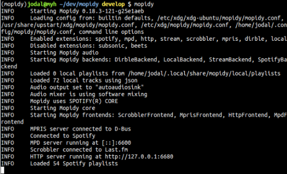
*The Interface of Mopidy*

As an application written in Python, Mopidy not only have network connectivity, audio output, but also support multiple operating systems and device, from linux, Mac OS X to Raspberry Pi. 
Out of box, Mopidy takes a role of server for MPD and HTTP. Additional frontends for controlling Mopidy can be installed from extensions.


**Everybody uses their favourite client**


*Clients of Mopidy*

You are not just a beneficiary, but also a contributor. You and people around you could connect their favorite MPD or web client to the Mopidy server to search music and manage playlist together. 
By making use of a browser of MPD client, which is available for all popular operating systems, control music form any phone, tablet or computer is not a imagination any more. [[1](#doc)]

###Specific Understanding 

The main function of Mopidy is to make multiple frontends capable of using multiple backends. The overall architecture of Mopidy as shown below is organized based on the frontends and backends. 

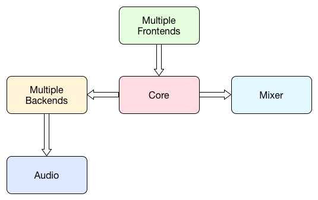
*Architecture of Mopidy*

The multiple frontends present the resource from Mopidy to user. They can implement a server for protocols such as HTTP, MPD as well as MPRIS. The core contains several controllers for different functionalities. The core actor gets the requests from the frontends and calls out to one or more backends. The responses from backends will be combined into a single response and sent to the requesting frontend. In this way, the multiple backends are able to work as one. Another function of the core is keeping track of the tracklist. In the backends, there are a set of providers having different functionalities to provide various music sources.  Additionally, the audio is built around GStreamer for backends to play audio. Mixer is used for the volume control.[[1](#doc)]

<div id="Stakeholder-Analysis"></div>
##Stakeholder Analysis
 
###Types of Stakeholders

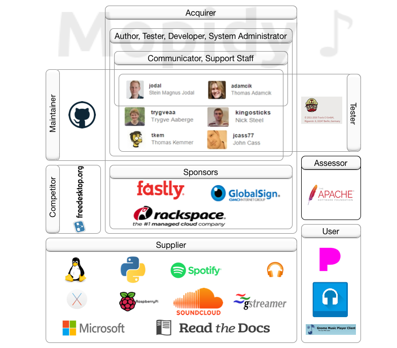
*Stakeholders of Mopidy*
 
Mopidy is developed, maintained and tested by [Mopidy Group](https://github.com/orgs/mopidy/people) mainly composed by 8 people. They made great contributions and gave life to Mopidy. They are not only the authors of Mopidy, but also the acquirers and administrators. Some of them [@Jodal](https://github.com/jodal) and [@Adamcik](https://github.com/adamcik) also play the role of the system communicators and supporting staffs. Mopidy got sponsored by Fastly, GlobalSign and Rackspace. Also Mopidy is assessed by Apache which supports a number of open-source software projects. Mopidy has many suppliers such as raspberry pi, Spotify and SoundCloud. Furthermore, Mpd clients and Mpd graphical clients are its main users.

### Power-Interest Grid

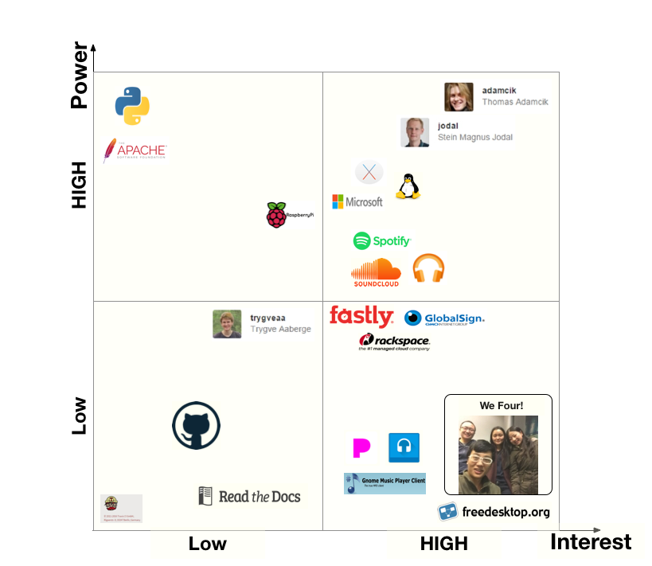
*Power-Interest Grid of Mopidy*

Given the power and interest in Mopidy, the stakeholders are prioritized as shown in the Power-Interest grid. In this figure, the high power and interest stakeholders like Jodal and Adamcik are placed on the top right, while stakeholders with both lower power and interest including some of the testers, maintainers and suppliers are in the bottom left corner. Other places in this grid show stakeholders with either high power or high interest such as our four team members who has high interest but low power in Mopidy.

<div id="Context-Viewpoint"></div>
##Context Viewpoint
  
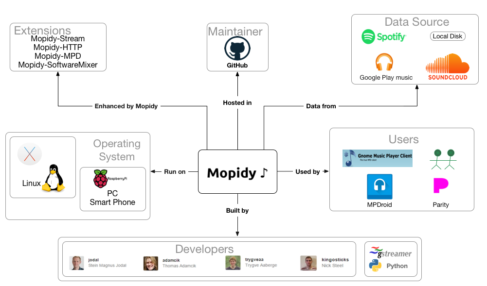
*Context Viewpoint of Mopidy*  

Mopidy is a completely open source project and GitHub is the main platform in which the Mopidy is developed. Like any project hosted in GitHub, the developers come from everywhere as long as they are interested in Mopidy and are willing to contribute. Developers who has made great contribution to the project may be invited in the Mopidy member team. Those people are the core developers of the Mopidy. Mopidy originally supports local disk and Spotify, other stream source and additional functions can be achieved by some third party extensions. As an open source project, users can easily download the source code and build the program from GitHub. Not only personal users, there also some software, such as Parity, use the code from Mopidy project with their own UI. Mopidy can run on PC with OS X and Linux, the support for Windows and smart phones is also on the way. Competitors like PulseAudio from freedesktop.org can also provide the similar function.  

<div id="Developer-Viewpoint"></div>
## Developer Viewpoint

When developing the system, the Mopidy developers have to consider a lot, such as the code structure, dependencies, configurations, constraints and design standards, to ensure the integrity and feasibility of the system. In this part, there is an analysis about the development architecture of Mopidy during the whole development process.

### Module Organization

Before writing the source code, the developers will consider the element of Mopidy to form an extensible music server. In this part, the module organization is introduced to achieve the main functionalities of Mopidy. 

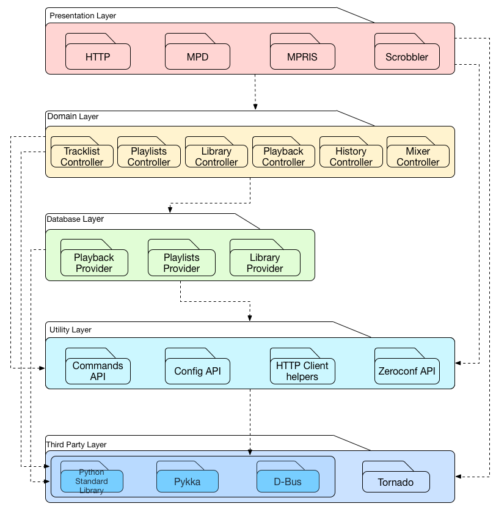
*UML Module Structure of Mopidy*

The module structure of Mopidy is presented as a UML package diagram. In this diagram, there are five layers from presentation layer to third party layer. 

- Presentation Layer: The presentation layer is the frontends directly providing the resource for user and can implement server for protocols such as HTTP, MPD as well as MPRIS.

- Domain Layer: The domain layer contains several controllers for different functionalities like keeping track of the tracklist and etc.  

- Database Layer: In the database layer, there are a set of providers having different functionalities to provide various music sources. 

- Utility Layer: The utility layer contains many modules used by other layers. 

- Third party layer: The third party layer has several platforms which are imported to achieve the a set of functionalities. 

The before-mentioned five layers depend on each other to some extent. The layers connected by arrows mean that the dependency of modules in these layers are allowed, for example, the modules in presentation layers are allowed to depend on the utility layer, domain layer and third party layer.  

#### Common Design Model
 
Define a set of design constraints that apply when designing the system’s software elements helps increase the system’s overall
technical coherence and makes it easier to understand, operate, and maintain. It can reduce risk and duplication of effort by 
identifying standard approaches to be used when solving certain types of problems as well. The definition of common design 
model can be specialized into three parts: common processing, standard design approaches and common softwares.

#### The Common Processing

Standardizing how the system logs messages and handles configuration parameters can significantly simplify its administration.
Common processing provides a standard approach across all system elements that can benefit a lot and directly contributes to 
the overall technical coherence of the system. 

##### Message Logging

- Use _mopidy_ _–v_ or _mopidy –vv_ or _mopidy –vvv_ to print debug log. All three options will give you debug level output from Mopidy and extensions, while _–vv_ and _–vvv_ will give you more log output from their dependencies as well.
- The console log always based on log level, defaults to true
- The _config file_ that overrides all logging config values. The _console format_ used for informational logging. The _debug format_ used for debug logging. See the [Python logging docs](https://docs.python.org/2/library/logging.config.html) for details on the format.
- The file to dump debug log data to when Mopidy is run with the _mopidy –save-debug-log option_. It will save the log equivalent with _–vvv_ to the file _mopidy.log_ in the directory you ran the command form.
- During development or debugging, the _loglevels_ config section can be used to change the log level for specific parts of Mopidy. But each key in the config section must match the name of a logger. The value is the log level to use for that logger, one of _debug_, _info_, _warning_, _error or critical_
- During development or debugging, the _logcolors_ config section can be used to change the log color for specific parts of Mopidy. Each key in the config section should match the name of a logger. The value is the color to use for that logger, one of _black_, _red_ , _green_, _yellow_, _blue_, _magenta_, _cyan_, _white_.

##### The Configuration

For the initialization, Mopidy has a lot of config values you can tweak, but you only need to change a few to get up and running. When you have created the configuration file, open it in a text editor, and add the config values you want to change. You can see the config by typing _mopidy config_. All extensions bring additional configuration values with their own defaults. You can check the core config, logging config, audio config and proxy config and change them as you want. All configuration sources are merged together to show the effective document. 
For termination and restart of operation, Mopidy has its commands on mopidy and commands on extensions.

#### The Standard Design Approaches

#####Standardization of Testing

Mopidy has quite good test coverage, and all new code going into Mopidy are advised to come with tests. Mopidy team provides many effective and practical test tools. “tox”, for example, a command that could run all tests, including all branches and pull requests. This is the ultimate test command before pushing to Github. Pytest as a test runner suffices people who want just want to run a test in a single directory to save time. And with the help of the pytest-cov plugin, you can even check ten slowest tests with aim of speeding up. All the codes modifications are welcomed written in the suggesting [code style]( https://docs.mopidy.com/en/latest/codestyle/#codestyle). As a convenience, Mopidy team also provides a directory named tests on Mopidy Github root directory. Developers could see detailed test in this file.

###### Testing Tools

Testing tools which are available for Mopidy includes: Travis CI, Tox, pytest, flake8.


### Codeline Organization

As an open source project, it is highly important to keep the source code in order so that other developers can easily understand and make contribution to it. 
Codeline organization is considered to be the way to store source code in a directory structure, managing it via configuration, building and testing the system regularly. 
Testing and configuration has been discussed in the previous model, this part is mainly focused on the source code structure and the build and release regulation.  
  
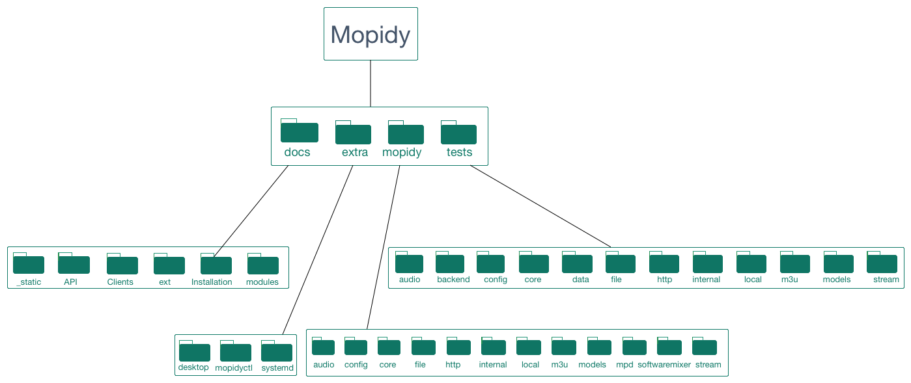
*Codeline Organization of Mopidy*
  
Under the root directory, Mopidy is divided into four subdirectories, docs, extra, mopidy and tests respectively. 
The docs folder contains the reStructuredText files for manuals and other important information. 
The manuals are also separated to different folders according to their content. 
The mopidy subdirectory contains the source code for the actual implementation of the Mopidy server. 
As we have discussed before, Mopidy is well organized by dividing its functionalities into different modules. 
The structure of the mopidy subdirectory is also based on the modulation of the whole system’s design. 
Each module has its own directory to store its source code. 
This keeps all the source code in order and makes it easier for developers to analyse each module. 
The tests folder is also parted to subfolders. Each of them only tests its counterpart under the mopidy folder.  
  
As Python is an interpreted programming language, Mopidy is not necessary need to be built before it gets released. 
Developers, as well as users, only need to type the command mopidy, then the system will be automatically built and run. 
  
In order to reduce the project’s dependency on key individuals and to automate the process, release procedures are well defined:   

  1.	Update changelog and commit it.  
  2.	Bump the version number and update the test case.  
  3.	Merge the release branch into maser.  
  4.	Install/upgrade tools used for package.  
  5.	Build package and test it manually in a new virtual environment.  
  6.	Tag the release.  
  7.	Push to GitHub.  
  8.	Upload the previously built and tested sdist and bdist_wheel packages to PyPI.  
  9.	Merge master back into develop and push the branch to GitHub.  
  10.	Make sure the new tag is built by Read the Docs, and that the latest version shows the newly released version.  
  11.	Spread the word through the topic on #mopidy on IRC, @mopidy on Twitter, and on the mailing list.  
  12.	Update the Debian package.  
    
### Technical Debt
 
During the process of software development, there will be more or less some work which needs to be completed before a particular job but is neglected by the developers. These neglected work will cause plenty of technical debt which will block the development of the project. Actually, there are many causes of technical debt like the business pressures and lack of understanding. We believe that some technical debt may be caused by Mopidy developers, so in this section we use a tool to identify the technical debt in Mopidy.[[4](#td)]

####Technical debt involved in Mopidy
We examined Mopidy code files by using SonarQube, an open source software used for quality management. Whenever a code violates basic rule of the programming language, SnoerQube propose an issue. By using this software, we received the following results.

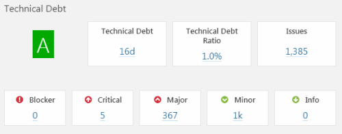
*Technical debt illustration*

From above consequence, we can see there is no blocker in Mopidy codes. Five critical issues are showed, which are caused by rename aiming for avoiding misunderstanding. Class methods lead to major issues. Furthermore, minor issues are raised up due to rename methods. Luckily, technical debt ratio is showed as 1.0%, which means Mopidy is well-organized and maintained.

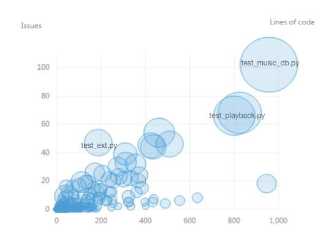
*Technical debt of files*

One circle represents a file of Mopidy. The size of circle represents the number of issues in a file, which means, the more issues exist, the larger circle is. The horizontal axis stands for lines of code in a file. So we can conclude that the top right circle should contain highest number of issues and largest amount of codes. This circle is the file of test\_music\_db.py, which includes 57 lines of code, 102 issues and 25 hours technical debt. 

<div id="Deployment-Viewpoint"></div>
## Deployment Viewpoint

According to the definition in book "Software Systems Architecture", the definition of deployment viewpoint describes 
the environment into which the system will be deployed, including the dependencies the system has on its runtime environment.

So far, Mopidy is supported by the following operating systems, Debian/Ubuntu, Arch Linux, OS X, Raspberry Pi. For Debian/Ubuntu, the packages of Mopidy are built for:

- Debian wheezy (oldstable), which also works for Raspbian wheezy and Ubuntu 12.04 LTS.
- Debian jessie (stable), which also works for Raspbian jessie and Ubuntu 14.04 LTS and newer.

The packages are available for multiple CPU architectures: i386, amd64, armel, and armhf. For Arch Linux, package size of Mopidy 2.0.0-2 is 3.0MB, the installed size is 9.6MB. Mopidy runs on all versions of Raspberry
Pi. However, note that Raspberry Pi 2 B’s CPU is approximately six times as powerful as Raspberry Pi 1 and Raspberry Pi Zero,
so Mopidy will be more joyful to use on a Raspberry Pi 2. Furthermore, in order to ensure the developers know what software 
will be available for them and to make the system administrators know what needs to be installed and managed on each piece of 
hardware, third-Party Software requirements must be clearly identified. The dependencies of Mopidy varies from different operating systems. All of these information is showed in the following table.

<p align="center"> Table1 The operation systems and third-party software</p>

|Operating Sytems     		| Third-Party Software | 
| -------------		|-----------	|
| 	Debian/Ubuntu	|GStreamer, Gst-plugins-ugly, Gst-python2|
| Arch Linux | 	gst-plugins-good, gst-plugins-ugly, gst-python2, gstreamer,  python2, python2-pykka>=1.1, python2-requests, python2-setuptools,  python2-tornado>=2.3, mopidy-mopify (virtual) (optional) - Web client with Spotify-inspired interface,  mopidy-scrobbler (virtual) (optional) - Last.FM scrobbler,  mopidy-soundcloud (virtual) (optional) - Soundcloud backend,  mopidy-spotify (virtual) (optional) - Spotify backend,  python2-sphinx (make)|
| OS X	|	Xcode, XQuartz, Homebrew, Python| 
| Raspberry Pi|GStreamer, Gst-plugins-ugly, Gst-python2	|  

<div id="Variability-Perspective"></div>
## Variability Perspective

As an extensible music server written in Python, developers of Mopidy devoted all their attention to attract different clients and people who are using different kinds of devices, in a range of Linux, Mac OS X, Raspberry Pi, normal people, music fans etc. As a result, developers must take variability as an important element into account when they are designing and developing this API. 

### Feature Identification

The Mopidy, as a music server, can be divided into some modules and each module has plenty of features for different types of stakeholders. In this part, the features of Mopidy are identified.

- Frontends：Mopidy provides many API for different types of frontends like HTTP, MPD, MPRIS and Scrobbler. The user can set up the API configuration about the specific frontend to make Mopidy suitable for this frontend. For example, The Mopidy-HTTP can be used for a web client to control Mopidy through HTTP and WebSockets. The features in frontends are mainly related to the Mopidy user such as MPDroid and Partify.

- Core：The core contains several controllers for different functionalities. The core actor gets the requests from the frontends and calls out to one or more backends. It has many configurations for user to control the paths and the tracklist length. 

- Backends：In the backend module, there are a set of suppliers like local, Spotify, stream and Soundcloud providing various music sources. These music sources can connect Mopidy and user can configure many parameters. 

- Audio: The audio is the interface around GStreamer for some specifc cases. The default playback provider is used when the backend is able to simply set the URI of the resource. But sometimes for example the raw audio data is delivered outside of GStreamer, the audio is needed to execute some additional functions. Furthermore, The audio is able to control the volume of default mixer. 

- Logging：Logging is used for user to inspect the running status of Mopidy. There are many parameters can be set up to change the attribute of console log, debug results and get the configuration file.

- Proxy：It is used for users or suppliers on locked down networks. So far not all parts of Mopidy and Mopidy extensions respect the proxy server configuration. 

- Language and OS：The language feature for Mopidy is English. It is relevant to all stakeholers. And Mopidy is compatible for two operation systems(OS): Linux and MAC OS X. This feature is bound up with the suppliers.

### Feature Relationships

Product line is defined by its features. Their relationship and a specific product is identified by a subset of features, this process is called a feature selection. Generally, there could be many possible limitations when the developers are defining feature selection. The constraint of feature selection named feature dependency. As a result, we define a feature selection is valid if and only if it fulfills all feature dependencies. After identifying basic feature dependencies, subsets of features can be decided, from which we can derive the feature model which can be regarded as a formalism to describe features and their constraints[[3](#fosp)]. 

For Mopidy, we did domain analysis and derive the following domains: operating system(OS), language, frontends, core, backends, audio, logging and proxy. We derive the following _Feature variability model of Mopidy_ and constructed it by FeatureIDE.

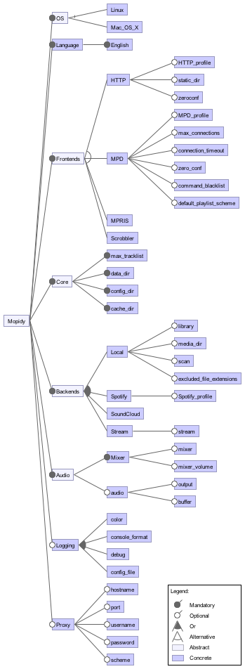
*Feature Variability Model of Mopidy*

_Notes_: In order to make the model concise, well-organized and accommodate more information, we use summarized feature instead of a class of features. 
- feature _debug_ indicates debug\_file and debug\_format
- feature _HTTP__ _profile_ indicates hostname and port
- feature _scan_ indicates scan\_format, scan\_flush, and scan\_follow\_symlinks
  
### Binding Time

Like we introduced above, Mopidy can run on different systems and devices. This really offer great convenience for users, however, conflicts, lack of hardware and many other issues emerge. So how Mopidy cope with incompatible problems is a critical point for Mopidy development. Luckily, so far, these variabilities are solved during Build Time.


####Build Time

A feature during Build Time means it can be regarded as a static binding. This is because it occurs before run 
time and remains unchange throughout program execution. Examples of this are OS and frontends for Mopidy. An operating system
should be determined before installing Mopidy, and can never be changed during the run time unless you use it on another device or install Mopidy again. It is similar to frontends. Compared to OS, you have more options of frontends and it is more flexible because it is unecessary to uninstall Mopidy if you want an alternative frontend. The only thing you need to do is adding some configuration in the configuration file of Mopidy like the code fragment1. But it have to be noticed that this feature can only be initialised during build time.

```

[http]
enbaled=true
hostname = 127.0.0.1
port = 6680
static_dir =
zeroconf = Mopidy HTTP server on $hostname

```
_Code fragment 1: Shows the variable features during build time._

It can be seen that _http/enabled_ decides if HTTP extension be used or not. And the hostname listens on IPv4/IPv6 loopback interfaces. And http/port shows which TCP port the HTTP server should listen to. The developers of Mopidy deprecated _http/static\__ _dir_ and said this will be removed in a future version of Mopidy. For the last item, _http/zeroconf_, means the name of the HTTP service when published through Zeroconf. The variabiles _$hostname_ and _$port_ can be used in the name.

Similar to frontends, Mopidy also provides multi functions. Through modifying configurations in configuration file of Mopidy, user can combine different functions and get a 'Unique Mopidy'. And users can also set different configurations in logging file to select partial logging information. All above mentioned features only work after restarting Mopidy. So we define these as build time variabilities.

It is interesting that the relationship of cost and the variability is like, a trade off. Developing the simplest system probably costs less at start because the system is simpler and quicker to deliver, but each later change is likely to cost more because developers have no existing mechanism for implementing the change. How to balance the cost and variable features is obviously the most important issue which need to be concerned about during the development of Mopidy.

### Evolution History

The evolution history of the variability mechanism and configurable features is summarized based on the changelog provided by the Mopify document. The version history of Mopidy is showed in the following picture.[[1](#doc)]

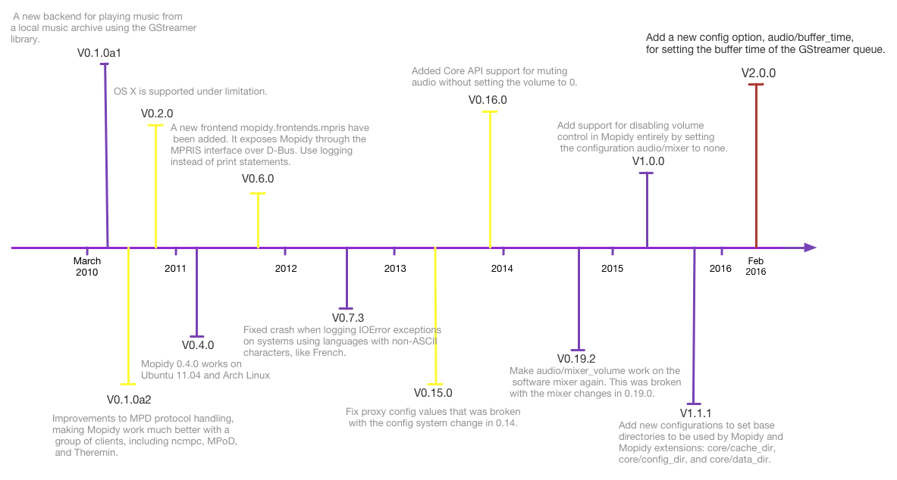
*Mopidy version history*


Pull requests and issues show a power influence when deal with the variability of the Mopidy project. For example, in issue [#1409](https://github.com/mopidy/mopidy/issues/1409) and pull request [#1442](https://github.com/mopidy/mopidy/pull/1442), a bug was caused by the fixed buffer size and now the buffer size is configurable. Another example is, in pull request [#901](https://github.com/mopidy/mopidy/pull/901), the compatibility issues of Python 3 were almost fixed, users now can build Mopidy by Python 3 instead of the old version. This is also a response to issue [#779](https://github.com/mopidy/mopidy/issues/779).

<div id="Usability-Perspective"></div>
## Usability Perspective

The usability perspective mainly focus on the end users of the system and any others who interact with the system directly or indirectly [[2](#swa)]. 
The usability cannot be ignored for the implementation and development of a system. It significantly affects the usage experience of the users and other interactors. 
In Mopidy, the users, maintainers and suppliers are relevant to the usability. 
Taken these stakeholders into consideration, the usability of Mopidy is analyzed in this part for the sake of efficiency of the interactions. 

The first step for the usability perspective is to identify touch points. Touch points are the places for people to interact with the system. Mopidy is a server to connect multiple backends and the frontend. So users interact with Mopidy only through the terminal in OS X or Linux as Figure[The Interface of Mopidy](#the-interface-of-mopidy) shown. 

The users can operate Mopidy in the terminal by many commands to achieve [install](https://docs.mopidy.com/en/latest/installation/), start, stop the system and etc. They can also [change the config values](https://docs.mopidy.com/en/latest/config/) directly in the configuration file named mopidy.conf to set up Mopidy like hostname and other parameters of each modules. And users can [run mopidy](https://docs.mopidy.com/en/latest/running/) or [run Mopidy as a service](https://docs.mopidy.com/en/latest/service/).

Mopidy is an internal system, which is tightly to be controlled and managed. It can only be operated through commands on the terminal. So the users should know how to operate the OS (Operating System) in the terminal. It is not easy for the majority of people because people are accustomed to use graphical user interface like Windows. This will have a significantly negative impact on the usability of Mopidy.

<div id="Conclusion"></div>
## Conclusion 
Mopidy is a server to allow you to play music from local disk, Spotify, SoundCloud and other sources. This project started at 2010 and the development of Mopidy is completely based on GitHub. With more and more people contribute to Mopidy, now it has evolved to the version v2.0.0. Although the active evolution makes Mopidy increasingly powerful, it is still far from completion. A lot of functions which are originally intended to be added in are still empty. And also, the compatibility becomes a severe problem. Deprecated APIs cannot be removed due to the extensions which are still using them. All these problems give us opportunities and challenges to provide our contribution to Mopidy.  

<div id="References"></div>
## References

1. <div id="doc"/>Stein Magnus Jodal, Johannes Knutsen, Thomas Adamcik. [Mopidy documentation](https://www.mopidy.com/)

2. <div id="swa"/>Nick Rozanski, Eoin Woods. [Software Systems Architecture](http://www.viewpoints-and-perspectives.info/)

3. <div id="fosp"/>Sven Apel, Don Batory, Christian Kästner, Gunter Saake. [Feature-Oriented Software Product Lines](http://link.springer.com/book/10.1007/978-3-642-37521-7)

4. <div id="td"/>D. Sculley, G. Holt, D. Golovin, E. Davydov, T. Phillips, D. Ebner, V. Chaudhary, M. Young, and J.-F. Crespo. "Hidden technical debt in machine learning systems". In Neural Information Processing Systems (NIPS). 2015.
