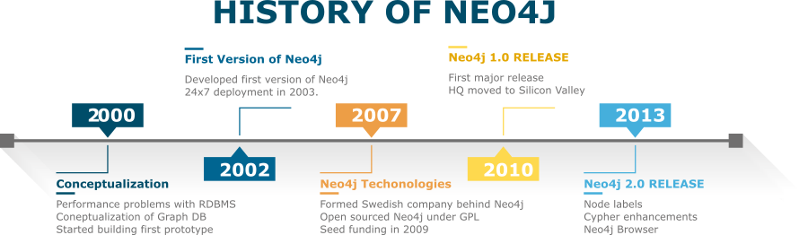
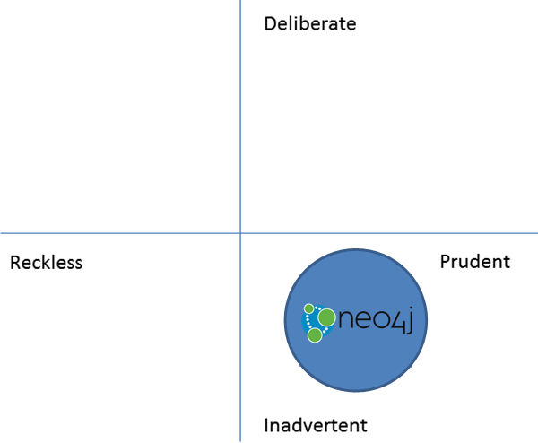
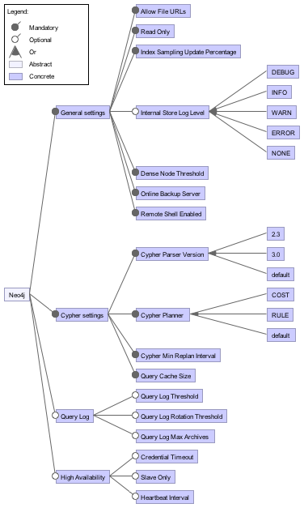
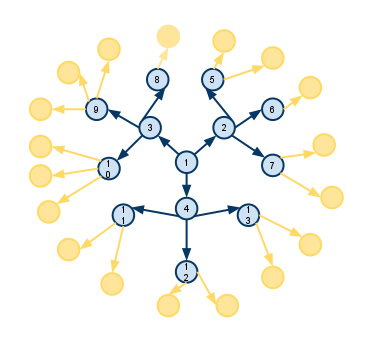
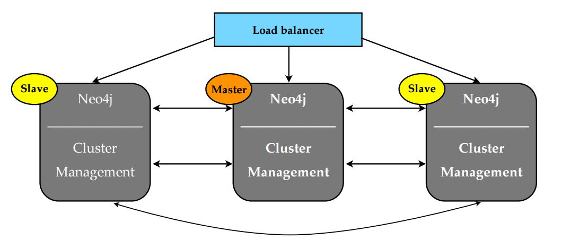

# Neo4j - A Graph Database

[](http://neo4j.com)

**[Kangliang Chen](https://github.com/kangliangc), [Manoj Krishnaraj](https://github.com/manojklm), and [Tom Peeters](https://github.com/tompeeters368)**

*[Delft University of Technology](http://tudelft.nl)*


**Abstract**

This chapter gives a brief overview of Neo4j's architecture by focusing on three fundamental concepts: stakeholders, viewpoints, and perspectives as defined in the book by Rozanski and Woods[1]. The stakeholder analysis section details the types of influencer's who have an impact the Neo4j's architecture. The context view explains the interactions between Neo4j and its environment; the development view and deployment views describe the software development process and the runtime environment respectively. Following this, the evolution, variability, performance & scaling perspectives of Neo4j are analyzed. Through these multiple viewpoints and perspectives, the software architecture of Neo4j can be easily discerned.


## Table of Contents

* [Introduction](#user-content-introduction)
* [Stakeholder analysis](#user-content-stakeholder-analysis)
* [Context View](#user-content-context-view)
* [Development View](#user-content-development-view)
* [Deployment View](#user-content-deployment-view)
* [Evolution Perspective](#user-content-evolution-perspective)
* [Variability Perspective](#user-content-variability-perspective)
* [Performance and Scalability Perspective](#user-content-performance-and-scalability-perspective)
* [Conclusion](#user-content-conclusion)
* [Bibliography](#user-content-bibliography)


<div name="introduction"></div>
# Introduction 

In the early 2000s the scalability of relational databases hit a ceiling, further increases in performance became difficult. These performance problems led to the conceptualization of graph database by its creator, Emil Eifrem, on an airplane flight. As in a graph structure, graph databases use nodes and edges to represent and store data. Semantic queries can be easily performed as the data stored in the nodes are interconnected with related nodes via edges. Neo4j is based on the above principles of a graph database. Neo4j is named after the Latin word for new (neo) and is partly inspired by the character, *Neo*, in the movie *Matrix*. The first version of graph database was deployed in 2003 and its source was made public in 2007. The important milestones in Neo4j's history are depicted in [Figure 1](#figure-history).


<div id="figure-history"></div>
	Figure 1: Timeline of important events in Neo4j's history

Neo4j is an open source, NoSQL graph management system written using Java and Scala. [Neo Technologies](https://neo.com) sponsors and oversees the development of Neo4j and has a huge influence on its development roadmap. Neo4j is one of the very few ACID compliance NoSQL databases as it uses a proprietary, labeled property graph data model to represent and store data both in memory and at the storage level. 

Some use cases for Neo4j include fraud detection, analytics, social networks, recommendations, scientific research, and routing. Since being made open source in 2007, the popularity of Neo4j has increased steadily and has been downloaded more than a million times. Well written guides, video tutorials, and online documentation makes it easy for new developers to adopt Neo4j. The following sections in this chapter will give insights into Neo4j's architecture and will help in the transition from a user to a contributor.

<div name="stakeholder-analysis"></div>
# Stakeholder Analysis 

"A *stakeholder* is a person, group, or entity with an interest in or concerns about the realization of the software architecture of a system.[1]" This section indentifies the important stakeholders who have a profound impact on the development of Neo4j followed by an analysis of their associated levels of power and interest.

The main stakeholder is [Neo Technology, Inc.](http://neo.com) The organization and its employees exclusively fulfill the roles of four of the eleven classes of stakeholders defined by Rozanski and Woods[1]:- **Assessors, Acquirers, Communicators, and Maintainers.** The most important decisions including architectural design, roadmap, releases are authoritatively taken by [the leadership team](http://neo4j.com/staff/) of Neo Technology, Inc. spearheaded by its CEO, [Emil Eifrem](https://twitter.com/emileifrem). The other stakeholders applicable to Neo4j are listed in [Table 1](#t1) and [Figure 2](#figure-stakeholder)

Stakeholder   | Description
---------|-----------------------------------------------------------
**Developers and Testers**|Most of the developers and testers are the employees of Neo4j. Employees of major customers including Google, ThoughtWorks, GraphAware are among the top contributors and focus on contributing to specific features to fulfill their requirements. The individual users are more adept at raising concerns and fixing minor bugs.
**Suppliers**|Though Neo4j supplies the software packages for deployment as downloads, other suppliers provide the whole infrastructure as a service. GrapheneDB specializes in the delivery of managed deployments of Neo4j suitable for most end users. IaaS providers like Heroku, Microsoft Azure supply solutions tailored to meet large scale deployments of Neo4j
**OEM Partners**|OEM partners specialize in design, optimization and delivery of both the hardware and software together. The solutions provided by the OEM Partners offer the best performance.
**Support**|Neo Technology's [customer support portal](https://support.neo4j.com/access/) provides support for licensed customers. Free support is extended to all via [Stackoverflow](http://stackoverflow.com/questions/tagged/neo4j) and [Google group](https://groups.google.com/forum/#!forum/neo4j)
**Users**|The users are anyone who uses the graph functionality of Neo4j. The broad spectrum of users includes individual software developers, students, educational institutions, government organizations, and enterprises including Linkedin, Walmart, eBay, and Cisco.

    Table 1: Other stakeholders of Neo4j.


<div id="figure-stakeholder"></div>
	Figure 2: Stakeholders for Neo4j

The power interest graph depicted in [Figure 3](#figure-power-interest) gives a visualization of the measure of the power that a stakeholder wields in the system compared to their interest. The bottom-left quadrant has the least power and interest where as the top-right quadrant has the most. The remaining quadrant on top-left and bottom-right bias towards more power and interest respectively.

As the major stakeholder, Neo Technology, Inc. has the most power and interest. Though the OEM Partners and the Suppliers have slightly lesser interest and power, they are still placed in top-right quadrant along with Neo4j. The enterprise customers are vital for the success of Neo4j and have high power with relatively low interest and are placed in the top-left quadrant.

The end users of the system and DevOp specialists have considerably low power and interest and are placed in the bottom-left quadrant. The bottom-right quadrant consists of occasional contributors from the community, regular contributors with relatively more power than the occasional contributors and the competitors. Though the competitors wield no power, their interest is very high as they do regular market and competitor analysis to keep in line with Neo4j's new features.


<div id="figure-power-interest"></div>
	Figure 3: Power/Interest grid for Neo4j

<div name="context-view"></div>
# Context View 
The context view describes the relationships, dependencies, and interactions between the system and its environment. To this end, this section will determine the scope of Neo4j, analyze the external entities and services that interact with it and finally visualize the relationships uncovered.

<div name="system-scope"></div>
## System Scope 
Databases are used by virtually every company to securely store information in a scalable manner. As databases are set up entirely by the users according to their own needs a database must be able to fulfil many different functions.  
In order to be competitive to widely-used existing databases, such as MySQL, Neo4j must be able to meet their standards. However, Neo4j must also provide something that other databases do not. Neo4j does this by utilizing its graph database structure in order to model relationships and store inconsistent data types in far more effective manners.  
Thus, the scope of Neo4j is to provide unique capabilities and performance in regards to relationship modelling and inconsistent data type handling, as well as providing all functionalities already present in existing databases.

<div name="external-entities-and-interfaces"></div>
## External entities and interfaces 
Neo4j is a fast growing database software with a dedicated company, Neo4j Technologies, sponsoring its development. As can only be expected, there are many external libraries and systems in use to assist in the development and a great deal of interest from third parties. Additionally, Neo4j has many challenges it must live up to as it needs to support a multitude of operating systems and greatly varying requirements. Below, we detail these relationships and visualize them in [Figure 4](#figure-context-view).

- Written in Java and Scala using Eclipse and IntelliJ

- Built using Maven and continuous delivery using TeamCity

- GitHub is the platform used for hosting and maintaining the source code as well as the tracking of issues

- Supports distributions for Windows, Linux & OS X

- Technical help for Neo4j use is supplied on StackOverflow, but developers can also be reached on Slack or even Twitter

- Neo4j has support for drivers in various programming languages including Java, JavaScript, Ruby, Python and .NET

- Dependence on libraries such as JUnit, Mockito, Jetty and Guava, AngularJS, Grunt, Bower, D3.js

- Competes with MongoDB, OrientDB, Titan, Oracle and more

- Dual licences- commercial license for enterprises and open sourced with AGPL3

- Used by small, and large organizations including Cisco, Walmart, National Geographic and more.

- Partnered with providers like Heroku, Microsoft Azure, GrapheneDB, ActiveState to provide customized solutions


<div id="figure-context-view"></div>
	Figure 4: Visualization of Neo4j's Context View


<div name="development-view"></div>
# Development View 
The development view of a system describes the architecture that supports the software development process. The following section address the concerns of a developer like module organization, common processes, standardization of design and testing, and codeline organization. Finally the technical debt of Neo4j is discussed. 

<div name="dev-mod"></div>
## Module organization 

The module structure model deals with the organization of system's source code in terms of modules[1]. The components of the two distributions of Neo4j- community, and enterprise are organized in distict folders. Logically, the enterprise edition encapsulates all the modules in community edition in addtion to a few extra components. This section focusses on structure and organization of the code for community edition of Neo4j in three abstract layers as shown in [Figure 5](#figure-module).

The different components of Neo4j community edition can be organized  three logical layers as seen in [Figure 5](#figure-module) in distinct layers


<div name="figure-module"></div>
	Figure 5: Module organization of community edition

1. **Access layer** - Provides external interfaces to the database system including cypher query language, bolt protocol, shell and graphical visualization.
1. **Intermediate layer** - core functionalities of the graph system including server APIs, graph engine, graphing algorithms, data collector, lucene index.
2. **Core layer** - made of internal components that are not accessable outside the system. Kernel forms the core of the Neo4j platform priving access to storage and memeory. This layer consists of components like io, csv, function primitives, and unsafe memory access.

<div name="dev-common"></div>
## Common Processing 
Neo4j is highly modulazired with minimal code duplication. Some common modules that reduce the code duplication include `csv`, `io`, `collections`, and finally `common`. The `common` foler contains most of the reused code and greatly helps in code maintainance.

<div name="dev-design"></div>
## Standardization of design
Being an opensource project, Neo4j has a set of strict guidelines for making contributions.

- The contributor must sign [CLA](http://neo4j.com/developer/cla/).
- Use Eclipse or IntelliJ for development
- Standardized templates are available for raising issues in GitHub.
- The code should strictly adhere to style checks defined and available for Eclispe or IntelliJ IDEs. 
- The commits must be squashed down and rebased without any merges.
- Documentation should be updated for any code changes.

<div name="dev-test"></div>
## Standardization of testing
The maven build process automatically triggers and executes all tests defined in Neo4j's source code. Code contributions are allowed to be merged only if the tests succeed. Tests are written using Junit and mockito. Continuous integration is achieved by using TeamCity. Following guidelines must be adhered for a Pull request to be successfully merged:

- All tests must succeed.
- Code coverage computed by cobertura is within acceptable limit.
- TeamCity integration tests succeed and no issues are raised by CI process.


<div name="dev-code"></div>
## Codeline Organization
Codeline model defines the overall structure of the codeline and ensures that order is maintained in the organization of the system's code[1]. The source code of both the editions are maintained in the same github repository. In [Figure 6](#figure-folder-structure), the top level folders are displayed in swim lanes along with their components in respective lanes.

The important folders at the root of the Neo4j repository are `community`, `enterprise`, `manual`, `packaging`, and `tools`. `manual` contains documentation of Neo4j in AsciiDoc format. It can also extract documentation from source code. `packaging` contains the various utilities for packaging and distribution of the Neo4j releases for different operating systems. Each component inside the community or enterprise folder has a maven `pom.xml` file in addition to `src` folder consisting of Java or Scala source code in `main`, along with `tests`, and `docs`.


<div id="figure-folder-structure"></div>
	Figure 6: Swimlane view of important directories of Neo4j

The main components of the Neo4j distribution are listed in table 2.

Directory|Description
---------------|--------------------------------------------------------------
 cypher                   | Cypher execution engine to support cypher query language
 graph-matching           | Graph pattern matching APIs
 graphviz                 | Visualization of graph data.
 kernel                   | Core of Neo4j that contains the storage system, embeded API, traversal API, batch processing, configuration, locking and other utilities. 
 shell                    | Provides a command line interface to Neo4j
 backup                   | Create backup of Neo4j database over the network 
 ha                       | Enables fault-tolerant database architecture and supports replicas as slaves.
 metrics                  | Modules to expose and report Neo4j metrics 
 
	Table 2. Important components of the Neo4j
 
<div name="technical-debt"></div>
## Technical Debt 

Technical debt describes the occurrence of using quick and cheap methods of fixing bugs or implementing features, methods which are typically not thought through well. In essence, the problem with performing such actions lies in the manner in which they make future work more difficult. This is because this manner of work typically does not follow the existing architecture or system design, making it more difficult to oversee the functionality of the system as a whole and create future changes.

Analysis of Neo4j's technical debt yields very good metrics; only 0.5% of classes have flaws in them. Interestingly, the two classes with the highest cumulative class flaws are both test classes, namely `PageCacheTest` and `NeoStoresTest`. The largest package in Neo4j kernel, `impl` package has likely gotten too convoluted over time and many problems occur within it.

Technical debt is typically differentiated using 'Reckless' vs 'Prudent' and 'Deliberate' vs 'Inadvertent', forming a total of 4 quadrants together. Neo4j contains relatively few flaws, leading us to categorize Neo4j as 'Prudent'. Additionally, the area that is most flawed appears to be the a part of the core functionality. This is likely a result of many years of development despite best attempts to avoid it, leading us to also categorize Neo4j as 'Inadvertent'.


<div id="figure-tech-debt"></div>
    Figure 7: Technical debt quadrant

<div name="deployment-view"></div>
# Deployment View 
Database systems are a thing which every modern company requires. This makes it all the more important that database software is simple to deploy and does not impose too many constraints on its users. Neo4j works towards this from the very beginning by utilizing Java and Scala, which can run on any Operating System, allowing users to choose the Operating System which they are most comfortable working with. Additionally, the hardware requirements are very lenient, being able to work with as little as 2 GB of RAM and 10 GB of disk space. In this section, we will look further, however, and analyze third-party software requirements as well as network requirements which Neo4j needs to function.

<div name="third-party-software-constraints"></div>
### Third-Party Software Constraints 
The installation of Neo4j requires no third party software other than Java runtime 7 or 8 (preferred). However, there are several third-party programs which Neo4j natively supports and that a user may want to install. Below, these programs are highlighted.

- It is recommended to install software that can visualize the graph database. Neo4j recommends the use of commercial product [Linkurious](http://linkurio.us). However, open-source software [Gephi](https://gephi.org/) is frequently used for this as well.
- Though it is possible to interface to a Neo4j server using the Neo4j Shell, the recommended method is to use an internet browser such as [Google Chrome](https://www.google.com/chrome/), which allows it to use the D3.js library to visualize data to the user.
- Neo4j supports the use of [Docker](https://www.docker.com), a program that can wrap another piece of software in a complete filesystem. Using Docker it becomes simpler to get Neo4j servers running on multiple systems, as it can store the image of the software and install it on another computer with no further hassle. The software on both systems will be identical.

<div name="network-requirements"></div>
### Network Requirements 
Neo4j itself uses native messaging and does not have any specific requirements other than interfacing with it using Neo4j Shell or an internet browser. However, the High Availability module, which is responsible for database replication in a master-slave configuration, does impose certain network capacity requirements. As this module is responsible for ensuring identical data across several Neo4j servers, this synchronization can put strain on a network. However, Neo4j has numerous settings to manage the functionality of the High Availability module. For example, the `ha.pull_interval` setting determines how frequently slaves pull updates from the master. Because this module can be fully configured as per the needs of the user this module has no exact network requirements, but should be taken into consideration when designing and running your database.


<div name="evolution-perspective"></div>
# Evolution Perspective 
In order to study the evolution of Neo4j's configuration and variability[1], we analyzed changelogs and release notes available at [Neo4j's GitHub wiki](https://github.com/neo4j/neo4j/wiki/Changelog). Neo4j's evolution history in regards to configuration and variability has been fairly minimal, with the only major changes actually being in recent history. The following section details the changes to configurations in the most recent releases of `2.2` and `2.3`, and `3.0`. For the purpose of keeping the lists clean and concise, bug fixes related to settings are not included.

<div name="evolution-in-version-2.2"></div>
### Evolution in version 2.2 

- Query log file rotation was added using the `dbms.querylog.rotation.threshold` option (this is the option mentioned earlier in the feature identification).
- `dbms.querylog.filename` was changed to specify a filename rather than a directory, as would be expected from the name. Additionally, the default value was changed to `null`, meaning the query logger is disabled by default.
- `logical_log_rotation_threshold` default value was changed from 1MB to 250MB.
- `mapped_memory_total_size` was renamed to `dbms.pagecache.memory`.

<div name="evolution-in-version-2.3"></div>
### Evolution in version 2.3 

- The default setting of `dbms.pagecache.memory` was changed from 75% to 50% of free system memory
- As a result of the Object cache being removed the following settings were removed: `cache_type`, `node_cache_size`, `relationship_cache_size`, `node_cache_array_fraction`, `relationship_cache_array_fraction`, `cache.memory_ratio`, `high_performance_cache_min_log_interval`

<div name="evolution-in-version-3.0"></div>
### Evolution in version 3.0 
In the latest release, version `3.0.0-M04`, a change was made to the way in which the configuration was loaded. The old functionality had two configuration files, `neo4j.properties`, and `neo4j-server.properties`. However, as the difference between these was sometimes vague, as well as the two separate files being rather clumsy, it was merged into the singular `neo4j.conf` that was mentioned last section.  
In the process of this update, a number of system properties which Neo4j used to find the configuration file(s) were changed, as well as the developers taking the liberty to remove various deprecated configuration settings from older versions (primarily version `2.2`).  
Furthermore, the following changes occurred:

- The cypher pre-parsing query planner option `greedy` was removed
- The cypher pre-parsing update strategy option `eager` was added.
- The setting `org.neo4j.server.database.location` was removed.
- The setting `dbms.active_database` was added, more or less a relocation of the former setting.
- The setting `dbms.directories.data` was added, to specify where the database stores its data.

To conclude, while there are certainly changes in the configuration options of each Neo4j version, considering the release timeline there is a fairly minimal amount. This can most likely be attributed to a large part that Neo4j's development focuses on improving performance and adding new features (which do not require many, if any, new settings). There is a fairly small amount of deprecated settings as most modules that have been added over the duration of Neo4j's development time have not been removed or replaced, which can be attributed to Neo4j having a clear and detailed design architecture which the developers follow closely.
<div name="variability-perspective"></div>
# Variability Perspective 
The variability of a system is an important characteristic of any system. Through customization of the settings a system can be made easier to work with for users, performance of the system can be increased and unused or unwanted modules can be disabled. In short, by providing a great deal of customization options a product can gain a competitive advantage over similar products.  

Neo4j, being a database system, has a particularly high need for variability. It serves as a framework for users of Neo4j to store all data they deem important and can have many different use cases. For example, a bank requires their database to have features and options to tighten security and confidentiality as much as possible, where as a cloud-service requires fast responses and high availability.  

These demands can be met using variability, which is especially ideal as making all such features compulsory would mean overburdening users that have no need for such advanced features. In this chapter we identify and analyze the work that Neo Technologies has put toward variability based on the work done by Apel et. al in their book *Feature-Oriented Software Product Lines*[2]. We analyze the ways in which Neo4j can be customized by its users, as well as the way in which these customizations were implemented by the developers.

<div name="feature-identification"></div>
### Feature Identification 
In this section we identify a number of the configuration options (features) available in Neo4j. In total there are roughly a hundred options, ranging from basic settings such as specifying the location of the database directory, to more advanced optimization options such as buffer and cache sizes. Settings are either general settings or module-specific settings. This section gives a number of examples of both general settings and for a specific module, in this case, Cypher was chosen.

<div name="general-settings"></div>
##### General settings 
A number of the settings available in Neo4j do not belong under any specific module, but are still significant settings which are important to mention. Below a number of these are highlighted.

- **Allow File URLs** - A server setting that determines whether the Cypher API will accept file URLs when loading data using `LOAD CSV`.
- **Read Only** - This setting determines whether users are allowed to write new data or update existing data to the Neo4j server or not. This is a useful method for developers to protect their data from users if the users have direct access to the server.
- **Index Sampling Update Percentage** - Determines the percentage of indexes need to be updated before sampling of an index is triggered.
- **Internal Store Log Level** - Sets the verbosity level of the log. Can be set to e.g. `DEBUG`, `INFO`, `NONE` and more.

<div name="cypher-settings"></div>
##### Cypher settings 
Cypher Query Language (CQL) is Neo4j's custom made query language, similar in nature to the more well known SQL. There are a number of settings specifying how cypher queries are processed and handled, expanded upon below.

- **Cypher Parser Version** - Sets the language version to use of the Cypher parser. Must be either `2.3` or `default`.
- **Cypher Planner** - Sets the default query planner to use which determines how to execute and optimize the query given to Neo4j. Should be either `COST` or `RULE`.
- **Cypher Min Replan Interval** - Determines the minimum time before Neo4j will start considering to re-plan a query currently in execution. This is typically done because the initial plan was poorly constructed and would take longer than re-planning a more efficient plan.
- **Query Cache Size** - Determines the maximum number of Cypher query execution plans that the server keeps in cache.

<div name="feature-relationships"></div>
## Feature Relationships 

The majority of features in Neo4j possess no dependency and have no conflicts with each other besides the need to turn their respective module on. For example, for the 'Query log threshold' setting to have any impact, 'Query logging' itself must be turned on.  

Furthermore, though many settings are mandatory (i.e. the system always uses them), every setting has a default value. Most of the time this default value need not be changed. In fact, in case of the 'High Availability' module it is recommended that you do not change anything. As such, despite there being a great deal of settings the amount being requested of the user is very minimal.

Figure 8 displays the relationship between a large number of features present in Neo4j. Unfortunately, there are too many to display all within a single figure.


<div id="figure-feature-relationships"></div>
   *Figure 8: Feature relationships in Neo4j based on [3]*

<div name="feature-binding-time-and-variability"></div>
### Feature Binding Time and Variability Strategy 

All Neo4j configuration options have a binding time of startup-time. The reason behind this decision is most likely a result of the manner in which databases are typically used, namely as long-running programs, often being active for days, weeks or even months at a time without pause. During this time there is generally no need to change settings, hence the ability to do so was not considered important.

The strategy for implementing these settings was to use a single configuration file. All settings can be defined in a `neo4j.conf` file which is located within the base directory of a database. This configuration file is read upon start-up of the Neo4j server and the settings are then stored within the program itself as a global object for quick access by the program. As such, making modifications to this file after start-up will not affect the server until Neo4j has been restarted.  

The configuration file has a simple structure, in which settings are assigned values with simple `=` statements and comments can be placed using `#`. For example, below is what a possible configuration file might look like:

```
# Enable shell server so that remote clients can connect via Neo4j shell.
remote_shell_enabled=true
# The network interface IP the shell will listen on (use 0.0.0.0 for all interfaces).
remote_shell_host=127.0.0.1
# The port the shell will listen on, default is 1337.
remote_shell_port=1337
```

By default the properties file is empty, meaning that each setting uses its default value. By giving each setting a default value Neo4j becomes easier to use, as less specific information is requested from newly starting users. The default values that are used for each setting can be found in the Neo4j documentation, which also features a description of each setting and the possible input values (e.g. value ranges/enumerator values).<div name="performance-and-scalability-perspective"></div>
# Performance and Scalability Perspective 
The performance and scalability is very crucial to a database. One of the most important characteristic to evaluate the performance of a database is the query time. Due to the tremendous rate of growth of data in the present day, it becomes more difficult for traditional database to provide real-time feedback. Furthermore, the increase in data means that databases should have be highly scalable to fit the needs. The graph database that was created and implemented by Neo4j has achieved that goal in its current situation. However, will Neo4j still meet the performance criteria if the workload increases even further in the future? The following sections focus on further discussion of the performance and scalability of Neo4j. Since these two points are essential to this software, we want to spend some time to analyze it on a number of points.

<div name="performance"></div>
### Performance 
There are two major characteristics of performance:

1.	Response time
2.	Throughput

The Neo4j is known as high performance when managing a huge amount of different data. Relational database search all of the data looking for anything that meets the search criteria. The larger the set of data, the longer it takes to find matches, because the database has to examine everything in the collection. However, a graph database only examines at nodes that are directly connected to other nodes. If a limit is given on how many steps it is allow to make, it can ignore everything further away for additional performance boosts. 


<div id="figure-nodes"></div>
	Figure 9: Visualization of Neo4j's node routing

Figure 9 depicts how nodes are connected within Neo4j. Only the blue nodes are searched during a query. Neo4j knows where it is at any time, and has no need to start over from the beginning or backtrack.

#### Response time
This leads to the difference in response time compared to relational databases. Graph databases have a much better performance if the data is not identical. The average response time will be hundreds times faster than the relational database. Conversely, it will be slower if the data is identical. 

#### Throughput
The throughput of Neo4j will vary considerable depending on the data type. If the data is unique and the steps limit is set, the performance will be quite similar. However, the performance will be heavily influenced if the numbers of connections between two nodes increases drastically. 

<div name="scalability"></div>
### Scalability 
Scalability can mean different things to different people. Common points are:

1.	Redundancy to failure
2.	Managing increasing read load
3.	Managing increasing data size
4.	Managing increasing write load


<div id="figure-cluster"></div>
	Figure 10: Visualization of Neo4j's Cluster system

#### Redundancy to failure 
Neo4j offers a scalability package which includes:

- Online backups when the cluster is running 
- Global cluster for data locality
- Disaster recovery for data center redundancy
- Reporting instances for ad-hoc reporting

In a Neo4j cluster, the full graph is replicated to each instance in the cluster. All the data is safe as long as one instance remains available. A single instance of Neo4j can house at most 34 billion nodes, 34 billion relationships, and 68 billion properties, in total.

#### Managing increasing read load
Read operations can be done locally on each slave. This allows the read capacity to increase linearly with the number of servers. 

#### Managing increasing data size
A graph database can find the neighbors of any node without going through the all relationships. Thus, as the data size increases, the query time will remain a constant. Additionally, if the steps limit is set properly, the query time is likely within a very small range. However, the performance will be influenced depending on whether the data is unique or not.

#### Managing increasing write load
Neo4j has a single master to coordinate all write operations, and it limits the write throughput of a single machine. However, there are few scenarios dealing with high write load. Furthermore, a queuing solution could be implemented to handle this situation. A steady manageable stream of write operations can be serviced by the cluster.

<div name="conclusion"/>
# Conclusion 

This chapter summarized Neo4j in architectural opinions. The stakeholder analysis was discussed followed by different views and perspectives.  In the stakeholder analysis, who they are and what they do were discussed. After that, there were three views introduced the software in context, development and deployment. At the last, there were three perspectives introduced the software in evolution, variability, performance and scalability. 

Companies and organizations after reading this chapter can get more insght to the software. Companies and organizations today not only need to store the large amount data, but need to get an insight from the existing data as well. In order to use the data relationships, companies and organizations need a database to store relationships as well.

Neo4j is a new approach to cope with the increasing data. Also, graphs are the most efficient and natural way to represent relationships. It gives higher efficiency, faster response, easier maintenance and safer operations comparing to the conventional database. 


<div name="bibliography"/>
# Bibliography 

**[1]** - Rozanski, Nick, and Eóin Woods. Software systems architecture: working with stakeholders using viewpoints and perspectives. Addison-Wesley, 2012.  

**[2]** - Apel, Sven, et al. "Feature-Oriented Software Product Lines." 

**[3]** - Thüm, Thomas, et al. "FeatureIDE: An extensible framework for feature-oriented software development." 
Science of Computer Programming 79 (2014): 70-85.

**[4]** - Neo Technologies' CEO, Emil Eifrem's interview https://twitter.com/emileifrem/status/712327903032188928
