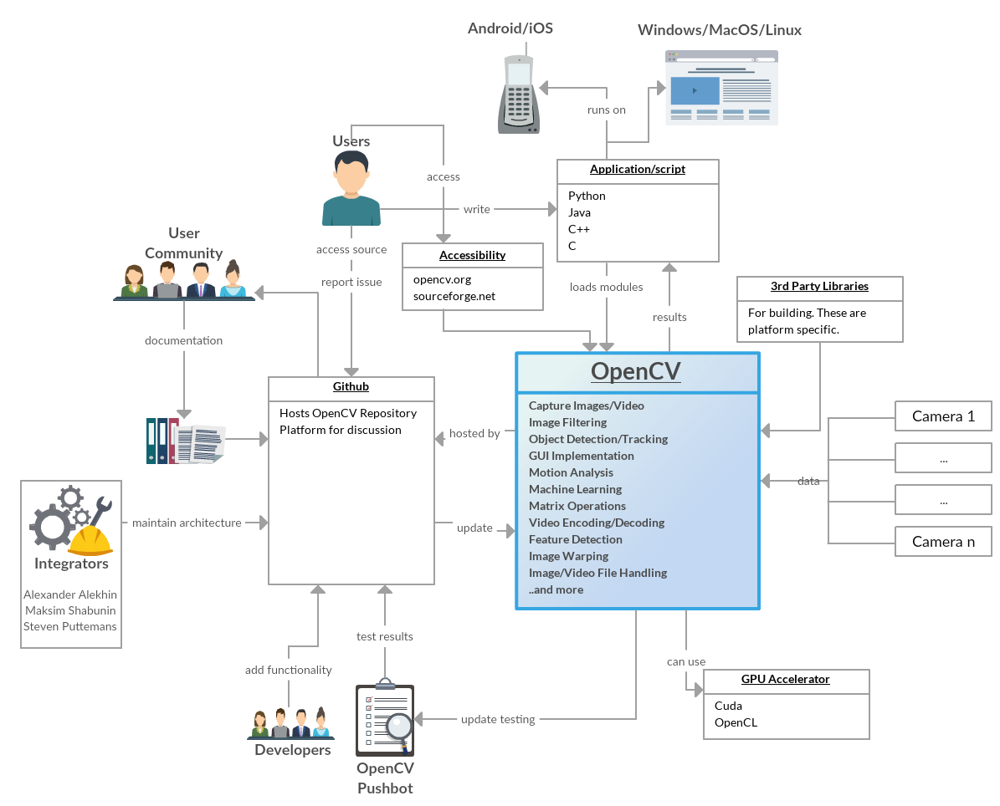
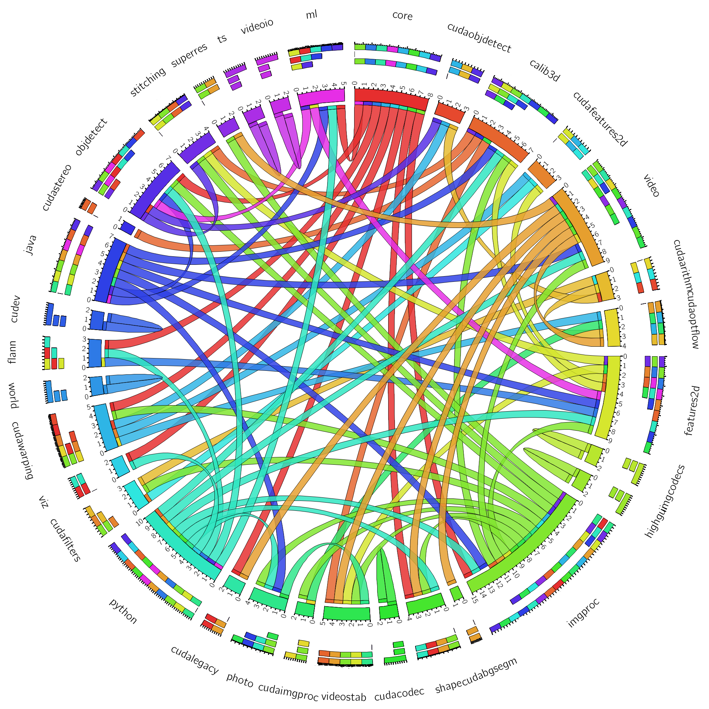
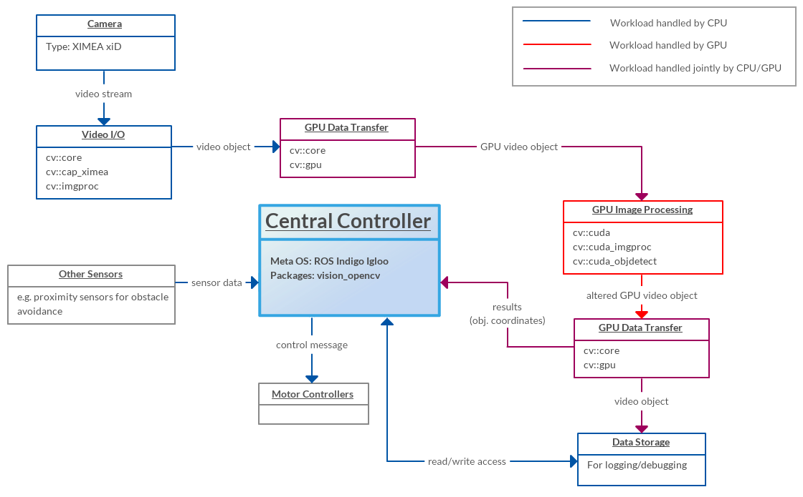

# OpenCV (Open Source Computer Vision Library)

**Bjarki Johannsson, Shruthi Kashyap and Renukaprasad Manjappa**

*Delft University of Technology*

## Abstract

*OpenCV is an open source, cross-platform, cross-language computer vision library, that was devised in order to create a common infrastructure for computer vision applications and to expand the usage of computer vision in commercial products. The library consists of more than 2500 optimised algorithms and supports hardware accelerators such as CUDA and SSE. This chapter provides a concise overview of the OpenCV project by presenting an analysis of the project through multiple perspectives and viewpoints as presented in the book by Rozanski and Woods [[4](#textbook)].*

## Table of Contents

* [Introduction](#introduction)
* [Stakeholders](#stakeholders)
* [Context View](#context-view)
* [Development View](#dev-view)
    * [Module Structure Model](#module-structure-model)
        * [Module Hierarchy](#module-hierarchy)
        * [Software Languages](#software-languages)
        * [Guide for Developers](#guide-for-developers)
    * [Codeline Model](#codeline-model)
        * [Source Code Structure](#source-code-structure)
        * [Build Approach](#build-approach)
        * [Release Process](#release-process)
        * [Configuration Management](#configuration-management)
* [The Evolution Perspective](#ev-perspective)
    * [The Evolution of OpenCV](#ev-opencv)
    * [The Future of OpenCV](#future-opencv)
* [Deployment View](#dep-view)
* [The Performance and Scalability Perspective](#perf-scal-perspective)
    * [The Performance Perspective](#perf-perspective)
    * [The Scalability Perspective](#scal-perspective)
* [Conclusions](#conclusions)
* [References](#references)

 
## Introduction

Computer vision is a discipline, that deals with acquiring, processing as well as analyzing images. Based on these functions, computer vision tries to extract as much useful information out of the images as possible, which can be used to make decisions. A widespread theme has been the search for methods that could provide computers with human-like abilities in understanding images and deducting useful information out of it. Computer vision is frequently used in autonomous driving, object recognition as well as product quality management amongst others. [[15](#cv)]

Computer vision has gone through a significant growth during the past decades and nowadays there are many libraries available for computer vision applications. The widespread usage of computer vision has been made possible by the combination of more capable algorithms, cheaper and more powerful hardware and better cameras. [[3](#book)]

OpenCV (Open Source Computer Vision Library) is a widely used computer vision and machine learning library mainly aimed at real-time applications. It was originally developed by Intel employees in a research center in Russia, but the project was taken over by a non-profit foundation in 2012. [[1](#opencv), [2](#wiki), [3](#book)]

The library is written in C and C++, but it is intended to be a cross-platform, cross-language library, therefore supporting languages such as Python, Java and operating systems such as Windows, Linux, Mac OS X, Android and iOS amongst others. The algorithms have been optimised in C and take advantage of multi-core processors and GPUs. [[1](#opencv), [2](#wiki), [3](#book)]

OpenCV has been licensed so that enterprises can use it in their products without providing the source code of their applications. Therefore, OpenCV has been also used by many corporations, such as Toyota, Google and IBM. [[1](#opencv), [3](#book)]

The main motivation for starting the OpenCV project back in 1999 were the following points [[3](#book)]:

* Advance the computer vision field by providing optimised code. 
* Spread knowledge of computer vision by providing a common library, that would make it easier to develop new applications.
* Make commercial applications more viable by making the optimised code free, without any limiting licenses. 

The chapter has been divided into 6 sections. The chapter starts with an analysis of the stakeholders, which is followed by the context view. These sections provide the main background information needed to understand OpenCV. The development view and evolution perspective provide an overview of the source code structure as well as how it has evolved during the long history of OpenCV. Finally, the deployment view as well as the performance and scalability perspective describe how OpenCV is used at run-time, what features it uses in order to increase performance and how scalable it is. 

 
## Stakeholders

Stakeholders are the individuals, teams or organisations that have an interest in the realization of a software system [[4](#textbook)]. We have found 5 types of stakeholders applicable to OpenCV out of the 11 types presented in the book by Rozanski and Woods [[4](#textbook)]. Most of the stakeholders are not applicable to OpenCV, since the book considers the design of a corporate web application, but OpenCV is an open source platform-specific library. The OpenCV stakeholders are presented in [Table 1](#table_1).

| Stakeholder  | Description                                                                                                                                                                                                                                                                                                                                                                                                                                                                                                                              |
|-----------------------------------|---------------------------------------------------------------------------------------------------------|
| Communicator | [Maksim Shabunin](https://github.com/mshabunin) has provided systematic work on documentation, but otherwise it is maintained by the whole community.                                                                                                                                                                                                                                                                                                                                                                                        |
| Developer    | [Alexander Alekhin](https://github.com/alalek), [Maksim Shabunin](https://github.com/mshabunin), [Steven Puttemans](https://github.com/StevenPuttemans) are the main developers, but more than 533 users in total have contributed to the project. Most of the developers have contributed, because they have encountered an issue while using the library and have come up with a solution to fix it. They take action in order to influence the next releases as well as to help other developers who might encounter the same issues. |
| Tester       | Testers are not explicitly used, instead the developers write the tests when implementing new functionality and an automated bot, [OpenCV Pushbot](https://github.com/opencv-pushbot?tab=activity), is used to run the automated tests when an integrator has approved a pull request.                                                                                                                                                                                                                                                       |
| User         | The users are comprised of small and large corporations, government agencies and software engineers. Some examples of corporations using OpenCV are Google, Intel, IBM and Toyota, but the total number of downloads has been estimated to more than 7 million [[2](#opencv)].                                                                                                                                                                                                                                                           |
| Integrator   | [Alexander Alekhin](https://github.com/alalek), [Maksim Shabunin](https://github.com/mshabunin) and [Steven Puttemans](https://github.com/StevenPuttemans) are the integrators. They try to develop the project in a systematic manner while maintaining the code quality, code style and the architecture. It seems that they are clearly struggling with invalid and duplicate issues, which make up roughly half of the recently closed issues.                                                                                          |

*Table 1: Stakeholders within the OpenCV project.*

 
## Context View

The context view defines the relationships, interactions and dependencies between OpenCV and its environment. This view gives a broad overview of the whole system and is therefore useful for all stakeholders. The context view model for OpenCV is presented in [Figure 1](#context_model).

*Figure 1: Context view model for OpenCV.*

OpenCV is tightly coupled with GitHub, which hosts the source code and where users can clone, fork or download it from. Issues and discussions about missing or faulty functionality also take place on GitHub. Developers can contribute to the project by making pull requests, which are then handled by the integrators. Documentation is provided by the user community through GitHub, although [Maksim Shabunin](https://github.com/mshabunin) is the main contributor in this category. A binary distribution is provided on the [OpenCV web page](https://www.opencv.org) and on [Sourceforge](http://www.sourceforge.net) for developers who have no intentions on modifying the source code. All of the stakeholders discussed in the [Stakeholders](#stakeholders) section are also covered in the context view model and all of them make use of GitHub as a means of accessing information about OpenCV. 

OpenCV is a real-time, highly optimised library, therefore it needs to have support for many hardware accelerators and external devices. It has support for [CUDA](http://www.nvidia.com/object/cuda_home_new.html), a platform for parallel computing on NVIDIA's GPUs. Over 375 million CUDA-enabled GPUs are present in modern computers, which allow the developers to run their algorithms on GPUs. OpenCV also supports another parallel programming library, namely [OpenCL (Open Computing Language)](https://www.khronos.org/opencl), which is an open source, royalty-free standard for parallel programming from the Khronos Group.

OpenCV is a cross-platform, multi-language library with support for all of the major operating systems as well as the C++, Java and Python programming languages, therefore it has to make extensive use of many third party libraries. It has support for many cameras, which are the main data sources for computer vision application via third party camera interfaces and libraries. 

 
## Development View

The development view describes the architecture of OpenCV as well as the surrounding build, release and configuration management procedures. The development view gives a broad overview of the source code and is therefore mainly oriented towards software developers.

 
### Module Structure Model

The source code for the OpenCV library is located in the *modules* folder in the repository structure (refer to [Source Code Structure](#source-code-structure) for details on the structure). The OpenCV library is huge, containing support for more than 2500 algorithms. The library has evolved for more than 15 years and has seen a tremendous growth in size during this period.

There is no apparent structure amongst the modules, which could be detected from analysing the structure of the files. Nevertheless, there is an enormous amount of dependencies between the modules, which can be detected from the *CMakeLists.txt* files in each module. These modules together with their dependencies are presented in [Figure 2](#arch_model).

*Figure 2: Inter-module dependencies of OpenCV.*

 
#### Module Hierarchy

Although there is no apparent structure between the modules, it can be easily observed that the common modules that other modules depend on are *core*, *python* and *java*. 

The *core* module contains the main algorithms and implementations, which are used the most in the library. This module contains most of the common design models, which reduce duplication. 

The OpenCV algorithms are implemented in C++, but those algorithms can also be called from Python and Java. The *python* and *java* modules are used to automatically create wrapper functions for Python and Java from the C++ implementation. Therefore, these modules are commonly referenced from most modules [[5](#wrap)]. 

Apart from the *core*, *python* and *java* modules, there is only one additional module, which sees widespread usage amongst other modules, that is *imgproc*. Other modules create a complex network of a few dependencies per module, that are hard to categorise into largely used common models. 

In general, there is no layering in the hierarchy of the modules. While *core*, *python* and *java* are the common modules, there isn't a clear separation above them. It is common that a module that refers to the *core* module also refers to another module that depends on the *core* module, therefore creating a very complex structure.

 
#### Software Languages

The total number of source code lines (excluding blank lines and comments) in the *modules* folder was 451,756 at the time of writing, and 1,452,059 in the whole project. The most widely used language in the OpenCV modules themselves is C++, as can be seen from [Figure 3](#soft_lang), which depicts the languages used in the OpenCV modules. Nevertheless, there is a significant amount of CUDA and OpenCL as well as Java and Python code, which is needed to improve the performance or portability. Furthermore, many other languages are used only for very specific tasks.

*Figure 3: Software languages used for the development of the OpenCV modules.*

Surprisingly, the most widely used language when considering the whole project is XML, which has 667,276 lines of code. Furthermore, the total number of languages used in the project is 28, which includes a significant amount of XML, YAML and CMake amongst others. The large amount of XML and CMake code clearly shows the significance of automation in the OpenCV project. We believe that this variation in the languages used makes the OpenCV project very intriguing, but also very complex for newcomers to master. 

 
#### Guide for Developers

The OpenCV coding style guide [[6](#style)] describes the main ideas behind the file and folder structure. The source code for the library is located in *opencv/modules/moduleName/src*, the headers are in  *opencv/modules/moduleName/include/opencv2/moduleName* and the tests are located in *opencv/modules/moduleName/test*. The guide suggests creating a new module in the modules folder, whenever it seems appropriate. This has led to a large number of modules in the library, that are placed in parallel in a single folder. 

 
### Codeline Model

The codeline model deals with the organisation of the source code in folders as well as the build and release procedures. 

 
#### Source Code Structure

The OpenCV library has been organised into 9 folders, which are depicted in [Table 2](#table_2) [[7](#root)]. 

| Folder     | Description                                                                |
|:-----------|:---------------------------------------------------------------------------|
| *3rdparty* | Contains third party libraries used by OpenCV                              |
| *apps*     | Applications used for development                                          |
| *cmake*    | Contains the core CMake files, that are used for configuration management  |
| *data*     | Contains files that are used by the library, demo applications and testers |
| *doc*      | Contains the documentation, that is also available on the OpenCV web-page  |
| *include*  | List of included modules                                                   |
| *modules*  | Contains the OpenCV library                                                |
| *platforms*| Contains the tools and files needed for cross-compilation                  |
| *samples*  | Contains the sample code for library usage                                 |

*Table 2: Source Code Structure.*

 
#### Build Approach

The OpenCV project uses CMake to manage the build process. Therefore, the library is highly configurable, allowing the developers to customize the library by excluding unused modules, building the debug or release version, building with or without the support for CUDA and OpenCL etc. 

The binary can be compiled after configuring the system with CMake by simply executing Make. This makes the build process straightforward, therefore limiting the amount of build steps although this is a multi-platform library [[8](#install)]. OpenCV can also be cross-compiled to other platforms. This has been automated by build scripts in [[9](#platform)].

OpenCV has been around for a long time and therefore it has been thoroughly documented. The build steps for most platforms can be found from [[10](#install-guide)].

 
#### Release Process

There is no concrete documentation about the release procedure of the OpenCV library available, therefore we devised a description of it based on the source code, tags, releases, milestones as well as the issues and their corresponding discussions. The frequency of new releases is very low, there have been only 3 new releases in the past year [[11](#download)]. There has been usage of milestones [[12](#milestones)], but its usage is not consistent and some milestones do not contain a single issue. It seems as though the integrators are deciding whether to create a new release or not based on their experience with the system. 

There have been 3 major releases for OpenCV: 1.X.X, 2.X.X and 3.X.X. As can be seen from the previous list, minor revision numbers have been used in addition to the major revision number. Alpha, Beta and RC (release candidate) revisions have been used for a new major version in order to slowly introduce the major releases and increase their reliability [[13](#tags)].

The OpenCV community uses GoogleTest to manage the testing of the library. A separate OpenCV bot is used to run the tests for each pull request, therefore reducing the workload of the developers. The testing has been standardized and there are instructions available on how to write tests. 

We believe, that there should be at least a concise description of release testing and milestones should be used consistently. This would make it easier for the developers to decide whether to risk creating a private release or wait for a public release.

 
#### Configuration Management

The OpenCV community uses a single repository for all platforms. Furthermore, a single tag and a single release is made for every release, therefore the binaries for all platforms can be compiled from a single tag. The branches are platform-independent as well, since there are only 3 active branches: master, 2.4 and 2.4.12.x-prep [[13](#tags)].

This means, that the integrators compile different release versions (for multiple platforms) from the same source code and upload the new versions to their distribution web-page [[11](#download)]. The process itself is not described in the documentation of OpenCV.

 
## The Evolution Perspective

The evolution perspective discusses how the system has evolved during its lifetime, how flexible the system is when new functionality needs to be added and how maintainable it is. 

 
### The Evolution of OpenCV

OpenCV has been around for more than 17 years and has seen an enormous growth during this period. Not only has the number of algorithms increased, but there have been a lot of technological advancements, that have made new platforms important for computer vision applications. This includes the widespread use of Android and iOS as well as the introduction of hardware accelerators such as CUDA and SSE. These factors have forced the developers to keep up constant improvement, the results of which are presented in [Table 3](#table_3). This provides an overview of the major versions, how the folder structure has evolved as well as some of the new features introduced. 

| Version | Folder Structure                                                                                                        | New Features & Refactorings                                                                                                                                    |
|:--------|:----------------------------------|:------------------------------------------------------|
| *1.0.0* | There is almost no common ground in comparison to the current version.                                                  | Very little functionality, uses Make.                                                                                                                          |
| *2.0.0* | The functional modules are grouped in a single *src* directory. A separate folder for third party libraries is created. | CMake is used instead of Make. No new features, mainly improvements.                                                                                           |
| *2.1.0* | A folder named *include* for the headers is created in the root directory.                                              | No new features, mainly improvements.                                                                                                                          |
| *2.2.0* | The library has been reorganised and a *modules* folder is created.                                                     | *core*, *imgproc*, *features2d*, *objdetect*, *calib3d*, *ml*, *highgui*, *gpu*, *contrib* and *python* modules are created.                                   |
| *2.3.0* | -                                                                                                                       | A new module, *stitching*, has been added. Also, there have been many smaller improvements to the modules                                                      |
| *2.4.X* | A separate *platforms* folder for operating system dependent scripts.                                                   | There are 12 minor releases, which add a lot of new algorithms and features, GPU functions and module refactorings. Added support for OpenCL, iOS and Android. |
| *3.0.X* | -                                                                                                                       | More GPU functions, improved Java bindings.                                                                                                                    |
| *3.1.X* | -                                                                                                                       | Support for newer operating systems and tools, a lot of new functionality.                                                                                     | 

*Table 3: Evolution of OpenCV.*

Software architecture sometimes has to be changed with the introduction of new features. This can be seen from OpenCV, which has seen a number of folder restructurings, module refactorings as well as minor refinements. This has ensured the longevity of the library, since it would be almost impossible by now to maintain it if these steps would have been skipped.

While contributions from the user community have played a valuable part of evolving the library, care must be taken when developers from all around are allowed to contribute. A few procedures that aim to reduce technical debt issues are maintained by the OpenCV integrators. A coding style guide is maintained and all contributors are urged to follow this guide. A similar guide on how to contribute is also presented on the OpenCV official site. Contributors should make sure the problem still persists before submitting something, and make sure that nobody else is working on the same issue, thus avoiding parallel development.

 
### The Future of OpenCV

It is hard to predict the future, but it is most probable that OpenCV will continue to improve its performance, add new functionality and provide easier to use interfaces. A book on OpenCV [[3](#book)] proposes six main areas, which will see major attention from the developers:

- *Applications* - There will be more higher-level applications, that can be easily used by the developers. This means lowering the learning curve and achieving faster time to market.
- *3D* - There will be more support for camera-sensor combinations, that enable the creation of 3D applications.
- *Dense Optical Flow* - There will be support for dense optical flows, which enable the detection of the movement of whole objects.
- *Features* - There will be a framework for interchangeable interest-point detection and interchangeable keys for interest-point identification.
- *Infrastructure* - The environment in which OpenCV is used will be improved, e.g. documentation improvements, better wrappers and better support for operating systems.
- *Camera Interface* -  The handling of cameras will become easier and there will be support for more colors per channel. 

 
## Deployment View

The deployment view [[4](#textbook)] focuses on the system's runtime environment, including the required hardware and mapping of software elements to the environment. OpenCV can be deployed e.g. on mobile devices using ARM processors running iOS, embedded systems running Linux or expensive workstations which include many CPUs and GPUs. Due to the extensive possibilities of deploying a system using the OpenCV library, we'll focus on one example which we'll use throughout this section. To cover all the possibilities is perhaps impossible, at least the material could easily fill a whole book.

The subject will be the computer vision part of an object tracking robot, running on Ubuntu using ROS (meta operating system designed for robotics) and GPU acceleration through CUDA. For simplicity the object detection is color based. [Table 4](#tab_td) shows the technology dependencies for the system used in our example.

| Component        | Requires                                            |
| :----------------|:----------------------------------------------------|
| Data capture     | XIMEA xiD camera, XIMEA enabled                     |
| GPU acceleration | NVIDEA GeForce 770 graphics card, CUDA enabled      |
| Data routing     | ROS Indigo Igloo w/vision_opencv package            |
| Meta-OS (ROS)    | Ubuntu 14.04 LTS                                    |

*Table 4: Technology dependency model for the example robot.*

The hardware and OSs were chosen to represent a realistic case which shows how OpenCV can be used as a part of a system. ROS currently only has install packages for Ubuntu. Although ROS can be used to capture video from cameras, our example uses OpenCV modules for this task. Along with the hardware requirements listed in [Table 4](#tab_td), the OpenCV library must be built with the XIMEA and CUDA options enabled to allow for communications with the camera and GPU acceleration.

The high-level operation of the robot is described in the following steps:

1. Get frame
2. Send frame to GPU
3. Detect object
4. Report results
5. Collect data from other sensors
6. Make decision based on results and data from sensors
7. Send control message to motor controllers based on decision
8. Goto step one

The video stream from the camera is captured using OpenCV's *cap_ximea* module. It is then converted to a GPU video object and sent to the GPU for processing. Sending the data to and from the GPU requires processing of both the CPU and the GPU. The image processing algorithm is handled solely by the GPU, allowing the CPU to focus on other tasks meanwhile, such as communications with other sensors and control calculations for the motors. Based on the results of the object detection, the central controller decides on an appropriate message to the motor control. [Figure 4](#fig_runtime) provides a runtime platform model for the robot, with focus on the OpenCV related part.

*Figure 4: Runtime model for the example robot.*

 
## The Performance and Scalability Perspective

 
### The Performance Perspective

Performance refers to the capability of a system to provide desired output within a certain response time. In image processing libraries such as OpenCV that deal with a large number of frames per second, it is favorable that the code is not only providing the correct solution, but also in the fastest manner possible.

OpenCV provides several features to boost performance and increase productivity. Many of these optimizations usually differ based on the  host architecture, operating system and even the language being used. For instance certain optimization features can only be used on Windows running on an Intel chipset. Performance might even vary for certain functions depending on the language used. In the following section we discuss certain important optimization features provided by OpenCV. We also discuss methods to benchmark an application in OpenCV and important results obtained.

#### Default Performance Optimizations in OpenCV

Many of the OpenCV functions are optimized using different performance optimization features. It also contains unoptimized code. Exploiting these features is a possibility if the run-time system supports them. OpenCV runs the optimized code if it is enabled, else it runs the unoptimized code. The function `cv2.useOptimized()` can be used to check if it is enabled or disabled and `cv2.setUseOptimized()` to enable or disable it. Some of the important optimization features are listed in [Table 5](#tab5).

| Feature | Description                                                                                                                                                                                                                                                           | Availability                 |
|---------|---------------------------------------------|------------------|
| SSE2/3  | Streaming SIMD Extensions 2, is one of the Intel SIMD libraries. These instructions allow multiple data sets to be operated using a single instruction.                                                                                                               | Intel chipsets               |
| NEON    | Specifically designed by ARM to accelerate multimedia and signal processing algorithms such as video encode/decode, 2D/3D graphics, gaming, audio and image processing.                                                                                               | ARMv6                        |
| IPP     | Integrated Performance Primitives (Intel® IPP) is an extensive library of software functions for developing data processing and communications applications. These functions are highly optimized using Intel® Streaming SIMD Extensions.                             | OpenCV 3.0 on Intel Chipsets |
| OpenCL  | Open Computing Language (OpenCL) is an open standard for writing code that runs across heterogeneous platforms including CPUs and GPUs. OpenCL provides applications with an access to GPUs for non-graphical computing (GPGPU) that results in significant speed-up. | All platforms                |
| CUDA    | CUDA is a parallel computing platform and application programming interface (API) model created by NVIDIA, to perform image processing on NVIDIA GPUs.                                                                                                                | NVIDIA GPUs                  |

*Table 5: Performance enhancing features in OpenCV.*

Some of the profiling results measured with CUDA show a significant improvement in performance for many OpenCV functions, as is depicted in [Figure 5](#fig5).

*Figure 5: Performance enhancement of various OpenCV functions with CUDA*
(*Source: [OpenCV official website](http://opencv.org/platforms/cuda.html)*).

#### Measuring Performance with OpenCV

In OpenCV the performance is measured by counting the number of clock ticks between the start and the end of an OpenCV function. OpenCV provides API functions such as `cv2.getTickCount` which provides the number of ticks at a specific point in time. So if we call it before and after the function execution, we get an estimate of the number of clock-cycles used to execute a function.

 
### The Scalability Perspective

Scalability of any software is its ability to handle increased workload in the future or for a short period of time, while continuing to meet the existing throughput, performance and responsiveness of the system. Also, any changes made to the system must ensure that the system’s capacity to handle the workload is not affected. Since OpenCV is a library which is used by other applications, its scalability indirectly influences the performance, response and throughput of the application using it.

To analyse the scalability of OpenCV, the usage of the library in real-time computer vision applications is considered. These applications are characterized by firm timing constraints, and handle varying amount of data at different points in their execution. Usually, these applications deal with the transformation of data from a still or video camera into either a decision or a new representation, which in this case is done using the APIs of OpenCV library.

The amount of data passed to the APIs (e.g. the size of the images or frames) affects their execution time and hence the response time of the whole system. The larger the data, the more processing time is required. However, the OpenCV algorithms are optimized and have been stabilized over the years to handle such increased workloads and to ensure good responsiveness and performance. Many of the OpenCV functions are optimized using SSE2, AVX etc, and are enabled by default while compiling. The function `cv2.useOptimized()` is used to check if they are enabled/disabled and the function `cv2.setUseOptimized()` is used to enable/disable them. If these optimizations are not enabled, the unoptimized code of the OpenCV will run. A common way of developing is to have optimizations disabled while debugging to avoid reducing the code readability.

The OpenCV GPU module supports NVIDIA GPUs in order to utilize the parallel computing capabilities of GPUs. However, the current version of OpenCV does not provide assistance in utilizing multiple GPUs, the algorithms can only use a single GPU. To achieve real-time performance while processing high quality videos, using a single GPU may not suffice. Therefore, the library provides APIs that allow the user to manually distribute the work between multiple GPUs by splitting the tasks into threads. This would help in accelerating the application during increased workload.

Similarly, OpenCV utilizes only one CPU core at a time. Multiple cores can be utilized by enabling multithreading using OpenMP (Open Multi-Processing) or TBB (Threading Building Blocks). These can be enabled by compiling the OpenCV library with `WITH_OPENMP` or `WITH_TBB` options enabled.

Currently, most of the APIs in OpenCV support only image formats using 8 bits per colour channel. If the applications using the library use newer cameras that can supply 10 or 12 bits per channel, the OpenCV APIs will fail to process the data. OpenCV, in the coming software releases, is planning to support more seamless handling of cameras along with eventual support for cameras with higher dynamic range. The higher bit depth increases the throughput of data to be processed by the algorithms.

 
## Conclusions

We've made an effort to map the architecture of OpenCV to the ideas presented in [[4](#textbook)]. This has proved to be a nontrivial task as it is hard to identify an architectural structure in the library. The interdependencies of the modules are numerous and hard to organize into categories. The size of the integrators group for the project is very small relative to the number of lines of code. The wide support for operating systems and hardware further increases the complexity of the system. A good portion of the bugs reported on the library's GitHub page are related to more recently added platform support, such as ARM processors.

Nevertheless OpenCV has done a good job during its lifespan making the world of computer vision and machine learning accessible to people, providing an easy to use interface to deal with complex tasks, without requiring the expert knowledge needed to implement the algorithms.

OpenCV provides excellent documentation and user guides for regular users who want to integrate OpenCV into their applications, but we feel that the documentation for the developers is scarce and therefore limits the amount of people willing to contribute to the project. Communication is slow and limited, which can also be attributed to the limited number of integrators.

 
## References

1. 
 About OpenCV. (2016). Retrieved February 29, 2016 from http://opencv.org/about.html
2. 
 OpenCV. (2016). Retrieved February 29, 2016 from http://en.wikipedia.org/wiki/OpenCV
3. 
 Bradski G. and Kaehler A. (2008). *Learning OpenCV*. O’Reilly Media, Inc.
4. 
 Rozanski and Woods. (2012). *Software Systems Architecture*, 2nd edition. Pearson Education, Inc.
5. 
 How OpenCV-Python Bindings Works?. (2015). Retrieved March 12, 2016 from http://docs.opencv.org/3.1.0/da/d49/tutorial_py_bindings_basics.html#gsc.tab=0
6. 
 The OpenCV Coding Style Guide. (2015). Retrieved March 2, 2016 from https://github.com/Itseez/opencv/wiki/Coding_Style_Guide
7. 
 Open Source Computer Vision Library. (2016). Retrieved March 2, 2016 from https://github.com/Itseez/opencv
8. 
 Installation in Linux. (2016). Retrieved March 2, 2016 from http://docs.opencv.org/trunk/d7/d9f/tutorial_linux_install.html#gsc.tab=0
9. 
 Platforms in OpenCV. (2016). Retrieved March 7, 2016 from https://github.com/Itseez/opencv/tree/master/platforms
10. 
 Introduction to OpenCV. (2016). Retrieved March 7, 2016 from https://github.com/Itseez/opencv/tree/master/doc/tutorials/introduction
11. 
 OpenCV Downloads. (2016). Retrieved March 12, 2016 from http://opencv.org/downloads.html
12. 
 OpenCV Milestones. (2016). Retrieved March 12, 2016 from https://github.com/Itseez/opencv/milestones
13. 
 OpenCV Tags. (2016). Retrieved March 12, 2016 from https://github.com/Itseez/opencv/tags
14. 
 OpenCV Change Logs. (2016). Retrieved March 12, 2016 from http://code.opencv.org/projects/opencv/wiki/ChangeLog
15. 
 Computer Vision. (2016). Retrieved March 22, 2016 from https://en.wikipedia.org/wiki/Computer_vision
