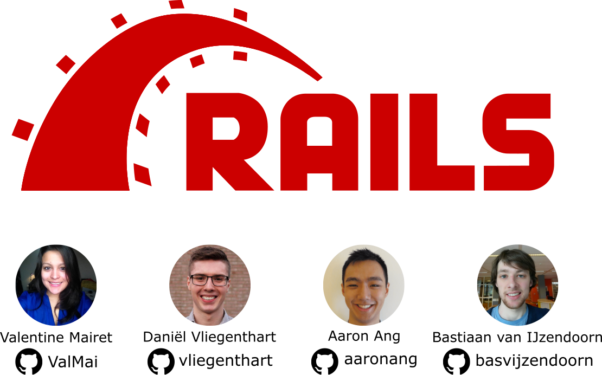
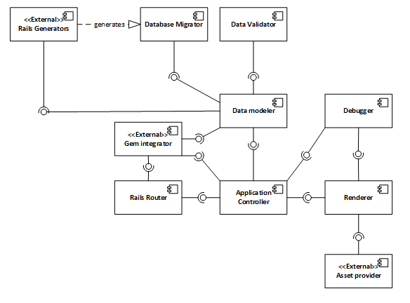
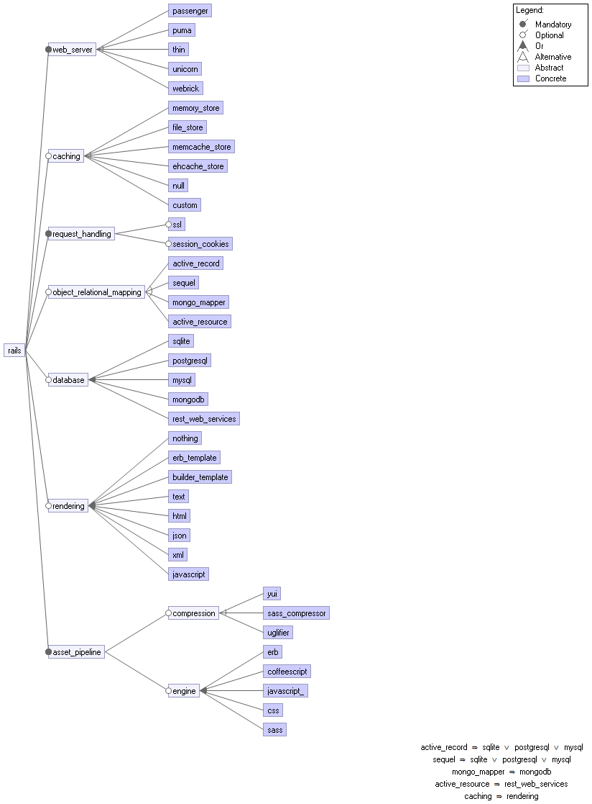

# Ruby on Rails - Always on Track

## Abstract

*Ruby on Rails is a web framework, focusing on making the development of web applications easier and more fun.
This framework has over 3,000 contributors, 700,000 users, and 200,000 lines of code.
To help developers understand Rails, we first analyse the stakeholders of Rails and provide an overview of where Rails stands in the real world.
We then describe Rails from various viewpoints and perspectives to understand its software architecture.
Providing these insights should help people join the Rails community and contribute to Rails, and give Rails members a description of their system from an outsider’s perspective.*

##  Introduction

Rails is a [Ruby](https://www.ruby-lang.org/en/) framework designed to facilitate web development and to develop database-backed web applications.
The Rails project was started back in 2004, and the first release of Rails occurred in December 2005.
In 2008, Rails migrated to [GitHub](https://github.com/).
The purpose of the Rails framework is to make the development of web applications easier and before all, more fun [[12](#rails2016rails)].

As of today, there are over 700,000 websites built with Rails [[1](#builtwith2016rails)], [3,000 contributors](https://github.com/rails/rails/graphs/contributors) to the Rails project, and this framework contains overall 200,000 lines of code.
From seamless database integration to providing a REST API; from emailing support to rendering HTML with embedded Ruby code - Rails contains anything a web developer needs.

The Rails core development team meticulously relies on two concepts: Convention Over Configuration and Don’t Repeat Yourself.
These software paradigms ensure the uniformity of the code base and the simplicity of development, without losing flexibility.

For the Software Architecture 2016 course, we chose Rails to investigate and to contribute to.
For our contributions to Rails, we approached the core developers and they gave us a task to help them for the next release of Rais.
It was an honour to assist them, and we got offered to work on a separate, though related, Rails project.

Concerning our research upon Rails, we report our findings in this chapter.
We start off a with a stakeholder analysis to inquire upon who and which entities have an interest in the realisation of the framework.
Then, we put Rails into context by showing where it stands in the real world.
We then approach the functionalities of Rails and describe the modules that make up the framework.
We investigate the variability of the framework, i.e. how Rails facilitates configurability.

Additionally, as security is an important aspect of the Web, we investigate how Rails deals with important security concerns.
Finally, we conclude this report with a discussion of Rails nowadays.

## Stakeholder Analysis

When it comes to designing a product for usage, one must think of who will have an interest in this particular product, even when we speak of software.
These entities or people who hold a stake in the realisation of the product are called stakeholders.
Rails has many stakeholders that we have identified in the table below.
We have sorted them according to the eleven types proposed by Rozanski and Woods [[18](#rozanski2012software)].

| Type | Stakeholder | Description |
|---|---|---|
| Developers | Core developers, committer team and contributors | The core developers sets policies and are the general managers, the committer team helps the core developers with pull requests. |
| Acquirers | Core developers | The core developers decide on the overall direction of Rails. There are no business sponsors for Rails. |
| Assessors | Developers in general | Developers assess the conformance to standards and legal regulations themselves. |
| Communicators | Teachers | Rails is taught by **teachers** in online environments by means of instructive movies on [YouTube](https://www.youtube.com/), tutorials on the web, or answering questions on [StackOverflow](http://stackoverflow.com/). There is a special project called “Ruby on Rails Guides” [[16](#guides2016ruby)], which provides guidelines “designed to make you immediately productive with Rails”. |
| Maintainers | Core developers, contributors | The overall evolution is maintained by the core developers, all other maintenance tasks by contributors. |
| Product Engineers | Users, developers | The users are the engineers of Rails products, the developers manage the GitHub repository and the Rails information website. |
| Suppliers | GitHub | GitHub is a supplier for the Rails repository. |
| Support Staff | Developers, teachers | Support for the development of Rails is done by developers in mailing lists and on GitHub. The teachers provide support for Rails applications on platforms such as StackOverflow. |
| System Administrators | Core developers, committer team | They control the development of the project. |
| Testers | Core developers, committer team | They are responsible for the testing of new commits. |
| Users | Developers and organisations that use Ruby on Rails | Examples of projects that are built with Rails are: [Basecamp](https://basecamp.com/), [GitHub](https://github.com/), [Shopify](https://www.shopify.com/), [Airbnb](https://www.airbnb.com/), [Twitch](https://www.twitch.tv/), [SoundCloud](https://soundcloud.com/), and many more. |

Additionally, the following stakeholders are identified but do not fall within the types of Rozanski and Woods.

*Gem Contributors:* Some developers develop gems that can contain anything from libraries to self-contained applications that are useful for a Rails application.

*End-Users:* End-users are the people who view and use Rails website as consumers. For instance, a GitHub visitor.

*RailConf Organisers:* There is a yearly Rails conference in order to meet people of the Rails community in real life.

*Bloggers*: a blog is maintained by some developers that share news on the progress of Rails development.

*Open Source Scientists:* The TU Delft Software Architecture class, and other academics interested in open source, perform research on the Rails community and the Rails repository.

*Ruby:* Rails is written in the Ruby programming language.
There is a cyclic dependency between the language and the framework, hence making Ruby a stakeholder of Rails.

## Context Viewpoint

In this section, we describe the context model of Rails.
This model describes what the system does and does not do and defines the relationships, dependencies, and interactions between the framework and its environment [[18](#rozanski2012software)].

*Figure 1: Context model of Ruby on Rails.*

In Figure [1](#context-model), we display the context model of Rails.
For external entities that are not self-evident, we explain its role with respect to Rails.

*VCS and issue tracker*: GitHub and Git facilitate collaboration between developers using the pull-based development model.
Furthermore, GitHub is used as an issue tracker.

*Package managers*: Ruby comes with two package managers: [RubyGems](https://rubygems.org/) and [Bundler](http://bundler.io/).
On the one hand, RubyGems is shipped with Ruby and is normally used for installing packages, known as gems, on system level.
On the other hand, Bundler is usually used to install dependencies based on a `Gemfile` which is included in almost every Ruby project.
Note that Bundler itself is a gem, which can be installed using RubyGems.

*Communication tools*: The Ruby on Rails community is heavily active and makes use of different communication channels: Google Groups, Freenode, Stack Overflow, and GitHub.
Google Groups is used to discuss the core functionality of the framework.
GitHub serves as a mean to discuss issues, primarily bugs and perform code reviews.

*Testing frameworks*: As every application is developed to satisfy users' need, it is important that we can verify and validate its functionality.
To facilitate testing, the Ruby community developed many testing frameworks each with its own target domain.

*Supported databases*: As more complex applications are developed, it is likely that one is required to store data.
This is where databases play an important role.
Databases provide means to read and write data to a storage device.

*Middleware*: *Rack provides a minimal interface between web servers that support Ruby and Ruby frameworks* [[7](#neukirchen2012rack)].
It specifies a communication protocol between the web server and a Ruby framework, such that the Ruby framework can work with an HTTP request, and that the web server can construct a valid HTTP response from the Ruby framework response [[2](#chande2013rack)].

*Web servers*: A web server processes HTTP requests from its users using network protocols.
Therefore, to make an application accessible from the Web, one will need to deploy a Rails application using Rack and a web server.

## Functional Viewpoint
The functional viewpoint describes the system’s runtime functional elements and their responsibilities, interfaces, and primary interactions [[18](#rozanski2012software)]. The functionalities are modeled in the UML diagram of [Figure 2](#functional-structure-model) and further described in this paragraph. Also, a common development scenario is described. The functionalities were extracted from the Ruby on Rails guides [[16](#guides2016ruby)].

### Functionalities

*Figure 2: Functional structure model of Rails.*

#### Rails Router

The Rails router has the responsibility to receive HTTP requests and to recognize URLs and dispatches them to a controller’s action.
For each URL path, a controller and action is defined.
When an HTTP request received , the router determines which controller and action to use.
Then, an instance of the controller is made and the action method is called.

#### Application Controller

The application controller is responsible for manipulating the business logic of the application, initiating the create, read, update, delete (CRUD) operations, and the rendering process.
Controllers can be defined and are interfaced by subclasses of the `ApplicationController`.
The methods of the subclass are the actions of the controller.

#### Data Modeler

The data modeler has the following responsibilities:

1. Represent models and their data.
2. Represent associations between these models.
3. Represent inheritance hierarchies through related models.
4. Perform database operations in an object-oriented fashion.

Models are interfaced by subclasses of the `ActiveRecord::Base` class.
The attributes of the class are mapped to the columns of the model table.

#### Data Validator

The data validator has the responsibility to ensure that only valid data is stored in the database and to provide ways to define what is valid data and what is not.
The data validators are also defined in the interface for the models.
Attributes of the subclass that represent columns in the table of the model can be validated on specific criteria.
Each time data is created or updated the validation criteria are checked.
If the validation criteria are not met, the operation will fail.

#### Database Migrator

The database migrator is responsible for providing ways to alter the database schema in a consistent and easy way.
Migrations can be interfaced in two ways:

1. Manual definition in a ruby domain specific language.
2. Automatic generation from a generator.
After a migration is defined it can be applied by calling a command in the command line.

#### Renderer

The renderer is responsible for rendering an HTTP response body and to give the HTTP response.
The render method that is called from a controller is the interface to the various rendering techniques used. There are 8 rendering options described in the variability overview.

#### Rails Generators

The generators have the following responsibilities:

1. Set up a Rails application.
2. Generate boilerplate code.
3. Set up user-defined generators.
4. Perform database migrations.

The generators form an external entity that needs to be called from the command line.

#### Gem integrator

The gem integrator has the responsibility to integrate gems into Rails applications.
Most users use bundler for the installation gems.
Bundler also keeps track of the versions and dependencies of gems.
Gems can after installation be added to the application by using the ‘require’ command in the Ruby code.

#### Debugger

The debugger is responsible for logging information and for tracking down problems and issues in the application that tests do not spot.
There are three interfaces for the debugger.

1. There are methods in Rails that can be used to provide debug information.
2. Debug information can be sent to the Rails logger.
3. The [Byebug](https://github.com/deivid-rodriguez/byebug) gem can be used to set breakpoints in the code and analyse the code at runtime.

#### Asset provider
The asset provider has three responsibilities:

1. Concatenate CSS and JavaScript assets.
2. Asset minification and compression.
3. Provide assets to end-users.

Assets are placed and interfaced in the `app/assets` directory.
The sprocket middleware serves the files by default in that directory.

### Common Developer Scenario
To show how the system behaves we walk through the implementation of a Ruby on Rails forum application.
The requirements for this application are simple.
There are multiple users that log into the system and can post messages on the forum board.
At first, the application is created by using a Rails generator.
The application router contains paths for the login screen and for the forum board.
There is a `User` model class and a `Message` model class.
Validators are added to the model  classes to check that the message and username fields are of limited length.
When an end-user posts a message the router instantiates a new controller instance and calls an action method of that controller.
In the method, a data storage operation is called.
However, as the model has a validator on the message column, the message length is checked prior to storing the data.
Then, the render method is called and renders an HTML response based on the forum board template that is sent to the browser.
The browser requests CSS assets that are mentioned in the HTML template.
 These are served by the asset pipeline.

## Development Viewpoint

This section presents the development viewpoint of the Rails framework, providing information of how Rails is structured, developed and released.

### Module Organization

Rails uses the Model-View-Controller (MVC) architectural pattern to enforce maintainability and to correctly decouple responsibilities for each layer, namely the *model*, *view*, and *controller* layers [[6](#mejia2011ruby)].
Other modules that are not part of the MVC layers are categorized as *core utility* or *utility*.
The module structure, in [Figure 3](#module-model), gives an overview of the layers and their interlayer dependencies.

*Figure 3: Module structure model of Ruby on Rails with interlayer dependencies.*

1. The **model layer** consists of modules that encapsulate database and business logic.
2. The **view layer** contains all logic related to view template lookup and rendering, and provides view helpers that assist when building HTML forms, Atom feeds and more [[8](#rails2015actionview)].
3. The **controller layer** is chiefly responsible for routing and handling web requests.
4. The **core utility layer** contains a collection of utility classes and standard library extensions which all other layers depend on.
The `railties` module contains functionality to *glue* all modules together [[11](#rails2014railties)].
5. The **utility layer** contains utility modules that provide optional functionality, such as sending and receiving emails, running background tasks and WebSockets integration.

### Standardization of Design

In this section, we describe the common components and design of major modules, e.g. Action Pack, Action View and ActiveRecord, and the recommended development approach to get contributors started.

In the [Module Organization](#module-organization), we have seen that every module depends on Railties and Active Support.
For this reason, we clarify the role of these two modules in Rails.

> Railties is responsible for *gluing* all frameworks together. [[11](#rails2014railties)]

Every major module in Rails is, in fact, a Railtie.
Modules define their own initialization and generators using Railtie.
Furthermore, Railties is responsible for managing the Rails command-line interface [[11](#rails2014railties)].

> Active Support is a collection of utility classes and standard library extensions that were found useful for the Rails framework. [[10](#rails2016activesupport)]

One essential utility that Active Support provides is `ActiveSupport::Autoload`, which allows developers to lazily load constants.

Rails provides developers a [standard development environment](https://github.com/rails/rails-dev-box), which can be installed using [Vagrant](https://www.vagrantup.com/) and [Virtualbox](https://www.virtualbox.org/) and a [contributing guide](http://guides.rubyonrails.org/contributing_to_ruby_on_rails.html#write-your-code) on coding style conventions
Finally, Batsov has written an extensive [style guide for Rails](https://github.com/bbatsov/rails-style-guide).

### Standardization of Testing

Rails promotes test-driven development (TDD) [[13](#rails2016testing)].
To enforce this, Rails’ Active Support module provides a test class, `ActiveSupport::TestCase`, that should be extended by every other test class.
The `TestCase` class utilizes the [MiniTest](https://github.com/seattlerb/minitest) test framework and defines additional or enhancing functionality, such as assertions and fixtures.

Once a change in code is completed, it is recommended to run the test suite(s) belonging to the affected module(s).
If all tests pass, one is allowed to make a pull request on GitHub.
This will, then, trigger a continuous integration service, namely [Travis CI](https://travis-ci.org/), to ensure that the proposed changes do not introduce unexpected failures [[13](#rails2016testing)].

### Instrumentation

Rails provides severals means for source code instrumentation; [Logger](http://guides.rubyonrails.org/debugging_rails_applications.html#the-logger), [Log4r](https://github.com/colbygk/log4r), [Byebug](https://github.com/deivid-rodriguez/byebug), and more.

Rails provides the `ActiveSupport::Logger` class to log information, which can be substituted by Log4r, to be utilized for debugging purposes.
Both tools provide the means to alter the level of detail logging for messages, which can improve the performance of a system.

When one is not able to detect a bug in the code using Logger or Log4r,  one is suggested to use a Byebug, which allows developers to introduce breakpoints into the code.

### Source Code Organization

In this section, we describe the structure of the source code, which specifies how code is structured, built, tested, released, and deployed [[18](#rozanski2012software)].

The code structure of Rails is explained in the [Module Organization](#module-organization).
However, we have not yet described the structure of a typical module.
Each module contains three directories, namely `bin`, `lib`, and `test`.
The `bin` directory contains executable Ruby scripts.
The `lib` directory contains source code for the module, i.e. functionality is implemented in this directory.
The `test` directory contains all test code, which ensures that code adheres to the desired functionality [[13](#rails2016testing)].

Rails uses [Rake](https://github.com/ruby/rake) as its build tool.
It is used to define tasks that can be executed, such as testing, generating documentation, preparing releases, installing gems, and more.
These tasks can be defined in a `Rakefile`.
Additionally, Rails uses [Bundler](http://bundler.io/) to manage its dependencies.
Dependencies are defined in a so-called `Gemfile`, which enables one to install all dependencies using one command: `bundle install`.

Once a developer is done writing code, (s)he has to test the written code and check for regressions.
This can be done locally using Rake, which defines a `test` task.
Subsequently, if the tests pass locally, one can push the changes to the Rails repository hosted on [GitHub](https://github.com/) to trigger the Travic CI service.
Also, Rails has a [rails-bot](https://github.com/rails-bot) that automatically assigns the *appropriate* developer to review the changes.
This way, Rails attempts to ensure that the changes do not introduce any regression.

Finally, Rails has defined a Rake task to release Rails and its modules on [RubyGems](https://rubygems.org/), a gem hosting service.
RubyGems allows Rails to define metadata, such as name and description, and its dependencies in a `*.gemspec` file.
This way, Ruby developers can install a module and its dependencies effortlessly with Bundler.
Further information about releasing can be found in the [`RELEASING_RAILS.md`](https://github.com/rails/rails/blob/master/RELEASING_RAILS.md) file.

## Variability Viewpoint

Variability is the ability to tailor the system in different ways, according to different needs.
Instead of making a software according to stakeholder requirements, a system can come in different *shapes* to suit its stakeholders.

Rails is a framework for the many, but the many do not necessarily want the same thing.
Providing variability is thus an important goal for Rails, to suit its stakeholders’ needs.

### Features

In this section, we have chosen a set of configurable features.
This list is not exhaustive but shows an accurate example of Rails’ variability and modularity.

#### Web Server

A web server handles HTTP requests, performs calculations and returns the appropriate response to the client.

Rack provides an interface which is compatible with all kinds of web servers [[20](#rubytoolbox2016servers),  [19](#digital2013servers), [3](#engine2016servers)]:

- **[Passenger](https://www.phusionpassenger.com/)** has built-in deployment error resistance and has both an open source and enterprise variant.
- **[Puma](http://puma.io/)** has a tiny footprint in both size and execution resources, most importantly memory, consumption and supports multiple threads.
- **[Thin](https://github.com/macournoyer/thin)** claims to be the most secure, stable, fast and extensible Ruby web server.
- **[Unicorn](http://unicorn.bogomips.org/)** has both a rich set of features, but delegates whatever responsibilities it can to other resources.
- **[WEBrick](http://ruby-doc.org/stdlib-2.0.0/libdoc/webrick/rdoc/WEBrick.html)** is the standard for a new Rails project, thus very simple to start using for development.

The choice of web servers can be found in the `Gemfile`.
The decision of which web server to use is made directly after the `rails server` command is executed, thus the binding time is at *load-time*.

#### Request Handling

Web request and responses handling in Rails is done by the [Action Dispatch](http://api.rubyonrails.org/classes/ActionDispatch.html) module and provides a range of middleware components, from which SSL and session cookies are vital when it comes to security.

[ActionDispatch::SSL](https://github.com/rails/rails/blob/master/actionpack/lib/action_dispatch/middleware/ssl.rb) contains all the logic to enable SSL with a list of configuration options, like `config.force_ssl`, the `secure` flag and HTTP Strict Transport Security (HSTS).
The [ActionDispatch::Cookies](https://github.com/rails/rails/blob/master/actionpack/lib/action_dispatch/middleware/cookies.rb) component sets the cookies for requests and contains three main configuration flags regarding cookie signing and salting.

For every request handled, the Rack `call` method is called by one of the Action Dispatch components, which then routes the request to the correct method and ensures that an appropriate response is sent back with cookies if so desired, thus the binding time is at *run-time*.

#### Object-Relational Mapping

Object-Relational Mapping (ORM) is a technique that connects rich objects to databases [[14](#rails2016record)].

Because Rails is built in a modular manner, it can be used with many ORM frameworks:

- [**Active Record**](https://github.com/rails/rails/tree/master/activerecord): Default ORM shipped with Rails and thus favors conventions over configurations.
- [**Sequel**](http://sequel.jeremyevans.net/): A plugin-based system, allowing plugins to extend its functionality [[5](#marohnic2015ode)].
- [**Ruby Object Mapper**](http://rom-rb.org/): Advantageous over Active Record due to its capabilities to use data providers such as REST API, NoSQL databases, etc.
- [**MongoMapper**](http://mongomapper.com/): Maps objects to a NoSQL database, namely [MongoDB](https://www.mongodb.org/).
 [**ActiveResource**](https://github.com/rails/activeresource): Similar to Active Record, as it follows the Rails philosophy but is specially developed for a  REST API.

Also, Rails applications can be developed without an ORM, i.e. developers can write pure database queries.

The ORM variability is achieved by the [Active Model](https://github.com/rails/rails/tree/master/activemodel) gem that provides an interface which external ORM developers should adhere to, such that their ORM can be integrated into Rails.
If a user wants to use another ORM, (s)he should indicate in `Gemfile` and `config/application.rb` which ORM they want to use by including a custom ORM gem.
Due to the fact that one has to configure an ORM in configuration files, the ORM is bound at *load-time*.

#### Database

Based on what ORM framework is used, one can choose a database system that suits one’s requirements best: [**SQLite**](https://www.sqlite.org/), [**PostgreSQL**](http://www.postgresql.org/) or [**MySQL**](https://www.mysql.com/).

Furthermore, one is able to use different databases, such as MongoDB and REST web services, by using alternative ORM gems, and can use many other databases with Rails, e.g. one can install Active Record adapters for [Firebird](http://www.firebirdsql.org/), [DB2](http://www-01.ibm.com/software/data/db2/), etc.
Note that one is also able to use Rails without a database and, therefore, will only be able to store data in memory.

The user defines the used database in the `Gemfile` and `config/database.yml`, a configuration file, which is read once when a Rails application is loaded, resulting in binding at *load-time*.

#### Rendering

Rendering is the process of turning a template or string into an HTTP response with the appropriate format rendering, being one of the following: nothing, ERB template, Builder template, text, HTML, JSON, XML or Javascript.

The rendering is started by calling the `ActionController::Base#render` method.
The user decides the controller logic and thus when a render method is called, so bound at *run-time*.

#### Caching

There are three types of caching in Rails for templates: page caching (always done on disk), action caching and fragment caching.
According to the Rails Guides [[15](#rails2016caching)], there are different options available for the storage of action and fragment cached data: Memory store, File store, MemCache store, Ehcache store, Null store and Custom store.

The methods in the cache store class are called inside Rails to interact with the cache store, which is configured at the start of the application and thus is bound at *load-time*.

#### Asset Pipeline

The [asset pipeline](http://guides.rubyonrails.org/asset_pipeline.html) provides tools and mechanisms by which JavaScript files, stylesheets, and images can be processed and prepared for use by the browser [[4](#rails2014pipeline)].

[`Sprocket-rails`](http://www.rubydoc.info/gems/sprockets-rails) is responsible for plugging the asset pipeline inside a Rails application.
When enabling the asset pipeline with the `config.assets.enabled` flag, the [`uglifier`](http://www.rubydoc.info/gems/uglifier), [`sass-rails`](http://www.rubydoc.info/gems/sass-rails) and [`coffee-rails`](http://www.rubydoc.info/gems/coffee-rails) gems are installed alongside.
Sprockets concatenates all JavaScript files into one `.js` file and all CSS files into one `.css` file, and additionally provides tools for compression.
When it comes to customising the pipeline itself, we can look at significant features that can be configured.
CSS and JS compression can be done by setting `config.assets.css_compressor` and `config.assets.js_compressor` to match the compressor gem.

Developers may choose different languages in order to code assets.
Supported languages include Sass for CSS, CoffeeScript for JavaScript, and ERB for both by default [[4](#rails2014pipeline)], which all have to be preprocessed.

The languages supported by Rails are precompiled during preprocessing time, before the loading of the application.
However, the binding precompilation and all configurations relating to ERB files or compressions tools are recorded and loaded when the server loads, thus the binding time is at *load-time*.

### Feature Dependency Analysis

*Figure 4: Feature model of Rails, created in FeatureIDE.*

Rails is built in a modular way, allowing the user to interchange most components in the system, thus, reduce the number of dependencies between features.
As can be seen in [Figure 4](#feature-model) There is a dependency between Object-Relational Mapping frameworks and database systems.
ORM frameworks are developed in such a way that they only support particular databases.
For example, using MongoDB is facilitated by the Mongo Mapper framework.
There is a dependency between page caching and rendering.
The pages or fragment of pages first need to be rendered before they can be cached.
Moreover, when looking at the asset pipeline, we observe that it **used to be** a direct dependency to Action Pack.
However, it is now a separate module that can be added to Rails depending on the developer’s wishes.

## Security Perspective

When developing for the web, one of the first concepts that should come to mind is security.
Many frameworks,  including Rails, provide useful helper methods that ensure certain security aspects, but security ultimately depends on the people using the frameworks [[17](#guides2012security)].

Security is defined by Rozanski and Woods [[18](#rozanski2012software)] as the set of processes and technologies that allow owners of resources in a system to reliably control who can read, change or execute which resources.
Resources are at the center of the system’s security, and *security mechanisms* enforce the *policies* that define how, and by which *principals*, these resources can be accessed.

### Security Concerns
Taking a look at the security perspective defined by Rozanski and Woods [[18](#rozanski2012software)], we identify how the system under analysis, namely Rails, deals with the most important concerns this perspective addresses.
The most important concerns include:

- Managing and securing of **resources**.
- Access rights of entities, also known as **principals**.
- Designing of security **policies**.
- Security **threats** to the system.
- The CIA triad of **confidentiality**, **integrity**, **availability**, and **accountability**.
- Threat **detection and recovery** from attacks.
- **Security mechanisms**.

### Security Concerns and Rails

Rails is a framework that facilitates building web applications.
We can, therefore, argue that it is not the responsibility of Rails to ensure the security of resources, *authentication* and *authorization* of principals, and the design of security policies.
However, Rails does provide its users, who are developers of Rails applications, with tools and guidelines on how to handle these aforementioned concerns in their applications [[17](#guides2012security)].
Policies can easily be designed with the help of Rails [sessions](http://guides.rubyonrails.org/security.html#sessions), provided [user management](http://guides.rubyonrails.org/security.html#user-management) tools and [admin security](http://guides.rubyonrails.org/security.html#intranet-and-admin-security).

Regarding threats that may arise in Rails applications, Rails itself keeps in mind details about the possible attacks.
The guides provide with helper methods and guidelines on how to protect Rails applications against e.g. cross-site request forgery attacks (CSRF), cross-site scripting attacks (XSS) and session hijacking.
Since Rails was designed to help developing database-backed web application, SQL injections are also a potential threat.
It also gives a clear definition of what these threats are, how the possible attacks are performed, and how to identify them.

Rails attempts to make it possible for users to ensure the CIA triad, with the accountability addition, by means of sessions to ensure confidentiality and logging to ensure integrity.
Additionally, with the use of sessions, an action can be traced back to the principal who performed it, therefore ensuring accountability.
Availability is, however, another story, as it is the user’s responsibility to make sure the application is available for end-users, Rails has no say in this.
When end-users authenticate on Rails applications, they will have their personal session assigned to them, with information only divulged to the specific session token.
Rails provides its users with logging tools that log activities inside the application, which is useful to check whether data was *inadvertently* changed.

Rails’ logging system is a good tool for detecting attacks on integrity and accountability, as it makes it possible for Rails developers to track the resource flow on their system.
However, recovering from such attacks is not really part of Rails.
There are no security monitoring mechanisms incorporated in Rails.

## Conclusions and Discussions

After this deep analysis of the Rails project, it is worth noting the following three points:

- Rails is a large center of interest, which is always evolving to provide better or newer features for web development.
- Rails has a large and friendly community, who is always eager to welcome new contributors.
- Convention over Configuration is what makes Rails a suitable framework to start with.

The lesson to learn from this is that Rails is easy.
This is why so many people and companies use it; this is why GitHub uses it!
It reduces advanced configurations to one set of flags, it provides immediate database support, it makes it possible for beginner developers and startups to make advanced web applications that kick off their business plan.

With that being said, there is one thing we should consider: Rails is a project from over ten years ago.
Therefore, it is reasonable to say that many newer frameworks have followed in the footsteps of Rails, and have made their approach even better.
Hence, we have to keep in mind that Rails is getting old, and more recent advancements in web development are slowly replacing it.

Moreover, Rails has one little aspect that is possibly problematic: the Ruby language.
Rails lacks performance mainly because of Ruby.
As easy to understand as it may be, Ruby remains an interpreted language, which, performance-wise, is not efficient.

*Are you new to the open source community and interested in contributing to Rails?
Take a look at [Rails](https://github.com/rails/rails) and the [guidelines](https://github.com/rails/rails/blob/master/CONTRIBUTING.md) to contribute to the Rails project.
The Rails team will welcome you with open arms, and will provide extensive feedback on even the smallest contributions you make.*

## References

1. 
BuiltWith. Ruby on Rails Usage Statistics. URL: http://trends.builtwith.com/framework/Ruby-on-Rails, 2016.
1. 
Chande, G. What is ‘Rack’ in Ruby/Rails? URL: http://blog.gauravchande.com/what-is-rack-in-ruby-rails, 2013.
1. 
Engine Yard. Rails Server Throwdown: Passenger, Unicorn or Puma? URL: https://www.engineyard.com/articles/rails-server, 2016.
1. 
 Launch School. Everything You Should Know About the Rails Asset Pipeline. URL: https://launchschool.com/blog/rails-asset-pipeline-best-practices, 2014.
1. 
Marohnić, J. Ode to Sequel. URL: https://twin.github.io/ode-to-sequel/, 2015.
1. 
Mejia, A. Ruby on Rails Architectural Design. URL: http://adrianmejia.com/blog/2011/08/11/ruby-on-rails-architectural-design/, 2011
1. 
Neukirchen, C. Rack: a Ruby Webserver Interface. URL: https://rack.github.io/, 2012.
1. 
Rails. Action View. URL: https://github.com/rails/rails/blob/master/actionview/README.rdoc, 2015.
1. 
Rails. Active Model – model interfaces for Rails. URL: https://github.com/rails/rails/blob/master/activemodel/README.rdoc, 2015.
1. 
Rails. Active Support – Utility classes and Ruby extensions from Rails. URL: https://github.com/rails/rails/tree/master/activesupport, 2016.
1. 
Rails. Railties – Gluing the Engine to the Rails. URL: https://github.com/rails/rails/blob/master/railties/README.rdoc, 2014.
1. 
Rails. Ruby on Rails. URL: http://rubyonrails.org/, 2016.
1. 
Rails Guides. A Guide to Testing Rails Applications. URL: http://guides.rubyonrails.org/testing.html, 2016.
1. 
Rails Guides. Active Record Basics. URL: http://guides.rubyonrails.org/active_record_basics.html, 2016.
1. 
Rails Guides. Caching with Rails: An overview. URL:
http://guides.rubyonrails.org/caching_with_rails.html, 2016.
1. 
Rails Guides. Ruby on Rails Guides. URL: http://guides.rubyonrails.org/, 2016.
1. 
Rails Guides. Ruby on Rails Security Guide. URL: http://guides.rubyonrails.org/security.html, 2012.
1. 
Rozanski, N. Woods, E. Software Systems Architecture: Working with Stakeholders Using Viewpoints and Perspectives. Addison-Wesley, 2012.
1. 
Tezer, O. S. A Comparison of (Rack) Web Servers for Ruby Web Applications. URL: https://www.digitalocean.com/community/tutorials/a-comparison-of-rack-web-servers-for-ruby-web-applications, 2013.
1. 
The Ruby Toolbox. Web servers. URL: https://www.ruby-toolbox.com/categories/web_servers. 2016.
