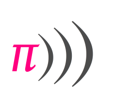
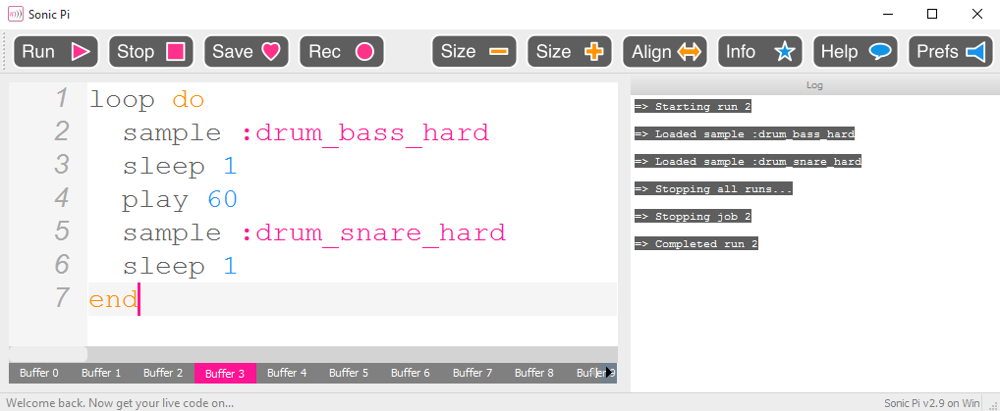
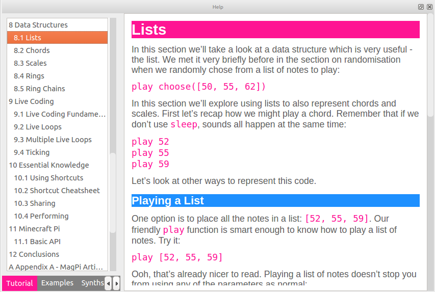
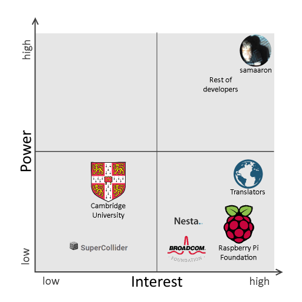
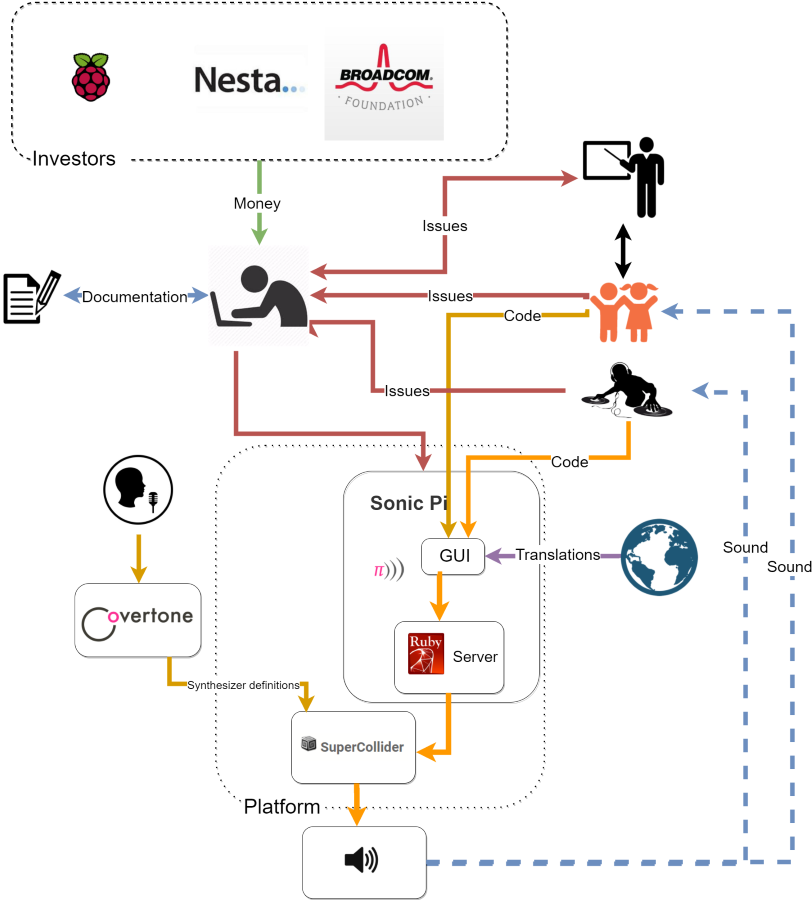
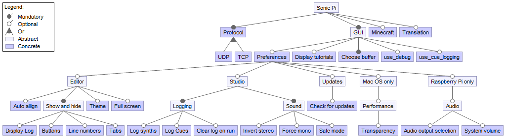

# Sonic Pi - The Live Coding Synth for Everyone

 

An in-depth analysis by Tom den Braber, Jeroen Castelein, Michel Kraaijeveld and Paul de Goffau, February-March 2016.

## Abstract
In this chapter we provide an analysis of Sonic Pi.
Sonic Pi is an application in which code can be written to create music.
Through examining the source code, the existing documentation and by contributing to the system, we gained insights which we used to describe a set of relevant views and perspectives.
These views and perspectives are based on software architecture standards.
They range from stakeholder analysis, to user functionalities, to the inner development view.
We round off with a small section on our experiences with contributing to the project.

## Table of Contents
- [Introduction](#Introduction)
- [Functional view](#Functional-view)
- [Stakeholders](#Stakeholders)
- [Context view](#Context-view)
- [Development view](#Development-view)
- [Variability perspective](#Variability)
- [Internationalization perspective](#i18n-perspective)
- [How to contribute](#how-to-contribute)
- [Conclusion](#Conclusion)
- [Appendix A - Ruby Gems](#appendix-a)
- [Appendix B - Code Smells in the Sonic Pi system](#appendix-b)

## Introduction
Sonic Pi is a free offline application where users can write their own code to produce music.
It is designed to provide an accessible programming platform for children or others with little programming experience.
Rather than having to create your first Java class with `public static void main(String[] args)` (what?) to get close to printing your first `Hello World` to the screen, all you have to do is write down `play 60` to hear your first beep.
Not impressed yet?
Add a loop, drum samples and some time between the samples.
That's all you need to get your first never-ending beat rolling.
The code is entered within the Sonic Pi application.
A screenshot of the GUI of the application can be found in Figure 1.

 
*Figure 1: Screenshot of the Sonic Pi application, with code for the never-ending beat*

Educational tools helping users learn how to code are provided in the form of tutorials.
Experienced users have been able to write existing or new songs, which they may share through code or sound.
Another feature that Sonic Pi is proud of, is live coding.
By creating a `live_loop`, users can modify their code on the go without having to stop the music in between.
This allows Sonic Pi to be used for live performances, and a small group of artists use Sonic Pi to perform at clubs and parties.
The development of Sonic Pi is done on GitHub and its code is completely open source.
Here, the developers come together to discuss issues, new features and changes to the system.
In the rest of this chapter, we present our analysis of Sonic Pi.
We offer several architectural views and perspectives, inspired by the book on Software Architecture by Rozanski and Woods [[1](#rozanski-woods-book)].
After reading this chapter, you will have a core understanding of the functionalities of Sonic Pi, its context, the stakeholders involved and the design choices made.
On top of that, you will be able to use this knowledge to start contributing to the project yourself.

## Functional view
Before we introduce all of the functionalities Sonic Pi has, it is good to mention what Sonic Pi aims to be. 
This can be learnt from the 'motto' as stated on the official website [[2](#sonic-pi-website)]:

> Learn to code creatively by composing or performing music in an incredible range of styles from classical to algorave.

Here, we already have a large portion of that what Sonic Pi wants to be summed up.
The primary goal is education: Sonic Pi offers a method for learning to code.
However, Sonic Pi also strives to be a musical instrument, and not just any musical instrument: it should be possible to make any kind of music you want to make, no matter how complex.
This can also be seen in the repository of the project [[3](#sonic-pi-repository)]:

> In addition to being an engaging education resource it has evolved into an extremely powerful and performance-ready live coding instrument suitable for professional artists and DJs.

### Functional Capabilities
Now that we know what the goals of Sonic Pi are, we can see which functionalities are offered to reach these goals. Because some functionalities are strongly related to each other, we categorize them into four categories: education, code, music and accessibility.

#### Education
Sonic Pi provides lessons within the application. 
Users can click on the 'Help' button in the GUI and the tutorials and examples are shown at the bottom of the screen.
The users can follow these lessons to learn programming and learn about programming concepts.
The lessons are written in such a way that they can be followed by aspiring programmers, even if those aspiring programmers are still children.
An example of such a lesson can be seen in Figure 2.
In this specific example, the student can learn about the list data structure and how it can be used in Sonic Pi.

 
*Figure 2: An example of a lesson that can be found within Sonic Pi*

#### Code
Sonic Pi provides its own Domain Specific Language (DSL). 
This language can be used to 'describe' sounds and subsequently play them. 
The Sonic Pi DSL is a collection of functions written in the Ruby programming language.
Sonic Pi can also transform the code that is written into sounds.
In order to be able to run this code, Sonic Pi has a code editor in which code from the DSL can be inserted.
Within the GUI, it provides some standard programming tools: users will see the exceptions their code throws, they can inspect the log-output and code can be automatically aligned.
The code editor is very basic; for example, it does not contain a debugger. 

#### Music
Although being able to write code in Sonic Pi is nice, it also has to be translated into music. 
This functionality is also present, making Sonic Pi a musical instrument. It is done by providing a number of synthesizers and some functions for timing and concurrency.
Sonic Pi itself does not actually make music: it uses an external platform called SuperCollider [[4](#supercollider-website)]. 
This does not mean that Sonic Pi does not do anything concerning the playing of music. 
Sonic Pi instructs SuperCollider on how and what it should play in terms of timing, beats per minute and what instruments to play among others.
To be able to use Sonic Pi for 'live coding', Sonic Pi is able to keep playing music while the code changes, and smoothly bring the changes into the currently playing musical composition.

#### Accessibility
The accessibility aspects of the application are strongly related to the goal concerning education.
To be able to be truly educative, it is also important to be easily accessible so that people will actually use the software.
Therefore, Sonic Pi provides a user interface which is internationalized to a great extent.
Almost all of the text shown in the GUI is loaded at runtime, translated to the default language of the computer running Sonic Pi if available.
Another aspect of accessibility is that the application comes with an installer, which is very easy to use.

As the name of Sonic Pi indicates, one of the core goals is to be able to run smoothly on a Raspberry Pi. 
The Raspberry Pi is a very cheap computer, so being able to run on the Raspberry Pi enlarges the possible userspace of Sonic Pi.
Sonic Pi can however be run on all major platforms to make it possible for everyone with access to a computer to learn programming.

### Internal Structure
Now that it is clear which functionalities Sonic Pi offers, we can have a first look at how Sonic Pi implements these functionalities.
A high-level overview can be seen in Figure 3.

There are two non-obvious choices that deserve some explanation: the choice for using SuperCollider as synthesizer tool and the choice for the overall architecture of having a client and a server.
The choice for SuperCollider can be explained by looking at another project where Sam Aaron, the founder of Sonic Pi, was involved. 
In 2010, a project called Overtone [[5](#overtone)] was founded, which also heavily relies on SuperCollider. 
Sam Aaron is also one of the main contributors of Overtone and has contributed to this project from the start and thus already had experience with SuperCollider when starting Sonic Pi in 2013. 
It is likely that this experience lead to the choice for using SuperCollider in Sonic Pi.
The second choice can possibly be explained by looking into the future: one of the ideas for contributions that can be found in the Sonic Pi repository is to synchronize multiple instances of Sonic Pi over the internet [[6](#how-to-contribute)], so that multiple artists can form an 'orchestra'. 
The client/server architecture could be a first step towards that goal, albeit that currently every client has an own dedicated server.

 
*Figure 3: Internal structure of Sonic Pi*

The GUI takes care of all interaction with the user. The Sonic Pi server provides all the business logic: the parsing of the DSL and sending instructions to the SuperCollider server.

The arrows in the diagram show the message flow. The GUI communicates with the Sonic Pi server over TCP or UDP. The Sonic Pi server communicates with the SuperCollider server using the OSC protocol. This protocol can be used for networking sound synthesizers, computers and other multimedia devices [[7](#osc-protocol)].

## Stakeholders
In order to understand why certain design choices have been made, and what roles people have taken in this project, we will describe the stakeholders that have been involved in the project.
These are separated into five groups: developers, suppliers, communicators, users and investors.

#### Developers
The most important group of stakeholders is the developers.
They are the ones who actively work on the project and use the application to come up with improvements and new ideas. 
The team of developers is quite small. 
[Sam Aaron](https://github.com/samaaron) is by far the main contributor and he responds to all issues and merges most of the pull requests. Joseph Wilk (@[josephwilk](https://github.com/josephwilk)), Xavier Riley (@[xavriley](https://github.com/xavriley)), Jeremy Weatherford (@[jweather](https://github.com/jweather)) and Hanno Zulla (@[hzulla](https://github.com/hzulla)) are other important developers that often join the development discussions or create issues/pull requests. 
They are mostly active in collaboratively thinking of a solution, after which it is implemented.
All of them have a great interest in Sonic Pi, whether as an educational tool or a music making tool which motivates them to develop further.

#### Suppliers
Sonic Pi is designed to run on the Raspberry Pi platform. 
The low price of the Raspberry Pi allows users to invest little money, while getting all of the features that Sonic Pi provides. 
Its small size also allows users to carry it along easily. 
This is what makes the Raspberry Pi foundation an important supplier.
Raspberry Pi has also included the Sonic Pi application in their Jessie distribution [[8](#Raspberry-Jessie)].

The [SuperCollider](http://supercollider.github.io/) project is the supplier of the sound for Sonic Pi, as it turns instructions into sound.

#### Communicators
This group consists of the Raspberry Pi Foundation, translators and guide creators. 
The Raspberry Pi Foundation has supported its development by offering learning material on their website [[9](#sonic-pi-lessons)].
A lot of people are involved by translating the tutorial that is embedded in the application.
Developers help each other by creating documentation.
The most useful documentation consists of guides to build the system on different operation systems.

#### Users
There are two groups of users, those who use it for education and those who use it for live performance.

* Education. Teachers use Sonic Pi to learn their students how to code interactively. It is not clear how many teachers do this, however the Raspberry Pi lessons have been trialled at a number of schools as part of the Computing curriculum in the UK. In this [blog](http://www.suppertime.co.uk/blogmywiki/2016/03/teaching-sonic-pi/) by one such teacher, he portrays how well Sonic Pi is received by his students. 
* (Live) musical performance. With Sonic Pi and live coding, Sam Aaron wants to introduce the computer as an instrument. He frequently performs at events and on [livestreams](https://www.livecoding.tv/samaaron/videos/BeBp3-live-coding-w-sonic-pi-303/) where he codes music. This is well received by the audience as it is quite impressive. Other artists have put some music up on for instance [SoundCloud](https://soundcloud.com/groups/sonicpi).  It is interesting to see that also source code is uploaded. An example is the start of the famous song "[Let it go](https://gist.github.com/danreedy/a0f0aa1ec2eb275c55a2)" from Disney's Frozen.

Both of these groups use the software for learning and enjoyment. 
They may encounter bugs or have ideas for new features, at which point they can approach the developers by creating an issue on GitHub.

#### Investors
The Sonic Pi project originates from a project funded by the Broadcom Foundation, executed by Sam Aaron at the University of Cambridge [[10](#origin-sonic-pi)]. 
The aim of this project was to create a product that would help teachers use the Raspberry Pi to teach computer science.

As time went by, the interest for Sonic Pi grew, now funded by the Raspberry Pi Foundation. 
They decided to improve Sonic Pi and design a v2.0. 
This project was called _Sonic Pi: Live and Coding_, and was partnered by [Cambridge Junction](http://www.junction.co.uk) and the Raspberry Pi Foundation.
From Nesta, a charity located in the UK dedicated to support ideas that can help improve our lives, they received a large donation to realize this project.

#### Classification of stakeholders: Power vs. Interest
All these stakeholders and their interests fit into a power-interest diagram, which can be seen in Figure 4.
Power indicates that a stakeholder has a lot of influence on the project.
Interest indicates that a stakeholder has a high interest in the prosperity of the project.
It is interesting to see how the stakeholders of any project actually interact with the development, should they be satisfied by developers or should the developers aim to accommodate to powerful stakeholders.

The stakeholders are placed according to their position within the project:

- **The developers** have high interest and high power, as they manage the whole project with passion. Their ideas and effort allow Sonic Pi to grow.
- Sam Aaron is on payroll at **Cambridge University** where he is a research associate. The Sonic Pi project started there, but after that they were never too involved with the development process.
- **SuperCollider** is an application that is used by, but does not rely on, Sonic Pi. It has little influence on Sonic Pi's growth.
- Stakeholders with low power and high interest are the **investors**, **suppliers** and **translators**. They want to use the application itself, or want to see it flourish because they think it might be interesting for the society.

 
*Figure 4: Power interest diagram of the Sonic Pi stakeholders*

## Context view
In Figure 5 Sonic Pi is depicted in relation to its context.
You can see the two groups of users, students and music performers, depicted at the right of the diagram.
The users enter code into the GUI.
This code is sent to, and interpreted by a server that runs a Ruby interpreter.
The server calls the SuperCollider application to play sounds.
The SuperCollider application processes these calls, and sends the required sound bits to the local sound system.
This sound is heard by the user.
The required sounds have mostly been created by an application called Overtone, where performers can create new music samples.
The Sonic Pi system is maintained and improved by the developers. 
These developers are supported by documentation made by the communicators.
The developers are funded by some companies, depicted by the logos of Nesta and the Broadcom Foundation.
The developers base their maintaining and improvements on the issues, mostly created by teachers that interact with their students, but also directly by the students.
Recall that the group of users also contains performers that use the application to create music.

 
*Figure 5: Context view*

## Development view
The development view describes the structure of the Sonic Pi system from the perspective of developers.
This includes the different modules of the system, the testing and release processes and an analysis on technical debt.

### Module structure model
The Sonic Pi system consists of two parts: a GUI and a server.
In this section, the organization of Sonic Pi's source code is shown by giving an analysis of the modules and their interdependencies. 
In addition, to get a clear overview of the interactions, the modules are presented in layers.

#### GUI
We start by analyzing the GUI, of which the main task is to make interaction with the actual application possible via graphical elements; it should enhance the user experience. 
This can also be seen in the various modules that were identified.
The following modules are contained in the GUI. 

- **MainWindow**: The main code source, creates the GUI that is visible and controls most of the user interaction. 
- **SonicPiOSCServer**: Handles the starting and stopping of the listening to the server (the other part of the system).
- **OscHandler**: Handles all the messages received, executes the relevant functions.
- **SonicPiAPIs**: Manages auto-completion.
- **SonicPiLexer**: Colors keywords based on the active theme.
- **SonicPiLog**: Adds messages to the log output in the GUI, colored based on the active theme.
- **SonicPiScintilla**: Handles all the text coloring, text inserting, layout, etc. on the main coding screen.
- **SonicPiTheme**: Implements the themes.
- **Help & doc**: Automatically generated files for the tutorials and documentation within the GUI.
- **[Qt](http://www.qt.io/)**: The external Qt framework that the GUI is built upon.
- **[Qscintilla](https://riverbankcomputing.com/software/qscintilla/intro)**: A port to Qt of the Scintilla[[11](#scintilla)] C++ editor control.

In addition, you can find the dependencies of the different modules depicted in Figure 6.
Note that some modules depend on libraries more than one layer down, due to the use of Qt in all modules.

 
*Figure 6: GUI module structure model*

#### Server
The server part of the system contains the _business logic_ of the program.
The modules in the server are a collection of functional modules to execute commands from the GUI, definitions for the code to be interpreted, and the communication with the SuperCollider server.

- **sonic-pi-server.rb**: Instantiates all necessary threads to run the system on this end.
- **Runtime**: Takes transformed input from the GUI and processes this so that the necessary functions are executed.
- **Studio**: Controls the music settings, the recording, and the communication with SuperCollider.
- **OSC::UDPClient**: Listens to the GUI.
- **OSC::UDPServer**: Performs the communication with the GUI and SuperCollider.
- **OSC**: Contains the OSC encoding and decoding.
- **Core**: Has basic helper functions, some threading functions. This forms a backend to all the code.
- **Settings**: Handles user settings; loading, changing and saving.
- **SynthInfo**: Contains the information on the different synth options.
- **LangDefs**: Contains special language definitions, functions etc. 
- **SoundDefs**: Contains special language definitions, functions etc. These functions also contain the execution of synths.
- **Ruby Standard Library**: The standard modules and classes that come with Ruby.
- **Ruby Gems**: Are packets of external Ruby code that are easily installable. The list of used gems can be found in Appendix A.

You can find the dependencies of the server in Figure 7.

 
*Figure 7: Server module structure model*

### Testing Approach
Testing is done both locally and with a continuous integration server on GitHub.
At the time of writing, 109 automatic tests have been added to the system, resulting in a line coverage of 6%.
This amount is not astonishing, considering there are many more classes and methods that keep Sonic Pi running.
A thing to note though; the Sonic Pi source code also contains a lot of inline documentation, which are counted by the program.
Therefore, the actual coverage is higher, but could not be measured with the tools available.
The lack of tests can also be seen in the contribution guide, as it is not stated that tests need to be provided when creating a pull request.

### Release Process
All changes are merged directly to the master branch of the project, so there is no branch available that only contains stable releases.
This means that between versions, you will need to use the release tags or download an executable from the [Sonic Pi website](http://sonic-pi.net) to get a stable version.
Furthermore, there are no formal requirements that a release should fulfill, such as test coverage or documentation.
Therefore, technical integrity is not guaranteed and releases are made when Sam Aaron decides that enough additions have been made.
When a new public version is released, the current state of the master branch is tagged accordingly and new installers will be created so they can become available as downloads on the [website](http://sonic-pi.net).

### Technical Debt
The extra time needed to make changes, especially to parts which were quickly and not optimally implemented, is considered as technical debt.
When a project suffers from technical debt, it is more difficult and costly to maintain it properly.
Several elements of technical debt can be distinguished: 

- **Low test coverage**; as mentioned earlier, the system is not optimally tested as only a small part is covered. Although 100% coverage does not mean that every possible bug or defect is found, increasing the current percentage would still be a good approach.
- **Deficient documentation**; none of the files had a description of what their usage is which makes it hard to find out the exact use of some of the files. No module or method documentation is presented, which makes it difficult to understand the intended working of classes and methods. Also the source code lacks consistent commenting.
- **Addressing of issues**; multiple issues are available in the [issue tracker on GitHub](https://github.com/samaaron/sonic-pi/issues). Most of them are quickly addressed, but it isn't always clear why some are still unresolved. Therefore it is not clear whether the project has technical debt based on the issue handling alone.
- **Code smells**; some examples of code smells are large classes, duplicate code or a high cyclomatic complexity.
Since most of the logic of the Sonic Pi program is written in Ruby, Reek [[12](#reek)] was used and gave a lot of valuable insights in the amount of code smells in the code.
The result of this can be found in Appendix B.
In addition to the code smells, there are also libraries used in the Sonic Pi project, which are not always up to date.
Since around 40% of the used libraries are not up-to-date, and one is even deprecated, we can conclude that technical debt is affecting the Sonic Pi project.

## Variability perspective 
Practically every software product has some form of configurability in them. 
Whether it is obtained through different versions of the software, e.g. enterprise edition vs. free edition, or possibly by changing options within the application, such as displaying line numbers in a text editor.
Sonic Pi is no stranger to this concept. 
Within the user interface there are many adaptable features concerning for instance logging and user friendliness.
There are also different builds for different operating systems, which alter some of Sonic Pi's functionalities.

To show the configurability of the system, we display all the _variable features_ offered.
In the feature model (Figure 8) all of these features are displayed.
Distinction is made between optional and mandatory features, as portrayed in the legend.
The lighter colored boxes are abstract features containing a set of other features. 
The darker colored boxes are features the user may change.
The model is constructed using the eclipse plugin FeatureIDE [[13](#featureide)].

 
*Figure 8: Feature Model, created with FeatureIDE*

These variable features can be changed at different times.
We distinguish compile-, boot- and runtime.

#### Compile-time
In the source code, directives are used to include and exclude certain lines of code when compiling for a certain operating system.
A couple of features are only compiled for certain operating systems. They can be found in Figure 8 under the _Raspberry Pi only_ and _Mac OS only_ nodes.
Since no specific features are available only on _Windows_, there is no node containing this operating system.

#### Boot-time
Boot-time is a special kind of runtime.
In our definition, features are bound at boot-time when the feature is set when starting the program and it cannot be changed afterwards.
Two features fulfill these criteria.
First, the translation that is used in the GUI.
When the program is booted, the system locale is used to try and find an appropriate translation.
After the program has decided a language, there is no way for the user to change it.
The other feature is the communication protocol (TCP or UDP) used.
The server can be configured using a parameter.
However, it is not possible to change this decision after the server has been started.

#### Runtime
All other features are decided at runtime.
Whilst using the program the user can change these features.
For instance, the user can switch the theme between a light and a dark theme, or they can enable/disable logging on their code runs. 

## Internationalization perspective
With Sonic Pi's goal to be used by children globally, internationalization (i18n for short) is an important perspective that needs to be taken into account.
Although a majority of the children nowadays learns English at school early on or through interaction with the internet, most will not feel comfortable in playing with an application if it is not in their mother tongue.
Sonic Pi aims to provide this comfort by translating the interface and most importantly the tutorials.
At the time of writing, 9 different languages are available, from English to French to Japanese.
To increase this number, the developers approach their users to contribute with a translation of their language.
This is implemented by displaying a message to users from countries with no available translation with a link to the Sonic Pi repository.
In the repository an extensive explanation is provided for users unfamiliar with GitHub on how to add their language.

One thing that is not translated is the code the user writes.
The code can be written in unicode, and thus supports every alphabet.
However, the language definition used in Sonic Pi is always in English.
This is not optimal, as someone who understands what `play_pattern_timed` means through language can use it more easily than someone who doesn't.

Similar to the language definition, the Ruby runtime executing the code written by the user can produce syntax errors or other errors.
These errors are shown in the GUI, but are not translated.
This makes debugging difficult if the user cannot read English.
A small compensation is offered by highlighting the line in the code that generated the error.

Other important elements that could still be translated are the buttons in the top bar.
These buttons are based on images, containing short English terms, of which an example can be found in Figure 9.
To compensate for the English labels on the images, the developers also included a small image that intuitively shows the function of the button.

 
*Figure 9: Some of the buttons in the GUI*

Other improvements that could still be made to improve internationalization are:

- options to change the language at runtime, rather than being decided on boot.
- offering text-orientation; some languages are written right to left, rather than left to right.

## How to contribute
Sonic Pi is open to contributions, but it might not be very clear on how you can contribute to it.
Therefore, we devote a section to our experiences with contributing to Sonic Pi.
To start off, there are no specific rules you need to comply with when writing code for the project.
As a result, most of the pull requests with code changed are merged if they look good and contributing can be considered easy that way.
In addition, Sam Aaron is quick to reply on pull requests, which ensures that you know what you are up to.
A drawback of the lack of rules is that you don't know beforehand whether your changes fit in with the project and you need to await the initial feedback.

Due to a lack of planning, although this is improved for the [upcoming version 3.0](https://github.com/samaaron/sonic-pi/milestones/v3.0), it is not always easy to find parts of Sonic Pi you can work on. 
One of the things you can do, is go through the issue list and see whether you can fix any of the problems that are indicated there.
You can also create an issue yourself in which you explain a feature that you want to have implemented and work on it yourself.
There is a [contribution guide](https://github.com/samaaron/sonic-pi/blob/master/HOW-TO-CONTRIBUTE.md) available that lists some ideas for future Sonic Pi versions.
However, it is not updated often and some of the listed features are already implemented in the meantime; making it not the best reference.
The same applies to the milestones mentioned earlier, as these are not actively used.

Overall, Sonic Pi is a project to which you can contribute easily; provided that you first have found something to contribute. In the future this might be more easily, if they stick to using [milestones](https://github.com/samaaron/sonic-pi/milestones/v3.0) and tagging issues appropriately.

## Conclusion
Sonic Pi is an innovative application to learn coding through music.
It offers tutorials and examples to get everyone started, and is even used in lessons by the Raspberry Pi foundation.
Aside from teaching, it can also be used for performing.
Sonic Pi has the ability for 'live coding', making it possible to compose pieces of music and play, and even edit it, live.
Overall, Sonic Pi is a fun program to use and definitely a nice way to learn people how to code.

We do think that there are a couple of improvements that could be made to the Sonic Pi project.
To start, the way in which pull requests are merged can be changed.
Currently changes are merged when they look good, but there is no proper testing required, resulting in some merges breaking parts of the system.
A proper test suite would solve this problem.
Elaborating on this, a test suite would also make requirements for contributing more clear, as there are currently no guidelines that your pull request needs to comply with.
Another thing that can be improved is the planning of the project.
At this moment, it is not entirely clear what we can expect of Sonic Pi in the future.
Milestones are not very actively used, so it would be a big improvement if it was clear which people are working on what features and what the planning of the project is in the long run.

## References
1. 
 Rozanski, Nick, and Eoin Woods. _Software systems architecture: working with stakeholders using viewpoints and perspectives_. Addison-Wesley, 2012.
2. 
 Sonic Pi, http://sonic-pi.net/. Accessed on March 14, 2016.
3. 
 samaaron/sonic-pi: The Live Coding Synth for Everyone, https://github.com/samaaron/sonic-pi. Accessed on March 14, 2016.
4. 
 SuperCollider >> SuperCollider, https://supercollider.github.io. Accessed on March 14, 2016.
5. 
 Overtone - Collaborative Programmable Music, http://overtone.github.io/. Accessed on March 29, 2016.
6. 
 sonic-pi/HOW-TO-CONTRIBUTE.md at master - samaaron/sonic-pi, https://github.com/samaaron/sonic-pi/blob/master/HOW-TO-CONTRIBUTE.md. Accessed on March 30, 2016.
7. 
 Introduction to OSC | opensoundcontrol.org, http://opensoundcontrol.org/introduction-osc. Accessed on March 26, 2016.
8. 
 Raspberry Jessie description, https://www.raspberrypi.org/blog/raspbian-jessie-is-here/. Accessed on February 16, 2016.
9. 
 Sonic Pi tutorial, https://www.raspberrypi.org/learning/sonic-pi-lessons/. Accessed on February 16, 2016.
10. 
 WIPO magazine, _Sonic Pi: Getting Creative With Computer Programming_,  http://www.wipo.int/wipo_magazine/en/2015/03/article_0007.html. Accessed on February 16, 2016.
11. 
 Scintilla, http://www.scintilla.org/. Accessed on February 29, 2016.
12. 
 Reek, https://github.com/troessner/reek. Accessed on February 26, 2016.
13. 
 Thomas Thüm, Christian Kästner, Fabian Benduhn, Jens Meinicke, Gunter Saake, and Thomas Leich. FeatureIDE: An Extensible Framework for Feature-Oriented Software Development. Science of Computer Programming, 79(0):70-85, January 2014.
14. 
 Unused gems? - Issue #928 - samaaron/sonic-pi, https://github.com/samaaron/sonic-pi/issues/928. Accessed on February 29, 2016.

## Appendix A - Ruby Gems
The list of Ruby gems is quite long, and we did not manage to identify why each gem was used. 
Strangely enough, there are even gems present in the 'vendor' folder that are not used at all.
These gems are scheduled to be used within a certain timespan [[14]](#unused-gems). 
There are also gems that are only used for testing.
Among all the gems listed below, we can see that there are a few recurring categories: sound-related gems and gems related to parsing and compilation. 
These two categories are very important to the Sonic Pi system and it is not surprising to find them in the listed gems as well.

- [ActiveSupport](http://api.rubyonrails.org) - a set of utility classes from the Rails framework
- [alsa-rawmidi](https://github.com/arirusso/alsa-rawmidi) - access the alsa raw midi API via Ruby
- [ast-2.0.0](http://whitequark.github.com/ast/frames.html) - library for working with Abstract Syntax Trees
- [atomic](http://github.com/headius/ruby-atomic) - provides a class for providing atomic updates
- [benchmark-ips](https://github.com/evanphx/benchmark-ips) - can be used for benchmarking
- [BlankSlate](https://github.com/masover/blankslate) - provides an empty base class which can be used for e.g. dynamic proxies
- [did-you-mean](http://github.com/yuki24/did_you_mean) - provides 'did you mean suggestions' in errors
- [ruby-ffi](https://wiki.github.com/ffi/ffi) - ruby extension for programmatically loading dynamic libraries, binding functions within them, and calling those functions from Ruby code
- [ffi-coremidi](http://github.com/arirusso/ffi-coremidi) - Access the Apple Core MIDI framework API with Ruby.
- [hamster](http://rubydoc.info/github/hamstergem/hamster/master/Hamster/Hash) - Efficient, immutable, and thread-safe collection classes for Ruby
- [i18n](http://ruby-i18n.org/wiki) - Ruby Internationalization and localization solution.
- [interception](https://github.com/ConradIrwin/interception) - Interception (intercept + exception) allows you to intercept all exceptions as they are raised. (probably used for catching exceptions caused by a user's code)
- [kramdown](http://kramdown.gettalong.org/) - kramdown is yet-another-markdown-parser but fast, pure Ruby, using a strict syntax definition and supporting several common extensions.
- [metaclass](https://github.com/floehopper/metaclass) - provides a `__metaclass__` method to all ruby objects
- [midi-winmm](http://github.com/arirusso/midi-winmm/) - Realtime MIDI input and output with Ruby for Windows/Cygwin. Uses the WinMM system API
- [midilib](http://github.com/jimm/midilib) - midilib is a pure Ruby MIDI library useful for reading and writing standard MIDI files and manipulating MIDI event data.
- [minitest](https://github.com/seattlerb/minitest) - Ruby testing framework
- [mocha](http://gofreerange.com/mocha/docs/) - provides methods for stubbing and mocking
- [multi_json](https://github.com/intridea/multi_json) -  will simply choose the fastest available JSON coder
- [narray](http://masa16.github.io/narray/) - alternative, fast Ruby Array implementation
- [parser](https://whitequark.github.io/parser/) - Parser is a production-ready Ruby parser written in pure Ruby
- [parslet](http://kschiess.github.com/parslet) - Parslet makes developing complex parsers easy.
- [Rouge](https://github.com/jayferd/rouge) - Pure Ruby syntax highlighter
- [ruby-beautify](http://www.arachnoid.com/ruby/rubyBeautifier.html) - will pretty up ruby code.
- [rubame](https://github.com/saward/Rubame) - Rubame is a simple Ruby websocket game server.
- [coreaudio](https://github.com/nagachika/ruby-coreaudio) - CoreAudio (Audio Framework of Mac OS X) wrapper library for ruby 1.9
- [ruby-prof](http://github.com/ruby-prof/ruby-prof) - ruby-prof is a fast code profiler for Ruby.
- [rugged](https://github.com/libgit2/rugged/) - Rugged is a library for accessing libgit2 in Ruby. It gives you the speed and portability of libgit2 with the beauty of the Ruby language.
- [Thread_safe](https://github.com/ruby-concurrency/thread_safe) - A collection of thread-safe versions of common core Ruby classes.
- [unimidi](http://rdoc.info/gems/unimidi) - Platform independent realtime MIDI input and output for Ruby.
- [wavefile](http://wavefilegem.com/) - A pure Ruby gem for reading and writing sound files in Wave format (*.wav).
- [websocket](https://github.com/imanel/websocket-ruby) - Universal Ruby library to handle WebSocket protocol

## Appendix B - Code Smells in the Sonic Pi system

| Code Smell | Instances |
| ---------- | --------- |
| Attribute | 9 |
| BooleanParameter | 34 |
| ClassVariable | 16 |
| ControlParameter | 33 |
| DataClumb | 5 |
| DuplicateMethodCall | 365 |
| FeatureEnvy | 64 |
| IrresponsibleModule | 169 |
| LongParameterList | 23 |
| NestedIterators | 17 |
| NilCheck | 9 |
| PrimaDonnaMethod | 17 |
| RepeatedConditionals | 11 |
| TooManyInstanceVariables | 16 |
| TooManyMethods | 9 |
| TooManyStatements | 173
| Uncommunicative (Parameter, Variable, Module) | 397 |
| UnusedParameter | 31 |
| UtilityFunction | 166 |
