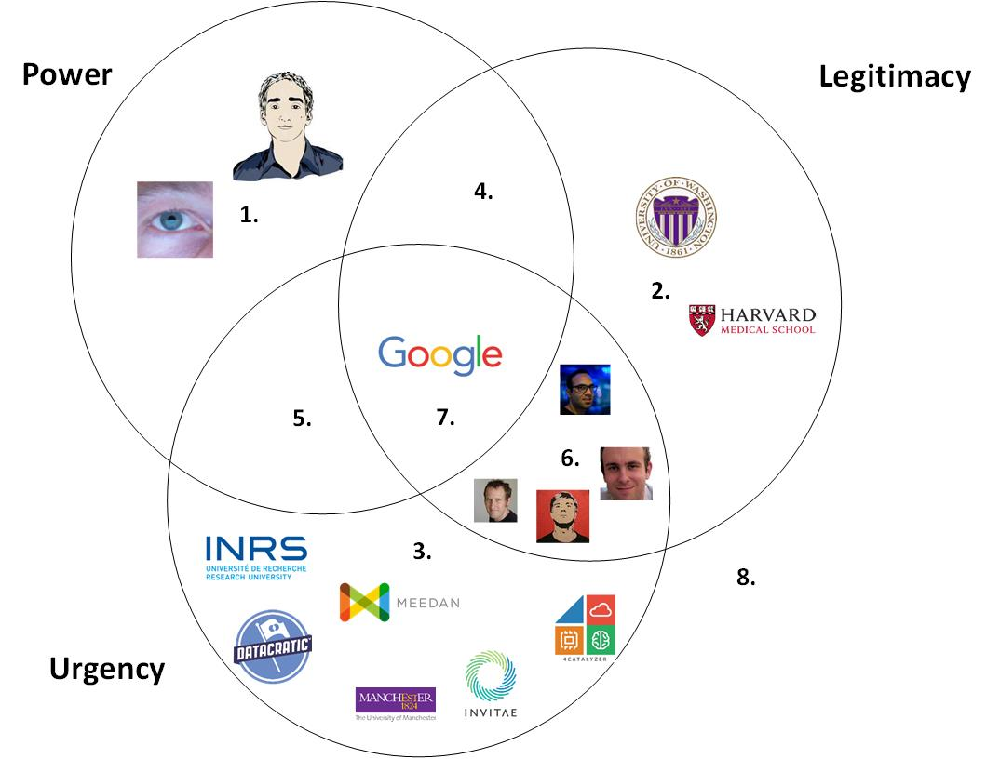
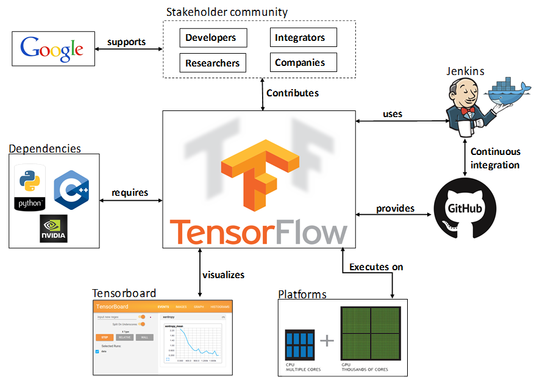
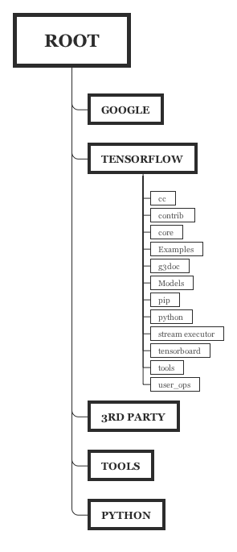
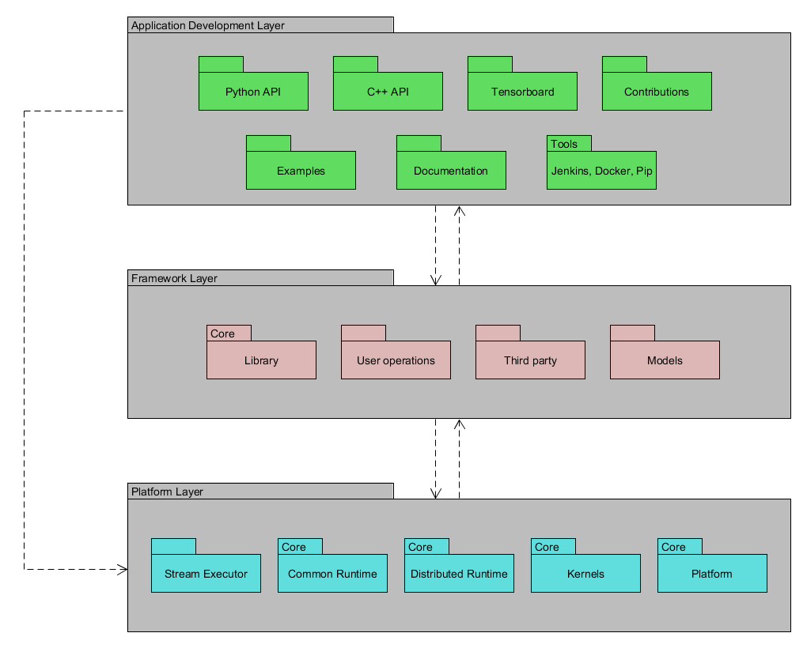
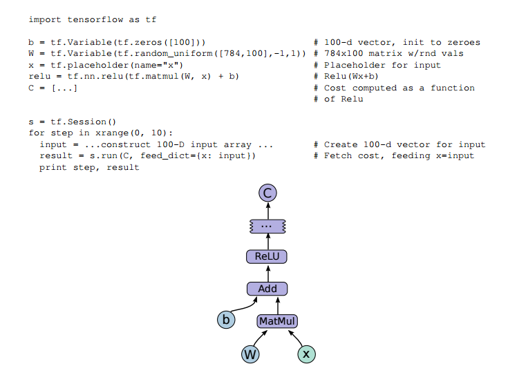
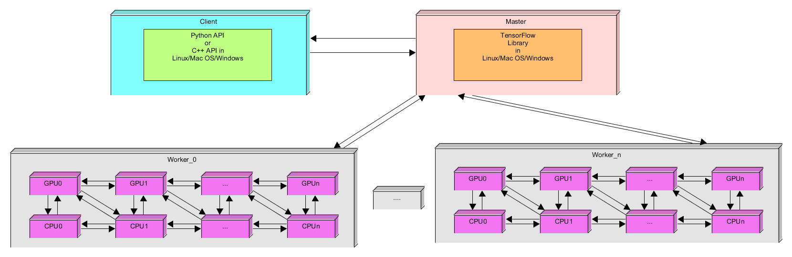
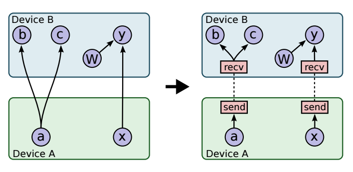

# TensorFlow™ - Open Source Library for Machine Learning Applications

  

By: Carmen Chan-Zheng, Ilse Verdiesen, Johan Carvajal-Godinez and Pranav Sailesh Mani  
Software Architecture, Delft University of Technology

##Abstract
TensorFlow™ is an open source software library developed by the Google Brain team for the purpose of conducting machine learning and deep neural networks research. The library performs numerical computation by using data flow graphs, where the nodes in the graph represent mathematical operations and the graph edges represent the multidimensional data arrays (tensors) which communicate between the nodes. The API has been used in the fields of medicine, translation services, and the analysis of financial markets. This chapter first describes TensorFlow™ by its features and stakeholders, secondly the architecture is analyzed by means of the context, development, and deployment view, and finally a conclusion is provided.

##Table of Contents

1. [Introduction](#int) 
2. [What is TensorFlow?](#wit) 
  2.1. [Features](#fea) 
  2.2. [Stakeholders](#sth) 
3. [Architecture](#arc) 
  3.1 [Views](#vie) 
      - 3.1.1 [Context view](#contv) 
      - 3.1.2 [Development view](#devv) 
      - 3.1.3 [Deployment view](#depv) 
  3.2 [Perspectives](#per) 
      - 3.2.1 [Evolution perspective](#evp) 
      - 3.2.2 [Variability perspective](#vap) 
      - 3.2.3 [Performance perspective](#pep) 
4. [Conclusion](#con) 
5. [References](#ref) 

##
1. Introduction
Machine learning is an artificial intelligence enabler that provides the foundations for extending the computer capabilities closer to human brain. To get there, new tools need to be developed, especially new models of computation that support faster application development cycle. This is not an easy task, which requires the help from the crowd sourcing community. 
TensorFlow™ is an extended version of DistBelief, a system developed for internal use at Google. DistBelief was internally used by Google employees to build large neural networks and scale training to thousands of cores in Google's datacenters. Some of the applications of Distbelief were image recognition, speech recognition, Google search etc. However, DistBelief had its own disadvantages. It was specifically designed for neural networks and was difficult to configure. It was also tightly coupled to Google's internal infrastructure. In order to overcome this problem, Google developed TensorFlow™ whose main purpose is to simplify real world use of machine learning systems. It is only recently (From December 18th 2015) that the TensorFlow™ team has started accepting contributions through GitHub before they were using the Gerrit system for collaborating. The history of developments starts from TensorFlow™ v0.5.0 till the current version 0.7.0.
This chapter is intended to explore three key elements: (1) What is TensorFlow™, (2) its main architectures views, and (3) its more relevant perspectives. Following this purpose, this chapter has been organized to explore the stakeholders, the context view, the development view, the deployment view, the evolution-, the variability-, and the performance perspectives.

##
2. What is TensorFlow™?
TensorFlow™ is an open source library for developing machine learning applications. These applications are implemented using graphs to organize the flow of operations and tensors for representing the data. It offers an application programming interface (API) in Python, as well as a lower level set of functions implemented using C++. It provides a set of features to enable faster prototyping and implementation of machine learning models and applications for highly heterogeneous computing platforms.
####
2.1 Features
[Tensorflow™'s webpage](https://www.tensorflow.org/) enlists the system's most important features, which are described as:

1. **Deep Flexibility**: Provides tools to assemble graphs for expressing diverse machine learning models. New operations can be written in Python and low-level data operators are implemented using in C++.
2. **True Portability**: Runs on CPUs, GPUs, desktop, server, or mobile computing platforms. That make it very suitable in several fields of application, for instance medical, finance, consumer electronic, etc. 
3. **Connect Research and Production**: TensorFlow™ allows industrial researchers a faster product prototyping. It also provides academic researchers with a development framework and a community to discuss and support novel applications. 
4. **Auto-Differentiation**: This is a key feature within the machine learning community. Gradient based machine learning algorithms benefit from automatic differentiation capabilities. As a TensorFlow™ user, you define the computational architecture for your predictive model, combine it with your objective function, and just add data to test your machine learning model.
5. **Language Options**: Python and C++. However, currently other APIs are being developed, for example a Ruby API.
6. **Maximize Performance**: Allows you to make the most of your installed hardware. Freely assign compute elements of your TensorFlow™ graph to different devices, and let TensorFlow™ handle the copies.

###
2.2 Stakeholders
TensorFlow™ is a very active community consisting of a very diverse group of Developers, Integrators, Researchers, Students, Architects, Software Engineers, Companies (i.e Engineers, managers, CEO, etc.), Consultants and Hardware Manufacturers (NVIDIA, ARM, Intel) (figure 1). Each group is assigned to each type of stakeholders according to the classification proposed in Mitchell et al.[[1](#mi)].

|Type of Stakeholder	  |  Description[[1](#mi)]	|  Application to TensorFlow™ 	|
|---	|---	|---	|
| Dormant Stakeholder (1)  	|  The relevant attribute of a dormant stakeholder is power. Dormant  stakeholders possess power to impose their will on a firm, but by not having a legitimate relationship or an urgent claim, their power remains unused. 	|  Integrators 	|
|  Discretionary Stakeholder (2) 	| Discretionary stakeholders possess the attribute of legitimacy, but they have no power to influence the firm and no urgent claims.  	| Researchers  	|
| Demanding Stakeholder (3)  	|  Where the sole relevant attribute of the stakeholder-manager relationship is urgency, the stakeholder is described as "demanding." Demanding stakeholders, those with urgent claims but having neither power nor legitimacy, are the "mosquitoes buzzing in the ears" of managers. | Students, Consultants and Companies  	|
| Dominant stakeholders  (4)  | In the situation where stakeholders are both powerful and legitimate, their influence in the firm is assured, since by possessing power with legitimacy, they form the "dominant coalition" in the enterprise.  | Hardware Manufacturers |
| Dangerous stakeholders  (5) |  We suggest that where urgency and power characterize a  stakeholder who lacks legitimacy, that stakeholder will be coercive and possibly violent, making the stakeholder "dangerous," literally, to the firm. 	| Researchers using multiple libraries, for instance Microsoft [CNTK](https://github.com/Microsoft/CNTK)|
| Dependent Stakeholder  (6) 	|  We characterize stakeholders who lack power but who have urgent legitimate claims as "dependent," because these stakeholders depend upon others (other  stakeholders or the firm's managers) for the power necessary to carry out their will. 	|  Architects and Software Engineers 	|
| Definitive Stakeholder  (7) 	|  By definition, a stakeholder exhibiting both power and legitimacy already will be a member of a firm's dominant coalition. When such a stakeholder's claim is urgent, managers have a clear and immediate mandate to attend to and give priority to that stakeholder's claim. 	| Developers  	|
The following figure plots each of the stakeholder according to its type:

  

                                   Figure 1. Stakeholder groups for TensorFlow

##
3. Architecture
The architecture of TensorFlow™ is described based on (1)_views_, which according to Rozanski and Woods[[2](#rw)] consists of elements or aspects of the architecture that are relevant to the concerns of the stakeholders, and (2)_perspectives_ which are a set of related quality properties across a number of the system’s architectural views that require consideration. In this paragraph first the context-, development- and deployment view are described, followed by the evolution-, variability- and performance perspective. 

###
3.1 Views
In this paragraph the context view provides insight in the relationship between TensorFlow™ and its environment, the development view gives a description of models that are of concern of the stakeholders, and the deployment view shows the environment into which the system is deployed and the dependencies that the system has on its elements.

####
3.1.1 Context view
The purpose of this section is to elaborate on the relationships, dependencies and interactions between TensorFlow™ and its environment. The main goal is discovering how these elements affect TensorFlow’s™ architecture. It will help to understand TensorFlow™ boundaries, as well as, its scope.

#####3.1.1.1 Scope definition
For this chapter, the most relevant elements surrounding TensorFlow™  have been considered. There were identified 5 key aspects that enables the operation of the library. These are: stakeholder community, repository management, execution platforms, visualization tools, and Library dependencies. These elements are described in more detail in the following subsections.    

######3.1.1.2 Stakeholder community
In the previous section the stakeholder community was described in detail. From this analysis, four key players were identified: developers, researchers, integrators and companies. 
Developers are those who enable new models, operations and tools within the API. They have a strong background in computer science. On the other hand, researchers use the latest version of TensorFlow™'s implementation to develop applications and study machine learning algorithms. Integrators are in charge to make decisions on whether or not a contribution can be integrated to the code base. These contributions are being proposed mainly by developers and researchers. Finally, the companies explore the results of researchers and try to enable new features on their products, taking advantage of their improvements. All of these four actor define the contributor community of TensorFlow™, which is supported by Google, in order to provide resources, but to gain expertise that could be used in future products.

######3.1.1.3 Repository Management
TensorFlow™  is hosted at GitHub under the Google's support. As mentioned previously, integrators are in charge of analyzing pull requests and determining if these can be merged. TensorFlow™ uses Jenkins as a continuous integration platform. Also, Docker is used to support the their delivery process.

######3.1.1.4 Execution Platforms
The execution environment surrounding TensorFlow™ is very heterogeneous. The Library supports ports for CPU, GPU and mobile platforms. It makes the library suitable for many application fields, but increases the implementation complexity. For example, for GPU implementation, currently only CUDA is supported, and for mobile platforms only Android. Also, there is a price to be paid when offering flexibility, which is performance. Later in this chapter we will see an analysis of this aspect.

######3.1.1.5 Visualization tools
Visualization is a key element for researchers. It allows to compare, but also to play with parameters to optimize the algorithm performance. Tensorboard is a module provided for that purpose. It takes the results from execution and enables the user to display, and compare different runs.

######3.1.1.6 Dependencies
As many other libraries, TensorFlow™ requires features from other systems, not just for maintaining the repository, but for enabling new functionalities. The main dependencies are the NVIDIA driver support for CUDA, the Python and C++ language support. There are several other dependencies that would be detailed in the development view.

In figure 2 the relation between the surrounding elements and the TensorFlow™ library are illustrated.

  

                              Figure 2 Context diagram for TensorFlow™ 

####
3.1.2 Development view
This view addresses the specific concerns of the software developers and testers[[2](#rw)]. This section contains the description of three different models: Codeline Models, Module Structure Model, and Common Design Models.

#####3.1.2.1 Codeline Models
This section explores the code structure of TensorFlow™  with the purpose of getting a better understanding on how the project is organized. 

######3.1.2.1.1 Source code hierarchy 
TensorFlow™ 's root directory at GitHub is organized in five main subdirectories: google, tensorflow, third-party, tools and util/python. Additionally, the root directory provides information on how to contribute to the project, and other relevant documents. In figure 3, the source code hierarchy is illustrated.

  

                                 Figure 3. TensorFlow™ source code organization

Following subsections will elaborate on the purpose of the five main subdirectories shown in figure 3:

######3.1.2.1.2 Google
This subdirectory provides an instance of ¨Protocol Buffers¨ library, a Google's language and platform neutral, mechanism for serializing structured data. That is required since TensorFlow™ supports implementations in C++ using a single Python API, which requires a common data interface. Also, it enables support to implementation with other programming languages, for instance, Java, Ruby and many others.

######3.1.2.1.3 Tensorflow
This is the heart of the library's implementation. It contains a set of subdirectories intended to:

* cc: declaring function wrappers for C++ code.
* contrib: containing features and contributions that eventually should get merged into tensorflow/core. 
* core: providing an implementation for the main functionalities of TensorFlow™. 
* examples: containing reference applications for contributors. 
* g3docs: contains documentation for Python and C++ APIs. 
* models: containing models for specific application implementation.
* python: containing the implementation of Python to support the application development API. 
* stream-executor: providing an interface with hardware accelerators (GPUs).
* tensorboard: containing a suite of web applications for inspecting and understanding of TensorFlow™ runs and graphs.
* tools: providing a proper execution environment for the library.
* user_ops: providing wrappers for customized user functions (i.e. ackermann).

######3.1.2.1.4 Third-party
This directory provides instances of useful third-party libraries to help the TensorFlow™ application developers. Three main libraries are identified here: 

* [Eigen3](http://eigen.tuxfamily.org/index.php?title=3.0): a C++ template library for linear algebra operations.
* gpus: a crosstool wrapper for compiling CUDA programs.
* [numpy] (http://www.numpy.org/): a package for scientific computing with Python.

######3.1.2.1.5 Tools
This provides a place to put a script to indicate Bazel which version of Python is being used.

######3.1.2.1.6 Util/ python
This provides a place to put a script to generate relative paths for Python, so it works in both a local or remote repository.

#####3.1.2.2  Module Structure Models

The purpose of this section is to focus on the organization of the TensorFlow™'s repository and group the modules into layers of abstractions. 

######3.1.2.2.1 Classify the Modules
As shown in the section "Codeline Models", the TensorFlow™ GitHub Repository is organized and classified as shown in Figure 3, these can be classified in the following way:

* Application development modules: Python API (_pp_ folder), C++ API(_cc_ folder), Tensorboard, contributions (_contrib_ folder), examples, tools such as Jenkins, pip and Docker (_tools_ folder in root directory) and useful documentation such as: APIs documentation, tutorial, getting started example located in _g3docs_ directory.
* Framework modules: Models, user operations, then from _tensorflow/core_ directory: libraries (_lib_ folder), and from the _root_ directory: 3rd party.
* Platform modules: from _tensorflow/tensorflow_ directory: Stream executor and the __tensorflow/tensorflow/core_ directory: kernels implementation, common_runtime, distributed_runtime, etc.

######3.1.2.2.2 Module Dependencies
To identify the module dependencies, each code from the application development, framework and platform modules group were analyzed. For example, the _function.py_ (from the Python API of the Application development group) shows a clear dependency to the Platform modules and Framework modules. This same approach was applied for each source file from the repository and the main identified dependencies are:
* Application development group and Framework group share dependencies between them. 
* Application development group with Platform group.
* Platform group and Framework group share dependencies between them.

######3.1.2.2.3 Layering Rules
In _Classify the Modules_ section, the modules have been classified into different groups. These groups can be used as the layers to organize the structure of the TensorFlow™ repository:

1. Application Development layer: This layer contains the tools for the user to develop any TensorFlow™ application. It contains API documentations, examples, tutorials, contributions from other users, installation and distribution tools.
2. Framework layer: This layer contains the definition of the operations used for the application development, models for specific application implementation and session implementations. 
3. Platform layer: This layer provides the interface with hardware (GPUs and CPUs), operation kernels, platform operations, datatype definition and execution framework.

The system's layer organization is shown in the following figure:

  

                                  Figure 4. Structure model of the TensorFlow™

#####3.1.2.3  Common Design Models

From the structure obtained in figure 4, we started to identify modules which are common processing. 

######3.1.2.3.1 Common Processing elements
The following elements can be identified as common processing elements:
* Message logging and instrumentation: For logging error messages in Python and C++ it is possible to log utilities. This controls which methods from pyglib.logging are used and a logline prefix using the google2 format is assembled.
* Use of third-party libraries: Third-party libraries that are used are CUDA, Eigen, NumPy and protobuf. 

####
3.1.3 Deployment view

According to Rozanski and Woods[[2](#rw)], the deployment view describes the environment into which the system is deployed and the dependencies that the system has on its elements. This view encapsulates the hardware environment that a system requires, the technical environment requirements for each element, and the mapping of the software elements to the runtime environment that will execute them. The next two sections will discuss the overview of TensorFlow™ Runtime Requirements, and later, it presents two deployment view models. 

#####3.1.3.1 Overview of TensorFlow™ Runtime Requirements

As discussed in the previous section, TensorFlow™ provides Python API and C++ API to the users to express a variety of algorithms, such as something as simple as math computation to a variety of machine learning models. 
In order to deploy (or distribute) the system, the TensorFlow™ team has provided four methods to install the Python API:

1.	Clone the files from GitHub source (For Linux 64-bit and Mac OS X 64-bit): This method might be the most tedious method since the user needs to install all dependencies separately. It requires Bazel, which is a build tool that builds code quickly and reliably. Then it requires to install all the Python dependencies, and lastly, (if needed) it requires the installation of the CUDA package. Less experienced users can follow the next three methods.

2.	Pip install (For Linux 64-bit and Mac OS X 64-bit): pip is a package management system used to install and manage software packages written in Python. This method might upgrade previous installed Python packages.

3.	Virtual env install (For Linux 64-bit and Mac OS X 64-bit): a tool that allows the creation of isolated Python environments. Using this, TensorFlow™ will be installed in its own directory.

4.	Docker (For any Operating System 64-bit environment): tool which wraps up a piece of software into one container where contains everything needs to run the system. This tool allows the use of TensorFlow™ in different operating system environments.

On the other hand, the C++ API deployment is only available through cloning the files from GitHub source.
Without regard of which Operating System is currently been used, the system needs Third-party software requirements, such as Python 2.7 or Python 3.3+ installed in the system. Also, the GPU version only can be run in Linux system and it requires the installation of Cuda Toolkit (at least version 7.0) and cuDNN (at least version v2).

Lastly, as for the hardware requirement, the TensorFlow™ team has not specified the minimum hardware requirements for running its architecture. However, since it uses the CUDA toolkit, we can assume that this is only intended for NVIDIA's GPU. Beside this assumption, the developer team only mentions that it will run in a conventional desktop CPU and optionally in GPU (in TensorFlow™ terminology CPU and GPU are called as devices). It can be deployed to a single device environment, multiple device environment (several devices within the same machine) or distributed environment (devices are distributed in several machines). However, there are examples that a written application using the Python API has been successfully deployed to an Android device by using Bazel, Android NDK and Android SDK ([Click here for further information](https://github.com/tensorflow/tensorflow/tree/master/tensorflow/examples/android)).

#####3.1.3.2 Deployment View Models
According to Rozanski and Woods[[2](#rw)], there are three models to describe the architecture of TensorFlow™ from the deployment view:

* Runtime Platform Models
* Network Models
* Technology Dependency Models

The next two subsections will detail the first two models since these are the most relevant for TensorFlow™.

#####3.1.3.3 Runtime Platform Models

Rozanski and Woods[[2](#rw)] state that the Runtime Platform model is the core of this view. It defines the set of hardware nodes required, the interconnection within the node, and software elements hosted in the hardware nodes. In order to build this model, it is important to understand how the system underlying mechanism works. According to the whitepaper[[3](#whp)], a user creates an algorithm in TensorFlow™ with the provided API and internally that algorithm is described by a graph that represents a dataflow computation. In the graph, each node corresponds to an operation (for example: an arithmetic operation), the values that flow along the edges are tensors (that's why it is called TensorFlow™!). The following figure obtained from the whitepaper[[3](#whp)] shows an example of TensorFlow™ code fragment with its corresponding computation graph:

  

                                 Figure 5. TensorFlow™ code fragment with its computation graph example[[3]]

The whitepaper[[3](#whp)] also mentions that the main components in TensorFlow™ are the clients, the master and one or more worker processes. If a user wants to run an algorithm, the user as a client, interacts with the master where it runs a placement algorithm to decide how to distribute the computation among all the worker processes. Each worker processes is responsible for arbitrating access to one or more computational devices. Each of the devices can communicate to each other through Send- and Receive node functions of the TensorFlow™ library.

The following figure shows the runtime model for TensorFlow™:

  

                                  Figure 6. Runtime Platform Model

The model above applies for single, multiple and distributed environment.  

#####3.1.3.4 Network Models

The Runtime Platform Model describes a high level of communication between the client, master and worker. The Network model describes specifically which nodes need to be connected and any other specific services and bandwidth requirements. In TensorFlow™ this model is applied to the cross device communication. Cross device communication means data transference between two or more devices (GPUs or CPUs), in which each device corresponds to a node in the network model.

According to the whitepaper[[3](#whp)], once the master has run the placement algorithm, the graph is partitioned into a set of subgraphs, one per device, as shown in the left graph of the following figure:

  

                                  Figure 7. Network Model: TensorFlow™ Cross Device Communication
  
Once it is placed, TensorFlow™ removes the graph x -> y and replaces it by two subgraphs: x -> send node and receive -> y as shown in the right side of Figure 7. At runtime, the implementation of send and receive nodes (which is part of TensorFlow™ library) coordinate the transfer of data across devices. By using this implementation, it isolates all communication inside Send- and Receive nodes which simplifies the rest of runtime. Also, one of the benefits of this implementation is that it decentralizes the system: the sender and receiver nodes impart the necessary synchronization between different workers and devices while the master only needs to issue requests per graph execution to each worker rather than being involved in the scheduling of cross device communication, thus, it makes the system much more scalable.  

###
3.2 Perspectives
In the following paragraphs the evolution perspective gives insight in the history of TensorFlow™, the variability perspective shows the modular development and different configurations, and the performance perspective gives an overview of the performance of TensorFlow™ compared to other machine learning applications. 

####
3.2.1 Evolution perspective
The history of developments starts from TensorFlow™ v0.5.0 till the current version 0.7.0. In order to 
know the history of developments, the [roadmap](https://www.tensorflow.org/versions/master/resources/roadmap.html#roadmap) of TensorFlow™ was first looked at. Currently they are working on the support for [iOS support](https://github.com/tensorflow/tensorflow/issues/16) and [OpenCL support](https://github.com/tensorflow/tensorflow/issues/22). The initial version of [distributed support](https://github.com/tensorflow/tensorflow/issues/23) is available in the source code. However, this has not been released in the binary versions as of now. 

####
3.2.2 Variability perspective

Many of the libraries in TensorFlow™ were developed separately and then integrated into the main codebase. This kind of modular development made it very easy to implement variability in TensorFlow™. TensorFlow™ can be run in two different configurations, namely single device execution and multi-device execution. Apart from this, there is a GPU version of TensorFlow™ and non-GPU version of TensorFlow™. It is supported in two separate Operating Systems, Linux and Mac OS. So, TensorFlow™ has a lot of variability built into it and the modular development of code is one of the reasons why TensorFlow™ can have this high amount of Variability. The core library is written C++ along with CUDA and for running the code on a machine containing a NVidia GPU. CUDA must be installed on the computer so as to support the code written for the GPU. 
In order to discuss the strategy used for implementing variability, we must first discuss the components of the TensorFlow™ application. The components in the TensorFlow™ application [[3](#whp)] are:

#####3.2.2.1 Client
The client is the application written in C++/ Python that interacts with the TensorFlow™ libraries and perform the required operations. The client creates a "Session" for interacting and using the TensorFlow™ libraries.

#####3.2.2.2 Master processes and Worker processes
The session created by the client interacts with the Master process, which in turn splits the client program into different sub programs/ sub graphs and allocates the work among different Worker Processes. These worker processes are responsible for running the computations on each of the devices/ processors. The devices in this case maybe GPU or CPU.

We can see the modularity built into the application. This kind of modularity allows for a huge amount of variability where each process works independent of each other. For example, if we want TensorFlow™ to run locally on a single computer, the client master and the worker processor all run on a single machine in the context of a single Operating system. This single computer can either be with or without the GPU. This is managed by the worker processes. So, this handles with variability of processors. The difference between the local and distributed versions is that they share the same code but the difference is that the client, the workers and the master can all be on different machines. These different tasks are containers in jobs managed by a cluster scheduling system. 

For distributed versions of TensorFlow™, [gRPC](http://www.grpc.io/) is used for interprocess communication.  Detailed steps for setting up the distributed version TensorFlow™ can be found [here](https://github.com/tensorflow/tensorflow/blob/master/tensorflow/core/distributed_runtime/README.md). We have identified the relevant steps from the [source](https://github.com/tensorflow/tensorflow/blob/master/tensorflow/core/distributed_runtime/README.md) and have listed them below. During build time, we must specify whether we need a CPU only or the GPU version. We need to have bazel installed on the computer in which we are building and currently this can be done only through source based installation of TensorFlow™.

####
3.2.3 Performance perspective
According to Rozanski and Woods [[2](#rw)], some of the important concerns are response time, throughput, turnaround time, scalability, predictability, Hardware Resource Requirements and Peak Load Behaviour. In our chapter, we focus only on Response time and throughput. We don't go into detail on these aspects, but we will be discussing at a high level about Performance Perspective of TensorFlow™. Performance Perspective is very important to a tool like TensorFlow™ as the performance of machine learning applications written in TensorFlow™ is extremely crucial. In complex machine learning applications, the best hardware might not give us the best results and the performance mainly depends on the code quality and the effectiveness with which memory is utilized by the software. Due to the complexity of the algorithms involved it is an extremely difficult task to benchmark the performance of TensorFlow™ by ourselves. So, we decided to use the information provided by other developers involved in the field of machine learning. These benchmark details were obtained from this [document](https://github.com/soumith/convnet-benchmarks/blob/master/README.md) in GitHub. Convnet has been used for the benchmarking. Convolutional network (Convnet) is a specific artificial neural network topology that is inspired by biological visual cortex and tailored for computer vision tasks. The benchmarks were performed on a machine with the following specifications:`6-core Intel Core i7-5930K CPU @ 3.50GHz` + `NVIDIA Titan X` + `Ubuntu 14.04 x86_64` . Some of the popular imagenet models were picked up and benchmarked. The benchmarking results are also done with other libraries available and we can draw some conclusions and compare them with other libraries to get a good idea of the actual performance of TensorFlow™ and whether it is one of the best libraries for machine learning. The benchamarked results are tabulated below:

**[AlexNet (One Weird Trick paper)](https://code.google.com/p/cuda-convnet2/source/browse/layers/layers-imagenet-1gpu.cfg)** - Input 128x3x224x224

| Library         | Class                                                                                                                | Time (ms)  | 
|:------------------------|:-----------------------------------------------------------------------------------------------------------| ----------:| 
| CuDNN[R4]-fp16 (Torch)     | [cudnn.SpatialConvolution](https://github.com/soumith/cudnn.torch/blob/master/SpatialConvolution.lua)     |  71    | 
| Nervana-neon-fp16    | [ConvLayer](https://github.com/soumith/convnet-benchmarks/blob/master/nervana/README.md)                        |      78    | 
| CuDNN[R4]-fp32 (Torch)      | [cudnn.SpatialConvolution](https://github.com/soumith/cudnn.torch/blob/master/SpatialConvolution.lua)    |      81    | 
| Nervana-neon-fp32        | [ConvLayer](https://github.com/soumith/convnet-benchmarks/blob/master/nervana/README.md)                    |      87   |
| fbfft   (Torch)                  | [fbnn.SpatialConvolution](https://github.com/facebook/fbcunn/tree/master/src/fft)                   |      104   |
| TensorFlow               | [conv2d](https://github.com/tensorflow/tensorflow/blob/master/tensorflow/python/ops/nn.py)                  |      151   | 
| Chainer                 |  [Convolution2D](https://github.com/pfnet/chainer/blob/master/chainer/links/connection/convolution_2d.py)    |      177   |
| cudaconvnet2*            | [ConvLayer](https://github.com/soumith/cuda-convnet2.torch/blob/master/cudaconv3/src/filter_acts.cu)        |      177   |
| CuDNN[R2] *             | [cudnn.SpatialConvolution](https://github.com/soumith/cudnn.torch/blob/master/SpatialConvolution.lua)        |      231   | 
| Caffe (native)           | [ConvolutionLayer](https://github.com/BVLC/caffe/blob/master/src/caffe/layers/conv_layer.cu)                |      324   |
| Torch-7 (native)         | [SpatialConvolutionMM](https://github.com/torch/cunn/blob/master/SpatialConvolutionMM.cu)                   |      342   |
| CL-nn (Torch)            | [SpatialConvolutionMM](https://github.com/hughperkins/clnn/blob/master/SpatialConvolutionMM.cl)             |      963   | 

**[Overfeat [fast]](http://arxiv.org/abs/1312.6229)** - Input 128x3x231x231

| Library                  | Class                                                                                                                    | Time (ms)         | 
|:------------------------|:-----------------------------------------------------------------------------------------------------------| ----------:| 
| CuDNN[R4]-fp16  (Torch)      | [cudnn.SpatialConvolution](https://github.com/soumith/cudnn.torch/blob/master/SpatialConvolution.lua)         |         242       | 
| CuDNN[R4]-fp32  (Torch)      | [cudnn.SpatialConvolution](https://github.com/soumith/cudnn.torch/blob/master/SpatialConvolution.lua)             |         268       |  
| fbfft  (Torch)                   | [SpatialConvolutionCuFFT](https://github.com/facebook/fbcunn/tree/master/src/fft)                             |         342       | 
| TensorFlow               | [conv2d](https://github.com/tensorflow/tensorflow/blob/master/tensorflow/python/ops/nn.py)                            |         349       | 
| Chainer                 |  [Convolution2D](https://github.com/pfnet/chainer/blob/master/chainer/links/connection/convolution_2d.py)              |         620       |  
| cudaconvnet2*            | [ConvLayer](https://github.com/soumith/cuda-convnet2.torch/blob/master/cudaconv3/src/filter_acts.cu)                  |         723       |  
| CuDNN[R2] *             | [cudnn.SpatialConvolution](https://github.com/soumith/cudnn.torch/blob/master/SpatialConvolution.lua)                  |         810       |  
| Caffe                    | [ConvolutionLayer](https://github.com/BVLC/caffe/blob/master/src/caffe/layers/conv_layer.cu)                             |         823       |  
| CL-nn (Torch)            | [SpatialConvolutionMM](https://github.com/hughperkins/clnn/blob/master/SpatialConvolutionMM.cl)                          |         963       |
| Caffe-CLGreenTea         | [ConvolutionLayer](https://github.com/naibaf7/caffe)                                                                     |      2857   | 616          |   2240         |

**[OxfordNet [Model-A]](http://arxiv.org/abs/1409.1556/)** - Input 64x3x224x224

| Library                  | Class                                                                                                                    | Time (ms)         |
|:------------------------|:-----------------------------------------------------------------------------------------------------------| ----------:| 
| CuDNN[R4]-fp16  (Torch)  | [cudnn.SpatialConvolution](https://github.com/soumith/cudnn.torch/blob/master/SpatialConvolution.lua)           |       471         |   CuDNN[R4]-fp32  (Torch)     | [cudnn.SpatialConvolution](https://github.com/soumith/cudnn.torch/blob/master/SpatialConvolution.lua)                    |       529         |  
| Chainer                 |  [Convolution2D](https://github.com/pfnet/chainer/blob/master/chainer/links/connection/convolution_2d.py)                   |    885 |
| TensorFlow               | [conv2d](https://github.com/tensorflow/tensorflow/blob/master/tensorflow/python/ops/nn.py)                               |      982         |
| fbfft    (Torch)                 | [SpatialConvolutionCuFFT](https://github.com/facebook/fbcunn/tree/master/src/fft)                                        |       1092        |  
| cudaconvnet2*            | [ConvLayer](https://github.com/soumith/cuda-convnet2.torch/blob/master/cudaconv3/src/filter_acts.cu)                     |       1229        |
| CuDNN[R2] *             | [cudnn.SpatialConvolution](https://github.com/soumith/cudnn.torch/blob/master/SpatialConvolution.lua)                    |       1099        | 
| Caffe                    | [ConvolutionLayer](https://github.com/BVLC/caffe/blob/master/src/caffe/layers/conv_layer.cu)                             |       1068        |
| Torch-7 (native)         | [SpatialConvolutionMM](https://github.com/torch/cunn/blob/master/SpatialConvolutionMM.cu)                                |       1105        |  350                    |   755                    |
| CL-nn (Torch)            | [SpatialConvolutionMM](https://github.com/hughperkins/clnn/blob/master/SpatialConvolutionMM.cl)                          |       3437        |  875                    |   2562                   |
| Caffe-CLGreenTea         | [ConvolutionLayer](https://github.com/naibaf7/caffe)             |      5620   | 988          |   4632         |

**[GoogleNet V1](http://research.google.com/pubs/pub43022.html)** - Input 128x3x224x224

| Library                  | Class                                                                                                                    | Time (ms)         | 
|:------------------------|:-----------------------------------------------------------------------------------------------------------| ----------:|  
| CuDNN[R4]-fp16   (Torch)     | [cudnn.SpatialConvolution](https://github.com/soumith/cudnn.torch/blob/master/SpatialConvolution.lua)                    |       462         |
| CuDNN[R4]-fp32  (Torch)      | [cudnn.SpatialConvolution](https://github.com/soumith/cudnn.torch/blob/master/SpatialConvolution.lua)                    |       470         |
| Chainer                 |  [Convolution2D](https://github.com/pfnet/chainer/blob/master/chainer/links/connection/convolution_2d.py)              |    687            |
| TensorFlow               | [conv2d](https://github.com/tensorflow/tensorflow/blob/master/tensorflow/python/ops/nn.py)                               |      905         |
| Caffe                    | [ConvolutionLayer](https://github.com/BVLC/caffe/blob/master/src/caffe/layers/conv_layer.cu)                             |       1935        |
| CL-nn (Torch)            | [SpatialConvolutionMM](https://github.com/hughperkins/clnn/blob/master/SpatialConvolutionMM.cl)                          |       7016        |
| Caffe-CLGreenTea         | [ConvolutionLayer](https://github.com/naibaf7/caffe)                                                                     |      9462   |

TensorFlow™ and Chainer are benchmarked with CuDNN, but it is not explicitly mentioned, and  one might think that these frameworks as a whole are faster, than for example Caffe, which might not be the case. However, one thing that can be inferred from the table above is that TensorFlow™ isn't the best library out there and it as its own set of performance issues and there is a lot of room for improvement. TensorFlow™ only uses cuDNN v2 and its performance is  almost 1.5x slower than Torch with cuDNN v2. It must be noted that the benchmark results are done using only a single-powerful GPU. However, these benchmarks were run on an older version of TensorFlow™ and the current benchmarking results are not yet available. More detailed and a clear view of TensorFlow™'s performance results for all kinds of architectures and number of machines can be expected in the next versions of whitepaper. However, not much detail is available from Google itself. Benchmarking performance is on their roadmap and more clear results can be expected in the future.

##
4. Conclusion
Based on the analysis of the architecture, we can conclude that TensorFlow™ is a startup project which is not yet mature and has a lot of room for future improvements. In the previous section it was shown that TensorFlow™ has performance issues compared to other machine learning applications. Next to this, the variability of TensorFlow™ is limited at this moment and it would be beneficial to extend support to OpenCL and add different platforms, such as iOS. Despite these limitations, we believe that TensorFlow™ has a lot of potential. Opening up TensorFlow™ to the OpenSource community is a very important step to tackle these limitations. When Google can address the current shortcomings it might very well become the defacto standard for machine learning.  

##
5. References
[1] Mitchell, R. K., Agle, B. R., & Wood, D. J. (1997). Toward a Theory of Stakeholder Identification and Salience: Defining the Principle of Who and What Really Counts. The Academy of Management Review, 22(4), 853–886. Retrieved from http://www.jstor.org/stable/259247

[2] Nick Rozanski and Eoin Woods. (2011). Software Systems Architecture: Working with Stakeholders Using Viewpoints and Perspectives. Addison-Wesley Professional.

[3] Martín Abadi, Ashish Agarwal, Paul Barham, Eugene Brevdo, Zhifeng Chen, Craig Citro, Greg S. Corrado, Andy Davis, Jeffrey Dean, Matthieu Devin, Sanjay Ghemawat, Ian Goodfellow, Andrew Harp, Geoffrey Irving, Michael Isard, Rafal Jozefowicz, Yangqing Jia, Lukasz Kaiser, Manjunath Kudlur, Josh Levenberg, Dan Mané, Mike Schuster, Rajat Monga, Sherry Moore, Derek Murray, Chris Olah, Jonathon Shlens, Benoit Steiner, Ilya Sutskever, Kunal Talwar, Paul Tucker, Vincent Vanhoucke, Vijay Vasudevan, Fernanda Viégas, Oriol Vinyals, Pete Warden, Martin Wattenberg, Martin Wicke, Yuan Yu, and Xiaoqiang Zheng. TensorFlow: Large-scale machine learning on heterogeneous systems, 2015. Software available from tensorflow.org. 

