#WildFly
**by Shishir Subramanyam,Ioana Leontiuc, Mengmeng Ye, Kyriakos Fragkeskos** *Delft University of Technology*  

<!-- -->

#Abstract
WildFly is a server application that provides easy communication between the user and its server. It is one of the many features of the JBoss Application Enterprise. WildFly provides remote management for one or more servers and runs on a local host server as well. This includes domain mode, where a domain of servers on different hosts can be managed by a central domain controller.
We analyzed the open source modules project of WildFly. Based on the online available information and the source code (both manual and tool based analysis) we reversed engineered the context, development, functional and operational viewpoints and the evolution perspective.

#Table of Contents  
| \#  | Title | 
| --------- | --------- | 
|[1](#con) | Context |
|[2](#sta) | Stakeholders | 
|[3](#pro) | Proposed Stakeholders|
|[4](#git) |  Git Repository Analysis |
|[5](#tec) | Technical  Environment |
|[6](#sys) | System Quality | 
|[7](#sysa) | System Architecture | 
|[8](#tran) | Transaction Feature System Analysis | 
|[9](#fur)|Further Reading | 
|[10](#conc)|Conclusion | 
|[11](#ref)|Reference| 

#Context
WildFly is an open source application server in Java [[2](#2)] . Its copyright is owned by Red Hat Inc. This company has a pattern of purchasing projects, releasing as open source one of the system`s functionality and then charging clients for support and access to the full feature version.

RedHat Inc has the infrastructure to turn rather small scale popular projects into a fully functional product. As stated by them: “We help more than 90% of Fortune 500 companies solve business challenges, align their IT and business strategies, and prepare for the future of technology”. As much as possible RedHat Inc tries to build up their new projects on their other owned projects. This is feasible since they are “the world`s leading provider of open source solutions”[[1](#1)].  

In 2006 RedHat Inc bought JBoss, and owned the copyright for the JBoss Middleware, a portfolio of enterprise-class application and integration middleware software products. [[5](#5)]. One of these is The Enterprise Application Platform a single platform to quickly develop and deploy applications [[4](#4)]. The application server within the JBoss Enterprise is called WildFly and released as open source.

#Stakeholders
RedHat Inc has full time employed developers that work on extending their project. However, since they are open source, some developers come from the open source community. 
We refer to the people that voluntarily contribute to the WildFly project by submitting pull requests or providing user support by answering related questions on forums or other platforms (YouTube videos, blog posts) as open source developers. We also consider the users of WildFly, and not the entire JBoss platform to be open source users. Therefore we refer to the open source community (OSCommunity) as being formed of these two groups, the open source developers and the open source users. We acknowledge the different roles each stakeholder group has. However our intention in the merging of some groups is to show that the same group of people has multiple responsibilities. We provide names of group representatives and acknowledge the contribution of the OSCommunity in the corresponding stakeholder groups.

**Communicators & Developers**:  we merged these categories because both consist of the JBoss developers employed by RedHat Inc, represented by Jason Greene, the project leader and the OSCommunity. However any contribution made by the OSCommunity has to be approved by a JBoss developer. The primary communicator are JBoss employees, they approve the official documentation (Stuart Douglas, Brian Stansberry,Leos Literak to name a few [[16](#16)]).
We have found that there is a RedHat Certificate a lot of people pride themselves with on Linked In. Some of them even made instructional videos on YouTube[[15](#15)]. Thus becoming communicators.

**Maintainers & Production Engineers(& System Administrators):** the people responsible for all these tasks are the JBoss developers employed by RedHat Inc. (like Stuart Douglas the JBoss software engineer that announced the new release). In this case the system administrators are the production engineers.

**Suppliers:** or sponsors are first of all RedHat Inc. The development made by their employees is the basis of new WildFly releases (latest version WildFly 10 on 29 January 2016). Also RedHat Inc provided other projects to help the JBoss development process which includes the development of WildFly. Some of these projects are:

- Hibernate = domain model persistence for relational databases [[7](#7)]

- Narayana = transaction manager [[8](#8)]

- Infinispan = distributed in-memory key/value data store with optional schema [[9](#9)]
- Arquillian = component model for integration tests that execute inside the real runtime environment [[3](#3)] 

Beside the RedHat products WildFly also benefits from[[17](#17)]: 

- Awestruct = framework for creating static HTML [[18](#18)]

- inteliJIDEA

- ej-technologies = free JProfiler licenses

**Support Staff:** the support available for free is from the OSCommunity. However, there is payed assistance available from JBoss. Because the second one is charged we consider them a proxy. They can be considered as an alternative if the OSCommunity does not rise to the challenge.

**Testers & Users:** the testers of JBoss (that use the Aquilian platform) and the users that pay for the JBoss Platform are implicitly in the same relationship with the WildFly project. Having said that, we have testers and users exclusively for the WildFly part. They come from the OSCommunity. However there are people outside this community that need the feature WildFly offers, thus becoming exclusive users of WildFly.  We consider these categories to be in the following relationship:

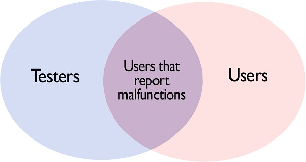

#Proposed Stakeholders
Analyzing the environment of WildFly we feel that in order to have a comprehensive stakeholder analysis there is a need for the following categories:

**Followers:** WildFly uses social media. These followers are exclusively interested in WildFly, 3960 twitter followers and 1352 members of the Google+ community. RedHat Inc has a total of 8300 employees [[10](#10)]. As shown in the Power/Interest Grid for Stakeholder Prioritization this group has no power and low interest. However we consider that this group should not be monitored with minimum effort. This group is composed of employees of JBoss, people from the OSCommunity but also other people that are somehow interested in WildFly, they might not even be users (this group is represented in the Context View as a question mark). But they are potential users. These people are most likely to use WildFly. More importantly this group has the potential of becoming future JBoss employees. From the company`s perspective, this group is the first place to look for new talent because they build up an interest in the product on their own. 

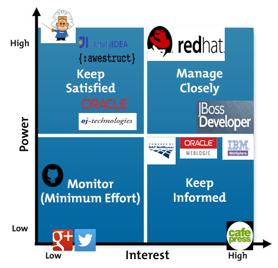

**Competitors:** the companies that offer the same services: IBM WebSphere, Oracle WebLogic,SAP NetWeaver

**Senior Adviser:** are the people with a lot of experience in the field that can have valuable input for the success of the development process. However these people are not exclusively involved with one project. They are not always present but when they are their input is always taken into account. They are low interest but at the same time a lot of power. For WildFly we found Arun Gupta. He is the vice president of developer advocacy at Couchbase. He has been building developer communities for 10+ years at Sun, Oracle, and Red Hat [[11](#11)]. Even though he work for a different company he is interested in the project. He wrote a blog post on how to use WildFly on raspberry pie [[12](#12)] and made a YouTube  tutorial [[13](#13)]

**Free riders:**  This type of stakeholders are independent of the development process. They have no power but high interest. In a way they behave like a parasite. They have only to gain from the success of the project. In the case of WildFly we found Caffe Press, they sell JBoss Community Gear, cups and t-shirts with the logo: "wear your open source pride" [[14](#14)]

All these are summarized within the following context view:

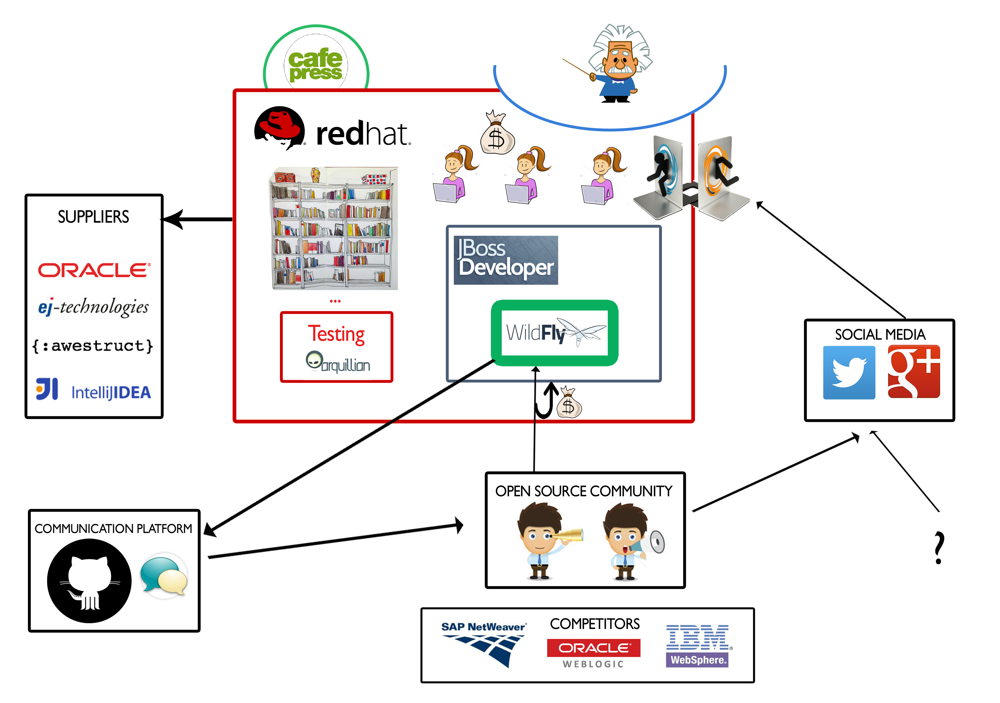

#Git Repository Analysis
Description  | Result 
---- |  ----
Open pull requests | 85
Closed pull requests | 8573
Merged pull request ratio | 1.07 per day
Proposed pull request ratio | 1.5 per day
Contributors | 248

Based on our personal experience the process of contributing is very thorough. The detailed oriented process for open source contributors makes the whole process time consuming and requires a significant number of re-submissions. However, it is very easy to report an issue. This situation can be observed in the correlation between created and resolved  issues for the past 30 days (as of 24th of March 2016).

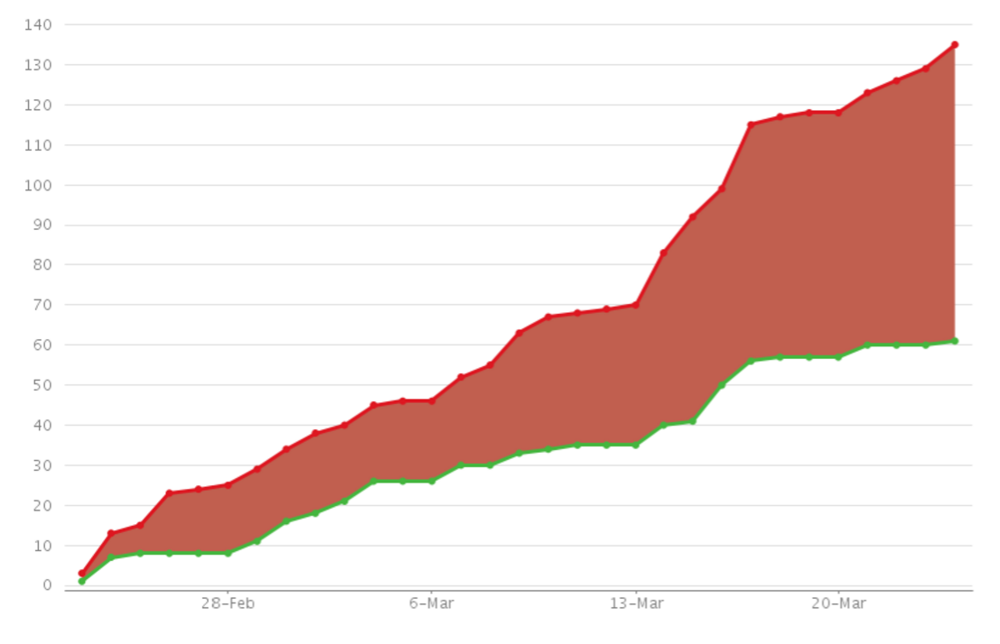

From the analysis we conducted on both pull requests and issues, we found out that the Stakeholders which are involved are the Developers. The Developer class, could be further divided in leading developer(for each component of the system), common developer and Open source community. Each one in this category, has different abilities. The leading developer is responsible to review the code of pull requests and to decide which pull request is going to be merged or not. They make merge decisions based on the quality of code, the style and if it fits the project's roadmap. If a pull request is not merged the leading developers usually send a brief explanation or provide a log file. The common contributors(of the system) are responsible to resolve different issues (e.g bugs, feature upgrades, feature requests) and the open source community developers can assist to resolve open issues by submitting pull requests. 

 

#Technical  Environment

WildFly is a server application that provides easy communication between the user and its server. It is one of the many features of the JBoss Application Enterprise. WildFly provides remote management  for one or more servers and runs on a local host server as well. This includes domain mode, where a domain of servers on different hosts can be managed by a central domain controller.

The system is organized in modules. The user can activate only the features that are useful for him. Activating a feature most of the times comes with added dependencies. This status, described in the WildFly official documentation [[22](#22)], is described in the diagram below. Green arrows represent dependencies that exist only when the feature is activated, where the black ones are constant dependencies. The green boxes are WildFly modules described in the documentation and the orange ones external sources.

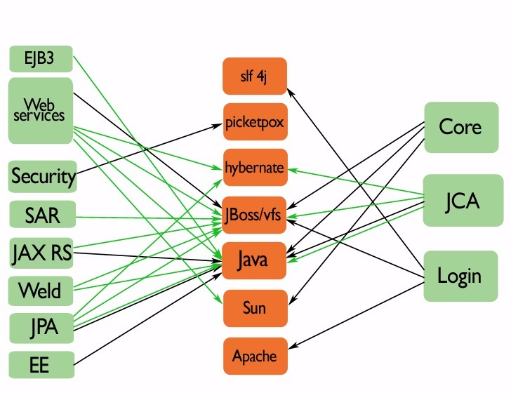

 

#System Quality

We looked into the quality of the project using iPlasma [[20](#20)] and inCode [[21](#21)]. The project has over 700 000 JavaLOC. Overall the class hierarchies have an average height and the inheritance trees are narrow. The classes are rather small and organized in fine-grained packages. These are all signs of a good system since the JBoss development team wants a modular system. The methods have average length and have simple logic, with few conditional branches. They also call several methods from few other classes. Making this a good environment for new open source developers. The overview pyramid "is an integrated, metrics-based means to both describe and characterize the overall structure of an object-oriented system, by quantifying the aspects of complexity, coupling and usage of inheritance"[[28](#28)]. The overview pyramid in itself shows that the JBoss developers take care of their technical debt.

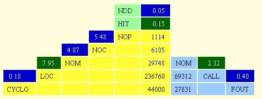

The  JBoss developers opted for test driven development [[23](#23)]. They have a comprehensive test suite. This shows interest in maintaining a qualitative system with the smallest amount of technical debt. To this end we found on the Jira JBoss account they have reported  7,555 issues on duplication, 3,140 issues on refactoring, 220 issues on dead code and 74 issues with misplaced code to name a few [[24](#24)].

During our analysis we found potential candidates for refactoring. For our first PR [[25](#25)] we resolved their worst case of duplicated code. A 65 line method in 6 different test cases. We have created this simple issue ourselves [[26](#26)] for our initial contact. A more detailed description of this process can be found in the contributions file. In the following weeks we plan to tackle some of their God Classes. 

 

#System Architecture

From the beginning (JBoss) had a new approach to the architecture, a "modular class loading and a dependency injection framework allowing the services providing the application server functionality to be installed in parallel", as described by Kabir Khan, five year old software engineer on this project [[19](#19)]. Throughout the version releases, the modules and their interaction have changed in order to improve the system. 

WildFly modules are isolated by default. Some dependencies of modules defined by the application server are set up automatically. These dependencies can be divided in four categories:

- System Dependencies 
- User Dependencies 
- Local Resources
- Inter Deployment Dependencies

Each one of the categories refers to a specific type of dependencies. The System dependencies refer to dependencies that are added to the module automatically, like Java Api's. The user dependencies are the dependencies which are added through JBoss deployment (not open source). Local Resources are packages inside the deployment like class files from WEB-INF or WEB-INF/lib. Finally, the inter deployment dependencies are the dependencies which affect other deployments in an EAR deployment.

In order to create the development view we researched WildFly official documentation, source code from GitHub and documentation from previous versions. We found the architecture of JBoss AS 7 which is the previous name of WildFly. The JBoss AS 7 was renamed into WildFly 7, the current version is WildFly 10.  The green boxes are subsystems that were kept up to version 10.

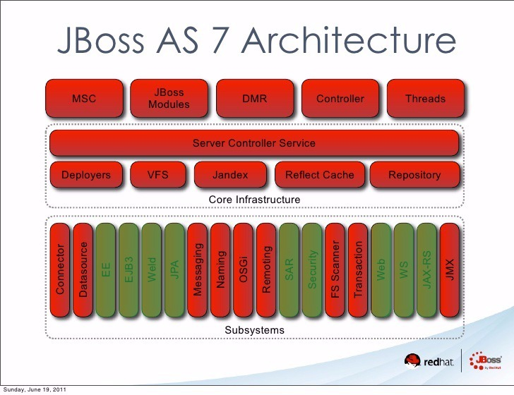

By comparing the architecture of WildFly 7 (JBoss AS 7) [[29](#29)] to the current code we found some  very interesting insights. Alterations have been made through the versions of WildFly like merging of subsystems, adding new functionalities and changing the hierarchical order.

The WildFly project we are looking into contains the modules the user can plugin into the core system. The core is a separate GitHub project [[27](#27)]. The WildFly project under consideration contains 38 maven projects. Out of these, there are 8 modules the user can plugin, the remaining 30 modules form the WildFly Utility layer, that a user can set up, which provides services for all the main feature modules. Each one of the 8 modules has an explicit dependency on junit for testing purposes. Also, in the WildFly.core project there is a subsystem which contains several tests for the project. These tests refer to several aspects of WildFly like:

- Core
- Api
- Cluster
- Domain
- Integration
- Spec

This six sets of tests aim to assess any change on the initial code, in order to avoid any unwanted situation, like internal errors, bad requests, systems' malfunctions, etc.

The main user enabled functionalities (green large WildFly modules Figure 9) are dependent on the core and JBoss libraries (i.e. Login). They are also indirectly or directly dependent upon the external sources that form the platform layer of our development view. The rest of the project forms the utility layer that contains the features the modules need. Each module has its own custom mix of dependencies that we traced from the pom files in the project. This overview can be seen in the following diagram:

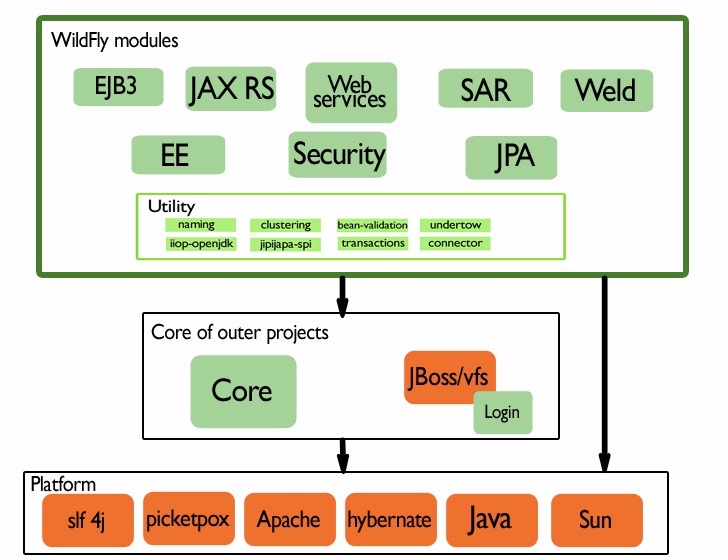
The main user enable functionalities are:
- **EJB3**: The Enterprise JavaBeans architecture or EJB for short is an architecture for the development and deployment of component-based robust, highly scalable business applications. These Applications are scalable, transactional, and multi-user secure.

- **Web Service**: JBossWS is a web service framework developed as part of the JBoss Application Server / WildFly. JBossWS integration provides the application server with any WS related technologies it needs for achieving compliance with the Java Platform.

- **Security**: The security subsystem is the subsystem that brings the security services provided by PicketBox to the JBoss Application Server 7 server instances.

- **SAR**: these deployment packages are just JAR files with special XML deployment descriptors in directories like META-INF and WEB-INF, which allows you to make changes to web pages etc on the fly without re-deploying the entire application.

- **JAX RS**: RESTEasy is a JBoss project that provides various frameworks to help build RESTful Web Services and RESTful Java applications. It is a fully certified and portable implementation of the JAX-RS specification. JAX-RS is a new JCP specification that provides a Java API for RESTful Web Services over the HTTP protocol.

- **Weld**: Weld is the reference implementation of CDI: Contexts and Dependency Injection for the Java EE Platform which is a JCP standard for dependency injection and contextual life-cycle management and one of the most important and popular parts of the Java EE platform.

- **JPA**: The Java Persistence API (JPA) is a Java specification for accessing, persisting, and managing data between Java objects / classes and a relational database. JPA was defined as part of the EJB 3.0 specification as a replacement for the EJB 2 CMP Entity Beans specification.

- **EE**: The EE subsystem provides common functionality in the Java EE platform, such as the EE Concurrency Utilities (JSR 236) and injection. The subsystem is also responsible for managing the life-cycle of Java EE application's deployments, that is, .ear files.

Even though the modules should be independent of each other, we highlight their inter dependencies in the following zoomed in diagram:

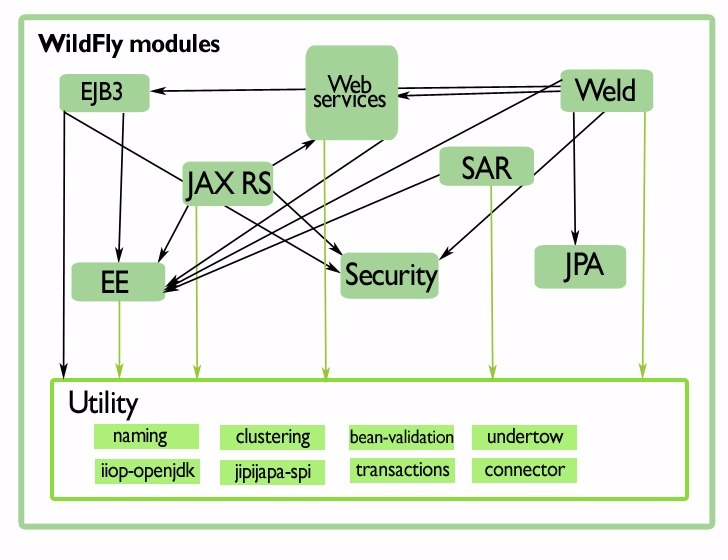

#Transaction Feature System Analysis

We focus on the Transaction user customization, specific to the WildFly project in discussion. This is a maven project in itself, part of the utility layer presented in the  architecture overview. The transaction has five sections with a total of 23 flexibility points described as followed.

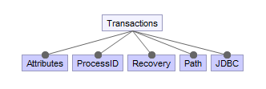

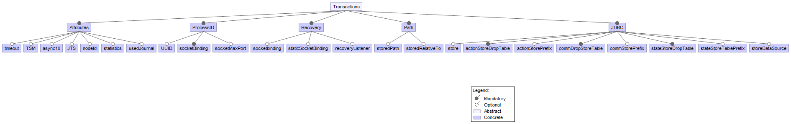

1. Attributes

	- Timeout:
A typical transaction might be started by a Session. If the duration of these transactions exceeds the specified timeout setting, the transaction service will roll-back the transactions automatically.
   
 	- Enable TSM Status:
Whether the transaction status manager (TSM) service, needed for out of process recovery, should be 	provided or not.     

 	- Journal Store Enable Async:
Whether AsyncIO should be enabled for the journal store. Default is false. The server should be restarted for this setting to take effect.
	    
	- JTS:
If true this enables the Java Transaction Service.

 	- Node Identifier:		
Used to set the node identifier on the core environment.

 	- Statistics Enabled:
Whether statistics should be enabled.

	- Used Journal Store:
Used for writing transaction logs. Set to true to enable and to false in order to use the default log store type. The default log store is normally one file system file per transaction log. The server should be restarted for this setting to take effect. It's alternative to jdbc based store.
    
2. Process ID
 	-  UU ID:
Indicates whether the transaction manager should use a UUID based process id.
	- Socket Binding:
The name of the socket binding configuration to use if the transaction manager should use a socket-based process id. Will be 'undefined' if 'process-id-uuid' is 'true'; otherwise must be set.
	- Socket Max Port	 	
The maximum number of ports to search for an open port if the transaction manager should use a socket-based process id. If the port specified by the socket binding referenced in 'process-id-socket-binding' is occupied, the next higher port will be tried until an open port is found or the number of ports specified by this attribute have been tried. Will be 'undefined' if 'process-id-uuid' is 'true'.  
	  
3. Recovery
   - Socket Binding
   	
   	 Used to reference the correct socket binding to use for the recovery environment.
   - Statics Socket Binding
   
  	 Used to reference the correct socket binding to use for the transaction status manager.
   - Recovery Listener
   	
   	 Used to specify if the recovery system should listen on a network socket or not.
    
4. Path
   - Object Stored Path
Denotes a relative or absolute file-system path denoting where the transaction manager object should store data. By default the value is treated as relative to the path denoted by the "relative-to" attribute.

   - Object Stored Relative to
References a global path configuration in the domain model, defaulting to the JBoss Application Server data directory (jboss.server.data.dir). The value of the "path" attribute will treated as relative to this path. 
   
5. JDBC
   - Store
Use the jdbc store for writing transaction logs. Set to true to enable and to false to use the default log store type. The default log store is normally one file system file per transaction log. The server should be restarted for this setting to take effect. It's alternative to Horneq based store
   
   - Action Store Drop Table
Configure if jdbc action store should drop tables. Default is false. The server should be restarted for this setting to take effect.
   - Action Store Prefix
Optional prefix for table used to write transaction logs in configured jdbc action store. The server should be restarted for this setting to take effect.
   - Communication Drop Store Table
Configure if jdbc communication store should drop tables. Default is false. The server should be restarted for this setting to take effect.
   - Communication Store Prefix
Optional prefix for table used to write transaction logs in configured jdbc communication store. The server should be restarted for this setting to take effect.
   - State Store Table Prefix
Configure if jdbc state store should drop tables. Default is false. The server should be restarted for this setting to take effect.
   - Jdbc state store table prefix
Optional prefix for table used to write transaction logs in configured jdbc state store. The server should be restarted for this setting to take effect.
   - Store Data Source
Jndi name of non-XA data source used. Data source should be define in data sources subsystem. The server should be restarted for this setting to take effect.

##Transaction Features Management

The transaction features are vital to the system. That is why a valid mix of mandatory transaction features are stored for default settings in a configuration xml file. The whole feature processing algorithm starts by calling the start method from CoreEnvironmentService class by the Runner. Their approach makes use of a JBoss closed implementation of a  CoreEnvironmentBean and a SocketBinding. The entire process has a roll back option that can give updates on the current status. 

The transaction process is dependent upon the JMX and EE (i.e. Concurrent's TransactionSetupProviderService ) subsystems.

In regards to configuring these feature we have found 7,832 Jira issues on transaction, 201 on journal store, 87 on Object Stored Path and 39 on Statics Socket Binding to name a few.

##Transaction Features Dependencies 
The outcome of transaction feature selection has a direct impact in the variability of the custom user instances of the WildFly system. At the same time the transaction module is used by other modules as shown in the diagram.

 

This means that all the developers of the modules  dependent upon transactions are affected by these features. The transaction module in WildFly monitors all the incoming and out-coming communications of the server. We can observe that the transaction subsystem is vital for the proper flow of almost all the main components of WildFly. 

Based on the source code and our experience as a mock user we identified the following dependencies between the transaction features.

1. `Journal store enable async io` **with** `Use journal store`
	>In order to set the `Journal store enable async io` to TRUE  first you
	>have to enable the `Use journal store`
	
2. `ID UUID` **with** `ID socket binding`
	>If the `ID UUID` is disable then you **MUST** assign as an id in `Id socket binding`

3. `Id socket binding` **with**  `Process id socket MAX port`
	>The `Process id socket MAX port` can **NOT** be assigned if the `id socket binding` is not defined

4. `Use JDBC store` **with** `JDBC store datasource`
	>If you enable `JDBC store` you have to provide a `JDBC store datasource`

5. `Process id socket MAX port` **with** `ID UUID` 
	>If the `ID UUID`  is true the `Process id socket MAX port` must be undefined

##Binding Time

We also categorized each feature to a certain class and binding time.

|Features| Class | Required| Binding|
| ------- | :---------: | :---------: | :--------: |
|Timeout |Attributes| FALSE |Start time|
|Enable TSM Status |Attributes| TRUE |Runtime|
|Journal Store Enable Async IO |Attributes| TRUE |Runtime|
|JTS |Attributes| TRUE |Runtime|
|Node Identifier |Attributes| FALSE |Runtime|
|Statistics Enabled |Attributes| TRUE |Runtime|
|Used Journal Store |Attributes| TRUE |Runtime|
|UU ID| Process ID| TRUE |Runtime|
|Socket Binding |Process ID| FALSE |Runtime|
|Socket Max Port |Process ID| FALSE |Runtime|
|Socket Binding |Recovery| TRUE |Runtime|
|Statics Socket Binding |Recovery| TRUE |Runtime|
|Recovery Listener |Recovery| TRUE |Runtime|
|Object Stored Path |Path| FALSE |Runtime|
|Object Stored Relative to |Path| FALSE |Runtime|
|Store |JDBC| TRUE |Runtime|
|Action Store Drop Table |JDBC| TRUE |Runtime|
|Action Store Prefix |JDBC| FALSE |Runtime|
|Communication Drop Store Table |JDBC| TRUE |Runtime|
|Communication Store Prefix |JDBC| FALSE |Runtime|
|State Store Table Prefix |JDBC| TRUE |Runtime|
|Jdbc state store table prefix |JDBC| FALSE |Runtime|
|Store Data Source |JDBC| FALSE |Runtime|

The following figures illustrate a few examples of the relationship between the class, binding time and the required features. The Attributes and JDBC class have the most required attributes. Also, JDBC has an equal number of required and optional features.

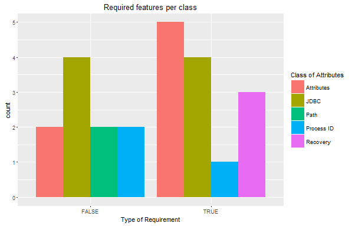

An overview of the feature binding time and class shows that only the *Default timeout* feature, which defines the timeout of the server requires reloading the server (i.e. restart). The rest of the features can be modified at Runtime. 

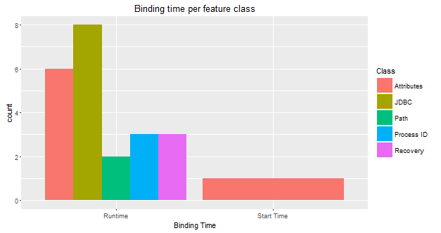

#Further Reading

1. [Install/Upgrade/Debugging Steps](https://github.com/delftswa2016/team-wildfly/blob/master/D6/Tutorial_1.md)
2. [Demo: Mail configuration](https://github.com/delftswa2016/team-wildfly/blob/master/D6/Tutorial_2.md)
3. Perspectives
	* [Evolution](https://github.com/delftswa2016/team-wildfly/blob/Refactoring_of_Final_Chapter/D6/Evolution_perspective.md)
	* [Development](https://github.com/delftswa2016/team-wildfly/blob/master/D6/DevelopmentPerspective.md)
4. Viewpoint
	* [Operational](https://github.com/delftswa2016/team-wildfly/blob/master/D6/OperationalView.md)
	* [Deployment](https://github.com/delftswa2016/team-wildfly/blob/master/D6/DeploymentView.md)

#Conclusion
WildFly is an open source server management application. We analyzed the architecture, stakeholders, development context and feature implementation, all detailed in this chapter. We also provide a further reading section that links to more resources developed by our team. The WildFly system is split into the core that contains the basic functionalities and the WildFly project that contains all the user enabled modules.

The quality of the code is good but still contains dependencies between modules that should be independent. We tried to contribute to a more modular architecture by our PR`s, by clearing duplicated code and a feature envy bad smell. The contribution procedure is very complex making it hard to get merged. We did however officially published a tutorial for installing, debugging, updating WildFly and a demo. The tutorial was our natural reaction to the available online information on WildFly. Based on our study we consider this system to be very well maintained, developed and tested.

#References

1 http://www.redhat.com/en/about "Red Hat"  

2 https://en.wikipedia.org/wiki/WildFly "Wildfly_wiki"  

3 http://wildfly.org/about/  "Wildfly"  

4 https://www.redhat.com/en/technologies/jboss-middleware/application-platform "Jboss"  

5 https://en.wikipedia.org/wiki/JBoss_(company) "jboos_wiki"  

6 "Rozaski and woods.software architecture"  

7 http://hibernate.org/  "hibernate"  

8 http://narayana.io/  "narayana"  

9 http://infinispan.org/ "infispan"  

10 https://en.wikipedia.org/wiki/Red_Hat "Redhat_wiki"  

11 https://www.linkedin.com/in/arunpgupta "arunpgupta"  

12 http://blog.arungupta.me/wildfly-cluster-raspberrypi-techtip28/ "cluster_rasp"  

13 https://www.youtube.com/watch?v=5MhqcVFVJ2s "youtube"  

14 http://www.cafepress.com/jbossorg/6726696 "cafepress"  

15 https://www.linkedin.com/in/ankur25 "ankur25"  

16 https://docs.jboss.org/author/pages/viewpreviousversions.action?pageId=80873103 "jboss_previous_version"  

17 http://wildfly.org/downloads/  "wildfly_downloads"  

18 http://awestruct.org/  "awestruct"  

19 https://www.linkedin.com/in/kabir-khan-99a333 "Kabir Khan Profile"  

20 http://loose.upt.ro/reengineering/research/iplasma "iPlasma"  

21 https://www.intooitus.com/products/incode  "inCode"  

22 https://docs.jboss.org/author/display/WFLY8/Documentation "WildFly Documentation"  

23 https://developer.jboss.org/wiki/TestDrivenDevelopmentTDDAndMovingForwardWithLessTechnicalDebt "jboos TDDi"  

24 https://issues.jboss.org/secure/Dashboard.jspa "Jira JBoss"  

25 https://github.com/wildfly/wildfly/pull/8740 "PR1-github"  

26 https://issues.jboss.org/browse/WFLY-6296?jql=project%20%3D%20WFLY%20AND%20resolution%20%3D%20Unresolved%20ORDER%20BY%20priority%20ASC%2C%20updated%20DESC "PR1-JIRA"  

27 https://github.com/wildfly/wildfly-core "core project"  

28 Lanza, Michele, and Radu Marinescu. (2007) *Object-oriented metrics in practice: using software metrics to characterize, evaluate, and improve the design of object-oriented systems.* Springer Science & Business Media.

29 http://www.slideshare.net/rayploski/jboss-application-server-7

[1]: http://www.redhat.com/en/about "Red Hat"
[2]: https://en.wikipedia.org/wiki/WildFly "Wildfly_wiki"
[3]: http://wildfly.org/about/  "Wildfly"
[4]:  https://www.redhat.com/en/technologies/jboss-middleware/application-platform "Jboss"
[5]:  https://en.wikipedia.org/wiki/JBoss_(company) "jboos_wiki"
[6]:  # "Rozaski and woods.software architecture"
[7]:  http://hibernate.org/  "hibernate"
[8]:   http://narayana.io/  "narayana"
[9]:  http://infinispan.org/ "infispan"
[10]:  https://en.wikipedia.org/wiki/Red_Hat "Redhat_wiki"
[11]:  https://www.linkedin.com/in/arunpgupta "arunpgupta"
[12]:   http://blog.arungupta.me/wildfly-cluster-raspberrypi-techtip28/ "cluster_rasp"
[13]:  https://www.youtube.com/watch?v=5MhqcVFVJ2s "youtube"
[14]: http://www.cafepress.com/jbossorg/6726696 "cafepress"
[15]:   https://www.linkedin.com/in/ankur25 "ankur25"
[16]: https://docs.jboss.org/author/pages/viewpreviousversions.action?pageId=80873103 "jboss_previous_version"
[17]: http://wildfly.org/downloads/  "wildfly_downloads"
[18]: http://awestruct.org/  "awestruct"
[19]: https://www.linkedin.com/in/kabir-khan-99a333 "Kabir Khan Profile"
[20]: http://loose.upt.ro/reengineering/research/iplasma "iPlasma"
[21]: https://www.intooitus.com/products/incode  "inCode"
[22]:  https://docs.jboss.org/author/display/WFLY8/Documentation "WildFly Documentation"
[23]:  https://developer.jboss.org/wiki/TestDrivenDevelopmentTDDAndMovingForwardWithLessTechnicalDebt "jboos TDDi"  
[24]: https://issues.jboss.org/secure/Dashboard.jspa "Jira JBoss"
[25]: https://github.com/wildfly/wildfly/pull/8740 "PR1-github"
[26]: https://issues.jboss.org/browse/WFLY-6296?jql=project%20%3D%20WFLY%20AND%20resolution%20%3D%20Unresolved%20ORDER%20BY%20priority%20ASC%2C%20updated%20DESC "PR1-JIRA"
[27]: https://github.com/wildfly/wildfly-core "core project"
[29]: http://www.slideshare.net/rayploski/jboss-application-server-7 "architecture"
[30]: http://www.gousios.gr/blog/How-do-project-owners-use-pull-requests-on-Github/ "Goussios" 

