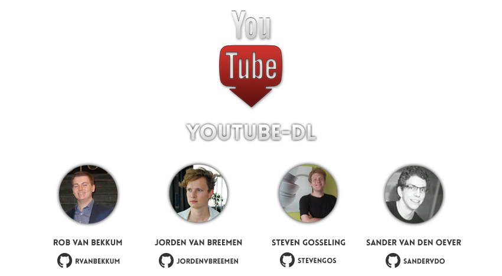
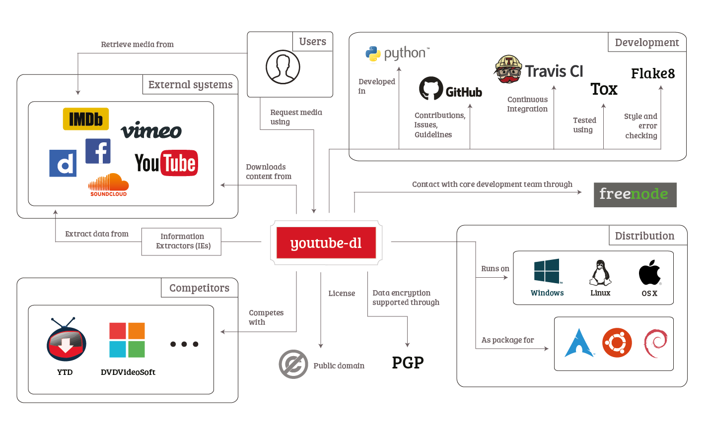
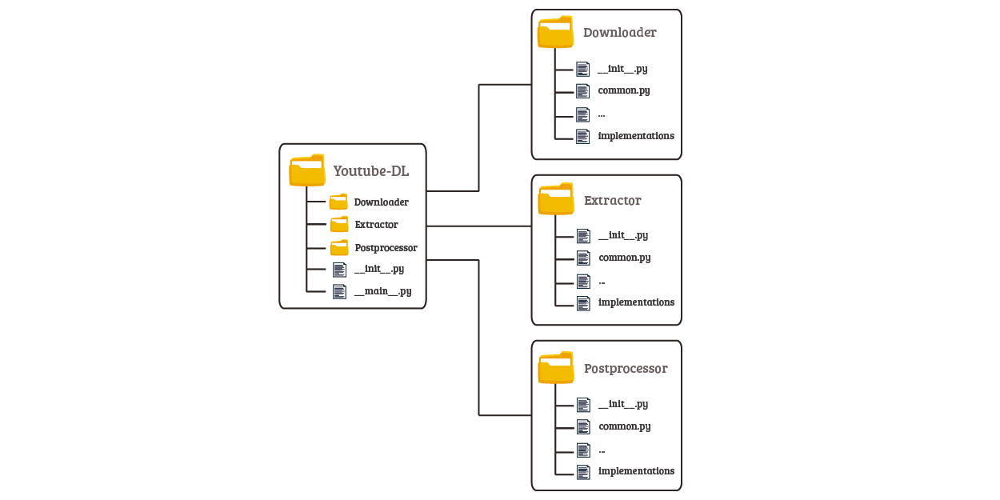

# Youtube-dl


<!-- -->

##### Abstract

[Youtube-dl](https://github.com/rg3/youtube-dl) is a simple command-line application that enables users to download videos from one of the more than [seven hundred](https://github.com/rg3/youtube-dl/blob/master/docs/supportedsites.md) supported websites.
The application is actively maintained and developed by a relatively small group of developers.
On a regular basis the project receives external contributions and requests (e.g. for supporting a new site) from developers and users.
The simplicity of the architecture, consisting of four major components, allows for easy, continuous integration of new functionality.
The application offers various features in the form of options that allow for retrieving specific data, extensive (downloading) configurations and post-processing tasks.
Finally there are some regulations (among others regarding *copyright infringement* and the *Terms of Service* of websites) that the application has to deal with and take into account.

##### Table of Contents

- [Introduction](#introduction)
- [Organization](#organization)
    - [Stakeholders](#stakeholders)
    - [Context View](#context-view)
- [Architecture](#architecture)
    - [Component Structure](#component-structure)
    - [Information Viewpoint](#information-viewpoint)
    - [Development Process](#development-process)
- [Features](#features)
- [Regulations](#regulations)
- [Conclusion](#conclusion)

## Introduction
Development of youtube-dl has been started over three years ago by Ricardo García, the original owner of the repository. He stepped down a while ago as the maintainer of the repository and it is now maintained by a community of active developers. In an earlier stage of development the architecture made it hard to extend the functionality of the application. At that point the architecture was completely redesigned to allow for easy integration of new site support.

Youtube-dl is a command-line application. However, graphical user interfaces are available as [extensions](https://github.com/MrS0m30n3/youtube-dl-gui) to the application. Users can provide the URL of a website where they have observed the video (or other supported content) and youtube-dl will attempt to download the media located at that URL. The user can specify additional options to customize the behavior of youtube-dl. The simplistic foundation and the Python programming language enable the application to run on all most common operating systems.

Currently the application is being contributed to nearly every day. The active community and the extensible architecture allow for easy integration of new functionalities. As a result current users are able to download media content from more than [seven hundred](https://github.com/rg3/youtube-dl/blob/master/docs/supportedsites.md) different sources. The application also supports downloading entire playlists, embedding subtitles, extracting audio and much more (see also the [section on Features](#features)).

This chapter aims to give users insight in how this application is developed, maintained and used. This way one will have a quick understanding of youtube-dl. First the stakeholders and the context view are used to provide insight in the organization of youtube-dl. This is followed by an in-depth analysis of the architecture of the application in order to understand its structure. Afterwards, the wide variety of features available in the application are discussed followed by a short discussion about the regulations the application and the users might face. Finally, there is a short conclusion regarding our findings about the project.

## Organization
This section will discuss the involved parties during the development, maintenance and execution of the application. These parties are then visualized using a context-view diagram.

### Stakeholders
Youtube-dl is maintained under the public-domain license. It does not have a foundation nor company attached to it that is involved in backing or supporting the maintenance or development of the application. Besides, no direct commercial opportunity is available for youtube-dl in the current situation. The most important stakeholders that are identified based on the categorization of Rozanski and Woods [[1](#rw)] are discussed below.

The **users** of youtube-dl consist of all users that use the application to download content from one of the supported websites. The application is most commonly used by non-commercial users that wish to obtain videos for offline usage. Commercial users of the application consist of websites that re-host videos published on one of the supported websites. There are, however, no commercial parties that acknowledge that they specifically use youtube-dl for such purposes.

The current most active **maintainers** of the project consist of the following members of the community: [Philipp Hagemeister](https://github.com/phihag ), [Sergey M.](https://github.com/dstftw), [Jaime Marquínez Ferrándiz](https://github.com/jaimeMF) and [Yen Chi Hsuan](https://github.com/yan12125). These members are all actively involved in the development and have collaborator access to the project on GitHub. Therefore, they oversee and review all new contributions to assure the quality of the project, and hence can be considered as both **assessors** and **integrators**.

A complete [list of people who are credited for their contributions](https://github.com/rg3/youtube-dl/blob/master/AUTHORS) to the project is available in the project repository. Every time a reasonably large contribution is made to the project one is asked if he/she wishes to be added to this list. Before a merge can take place developers are required to **test** the new functionality themselves and the code is inspected by one of the maintainers.
The core development is mostly done by the four maintainers mentioned earlier, who also have the most influence on which pull requests get merged. However, another community member that holds the nickname [remitamine](https://github.com/remitamine) also contributed a lot of development work in recent releases. He has also been granted a collaborator status. What is peculiar here is that Ricardo García is the founder and owner of the project but announced in his [blog](http://rg3.name/201408141628.html) and on [Hacker News](https://news.ycombinator.com/item?id=8647943) that in 2011 he has stepped down as maintainer of youtube-dl, though still owns the repository and the [website](https://yt-dl.org/).

The community offers **support** using the GitHub issue system. This support is provided by the community of youtube-dl, here different kind of stakeholders ask for support, ask questions and they submit bug reports and feature requests. Support at issues is often provided by one of the maintainers, though sometimes other community-members get involved.

In the recent support issues the most involved member is [Sergey M.](https://github.com/dstftw). He is often involved in answering questions from the community or taking care of bug reports and missing functionality. He could therefore, apart from **developer**, be considered as a main **support staff** member as well. The application is distributed using both GitHub and the [website from Ricardo García](https://yt-dl.org), these could be considered the **suppliers** of the application.

Other involved parties are the websites that are supported by youtube-dl. Some of these websites will have commercial applications for the hosted videos and thus have rules that specify that downloading the videos from their website is not allowed. The youtube-dl application could effect their services and break the policy for these websites. This could have a negative effect on both the supported websites and the legal position of youtube-dl. We will discuss this in more detail within the [Regulations section](#regulations).

Next to these parties there are applications available that use youtube-dl as a foundation/extension or dependency for their own application. Some examples are [youtube-dl-gui](https://github.com/MrS0m30n3/youtube-dl-gui) and [Instant Music Downloader](https://github.com/yask123/Instant-Music-Downloader), which rely on the functionality of youtube-dl for their application to function properly.

Finally, youtube-dl has to deal with some **competitors** like [DVDVideoSoft](https://www.dvdvideosoft.com) that deliver (partly) the same functionalities that youtube-dl delivers. These stakeholders are involved as they could take away some clients from the application.

### Context View
To give a view of the context in which youtube-dl resides, we identify the scope of the application and describe the interactions and dependencies between the application and its environment. Therefore we consider the external services and data that youtube-dl depends on to enable it to do what it is build for.

#### Functional Capabilities
The most important functionality that youtube-dl offers is downloading content from any of the supported platforms. Youtube-dl supports these platforms by having a separate Information Extractor (IE) implemented for each platform. The software architecture is designed in such way that it focuses on the process of adding support for new platforms by adding a new IE being a relatively simple tasks for developers.

The core of youtube-dl implements the other functionalities, which are:

* **Parsing the input and options**: Enabling users to download content from all supported platforms in a uniform way.
* **Downloading files from the media platforms**: Actually downloading the content is handled by youtube-dl and is independent of the media-hosting platform.
* **Post-processing the downloaded content**: Processing files in a certain way defined by options set by the user.

Youtube-dl also accounts for other features such as downloading content that requires authentication, retrieving subtitles and setting other more advanced options (e.g., network configurations). The application can be used in a uniform way for downloading from various platforms where it uses IEs to decide how to extract the required data. It therefore is not concerned with automatically identifying the platform and deciding how to retrieve the content from it.

#### External Entities and Interfaces
There are multiple external entities that youtube-dl interacts with, the first we identify being the platforms such as; YouTube, Vimeo or SoundCloud, from which the application extracts data and retrieves content (e.g., video and audio files) that are requested by its users. The data the application depends on for downloading this content is extracted using an IE for the specific platform. Based on a URL of the content provided by the user, this IE fetches a dictionary of information about the content that is to be retrieved that is subsequently used by youtube-dl to download the content from the platform.

The community of youtube-dl is primarily active on GitHub. As mentioned earlier it is used for issue tracking. Other than that it is used for (external) contributions of developers and communicating the contribution guidelines and information about the usage of the application. Contacting the core developers of the system is also possible through a dedicated [IRC channel](http://irc.netsplit.de/channels/details.php?room=%23youtube-dl&net=freenode) on Freenode. The application uses the [Travis CI](https://travis-ci.org/rg3/youtube-dl) system for continuous integration, but seems to have abandoned the active use of the system at the time of writing [for over two years](https://github.com/rg3/youtube-dl/issues/8496).

Furthermore, youtube-dl has a built-in testing system which makes use of the [Tox](https://tox.readthedocs.org/en/latest/) testing tool for Python for testing each of the IEs of the application. In order to contribute by adding support for a new IE, developers are required to write at least a single test for the IE, which typically comprises of downloading the content for a sample URL. Next to this, developers are required to use the [Flake8](https://pypi.python.org/pypi/flake8) tool to check for adherence to the [PEP8](https://www.python.org/dev/peps/pep-0008/) style conventions, logical errors and code complexity. Finally, developers can contribute to youtube-dl by making a pull request which then will be reviewed by the maintainers.

In [Figure 1](#figure-context-view-diagram) a visual overview is provided of the interactions of youtube-dl with external entities and capabilities and characteristics of the application. This diagram serves as a high-level view of the system not considering the detailed structure or implementation of the system.

<div id="figure-context-view-diagram"></div>

    
**Figure 1** - *A visual representation of the context view of youtube-dl.*

#### Impact       
Since everyone is free to use, alter and distribute the code of youtube-dl a possibility is to integrate youtube-dl in another application (like a GUI wrapper).
These tools depend on the data format that youtube-dl requires. As soon as this format will change, the wrappers will most likely require some changes too. Given the fact that the command structure has not changed for over a year based on the [blame log](https://github.com/delftswa2016/youtube-dl/blame/master/youtube_dl/YoutubeDL.py) it is not likely to expect changes there anytime soon. Only some parameters changed slightly and in most cases there was only new instead of changed functionality. This provided some certainty for applications that integrate youtube-dl as it will not likely break these applications when youtube-dl is being updated.

## Architecture
In this section we aim to give the reader more insight into the architecture of the application. The component structure of the application is explained and visualized using a diagram.
Next the information flow between the different components is discussed, describing the conditions under which the different types of information are exchanged.
Finally we take a look at how the development of the application takes place.

### Component Structure
Youtube-dl consists of a couple of components. These components and their relationships are visualized in [Figure 2](#youtube-dl-structure).
The main components are:

<div id="youtube-dl-modules"></div>

* **YoutubeDL**: the core of the application. This component is responsible for the overall process. It processes the input, parsed arguments from the command-line and information from assumptions made by youtube-dl itself.  
* **Extractors**: responsible for gathering the information about the video. The extractors are able to extract video-urls from webpages through analysis (regular expressions for instance). The extractors provide the information in a pre-defined format so that it can be processed further by the *YoutubeDL* component.  
* **Downloaders**: the downloaders are able to transfer a remote video to the local filesystem. Depending on the media-format this component will determine which downloader to use.
* **Post Processors**: responsible for any post-download operations that should be applied on the video. Think of embedding subtitles, extraction the audio, etc.

<div id="youtube-dl-structure"></div>


**Figure 2** - *Component structure of youtube-dl.*  

#### Default Program Flow        
As can be seen in [Figure 2](#youtube-dl-structure), we have the core component (*YoutubeDL*) that controls the process. When the application is started the initializer (depicted at the top) will perform a self-update (if requested by the user) and it will parse the arguments from the command-line. Then *YoutubeDL* requests an extractor by using the initializer of the *Extractors* component which helps determining which extractor to use. As soon as *YoutubeDL* receives back the required information it can pass this information to the downloaders. The initializer of the
*Downloaders* component then determines which downloader to use (depending on the file type/properties) and tries to download the corresponding file. Finally, *YoutubeDL* applies post-processors according to the user's wishes. The initializer of the *Post Processors* component determines which post-processors should be ran and returns the output of the selected processor(s). If the user requested to download multiple files, *YoutubeDL* will proceed and repeat the process all over for the next file.

#### Test Program Flow
Tests are available for each of the [components listed earlier](#youtube-dl-modules). Tests can be invoked from the command-line. The tests will be retrieved from all the available downloaders, extractors and processors (indicated by the dashed lines in [Figure 2](#youtube-dl-structure)). For example, every extractor contains a number of tests. These tests try to extract the information for a given URL. This result is then compared to the pre-defined expected result. It is possible to specify which tests to run. The test suite is growing and therefore the testing process takes longer as youtube-dl evolves. Being able to run only specific tests allows you to quickly test a specific part.

#### Error Reporting Flow
Youtube-dl aims at centralizing error-reporting. From all the implementations of downloaders, extractors and post-processors the errors are directed to the core, *YoutubeDL*, where the errors are handled. This ensures a consistent way of reporting errors, which makes it a lot easier to maintain the project. *YoutubeDL* in turn prints the errors (in a consistent format) to the command-line (as indicated with the red line in [Figure 2](#youtube-dl-structure)).

#### Extensibility
The structure is designed to be extended easily. Previously the developers encountered problems when they had to 'hack in' additional features. This lead to [the decision to implement the application from scratch](http://rg3.name/200807240952.html).
In the current implementation there are interfaces for the extractors, downloaders and post-processors. By implementing these interfaces one can easily extend the functionalities of youtube-dl.

#### Folder Structure

To keep the structure simple, youtube-dl has separate folders for the different kind of implementations. Within the repository there is a folder called `youtube_dl` which contains all of the source-code. Within that folder there are subfolders called `downloader`, `extractor` and `postprocessor`. The related initializers can be found in `__init__.py` for the given subfolder and next to that every subfolder contains a `common.py` which holds the interface that is implemented by all implementations. For instance, each extractor implements the functions declared in the base class in `extractor/common.py`. The filenames of the different implementations are clear, for example the extractor for YouTube videos is located in a source file called `extractor/youtube.py`.
A graphical overview can be found in [Figure 3](#youtube-dl-folder-structure).

<div id="youtube-dl-folder-structure"></div>

              
**Figure 3** - *Folder structure of youtube-dl. Each of the subfolders houses an initializer, a common interface and several implementations of this interface.*      

### Information Viewpoint
The flow of information within youtube-dl is not too complex. Visualizing the flow of information exchanged between components at runtime will provide more insight in how the application functions. The flow is best visualized using an information flow diagram as shown in [Figure 4](#youtube-dl-information-flow).

<div id="youtube-dl-information-flow"></div>

       
**Figure 4** - *Information flow diagram.*

We will discuss the kind of information exchanged between the different components of youtube-dl and under what circumstances this information is exchanged. Initially a user will provide youtube-dl with a URL and some optional options. These options are analyzed and stored in the *YoutubeDL* component. Here options such as the setup of a proxy, age validation or downloading thumbnails are processed.

After initialization the *YoutubeDL* component will create an *Extractor*. The extractor will receive the URL of the webpage and it will return all information that is needed for further processing. The extractor retrieves this information from the webpage and, in some scenarios, from additional webpages that will be downloaded to retrieve (more) information. Whenever a website hosts content for multiple other websites, one can create really small extractors for these websites that all point to the extractor of the hosting website. The extractor for the hosting website will receive the information from the smaller extractors and perform its extraction process. The user will see information about the extraction process on the command-line interface. Which information is shown depends on the extractor and the information that it retrieved from the website.

With the extractor's information the *File Downloader* is capable of downloading data from a specific location. This downloader receives additional information, e.g. information to see whether it has to download a playlist or whether there are bandwidth limitations. This information can originate from the extractor or from the user (through options on the command-line interface). In the scenario of a single file it will fetch the file from its physical location, perform small modifications such as generating filenames, process any options that might influence the file and finally saving the resulting file to the desired location. When the *File Downloader* is called with a playlist option it will retrieve media from multiple media sources that are part of the playlist.

Users can specify options that will (optionally) trigger *Post-Processors*. *Post-Processors* are created in the *YoutubeDL* component and a list of them is stored there. They may invoke a downloader or extractor but this is not executed within the component itself but within *YoutubeDL*. Therefore there is no direct flow of information between the *Post-Processor* and the two other components.

Future executions of youtube-dl are almost completely independent of prior executions. Most information is extracted from the Internet. There is only very few static information stored within youtube-dl. Nearly everything is executed at runtime and stored in memory. The output media is, obviously, a static result and will have no effect on future execution.

### Development Process
The development of youtube-dl is open for external contributions on the repository on GitHub. The project relies on the GitHub issue tracker where all bug reports and requests are filed by both users and developers. The [guidelines for creating a new issue](https://github.com/rg3/youtube-dl#bugs) are documented on the repository and comprises of various questions that should be evaluated before placing an issue.
It is possible to obtain logging information at different levels and it is recommended (sometimes even required) by the authors to include the full verbose output in issues to get an overview what happens step-by-step.
For several issues the maintainers of the repository attach [labels](https://github.com/rg3/youtube-dl/labels) for issues falling within a particular category (e.g., `site-support-request` issues are typically solved by the implementation of a new extractor). Most commonly, external contributors or maintainers create pull requests from the open issues.

Before developers submit their pull requests they should attempt to follow the instructions and adhere to the [guidelines](https://github.com/rg3/youtube-dl#developer-instructions) and standards as described in the [External Entities and Interfaces](#external-entities-and-interfaces) section.
When a pull request is submitted it is reviewed by one of the maintainers who will provide feedback whenever the implementation can be improved or when it can be made more generic (or specific). For example, when adding a new extractor, the maintainers might suggest to add additional tests to cover more extraction scenarios for different pages or to use the [generic extractor](https://github.com/rg3/youtube-dl/blob/2c9ca78281f84abe194bdf23a5e06b747961c9eb/youtube_dl/extractor/generic.py) for scenarios in which that is possible.
When all feedback is processed and a pull request is ready to get merged, developers are asked to squash their contribution into a single commit.

Considering the abandoned use of the CI system one could say that the system builds up *technical debt* [[2](#ref-2-technical-debt)]. That is, developers keep adapting the system through contributions, but over time the functionality added in the past might break. The longer repaying the debt (by restoring the integration of the CI system by fixing defects for successful builds) is postponed, the more time will have to be put into fixing it and the more difficult maintenance becomes. The maintainers might benefit of a proper use of the CI system, as they can process pull requests for which builds fail faster.
Though, we should note that the maintainers are avoiding technical debt as well by strictly reviewing the contributions to make sure they adhere to their standards and only quality code is merged into the codebase.

As contributions are made continuously to the project, the maintainers of youtube-dl release a new version of the application by creating [GitHub releases](https://github.com/rg3/youtube-dl/releases). Releases are made at least once a month, but often weekly or even daily and are then made available on the [main website](http://yt-dl.org/). The application is also available as distribution packages, but the versions provided are mostly outdated. Therefore the authors recommend their users to follow the [manual installation instructions](http://rg3.github.io/youtube-dl/download.html) instead to always have the latest version.

## Features
Youtube-dl offers many other features than just downloading a video using a provided URL. All of the features are listed and explained in the [`README.md`](https://github.com/rg3/youtube-dl/blob/master/README.md) that is available on the [repository](https://www.github.com/rg3/youtube-dl). The features can be split into 5 categories, namely:

- Extractor features
- Download features
- Post-processing features
- Configuration files
- Testing

The **extractor features** relate to the process of extracting information from the provided URL. The most important features here are the support for *playlists* and the *workarounds* that are available to support certain websites. If a URL contains a playlist, youtube-dl is able to download the entire playlists. These playlists can be filtered based on different available meta-data such as view count, duration, liked, titles, etc. The workarounds allow the user to specify custom header fields (like a browser) to work around some security measures that might have been taken by the site to avoid downloading the content.

The **download features** are related to the actual download process. Examples of such features are the ability to use a *proxy*, *authentication* and *quality selection*. The latter one allows you to download the file with exactly the quality that you require (if available). Authentication allows users to specify credentials that can be used to work around permission issues. Authentication is also possible by using a user-defined cookie (in the case that regular authentication is not supported or fails). The use of a proxy allows a user to access content that is not available from the users normal connection (think of geo-limitations).

Within the **post-processing features** the user is able to tweak the downloaded file to his/her preference. A user can among others choose to *embed subtitles* and *convert the content*. The user can specify a subtitle source, which then will be embedded in a video file. The user can also specify the desired output format. The post-processor in question will convert the downloaded file into the desired format.

In order to ease the use of youtube-dl it is possible to create a **configuration file**. Normally one would need to specify all options on the command-line. Using this file one can specify options that he/she uses regularly. These options then will be executed automatically by youtube-dl. For example, instead of typing `youtube-dl URL -x --proxy SOME_IP -o ~/Movies/%(title)s.%(ext)s` every time one could create a configuration file like this;

```
-x
--proxy SOME_IP
-o ~/Movies/%(title)s.%(ext)s
```
The only remaining thing one has to do to achieve the same result, is running `youtube-dl URL`.

There are some **testing features** created especially for Developers and Supporters of the project. They consist, among others, out of *error reporting*, *logging* and *simulation*. The latter allows the developers to simulate a download in order to find or trace potential bugs.

All of the features that are available can be ran independent from each other. Some features depend on external sources. An example of such a dependency is present in the automatic retrieval of subtitles from YouTube videos. This requires information from YouTube (that has to be available in order to succeed).

<div id="regulations"></div>

## Regulations

Youtube-dl allows to download several types of media from the internet. Following from this possibility youtube-dl allows users to download potentially copyrighted material. Youtube-dl will have to adhere to local laws. In this section we will discuss matters related to such and other relevant regulations.

### License
Youtube-dl is released in the public domain. This means that everyone is free to copy, modify, sell, distribute, etc. There are users that have built extensions and redistributed the new package. Some users actually added support for sites that are known to have issues with copyright infringement. But this is independent of the official repository. Since anyone can add functionality one might include support for illegal sources as well. This, however, is not something that can be influenced by the youtube-dl team.

### Practice
Youtube-dl receives a lot of site support requests that ask for support of sites that infringe copyrights. The authors of youtube-dl respect the copyright laws; they refuse to add support for sites that clearly are intended to infringe copyright (see for example issue [#1048](https://github.com/rg3/youtube-dl/issues/1048)). As long as there are videos on the website that do _not_ infringe copyrights, support for that particular website will likely be allowed. This is also written in their [`README.md`](https://github.com/rg3/youtube-dl#can-you-add-support-for-this-anime-video-site-or-site-which-shows-current-movies-for-free). Based on this support for sites like YouTube would be allowed, but actually using the application for YouTube would be illegal (breaching their Terms and Conditions).

### Laws
The internet allows its users to spread all kinds of materials very easily. Unfortunately this also allows these users to spread illegally obtained materials with the same ease. Consequently, these illegally distributed materials can be downloaded with the use of tools like youtube-dl. Since youtube-dl originally was designed to download from YouTube, we will discuss the case of YouTube in more detail.

YouTube offers video streaming as a service. To monetize this service they show ads on their website (amongst others). In their Terms and Conditions they state the following;

> **[Point 5.1 - L](https://www.youtube.com/t/terms?gl=GB)** - you agree not to access Content or any reason other than your personal, non-commercial use solely as intended through and permitted by the normal functionality of the Service, and solely for Streaming. "Streaming" means a contemporaneous digital transmission of the material by YouTube via the Internet to a user operated Internet enabled device in such a manner that the data is intended for real-time viewing and not intended to be downloaded (either permanently or temporarily), copied, stored, or redistributed by the user.

 It is stated that anything that is not streaming, is not allowed. This would mean that the usage of youtube-dl for downloading is not allowed either. The Terms and Conditions are not the same for every country. The quote above is taken from the UK Terms and Conditions. However in the worldwide version it states;

> **[Point 5 - B](https://www.youtube.com/t/terms)** - Content is provided to you AS IS. You may access Content for your information and personal use solely as intended through the provided functionality of the Service and as permitted under these Terms of Service. You shall not download any Content unless you see a “download” or similar link displayed by YouTube on the Service for that Content. You shall not copy, reproduce, distribute, transmit, broadcast, display, sell, license, or otherwise exploit any Content for any other purposes without the prior written consent of YouTube or the respective licensors of the Content. YouTube and its licensors reserve all rights not expressly granted in and to the Service and the Content.

Here it is mentioned that it is allowed to download content, but only when they show a download link on YouTube itself. So downloading the content is not allowed in this scenario. However, the regulations vary based on location, this is something that youtube-dl should consider.

Laws are different for every country. For instance the Canadian government published [An Act to amen the Copyright Act](http://www.lop.parl.gc.ca/content/lop/LegislativeSummaries/41/1/c11-e.pdf). It states that you are free to download any content that is legally acquired by you, as long as you do not redistribute. You might, however, still breach the Terms and Conditions of a specific website. If we look at The Netherlands we see a different situation. In The Netherlands it was always allowed to download any content from the web, only distributing was illegal. After a [decision in the Court of Justice of the European Union](http://curia.europa.eu/jcms/upload/docs/application/pdf/2014-04/cp140058nl.pdf) it was said to be illegal in all cases to download copyrighted contents. In Germany there are several complaints about users who were distributing content and who received a fine for that.

Youtube-dl itself can be considered legal. Although it allows one to download copyrighted material, one still has to make the decision to put youtube-dl to that use. Sites can offer both copyrighted and free contents, for the latter one support of youtube-dl is legitimate. As developers refuse to merge contributions that include parts that are not following their rules, youtube-dl will also remain legal in the future. If the user chooses to download illegal content, he/she will be the one responsible for the consequences.

<div id="conclusion"></div>

## Conclusion

Youtube-dl is a command line tool that allows one to download video content from one of the websites supported by the application.
Because of this simple interface and the use of the Python language, all major operating systems are supported.
The behavior of the program can be influenced by passing additional options on the command-line.
Nowadays there are a lot of options available that can be used to one's preference.

Youtube-dl has a rather simple architecture.
It can be divided into four major components; the core of the application, the downloaders, the extractors and the post-processors.
All offer different and specific functionality to the application.
This well defined structure allows for continuous updates as external contributors are not required to have an extensive amount of prerequisite knowledge about the whole application.
This is one of the main reasons why the application can constantly be extended with new valuable functionality.

The simplicity of youtube-dl's architecture allows for an easy, continuous, integration of new functionality.
Some of the more active maintainers have been granted collaborator access to the repository.
They ensure that all contributions to the project adhere to the strict guidelines. Because of the active community youtube-dl offers a wide range of functionality and an exceptional amount of supported websites.

Besides, youtube-dl offers a way to download both legal and illegal content from supported websites.
Apart from the fact whether the content in case is legal or illegal, websites might still disallow downloading content in general in their *Terms of Service*.
Youtube-dl also has to deal with the various regulations in each country.
Depending on the country, these regulations do not allow downloading copyrighted material.
The maintainers tend to respect the regulations and decline to add support for websites that infringe copyright.
The developers of youtube-dl are, however, not responsible for the activities of the users and thus the application itself can be considered legal.

Because of the simple architecture, the extensive reviews of contributions and the attitude of the maintainers towards the regulations, we think that youtube-dl deserves its high standing on GitHub.

## References
<div id="rw"></div>

[1] Nick Rozanski and Eoin Woods. Software Systems Architecture: Working with Stakeholders using Viewpoints and Perspectives. Addison-Wesley, 2012.
<div id="ref-2-technical-debt"></div>

[2] Chris Cairns and Sarah Allen. 2015. What is technical debt? Retrieved February 28, 2016, from:
`https://18f.gsa.gov/2015/09/04/what-is-technical-debt/`
